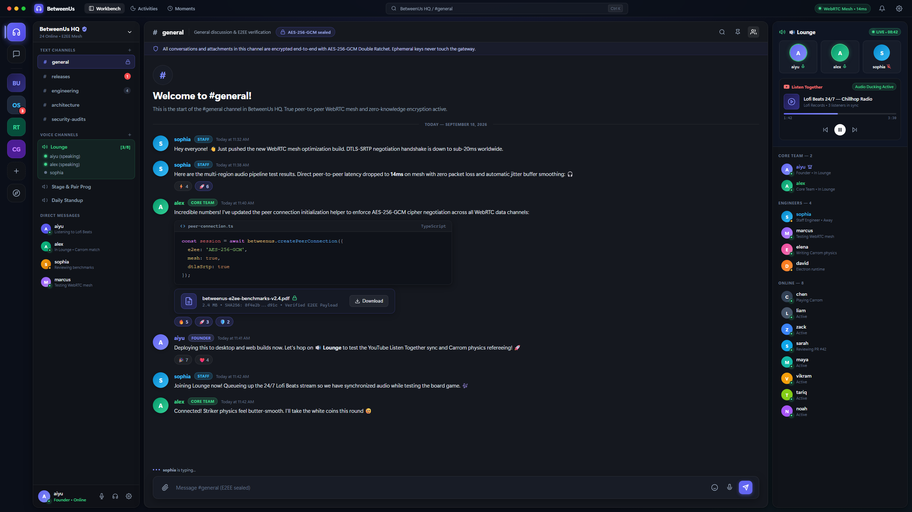

# BetweenUs

<p align="center">
  
</p>

<p align="center">
  <a href="https://github.com/aiyu-ayaan/BetweenUs"></a>
  <a href="https://github.com/aiyu-ayaan/BetweenUs"></a>
  <a href="https://github.com/aiyu-ayaan/BetweenUs/commits/master"></a>
  
  
  
  
  
  
  
  
  
  
  
  
  <a href="LICENSE"></a>
</p>

A modern, secure communication platform with end-to-end encrypted messaging, peer-to-peer (P2P) WebRTC voice/video channels, interactive screen sharing, picture-in-picture, and remote desktop access. Built as a high-performance pnpm + Turborepo monorepo of NestJS microservices with Desktop (Electron), Web (React), and Native Mobile (Android Jetpack Compose) clients.

Messages, attachments, and call media are end-to-end encrypted: the server stores and routes ciphertext, never holding any key that can decrypt it. Voice, video, and screen sharing stream directly between participants via a peer-to-peer WebRTC mesh with DTLS-SRTP encryption — requiring zero media server infrastructure.

`CLAUDE.md` is the target architecture. `development/` tracks what is built, why each decision was taken, and what is deliberately left open. `docs/` holds a small number of deep dives on one cross-cutting feature each, linked from wherever that feature is mentioned. `DEPLOYMENT.md` is the step-by-step guide for deploying on a server with Docker Compose, Cloudflare Tunnels, and STUN/TURN relays.

---

## Status

| Area | State |
| --- | --- |
| Accounts | Register, login, refresh-token rotation with reuse detection, Google and GitHub sign-in, admin panel |
| Servers | Servers, custom roles with colours, per-member permission overrides, invite links that expire and can be revoked, custom emoji, server settings |
| Channels | Public and private text channels, private channels as an allowlist, direct messages between friends |
| Messages & Chat | End-to-end encrypted, realtime over WebSocket, history paging in both directions, replies, `:` emoji search, per-server custom emoji including animated, reactions with who-reacted names, drag-and-drop and a preview before sending, full-screen zoomable image viewer, integrated video player, and local media album saving |
| Voice and video | Peer-to-peer voice channels, camera, one screen share at a time with takeover, join and leave tones, manual quality override, end-to-end encrypted media, no media server |
| Android Client | Native Jetpack Compose + Material 3 app with E2EE messaging, WhatsApp-style media picker and composer, media viewers, and public gallery saving (`Pictures/BetweenUs`, `Movies/BetweenUs`) |
| Presence | Online / idle / do not disturb / invisible, typing indicators, voice rosters |
| Notifications | Desktop notifications, system tray, start with the system, per-channel and per-person mute, quiet hours, persisted unread with a line that survives a restart |
| Remote desktop | A machine offers itself from Settings, dials out to the gateway, and is viewed and driven from another client; per-machine permissions with expiry, and an audit trail |

## Features, and where each one works

**Desktop** is the Electron app, **Web** is the same UI in a browser tab
(`apps/web` mounts `apps/desktop/src`, so they are one codebase), and
**Android** is the native Compose client.

Where the three differ it is almost always for one reason: screen capture by
source, synthetic mouse and keyboard input and the OS keychain live behind the
Electron preload bridge, and a browser tab has none of them.

| | Desktop | Web | Android |
| --- | :---: | :---: | :---: |
| **Accounts** | | | |
| Register, sign in, refresh-token rotation | ✅ | ✅ | ✅ |
| Google and GitHub sign-in | ✅ | ✅ | ✅ |
| Display name, avatar, change password | ✅ | ✅ | ✅ |
| Encryption identity: unlock, backup secret | ✅ | ✅ | ✅ |
| Device list and revoking a device | ✅ | ✅ | — |
| Point the client at another deployment | ✅ | ✅ | ✅ |
| Admin panel | \* | \* | \* |
| **Servers and channels** | | | |
| Create a server, join one, leave or delete | ✅ | ✅ | ✅ |
| Invite links: create, expiry, use limit, revoke | ✅ | ✅ | ✅ |
| Invite preview card before joining | ✅ | ✅ | ✅ |
| Server icon | ✅ | ✅ | ✅ |
| Custom roles: create, colour, permissions, delete | ✅ | ✅ | ✅ |
| Per-member permission overrides | ✅ | ✅ | ✅ |
| Add a friend to a server, kick, change role | ✅ | ✅ | ✅ |
| Text and voice channels, private channel allowlists | ✅ | ✅ | ✅ |
| Custom emoji: add and remove | ✅ | ✅ | ✅ |
| **Messaging** | | | |
| End-to-end encrypted messages, realtime, history paging | ✅ | ✅ | ✅ |
| Direct messages and friends | ✅ | ✅ | ✅ |
| Replies, edit, delete, reactions | ✅ | ✅ | ✅ |
| Pinned messages | ✅ | ✅ | ✅ |
| Custom emoji in messages | ✅ | ✅ | ✅ |
| `:` emoji suggestion menu while typing | ✅ | ✅ | — |
| Emoji picker | ✅ | ✅ | ⚠️ Unicode only |
| Search within a channel | ✅ | ✅ | — |
| Quick switcher (Ctrl+K) | ✅ | ✅ | — |
| Attachments of any type, up to 100 MB | ✅ | ✅ | ✅ |
| Sending survives leaving the screen | — | — | ✅ foreground service |
| HEIC photos converted, photos re-encoded on the way out | ✅ | ✅ | ✅ |
| Preview before sending, multi-select, captions | ✅ | ✅ | ✅ |
| Drag and drop into the composer | ✅ | ✅ | — |
| Zoomable image viewer, video player | ✅ | ✅ | ✅ |
| Save media to the device gallery | download | download | ✅ `Pictures/BetweenUs` |
| **Voice, video and screen share** | | | |
| Peer-to-peer voice channels | ✅ | ✅ | ✅ |
| Camera | ✅ | ✅ | ✅ |
| Screen share | ✅ | ✅ | ✅ |
| Tiles shaped to the picture (portrait and landscape) | ✅ | ✅ | ✅ |
| Ask to drive somebody's shared screen | ✅ | ✅ | — |
| Be driven while sharing your screen | ✅ | — | — |
| Manual quality override | ✅ | ✅ | ⚠️ automatic |
| Push to talk | ✅ | ✅ | — |
| Picture-in-picture while minimised | ✅ | — | — |
| Join and leave tones | ✅ | ✅ | ✅ |
| Ongoing-call notification | tray | — | ✅ foreground service |
| **Presence and notifications** | | | |
| Online, idle, do not disturb, invisible | ✅ | ✅ | ✅ |
| Typing indicators, voice rosters | ✅ | ✅ | ✅ |
| Unread counts and the unread line | ✅ | ✅ | ✅ |
| Notifications for messages, mentions and calls | ✅ | ✅ | ✅ FCM, app dead or alive |
| Per-channel and per-person mute, quiet hours | ✅ | ✅ | ✅ |
| Not woken for a chat open on another of your devices | ✅ | ✅ | ✅ |
| System tray, start with the system | ✅ | — | — |
| Self-updates from GitHub Releases (alpha / beta / stable) | — | — | ✅ |
| **Remote desktop** | | | |
| Offer this machine to be controlled | ✅ | — | — |
| View and control another machine | ✅ | — | ✅ |
| Grants per person and permission, with expiry | ✅ | — | ✅ |
| Rename, remove, read the audit trail | ✅ | — | ✅ |

\* The admin panel is its own bundle at `/admin`, so it is a browser page
whichever client you arrived from.

**Push suppression** works the same way WhatsApp's does: if any of your
windows has a channel open and focused, none of your devices is woken for a
message in it. A different channel still buzzes normally, even in the same
server. See `docs/push-suppression.md`.

---

Known limits are written down rather than implied: see `development/E2EE.md`
for what the encryption does and does not protect,
`development/SECURITY.md` for who the API believes and what it still does not
defend against, and `development/TODO.md` for everything each phase left open on
purpose.

---

## Architecture

Five concerns are kept apart, and the separation is the design: public ingress,
internal routing, application logic, realtime media, and remote access.

```
                              Internet
                                 │
                          Cloudflare Tunnel          (no inbound ports opened)
                                 │
                        ┌────────▼────────┐
                        │  Nginx :8080    │          routing, rate limits,
                        │  API gateway    │          body caps, WS upgrade
                        └────────┬────────┘
                                 │
   ┌──────────────┬──────────────┼───────────────┬──────────────┐
   │              │              │               │              │
┌──▼───┐   ┌──────▼─────┐  ┌─────▼─────┐  ┌──────▼──────┐ ┌─────▼──────┐
│ auth │   │  server    │  │   chat    │  │  presence   │ │notification│
│ 3001 │   │   3003     │  │   3004    │  │    3005     │ │    3006    │
└──┬───┘   └──────┬─────┘  └─────┬─────┘  └──────┬──────┘ └─────┬──────┘
   │              │              │               │              │
   └──────────────┴──────┬───────┴───────────────┴──────────────┘
                         │
            ┌────────────┴────────────┐
            │                         │
      ┌─────▼──────┐            ┌─────▼─────┐
      │ PostgreSQL │            │   Redis   │  pub/sub, presence,
      │   :5432    │            │   :6379   │  rate limits, sessions
      └────────────┘            └───────────┘

  Client A (Desktop/Web/Android) ── /ws/call ──▶ call-service :3007 ◀── /ws/call ── Client B (Desktop/Web/Android)
                                                 (roster, SDP, ICE relay)
      │                                                                                        │
      └───────────────────── WebRTC, direct: voice / video / screen ───────────────────────────┘
```

There is no media server. `call-service` decides who may join a call and
introduces the participants to each other; everyone then holds one
`RTCPeerConnection` per other participant and the media goes straight between
the two clients.

That is also what makes the deployment simple. A Cloudflare Tunnel carries HTTP
and WebSocket and not UDP, so anything with a media server in it has to smuggle
media past the tunnel - a routable address to advertise, published ports, a
forced relay. None of that exists here: no port is opened for media, and no
service ever tells a client where to connect.

The cost is the mesh: each participant uploads one copy per other participant,
which is comfortable to about five on video and eight on voice alone. Bigger
calls want an SFU, and that would be a deliberate decision rather than a drift.

### How a request actually flows

Sending a message, from the keystroke or tap to the other person's screen. Every layer
does one job, and the boundaries are where the security properties live.

```
┌──────────────────────────────────────────────────────────────────────┐
│ 1  Client (Desktop Electron / Browser Web / Native Android)          │
│    Store/State → encrypt with the channel key (AES-256-GCM)          │
│    • Desktop/Web: Zustand store + WebCrypto API                      │
│    • Android: Conversation store + javax.crypto AES/GCM/NoPadding    │
│    Plaintext stops here. Everything below sees ciphertext.           │
└───────────────────────────────┬──────────────────────────────────────┘
                                │  POST /api/v1/messages   (JWT bearer)
┌───────────────────────────────▼──────────────────────────────────────┐
│ 2  Nginx :8080          (in development, the Vite proxy stands in)   │
│    Route by path · rate limit · body cap · forward x-request-id      │
│    No business logic, no database, no idea what a message is.        │
└───────────────────────────────┬──────────────────────────────────────┘
                                │  http://chat-service:3004
┌───────────────────────────────▼──────────────────────────────────────┐
│ 3  chat-service (NestJS)                                             │
│    JwtAuthGuard         → who is this                                │
│    ValidationPipe / DTO → is the body the right shape                │
│    Controller (thin)    → hands off, decides nothing                 │
│    MessagesService      → resolveChannelAccess(user, channel):       │
│                           membership, role, overrides, allowlist     │
└───────────────────────────────┬──────────────────────────────────────┘
                                │  typed Prisma calls
┌───────────────────────────────▼──────────────────────────────────────┐
│ 4  Prisma (@betweenus/database)                                         │
│    One schema, one generated client, one connection pool.            │
│    Typed queries in, rows out - the only thing that speaks SQL.      │
└───────────────────────────────┬──────────────────────────────────────┘
                                │
┌───────────────────────────────▼──────────────────────────────────────┐
│ 5  PostgreSQL :5432                                                  │
│    messages(id, channelId, authorId, content = ciphertext, …)        │
│    attachments(id, key, size, … = ciphertext / unidentifiable blobs) │
└───────────────────────────────┬──────────────────────────────────────┘
                                │  row written
┌───────────────────────────────▼──────────────────────────────────────┐
│ 6  Redis :6379 - publish `message.created`                           │
│    Fanout, not storage: every chat-service instance is subscribed,   │
│    so a client on another instance is reached just the same.         │
└───────────────────────────────┬──────────────────────────────────────┘
                                │
┌───────────────────────────────▼──────────────────────────────────────┐
│ 7  /ws/chat gateways → sockets subscribed to that channel            │
│    → each client (Desktop / Web / Android) decrypts with channel key │
│      updates local state/cache (Zustand / Room DB) and notifies      │
└──────────────────────────────────────────────────────────────────────┘
```

The sender's own client is on that same socket path: there is no optimistic
insert, so a message appears when it is real, and the copy that appears is the
one that came back through the fanout.

Reads take the first five steps and stop: `GET /api/v1/messages` is the same
guard, the same access check, and one indexed Prisma query on
`(channelId, createdAt)`. The clients (Desktop, Web, Android) cache the decrypted
result per channel in memory/Room DB, so reopening a conversation paints immediately
and refreshes behind it.

Two paths deliberately skip this stack:

- **Media** goes `client ↔ client` over WebRTC mesh (Desktop, Web, Android). `call-service` only relays the
  offers, answers and ICE candidates the clients use to find each other.
- **Attachments** are sealed on the client (Desktop, Web, Android) and uploaded as encrypted bytes; the server
  stores an object it cannot type and hands back a key.

### Services

Each service is its own package with its own `package.json` and `GET /health`,
and can be deployed on its own. The images are all built from one multi-stage
`infrastructure/docker/Dockerfile`, one target per service, so the workspace is
installed and compiled once rather than once per image.

| Service | Port | Owns |
| --- | --- | --- |
| `api-gateway` | 8080 | Nginx config: routing, rate limiting, request caps, WebSocket upgrade. No business logic |
| `auth-service` | 3001 | Registration, login, JWT access and refresh tokens with rotation, OAuth, the admin API |
| `server-service` | 3003 | Servers, members, roles, permission overrides, channels, invites |
| `chat-service` | 3004 | Messages, `/ws/chat` fanout, uploads, the E2EE key directory, friends and DMs |
| `presence-service` | 3005 | `/ws/presence`, online status, typing, voice rosters, all Redis-backed |
| `notification-service` | 3006 | Notification preferences, per-channel mutes, quiet hours, read markers |
| `call-service` | 3007 | Call permissions, the peer roster, and `/ws/call` signalling. Never media |
| `remote-gateway` | 3008 | Remote machines, per-machine permissions, session relay on `/ws/remote`, audit log |
| `remote-agent` | — | Scaffold, for a headless machine. On a desktop the agent is the app itself |

`user-service` is a scaffold too; its routes (profiles, friends, user search)
are served by chat-service until it exists.

### Shared packages

Cross-cutting code only - no service's business logic lives here.

| Package | Holds |
| --- | --- |
| `@betweenus/shared-types` | DTOs, API contracts, WebSocket event unions. One source for client and server |
| `@betweenus/database` | Prisma schema and client, plus `resolveChannelAccess` and `resolveRemoteAccess` - the single answers to "may this user do this here" and "…to this machine" |
| `@betweenus/auth` | JWT sign and verify, `JwtAuthGuard`, `@CurrentUser()`, secret sealing |
| `@betweenus/permissions` | Role constants and the override arithmetic (deny beats grant beats role) |
| `@betweenus/events` | Event names, payload contracts, and the Redis pub/sub bus |
| `@betweenus/nest-common` | Bootstrap, request ids, the error contract, `/health`, Redis-backed rate limiting |
| `@betweenus/storage` | Local-disk and S3 drivers behind one interface, including multipart upload |
| `@betweenus/websocket` | Shared socket plumbing |
| `@betweenus/logger` | Structured JSON logging with redaction |
| `@betweenus/config` | Typed environment loading |

### Realtime

- **`/ws/chat`** - JWT handshake, per-channel subscriptions, fanout driven by
  Redis pub/sub so any number of chat-service instances stay in step.
- **`/ws/presence`** - status, typing and voice rosters, with Redis holding the
  live state rather than any single process.
- **`/ws/remote`** - the relay between a remote session's controller and the
  agent on the machine, with every input event checked against the permissions
  frozen on the session.
- **`/ws/call`** - the roster of who is in a channel's call, and the offers,
  answers and ICE candidates two clients exchange to find each other.
- **WebRTC, client to client** - voice, video, screen share and a remote
  machine's screen. Never over WebSocket, and never through a server.

### Data

PostgreSQL holds persistent state through Prisma: users, identities, servers,
members, roles, channels, channel allowlists, friendships, messages, device
keys, wrapped channel keys, notification settings, read markers, remote
machines, remote grants, remote sessions and the remote audit trail.

Redis holds what is live and cheap to lose: presence, typing, voice rosters,
pub/sub, rate-limit windows.

Object storage (local disk or any S3-compatible bucket) holds files. Postgres
keeps the metadata; blobs never go in a column.

---

## Security

- **End-to-end encryption.** ECDH P-256 identity key per device, HKDF key
  wrapping, AES-256-GCM for messages, attachments and call media. Private keys
  are sealed with the OS keychain through Electron `safeStorage` and never
  leave the machine. A call that cannot encrypt aborts rather than downgrading.
- **Attachments are encrypted before upload**, and their manifest - name, real
  type, size - travels inside the encrypted message body, not in columns. The
  server cannot type what it stores, so it serves everything as
  `application/octet-stream` with a download disposition.
- **Authorization is server-side and central.** `resolveChannelAccess` answers
  every channel question for chat-, call- and presence-service. A private
  channel is an allowlist that ownership does not override, and a channel the
  caller cannot see answers 404 rather than 403, so ids cannot be probed for.
- **Refresh-token rotation with reuse detection** - replaying a consumed token
  revokes the whole family.
- **Rate limiting twice**: per address at the gateway, and again in the service
  through Redis, so every instance shares one budget.
- **Hardened renderer**: context isolation on, node integration off, sandbox
  on, a permission handler that allows only microphone, camera and display
  capture, and navigation locked to the app origin.
- **Structured logs never carry** passwords, tokens, keys or message content.
  Every request logs a request id, and the id survives a hop between services.

`development/E2EE.md` states the threat model and the known gaps plainly.

---

## Requirements

- Node.js 20+
- pnpm 9
- Docker - Postgres and Redis in development; the whole stack in a
  deployment (see `DEPLOYMENT.md`)

## Quick start

```bash
cp .env.example .env            # set JWT secrets & ensure DATABASE_URL matches POSTGRES_PASSWORD
pnpm dev:infra                  # Postgres and Redis in Docker
pnpm install
pnpm db:generate
pnpm db:migrate                 # creates the schema
pnpm db:seed                    # optional: demo@betweenus.local / betweenus123
pnpm dev:backend                # every service, no renderer (leave running)
pnpm dev:duo                    # second terminal: two signed-in test windows
```

Use `pnpm dev:backend`, not `pnpm dev`: the latter also starts the desktop
renderer on 5173, which `dev:duo` needs for its own Vite. `pnpm dev:desktop`
runs a single client against a running backend.

Everything in containers instead:

```bash
pnpm prod:up                      # starts the full production container stack
# Or: docker compose --env-file .env -f infrastructure/docker/docker-compose.yml up -d --build
```

Default ports: gateway `8080`, auth `3001`, server `3003`, chat `3004`,
presence `3005`, notification `3006`, call `3007`, renderer `5173`, admin panel
`5174`, web client `5175`. Nothing listens for media: it goes directly between
clients, on ports negotiated per call.

## Production app builds & packaging

To build and package production release artifacts:

```bash
# 1. Build all packages, backend microservices, and web frontends:
pnpm build

# 2. Package the Desktop Client executable (Electron installer/binary):
pnpm desktop:package
```
Output binaries are written to `apps/desktop/dist/`.

## Desktop client

Electron with a hardened preload, React, Tailwind and Zustand. It keeps running
in the system tray when the window is closed - which is what makes a
notification possible while it is "shut" - and starts with the system by
default, with both switches in Settings → Notifications.

```
pnpm dev:desktop     one client against a running backend
pnpm dev:duo         two windows, two profiles, two encryption identities
pnpm dev:web         the browser client on 5175
pnpm dev:admin       the admin panel on 5174
pnpm admin:create    bootstrap the first administrator (password printed once)
```

## Web client

The same app in a browser: `apps/web` is a bundle that mounts the UI out of
`apps/desktop/src` rather than copying it, so chat, calls, screen share and
settings are the same code in both clients. It is served at the root of the
gateway, which makes a deployment one address for everything - the app at `/`,
the admin panel at `/admin`, the services under `/api`.

What a tab does not get is the **remote-desktop section**: no machine list, no
agent, no Remote Access settings. Screen capture by source, synthetic mouse and
keyboard input and the OS keychain all live behind the Electron preload bridge,
and a browser has none of it - so the app looks for that bridge and offers the
section only where it can work.

Requesting control of somebody's **screen share inside a call** does work from
a browser: the controller only sends input events over the data channel, and it
is the machine being driven that needs the bridge. Sharing your screen from a
tab and handing control the other way is refused, which was already the answer
on macOS and Linux.

### One address, and how to change it

A deployment is **one URL**. REST, `/ws/chat`, `/ws/presence`, `/ws/call`,
`/ws/remote` and uploaded files are all behind the same gateway, so there is a
single variable to set:

```
VITE_API_URL="https://betweenus.example.com"
```

Which URL that is:

| Where the backend runs | Point the desktop app at |
| --- | --- |
| `pnpm dev:backend` on this machine | nothing - `pnpm dev` proxies to the services itself |
| Docker compose on this machine | `http://localhost:8080` (the built-in default) |
| Docker compose on another machine on the LAN | `http://<its-ip>:8080` |
| Behind a Cloudflare Tunnel | `https://betweenus.example.com` |

The port is `GATEWAY_PORT`, never a service port: `3001`, `3004` and the rest
are internal to the Docker network and are not what a client talks to.

`VITE_API_URL` is read from the repo-root `.env` and baked in at build time, so
it only affects a packaged build. `pnpm dev` ignores it deliberately - the Vite
dev server proxies to the services itself, and its own origin is then the
gateway.

It is only the default. **Connect to a self-hosted instance** on the login
screen (and *Change server* in Settings → My Account) points the window at any
other deployment: the address is checked before it is stored, and connecting
elsewhere signs the window out and reloads. So a build can ship pointed at one
deployment without being locked to it.

There is no exception to it. Media used to be one - an SFU negotiated its own
path on `7881/tcp` and a UDP range, so the deployment was one hostname plus a
set of ports. Peers now reach each other directly, so the hostname really is
the whole address: one URL carries everything a client asks the backend for,
and media asks the backend for nothing.

## Android client

A native Android mobile application built with **Kotlin 2.2**, **Jetpack Compose**, and **Material 3** (`apps/android`).

- **End-to-End Encrypted Chat**: Client-side AES-256-GCM message encryption/decryption, channel & direct messaging, real-time typing indicators, read markers, and offline Room/memory caching.
- **WhatsApp-Style Attachment Sheet**:
  - Inline recent photos & videos tray with multi-select badge counter and batch sending.
  - Dedicated action buttons: **Document** (`OpenMultipleDocuments`), **Camera** (`TakePicture` with `FileProvider`), **Gallery** (`PickMultipleVisualMedia`), and **Audio** picker.
  - Handles modern Android 14+ (`READ_MEDIA_VISUAL_USER_SELECTED`), Android 13 (`READ_MEDIA_IMAGES` / `READ_MEDIA_VIDEO`), and legacy storage permissions.
- **Modern Message Composer**:
  - Rounded pill input well with accent active borders and typing indicator dispatch.
  - Built-in **Emoji Picker Sheet** with categorized emojis (Smileys, Gestures, Hearts, Fun & Symbols).
  - Quick **Camera Button** that automatically hides when the on-screen keyboard is open (`WindowInsets.isImeVisible`) or while typing to maximize input area.
  - Active circular Send button that illuminates in `Accent` when content is staged.
- **In-Chat Media & Dedicated Viewers**:
  - Responsive inline photo and video cards with client-side decryption.
  - **Fullscreen Zoomable Image Viewer**: Multi-touch pinch-to-zoom, pan gestures, reset zoom, and native system share sheet.
  - **Integrated Video Player**: Fullscreen playback with standard media playback controls.
  - **Direct Gallery Storage Saving**: "Save to Gallery" action saves media directly into the device's public media albums under `Pictures/BetweenUs` and `Movies/BetweenUs` using modern Android Scoped Storage (`MediaStore`).
- **WebRTC Voice & Video**: Peer-to-peer audio and video calls.
- **Push notifications**: FCM, data-only and sealed - the server never writes a
  notification, only the phone can. Messages, mentions, calls (a `CallStyle`
  full-screen intent that rings with the app dead), friend requests and being
  added to a server. Suppressed for a channel any of your other devices already
  has open and focused - see `docs/push-suppression.md`.
- **Attachments send under a foreground service**: leaving the channel, taking
  a call or locking the phone no longer kills an upload halfway.
- **Self-updating**: checks its own GitHub releases on launch and once a day in
  the background, on a channel of alpha / beta / stable, downloads the APK
  built for the device's ABI (never the universal one), and hands it to
  Android's package installer - install now or snooze a day. See
  `development/ANDROID_TODO.md` (phase 15).

```bash
# Build and verify the Android client:
cd apps/android
./gradlew assembleDebug      # compiles debug APK
./gradlew test               # runs unit test suite
```

## Remote desktop

A machine offers itself by turning on **Settings → Remote Access**. It enrols
under the account signed in on it, keeps its credential in the OS keychain and
dials *out* to the gateway - nothing listens, no port is opened, and 3389 is
published nowhere in this stack.

Access is granted per person per machine, never by a server role: owning a
machine grants everything on it, and anybody else holds exactly what they were
given, optionally until a date. `REMOTE_VIEW`, `REMOTE_CONTROL` and
`REMOTE_CLIPBOARD` are implemented; `REMOTE_FILE_TRANSFER` and `REMOTE_AUDIO`
exist in the vocabulary and do nothing yet.

The screen travels directly between the two machines, the same way a call does:
the gateway relays the offer and answer that set the connection up, and then
carries no pixels. It relays
input and refuses anything the session was not granted, so a view-only session
cannot type however the client is built - and refusals are audited alongside
the sessions themselves, which a machine's owner can read.

The owner connecting to their own machine starts immediately; anyone else
raises a prompt on the machine that refuses itself if nobody answers, and a
banner stays up for as long as the session does. Mouse and keyboard injection
is Windows-only for now - elsewhere a session can watch but not touch.

## Public ingress

BetweenUs is one public hostname. If a `cloudflared` already runs on the server,
add one ingress entry:

```yaml
- hostname: betweenus.example.com
  service: http://localhost:8080     # GATEWAY_PORT
```

and reload it - no extra container. To let BetweenUs bring its own tunnel instead:

```bash
CLOUDFLARE_TUNNEL_TOKEN=... docker compose   -f infrastructure/docker/docker-compose.yml --profile public up -d
```

`infrastructure/cloudflare/tunnel.yml` documents both, and why the tunnel is
now enough on its own. It carries HTTP and WebSocket, which is all signalling
is; media is UDP, which no tunnel carries, and does not need to - it goes
straight between the clients. Nothing else has to reach the host, so no port is
opened for media anywhere in this repo.

`DEPLOYMENT.md` walks the whole thing end to end - what to generate, how to
create the first administrator, and what each endpoint behind the tunnel is for.

## File storage

`@betweenus/storage` picks its driver from the environment:

- **S3 variables empty (default):** files land in `LOCAL_STORAGE_PATH`
  (`./storage-data`) and chat-service serves them. Nothing to configure.
- **`S3_ENDPOINT`, `S3_BUCKET`, `S3_ACCESS_KEY`, `S3_SECRET_KEY` all set:** the
  S3 driver takes over. Partial configuration stays on local disk rather than
  half-working.
- `STORAGE_DRIVER=local|s3` forces one. Forcing `s3` without credentials fails
  at boot instead of silently falling back.

In Docker the local driver writes to `/data/uploads` inside chat-service, and
`UPLOAD_DATA_PATH` decides where that is on the host: a bare name is a Docker
volume (`upload-data`, the default), a path is a bind mount.

```bash
UPLOAD_DATA_PATH=/mnt/disk2/betweenus-uploads   # or D:/betweenus-uploads on Windows
```

Keys are UUID-based, so a client filename never decides where a file lands.
Anything over 8 MB uploads in parts, with the session carried by the client as
a sealed ticket rather than held as state in a service.

---

## Repository layout

```
apps/
  desktop/                Electron + React + Tailwind + Zustand client
  web/                    The same UI in a browser, served at / (no remote desktop)
  admin/                  Admin panel (React, served under /admin)
  android/                Native Android client (Kotlin 2.2 + Jetpack Compose + Material 3)
  services/
    api-gateway/          Nginx configuration
    auth-service/         Accounts, tokens, OAuth, admin API
    server-service/       Servers, roles, channels
    chat-service/         Messages, /ws/chat, uploads, E2EE directory
    presence-service/     /ws/presence, status, typing, voice rosters
    notification-service/ Preferences, mutes, quiet hours, read markers
    call-service/         call permissions and /ws/call signalling
    remote-gateway/       Remote machines, permissions, session relay, audit
    remote-agent/         Scaffold - for a headless machine with no app on it
    user-service/         Scaffold
packages/                 shared-types, database, auth, permissions, events,
                          nest-common, storage, websocket, logger, config
infrastructure/           docker compose, nginx, cloudflare
development/              planning, MVP, E2EE design, API security, testing guide, TODO, Android roadmap
DEPLOYMENT.md             putting it on a server, end to end
```

## Common commands

| Command | Effect |
| --- | --- |
| `pnpm dev:backend` | Every service, no renderer |
| `pnpm dev` | Everything, including the desktop renderer |
| `pnpm dev:duo` | Two signed-in desktop windows for chat, voice and presence |
| `pnpm build` | Build every package, service and the desktop bundle |
| `pnpm typecheck` | Type-check the whole monorepo |
| `pnpm check` | Package self-checks - crypto, storage, logger, auth, permissions, websocket |
| `pnpm db:migrate` / `db:seed` / `db:studio` | Schema, demo data, Prisma Studio |
| `pnpm data:path <path>` | Configure single-point data root directory in `.env` and set up tree |
| `pnpm db:backup` | Trigger pre-migration or manual database dump to `BACKUP_DATA_PATH` |
| `pnpm admin:create` | Create the first administrator |
| `pnpm --filter @betweenus/chat-service smoke` | End-to-end check against running services |
| `pnpm --filter @betweenus/presence-service smoke` | Presence, typing and voice rosters |
| `pnpm --filter @betweenus/notification-service smoke` | Preferences, unread counting, read markers |
| `pnpm --filter @betweenus/remote-gateway smoke` | Enrolment, grants, and what the remote relay refuses |
| `cd apps/android && ./gradlew test` | Run Android core & UI unit test suite |
| `cd apps/android && ./gradlew assembleDebug` | Build debug APK for Android |

## Testing and CI

Three layers, all runnable locally:

1. **Self-checks** (`pnpm check`) need no infrastructure: the crypto
   primitives, the storage drivers including a multipart round trip, the
   permission arithmetic, the logger's redaction, and the API's trust
   boundaries - which address a request is counted against, which redirect a
   finished sign-in may be sent to, which algorithm a token is verified with.
2. **Smoke scripts** drive the real HTTP and WebSocket surface against running
   services and exit non-zero on a failed assertion.
3. **Manual walkthroughs** for what only a human can judge - two people in a
   voice call, a shared screen, a notification arriving from the tray.
   `development/TESTING.md` lists them.

GitHub Actions runs install → lint → typecheck → build → self-checks, then an
integration job with Postgres and Redis containers that applies the migrations,
starts the services and runs every smoke script.

## API surface

```
POST /api/v1/auth/register|login|refresh|logout    GET /api/v1/auth/me
GET|POST /api/v1/servers          POST /api/v1/servers/join
GET|PATCH|DELETE /api/v1/servers/:id       POST /api/v1/servers/:id/leave
GET /api/v1/servers/:id/members   PATCH|DELETE /api/v1/servers/:id/members/:userId
GET|POST /api/v1/channels         PATCH|DELETE /api/v1/channels/:id
GET|PUT /api/v1/channels/:id/members       GET|POST /api/v1/messages
GET /api/v1/users/search          GET|POST /api/v1/friends
POST /api/v1/friends/:id/accept   DELETE /api/v1/friends/:id
GET|POST /api/v1/dm
POST /api/v1/uploads              GET /api/v1/uploads/:key
GET|POST /api/v1/e2ee/devices     GET /api/v1/e2ee/keys/:channelId
POST /api/v1/e2ee/keys            POST /api/v1/calls/token
GET|PATCH /api/v1/notifications/preferences
GET /api/v1/notifications/unread  POST /api/v1/notifications/read
GET|POST /api/v1/remote/machines  PATCH|DELETE /api/v1/remote/machines/:id
GET|PUT /api/v1/remote/machines/:id/grants
GET /api/v1/remote/machines/:id/audit
POST /api/v1/remote/sessions      DELETE /api/v1/remote/sessions/:id
GET /api/v1/admin/...             (administrators only)
WS   /ws/chat                     WS  /ws/presence      WS /ws/remote
GET  /health                      (every service)
```

Errors share one shape everywhere:

```json
{ "error": { "code": "CHANNEL_NOT_FOUND", "message": "Channel not found", "requestId": "..." } }
```

---

## Recently added

Newest first. Every one of these is in `development/TRACK.md` with the reason it
was built the way it was; this is the short version.

### Notifications & Android self-update

- **Push suppression across devices.** A message no longer buzzes a phone
  whose owner has that exact channel open and focused on another device -
  desktop, web or a second phone. Per account, per exact channel: a different
  server still notifies normally everywhere. Clients report focus over
  `/ws/presence`; `notification-service` asks `presence-service` before every
  fan-out and drops the readers. `docs/push-suppression.md`.
- **Every attachment sends under the foreground service, not only pictures and
  video.** A document used to upload inline in the chat screen's own scope,
  which died the moment the screen did - leaving the channel mid-upload left
  its parts in object storage and nothing to finish them. Everything picked
  now goes through the same preview and the same `Outbox` queue.
- **Android updates itself.** Checks its own GitHub releases on launch and once
  a day in the background (`WorkManager`, unmetered network), on a channel of
  alpha / beta / stable, downloads the APK built for the device's ABI and hands
  it to a `PackageInstaller` session - which reports what happened, including a
  refusal from a build signed with a different key. Install now, or snooze a
  day by default. `development/ANDROID_TODO.md` (phase 15).

### Deployment & Backups

- **Single Point Datapath (`BETWEENUS_DATA_PATH`).** `pnpm data:path <path>` sets up a unified storage root for `data/postgres`, `data/redis`, `data/media` (`pictures/` and `attachments/`), and `backup/`. Derived path environment variables (`POSTGRES_DATA_PATH`, `REDIS_DATA_PATH`, `UPLOAD_DATA_PATH`, `BACKUP_DATA_PATH`) are written directly to `.env` while preserving fallback to Docker named volumes.
- **Pre-Migration Database Backups & Write Pre-checks.** `db-backup-once` container automatically executes a `pg_dump` SQL archive before `prisma migrate deploy` runs. Write permissions on `BACKUP_DATA_PATH` are validated automatically by `backup.sh` and `data-path.mjs` to prevent silent output redirection errors.

### Security

- **Adding a member is friends-only.** `POST /servers/:id/members` used to take
  any username and add it - being added is a member list entry, a notification
  and a set of readable channels, none of which the person was asked about.
  Letting a stranger in is what an invite link is for.
- **A moderator cannot edit or kick an administrator.** The permission check
  answered "may you manage members at all" and the role check answered "may you
  hand out that role"; neither asked who the member was.
- **Attachments need a session to download.** They are ciphertext either way,
  but the bytes and their size went to anybody who ever saw the URL. Avatars
  stay public, because an `` tag cannot carry a header.
- **A key per machine, not per account.** The device directory is a list now,
  a channel key is wrapped once per device, and revoking one deletes its wraps
  and re-keys every channel it could read.

### Chat

- **Replies**, on all three clients - a quote inside the encrypted body, so the
  server never learns who is answering whom.
- **`:` emoji search**, ranked exact-then-prefix-then-substring, with a
  shortcode table for every emoji the picker draws.
- **Per-server custom emoji, animated included.** Upload a picture, name it,
  type `:name:`. Animated files are stored exactly as uploaded, which is the
  whole trick - re-encoding a GIF keeps the first frame and throws the rest
  away. The pictures travel inside the encrypted message, so a shortcode
  forwarded into a direct message still renders.
- **Invite links.** `/invite/<code>`, redeemed after sign-in, surviving the
  reload that sign-in causes.
- **A member menu**: message, add friend, mute, copy id. Muting is per person
  and follows the account; a muted person is silent even when they mention you.
- **History that pages backwards** on desktop and web, anchored so the reader
  stays where they were reading.
- **A local cache** on desktop and web - servers, channels, conversations and
  the last few hundred messages per channel, as the ciphertext the server sent.
- **An unread line that survives a restart**, with a bar to jump to it.
- **Media preview before sending**, drag-and-drop anywhere in the conversation,
  and video that loads itself rather than waiting for a click.

### Voice

- **One screen share at a time**, replacing the one before it the way Teams
  does, arbitrated by `call-service` because two simultaneous claims need one
  answer.
- **Join and leave tones**, synthesised at both ends at the same two
  frequencies.
- **A manual quality override** - bitrate, frame rate, codec - for a share and
  for a remote session, which is how a LAN gets told it is a LAN.
- **Devices that follow the hardware**: a headset plugged in mid-call is moved
  to, and a chosen device that is missing says so.

### Android

- **Reconnect on a network-change callback** rather than waiting out a backoff
  measuring a problem that has gone.
- **Microphone processing, a hi-fi mode and an output route**, applied to a
  call that is already up.
- **Invite management**, and a fix to a line that still told people to share
  the slug.
- **R8 on the release build**, code and resources shrunk, with keep rules that
  each say why they exist.

### Known gaps

- No backend has been run in the sessions that wrote most of the above; the
  smoke scripts are the integration tests and they need a database and Redis.
- Migrations are waiting to be applied - see the list at the bottom of
  `development/TRACK.md`, including two whose names sort backwards.
- On Android a GIF emoji shows its first frame: animating one needs Coil's
  `coil-gif` artifact, which is one dependency line.

## Conventions

- TypeScript strict everywhere; no `any` in committed code.
- Controllers stay thin, services hold the logic, persistence stays in services.
- Every service exposes `GET /health` and answers the shared error contract.
- Conventional commits (`feat:`, `fix:`, `chore:`, `docs:`).

## Licence

**Source-available, view only. Not open source, and not MIT.**

You may read this code and refer to it. You may not copy, modify, redistribute,
or use it - in whole or in part, in source or compiled form, commercially or
not - without written permission from the copyright holder. Full terms in
[`LICENSE`](LICENSE).

Third-party dependencies keep their own licences.

## Documentation

| Document | Covers |
| --- | --- |
| `CLAUDE.md` | Target architecture, in full |
| `development/PLANNING.md` | Phase map, every architectural decision and why |
| `development/MVP.md` | What the first runnable version covered |
| `development/E2EE.md` | Encryption design, threat model, known limits |
| `development/SECURITY.md` | API trust boundaries: identity, authorization, rate limits, known gaps |
| `development/TESTING.md` | Running two clients locally, and what to try |
| `development/TODO.md` | Ordered backlog, including what each phase left open |
| `development/ANDROID_TODO.md` | Native Android client architecture, roadmap, and completed phases |
| `development/TRACK.md` | The current track: what has landed this pass, and why it was built the way it was |
| `FCM/README.md` | Push notification design: why it is data-only, what the server can decide and what only the client can |
| `docs/push-suppression.md` | Why a phone is not woken for a chat already open on another of your devices, end to end |
