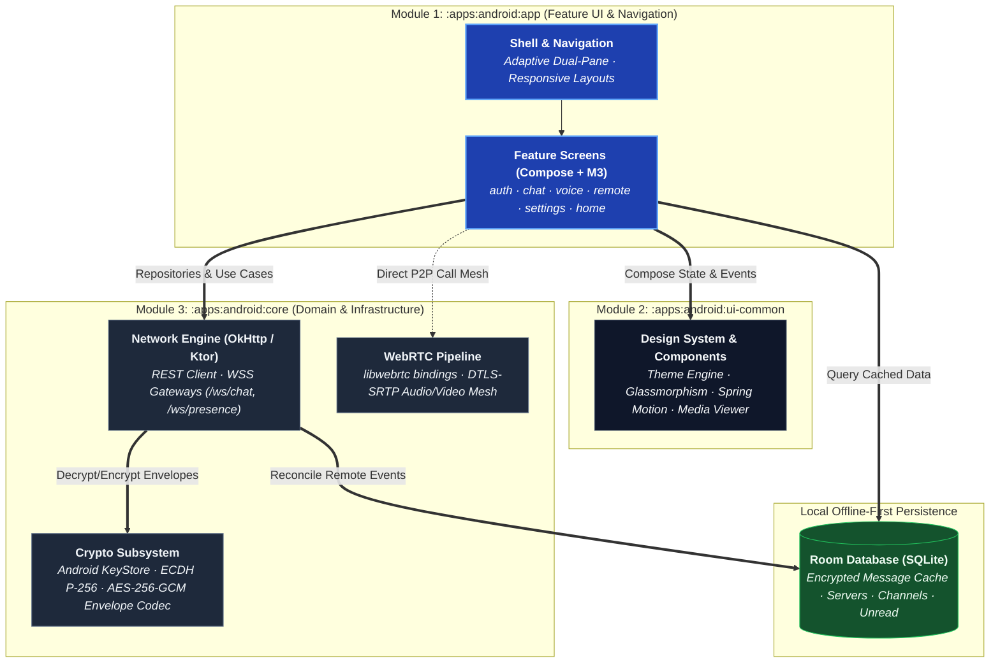

import useBaseUrl from '@docusaurus/useBaseUrl';

# Android Client

`apps/android` — native Kotlin + Jetpack Compose, three Gradle modules. It
talks to the same backend as the desktop and web clients: no Android-only
API exists on any service. Where the client needs a reference
implementation to match, that's `apps/desktop/src/...` and the shared
contract in `packages/shared-types`.

<p style={{textAlign: 'center'}}>
  
</p>

## Status

In progress, not yet shipping to real users the way desktop is. Register,
sign in, session restore, server switching, channels, messages, reactions
and voice have been run by hand on an emulator against a local backend, and
end-to-end encryption was cross-checked against the desktop client's own
crypto (same epoch, a re-key, still readable both directions). **Media —
calls, screen share and the remote-desktop viewer — has since been driven
two-device**, which is what a mesh needs to prove anything, along with push
notifications on a real phone, the local cache offline, and the APK
self-updater. Blocking, clearing your own history, password recovery and the
live username check landed since and compile and unit-test green, but have not
been on a device yet. So has the adaptive shell — two panes on tablets and
unfolded foldables — which has not been on one of those either. Full status, phase by phase:
[`development/ANDROID_TODO.md`](https://github.com/aiyu-ayaan/BetweenUs/blob/master/development/ANDROID_TODO.md).

## Modules



### `core`

```text
core/src/main/java/.../core/
  crypto/    ECDH device identity, channel-key wrap/unwrap, envelope codec
  data/       Repositories, DTOs matching packages/shared-types
  store/       Room database — servers, channels, DMs, messages, unread counts
```

The client opens on what it already knows: servers, channels, the DM list,
friends, unread counts and message history come off the local Room database
before anything is asked of the server — the same "show cache, then
reconcile" shape a modern chat client needs to feel instant on a cold start
over a slow connection.

### `app` — features

```text
feature/auth       feature/chat        feature/home        feature/members
feature/servers      feature/settings     feature/shell        feature/notifications
feature/remote          feature/update        feature/voice
```

- **`remote`** — a remote-desktop *viewer* only. The phone can watch and
  control an enrolled machine; it can't itself be enrolled as a target,
  since nothing on a phone can move a desktop's mouse. Same asymmetry as
  the web client (see [Architecture Overview](/architecture/overview)).
- **`settings`** — modular Settings Hub (`Route.Settings`) structured hierarchically into dedicated sub-setting pages:
  - **`AccountSecurityScreen`** (`Route.AccountSettings`) — Profile, display name, avatar customization, password management, and E2EE key/passphrase backup.
  - **`VoiceSettingsScreen`** (`Route.VoiceSettings`) — Audio routing, input device, HiFi microphone mode, noise/echo processing, and pre-gate sensitivity dBFS meter.
  - **`NotificationSettingsScreen`** (`Route.NotificationSettings`) — Push preferences and OS notification integration.
  - **`DeviceSettingsScreen`** (`Route.DeviceSettings`) — "This Device" diagnostics, local crash reports, call data history, and auto-updates.
  - **`PermissionsScreen`** (`Route.Permissions`) — Consolidated runtime permissions overview with live health meters and batch grant actions.
  - **`PermissionDetailScreen`** (`Route.PermissionDetail`) — Dedicated per-permission deep-dive pages (Notifications, Mic, Camera, Nearby Devices, Media) with hardware operations, rationales, and live toggles.
  - **`PrivacyScreen`** (`Route.Privacy`) — Blocked users directory and message history clearing.
  - **`ThemesScreen`** (`Route.Themes`) — 16 curated themes, Material You dynamic wallpaper theming, and accent customization.
- **`chat`** — the conversation. A direct message's header carries the other
  person's `Avatar`, not an anonymous outline in a cookie: the drawer row that
  opened the conversation is showing their photo, and a header drawing a glyph
  beside it read as a different person. Tapping any avatar that stands for a
  person opens their photo through `ProfileViewer` — see
  [Profile photos](/architecture/overview#profile-photos).
- **`home`** — the friends list, and **`AddFriendScreen`** (`Route.AddFriend`)
  beside it. Two searches, deliberately kept apart, matching the desktop's
  **Add friend** tab: the field on the friends list filters the people you
  already have, and the separate screen searches the directory and drops
  anyone already on the list from its results. Opening a direct message from
  either is the only way one gets created, on every client.
- **`members`** — who is in the server, and what a row offers. *Message* is
  allowed to be refused — a server puts people in the same room, it does not
  make them friends, so `POST /api/v1/dm` answers `FRIENDSHIP_NOT_FOUND` or
  `NOT_FRIENDS` and the screen says so rather than throwing out of a coroutine.
  Everything past *Message* and *More* lives in `MemberMenuSheet`, including
  the role editor: a row is a name first, and a name measured after four
  trailing buttons is an ellipsis.
- **`update`** — checks the app's own GitHub releases on launch (channel:
  alpha/beta/stable), downloads the APK built for the device's real ABI
  rather than the universal one, and hands it to Android's installer.
- **`voice`** — the same WebRTC mesh described in
  [Peer-to-Peer Media](/architecture/media), Android's own
  `RTCPeerConnection` bindings instead of the browser's.

## Which day a message was sent

A bubble carries a clock time and nothing else, so a conversation read a month
later says 09:14 without saying which morning. The list puts a day divider above
the first message of each day - **Today**, **Yesterday**, the weekday for the
week just gone, and the full date once a week has passed and a weekday would
name two different days. The days are the reader's local days, so a message sent
at 00:30 sits under today's divider even where the server called it yesterday.

Clock times follow the *device*, not the locale: Android has a **Use 24-hour
format** switch, and a chat showing `14:32` to somebody whose phone says
`2:32 PM` everywhere else is the one thing on screen out of step with it.
`clockTime` reads `DateFormat.is24HourFormat` and moves only the hour field of
the locale's own short-time pattern, so the separator and the order stay the
locale's. The desktop and web get the same answer from `Intl` for free.

"Today" is the *server's* today, not the phone's. `ServerClock` learns the
offset from the `Date` header every HTTP reply already carries, and a phone more
than five minutes out gets a banner saying so. It is a display rule, not a
security one: every expiry in the product is decided on the server, and a phone
clock cannot move any of them — see [Security](/security/overview#clocks).

Timezones need no handling beyond that, and that is deliberate: every timestamp
on the wire is UTC (`toISOString()` on the services' side, `createdAt` never
minted by a client), and every client reads it in the reader's own zone. A
message sent at 20:00 in Berlin reads 23:30 to somebody in Kolkata, under *that*
reader's day divider. Nothing is ever drawn in the sender's zone or in UTC.

The rule is `dayLabel`/`sameDay`/`clockTime`, written twice and tested on both
sides:
`Day.kt` here, `day.ts` on desktop and web, the same cases in each. The
"message info" sheet's read receipts use the same words and the same clock, so a
receipt never names the day differently from the conversation above it. A day
boundary also breaks the author grouping - two messages a minute apart either
side of midnight have a divider between them, and a run of bubbles reading
across it visibly is not one run. The desktop's message search labels its
results the same way rather than printing a bare date.

## One name, drawn once

Every list of people draws a display name over an `@handle`. An account that
never set a display name has the two be the same string, and the row then reads
"test" over "@test" — which looks like a rendering fault rather than a name.
`UserSummary.handle`, `ServerMember.handle` and `PublicUser.handle` answer null
when the second line would only repeat the first, so the rule lives in `core`
once instead of in each of the five screens that draw a person, and
`PersonLabelTest` holds it — case-insensitively, and for a blank display name.

## One shell, two shapes

The client used to draw a conversation with the channel list behind a
hamburger, on every device. That is right on a phone and wrong on everything
else — a tablet or an unfolded foldable has room for both, and hiding one
behind a button is throwing the screen away.

`shellFrame(width, hingeStart, hingeEnd)` in `:ui-common` decides:

| Window | Shape |
| --- | --- |
| `< 600.dp` | One pane. The channel list is a `ModalNavigationDrawer`. |
| `>= 600.dp` | Two panes. The list is permanent beside the conversation and the hamburger is **omitted**. |
| Vertical separating fold | The split lands on the fold and the seam is left empty. |
| Fold too near an edge | Ignored — a bounded proportional split (`280.dp`–`360.dp`) instead. |

It is a **pure function**, deliberately separated from the four lines of
`rememberShellFrame()` that read the window and the posture, because every
interesting case is a device nobody testing it will be holding: a foldable
half-opened, a hinge nearer one edge than the other, a folded foldable that is
a narrow phone with a seam behind the screen, a freeform window dragged narrower
while the app runs. Ten of them are asserted in `ShellFrameTest`.

Three details that are decisions rather than defaults:

- **The hamburger goes, rather than being drawn dead.** A button that opens a
  panel already open is a control that appears to do nothing, so the screens
  that draw one take a nullable callback.
- **A horizontal fold is not a hinge here.** Laptop posture does not divide the
  window left from right, so it never reaches the function.
- **Both layouts call the same two composables.** They are extracted rather
  than written once per branch — a second copy is a second place to add a
  callback to, and the one that gets forgotten is always the one on the device
  nobody is holding.

One dependency does it: `androidx.compose.material3.adaptive:adaptive`, whose
`currentWindowAdaptiveInfo()` answers both "how much room is there" and "is
there a hinge across it". `MainActivity` already declared
`screenSize|screenLayout|smallestScreenSize` in `configChanges`, so unfolding
resizes and recomposes instead of recreating the activity.

Not yet done: a third pane for the member list, which a 1280dp tablet has room
for and the desktop client already shows.

### `ui-common`

A dynamic Material 3 Expressive Compose design system shared across every feature module, plus `Adaptive.kt` — the window-size and folding-feature decision described above. Features:
- **Dynamic 16-Theme Palette Generation** (`BetweenUsColorPalette`, `LocalBetweenUsColors`, and `BetweenUsThemeTokens`).
- **Accent Customizer**: Dynamic override of active tokens across all Composable surfaces.
- **Spring Motion Scheme** (`BetweenUsMotion.spatial`, `BetweenUsMotion.effect`) driving predictive push/pop navigation transitions and animated category filtering.
- **Legacy Compatibility Layer**: Seamlessly binds `Ground`, `Surface*`, `Accent`, and `Slate*` call sites to dynamic active tokens.

## End-to-end encryption on Android

Same design as [E2EE](/security/e2ee): one ECDH P-256 device identity key
per installation, sealed refresh token via the Android Keystore, channel
keys wrapped per device. Nothing about the crypto is Android-specific
except where the private key is sealed.

## Sign-in from a phone

OAuth can't come back to a loopback port the way desktop's flow does — a
phone has no listener nothing else can steal. Instead the redirect targets
a private URL scheme (`betweenus://oauth`), bound to a PKCE-style challenge:
the client sends a SHA-256 of a random verifier when the flow starts and
must produce the verifier itself to redeem the one-time code, so an app
that merely intercepts the scheme (Android doesn't guarantee only one app
can register it) holds a code it can't spend. Detail:
[Auth & Permissions](/system-design/auth-and-permissions) and
[`development/SECURITY.md`](https://github.com/aiyu-ayaan/BetweenUs/blob/master/development/SECURITY.md).

## Blocking, clearing, and getting back in

The client speaks the same four account endpoints as desktop and web, and three
of them needed something here that the browser did not.

**A block is announced as an ordinary removal** — the far side is never told
which of the two it was. But the phone builds its conversation rail from a list
rather than deriving it from the friend list, so `friends.changed` reloads both.
Without that, the blocked conversation stayed in the rail and answered 404 when
tapped, which tells the far side exactly what the design was avoiding.
`Workspace` also removes the person from both lists at the moment of the call
rather than waiting for that announcement to come back round, because the screen
the button was pressed on has to be right immediately.

**`chats.cleared` reaches Room, not only memory.** The cache is what makes
opening the app not a spinner, and after a clear it holds envelopes the server
will no longer return — so `Conversation` drops the database, the decrypted
history and the paging cursors together, then re-opens whatever is on screen.
Clearing only the in-memory copy would have brought the whole thing back on the
next cold start.

**The username availability check is debounced *and* cancelled.** A plain
debounce still allows a slow answer about an earlier name to land after a faster
one about the name now in the field, reporting a free username as taken.

*Clear all my messages* sits behind a dialog rather than desktop's typed
confirmation — on a phone keyboard, a sentence somebody has to read is the
better speed bump. The forgot-password screen is the only client that states
what a reset costs before it happens: the identity backup is sealed with the old
password, so a phone signing in fresh afterwards reads what arrives from then
on, not what came before.

## Messages that stop existing

Three of the four mechanisms are the server's and the phone only reflects them;
the fourth is the phone's own and is the interesting one.

**Voice messages** replace the send button when nothing is typed, which is the
one moment that button has no job. `VoiceNote` records Opus in an Ogg container
from API 29 and AAC in an MP4 before that — both play on every client — into
the app's own cache directory, then hands the file to `Outbox` exactly as the
paperclip would. Everything downstream already existed. What the recorder owns
is the microphone: a five-minute ceiling enforced by `setMaxDuration` rather
than by a timer nobody is watching, a one-second floor so a tap meant as a hold
is not sent as room tone, and `release()` on every path out — including
`onDispose`, because leaving the conversation mid-recording is exactly how an
indicator gets left on.

**One-time media** is never drawn as a thumbnail; the whole block is one card
that has to be tapped. Tapping calls `POST /messages/:id/burn` **on the way
in**, not on the way out: a process can be killed, and a message that survives
being looked at is not a one-time message. The viewer is a `Dialog` whose
window carries `FLAG_SECURE` for exactly as long as it is open — the platform
then fails the screenshot gesture, records black, and keeps the window out of
the recents thumbnail. The decrypted bitmap is deliberately **not** put in
`MediaCache`: that cache is keyed on the storage key and would outlive the
message the feature exists to destroy.

That flag is real and the platform enforces it, which is more than a desktop
can offer. It still does not stop a second phone pointed at this one, so the
line under the picture says so. The promise the feature actually makes is that
the file stops existing everywhere once it has been seen.

**Disappearing windows** live under the conversation's three-dot menu, both of
them on one sheet: the server's, which deletes for everybody, and the account's
own, which filters. They are shown together because the question is "how long
do messages last here" and its two answers interact — split across two settings
screens, somebody could set an hour for themselves inside a server that keeps a
week and have no way to find out which was winning. The sheet states the
effective window underneath.

`Conversation.pruneExpired()` runs on a 30-second ticker while a chat is open.
It is not the mechanism — the server deletes the rows and says so. It exists
for the phone that was asleep when the window closed and would otherwise keep
drawing decrypted messages the server destroyed hours ago.

**And deleting a photo deletes the photo.** `MediaCache` holds plaintext — a
bitmap in memory, and for video a real decrypted file in the cache directory —
keyed on the storage key, so nothing about a deletion reached it. `Conversation`
now reads the manifest off the copy it still holds *before* replacing it (a
tombstone has an empty body and names nothing) and calls `MediaCache.forget`,
which drops the bitmaps and deletes the video file. The wire between the two
lives in `BetweenUsApp`, because the cache is in the app module and the store is
in core.

## Input sensitivity, and the hook that makes it possible

Noise suppression cleans up a signal; it does not decide that nobody is
talking, so a suppressed fan is a quieter fan, still in the call. What makes a
call silent between sentences is a **gate**: below a threshold the microphone
is closed. It is the single control that most changes what other people hear,
and it was the last of the desktop's audio controls the phone did not have.

It was written down as blocked by the platform for a long time, and the
reasoning was right about the two hooks anybody finds first:

| Hook | What it gives you | Why it cannot gate |
| --- | --- | --- |
| `setSamplesReadyCallback` | A **copy** of the buffer, after it has gone to the encoder | Too late to change what was sent. Fine for a meter. |
| `setMicrophoneMute` | Zeroes the buffer before the encoder | It zeroes it before that copy is taken too — so a gate driven from the meter reads its own silence the moment it closes and **can never reopen**. It latches shut. |

That latch is the trap, and it is why "a level meter driving a mute toggle"
was the honest description of what those two could build together.

`setAudioBufferCallback` is the third hook and it is the real one: it is handed
the **live capture buffer, in place, before it reaches the encoder**. So the
gate on Android is a gate in the same sense the desktop's AudioWorklet is one.
It measures the signal as it arrived, then attenuates the samples that are
about to be sent — and measuring first is exactly what keeps it able to open
again.

The constants are the desktop's, so a threshold set on a laptop means the same
thing on a phone: a 300 ms hold (speech is mostly gaps at this timescale —
every stop consonant is one), 6 dB of hysteresis (a voice sitting exactly on
the threshold would otherwise flutter the gate), a 5 ms attack (slower eats the
consonant that tells "bat" from "cat") and a 150 ms release (faster is an
audible click, because a waveform cut mid-cycle is a step edge). The ramp is
applied per sample; a buffer-wide gain step is a 10 ms staircase and a
staircase in the amplitude envelope is audible as zipper noise.

The settings screen draws the **pre-gate** level beside the slider. That is the
only way round it can be: a meter of the gated signal would sit at silence
exactly when somebody is trying to find the threshold that stops it doing that.
The meter only moves during a call — Android does not reliably allow a second
capture of one microphone, so the row says so rather than showing a bar that is
dead for a reason nobody can see.

## Push notifications

Firebase Cloud Messaging, data-only payloads — the server can't read a
message body to put words in a push, so the notification is written on the
device after it wakes. See
[notification-service](/services/notification-service) and
[Notifications Architecture](/architecture/notifications).
A direct call rings even with the app fully killed, via a `CallStyle`
notification with a full-screen intent.

## Building it

From the repo root, so the Android client is reachable by the same `pnpm`
vocabulary as everything else in the workspace:

```bash
pnpm android:build               # debug APK
pnpm android:test                # unit tests
pnpm android:run                 # install on a connected device and start it
pnpm android <task...>           # any other Gradle task, straight through
```

`apps/android` has no `package.json` and so is not a pnpm workspace package;
`scripts/android.mjs` bridges the gap by running the module's own
`apps/android/gradlew`. `cd apps/android && ./gradlew assembleDebug` is
exactly equivalent, and is what CI runs.

No particular JDK version to chase — any recent one on `PATH` launches the
wrapper, which provisions the daemon JVM itself, pinned to 17 by
`gradle/gradle-daemon-jvm.properties`. That is why CI's Java 21 and a newer
local one build identically. `android:run` additionally needs an Android SDK
and `adb` on `PATH`. `local.properties` (git-ignored) sets
`betweenus.serverUrl`, a default only — the login screen's server picker can
point the app anywhere at runtime. See [Running Locally](/running-locally#android) and
[CI](/deployment/ci#android) for what runs on every pull request.
