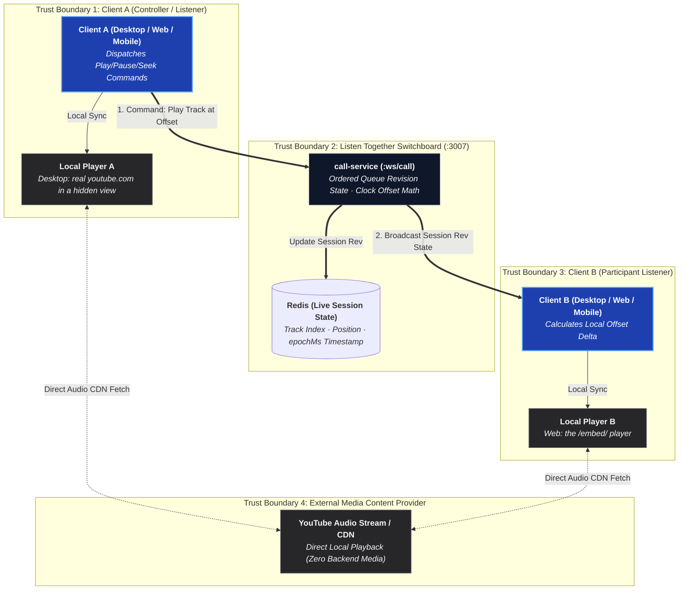

# Listen Together

Two people in a voice channel, working, with the same music playing in both
sets of headphones — in step, at full quality, and either of them able to
change what it is.

It is the one thing in BetweenUs that looks like media and deliberately is not.

**It is audio.** There is no shared picture and no rectangle for one. A picture
would be a second screen share nobody asked for, costing every participant the
upload this feature exists to avoid — and the thing being shared is a song.

## The idea, in one paragraph

**No audio crosses the wire.** Each client plays the track itself, from
YouTube, over its own connection. What `call-service` relays is a queue and a
position — a few hundred bytes when somebody presses a button, and nothing at
all in between. The result is signalling, so it goes down `/ws/call` beside the
SDP and through a Cloudflare Tunnel like everything else.



## Why not just share a tab with the sound on

That was the obvious answer and it is worse in five separate ways:

| Sharing a tab | Listen Together |
| --- | --- |
| One video **upload per listener** from the sharer's machine | Zero uplink |
| Music re-encoded through a codec tuned for **speech** | Full quality, from the source |
| Everyone hears whatever survived the trip | Everyone hears the original |
| The sharer cannot alt-tab away from the tab | Nobody has to keep a window open |
| Only the sharer can change the track | Anybody in the call can |

The mesh already costs each participant one upload per other participant for
voice and video (see [Peer-to-Peer Media](/architecture/media)). Adding a music
stream to that is the most expensive possible way to solve a problem that a
timestamp solves for free.

## The state, and why it is shaped that way

A session never stores "the position". It stores a position **and the instant
it was true**:

```ts
interface ListenSession {
  rev: number;            // bumped by the gateway on every change
  queue: ListenTrack[];
  index: number;
  paused: boolean;
  positionMs: number;     // where the track was...
  atServerMs: number;     // ...at this moment on the gateway's clock
  byUserId: string | null;
}
```

A client reads the current position as `positionMs + (serverNow - atServerMs)`
while playing, and as `positionMs` while paused. So **one message stays correct
until somebody presses something** — there is no stream of position updates,
and a client that has been quiet for ten minutes is still in step.

The arithmetic lives in `@betweenus/shared-types` (`listenPositionAt`) rather
than in either the service or the client, because it *is* the meaning of those
two fields. A gateway that advanced the position differently from the clients
reading it would be a session where nobody is wrong and nobody agrees.

## The clock

Two machines disagree about what time it is by whatever their NTP daemons last
settled on — usually milliseconds, occasionally seconds, and on a laptop that
woke from sleep, whatever it feels like until the next sync. A session that
trusted `Date.now()` on both ends would be exactly as far out of step as the
clocks are, and neither person could tell why.

So `call-service` stamps its own clock onto every `pong`, and each client
measures its offset the way NTP does:

```text
offset = serverMs + roundTrip / 2 - receivedAt
```

Eight samples are kept and **the least-delayed one wins** — not the average. A
slow round trip is slow because something queued, and a queue is almost never
symmetric, so a delayed sample is *biased* rather than merely noisy; averaging
spreads that bias across the answer instead of discarding it.

## Drift, and why it is left alone

A player is not an oscillator. It buffers, it rebuffers, it decodes at whatever
rate the machine manages, and it drifts. Each client checks itself against the
shared position every five seconds and does nothing until the gap passes
**1.5 seconds**, then closes it in one seek.

Tightening that does not make the feature better — it makes it seek every few
minutes, and a seek is a hole in the music where being a second out is only
being a second out.

The textbook alternative, nudging `playbackRate` by a few percent to close small
gaps smoothly, was ruled out against the embed, which quantises playback rate to
the values in its own menu — a request for 1.04 is refused or rounded to 1.25, a
chipmunk rather than a correction. The desktop player drives a real `<video>`
element, which would take 1.04 happily, so this is now a *choice* rather than a
constraint: one seek every few minutes is a hole in the music, and a permanent
1.04 is a song playing at the wrong pitch for everyone who notices. It stays a
seek, and the web client could not do it either way.

## Ducking

While anybody in the call is speaking, the music drops smoothly by approximately
ten decibels (`DUCK = 0.55` on the slider, translating via quadratic scaling to
~30% acoustic power) and fades back nine hundred milliseconds after the last word.
This keeps the groove and melody clearly audible in the background without fighting
or overpowering the speaker. Mid-fade transitions reverse seamlessly if speech starts
or stops abruptly.

## There is no host

Anybody in the call may add, remove, skip, seek, pause or stop. A host is a
person who eventually leaves and takes the music with them; the queue is a thing
the room built and it belongs to the room.

What that needs is an ordering, and a mesh has none — the same problem the
screen share has, with the same answer. `call-service` holds the sockets, so it
is the only thing that can say which of two simultaneous presses happened
second. Every change bumps `rev`, and a client drops any state numbered at or
below one it has already applied, so its own echo cannot undo somebody else's
later change.

## The protocol

Client → server, on `/ws/call`:

| Event | Meaning |
| --- | --- |
| `listen.add` | `{provider, ref, playNow?}` — a YouTube id. Gateway mints the entry id; `playNow: true` queues and jumps in a single atomic revision |
| `listen.remove` | `{trackId}`. Emptying the queue ends the session |
| `listen.play` | Resume, or `{index}` to jump |
| `listen.pause` | `{positionMs}` — where this window's player actually stopped |
| `listen.seek` | `{positionMs}` |
| `listen.skip` | `{delta}`. Back within 3s means "previous"; later means "restart this" |
| `listen.stop` | Closes it for everybody |
| `listen.ended` | `{trackId}` — "my player finished this" |
| `listen.meta` | `{trackId, title?, durationMs?}` — "my player learned what this is" |

Server → client: `listen.state` with the whole session (or `null`), and `pong`
carrying `serverMs`.

Two of those deserve a note.

**`listen.ended` is sent by every client, and the gateway advances once.** The
track id is checked against the one playing, so the second and third arrivals
are about a track that is no longer current and do nothing — idempotent by
construction rather than by electing a reporter, because electing one means the
queue stops when that person's window closes.

**`listen.meta` exists because a pasted link has no title.** Only a player that
has loaded the video knows it, and nothing on the server may go and ask: an
outbound call from a backend service to fetch a title is a service that needs an
API key, an egress rule and an opinion about who is listening to what. The
clients have the player open anyway. First one to know fills it in; a later
client reporting a *different* title is ignored, since that is either a regional
cut or somebody relabelling a track in everybody else's queue after the fact.

## The panel

Listen Together takes the voice stage, the way a shared screen does, with two
tabs and a transport bar under them. It was a popover on the call controls, and
that was wrong twice.

**It drew itself twice.** `VoiceControls` is rendered in two places — the
sidebar and the channel view — and it drew the panel from a flag in the store.
One flag, two render sites, two live panels side by side, each with its own seek
bar. The rule the fix encodes: *shared state may only be drawn once.* The button
sets the flag and nothing else; `VoiceChannelView` is the single render site,
and pressing the button from the sidebar navigates there first.

**The video filled the screen.** It was `aspect-video w-full`, which on a 1750px
stage is a 984px-tall box, and nothing above it was `min-h-0` — so flexbox let
it push past the bottom of the window. That box is gone entirely now, along with
the bug: the feature is audio, and the Playing tab shows what is on rather than
a picture of it.

```text
┌─ Listen together ──── [Browse] [Playing] ───────────────────── ✕ ┐
│                                              │  Queue            │
│   youtube.com (desktop), or what is on       │  ▸ track one      │
│                                              │    track two      │
│                                              │  [paste a link] + │
├──────────────────────────────────────────────┴───────────────────┤
│ ⏮ ⏸ ⏭   Title · added by   3:07 ──●────── 6:12   🔊──   Stop     │
└──────────────────────────────────────────────────────────────────┘
```

Closing it leaves a one-line bar above the tiles with the same transport on it.
The music carries on, which is what closing a panel should cost.

Browse and Playing are still tabs rather than two panes, but the reason has
narrowed to space. It used to be a hard constraint — a `WebContentsView` paints
above every pixel of the renderer's DOM, so an embedded player shown beside the
site would have been invisible with nothing to explain it. There is no embedded
player in the desktop window any more, so only the browse view is a native
surface, and only it needs the rectangle to itself.

## Getting a track in: browse, don't paste

Pasting links was the first version and it was the wrong shape. Nobody keeps a
list of video ids. People search for a half-remembered chorus, open a playlist
they made, or look at what their subscriptions posted this morning — and two of
those need a signed-in account.

So on **desktop**, the panel opens youtube.com itself inside the call:

- **Clicking a thumbnail is the control:** Pressing any video on YouTube directly plays it for the entire call (`listen.add` with `playNow: true`) and flips the view to the Playing tab. No extra copy/paste or button clicking is needed.
- **Add to queue stays on Browse:** An "Add to queue" button remains available on the browser bar so listeners can line up subsequent tracks while continuing to search.
- **Atomic jump (`playNow`):** Queuing and playing happen in one server revision. Sending `listen.add` followed by `listen.play` would be two revisions, where a concurrent queue modification could shift track indices and cause the wrong song to play.

### Two views, and why there must be two

The desktop app holds **two** `WebContentsView`s on youtube.com, sharing the
`persist:youtube` session so both are the same signed-in account:

| | Browser (`youtube-view.ts`) | Player (`youtube-player.ts`) |
| --- | --- | --- |
| Visible | yes, over the Browse rectangle | never — parked off the window |
| Sound | muted, always | this is the only thing making sound |
| What it is for | choosing a track | playing the one the call chose |
| Anything that starts playing in it | is paused, and offered to the call | is the point |

One view cannot be both, and the reason is the ordinary case rather than an edge
one: browsing navigates away from the watch page. A single view would stop the
music every time somebody went looking for the next song — which is exactly what
people do while a song is playing.

The browser half is still permanently muted and still pauses whatever starts in
it, through `media-started-playing`. That event is the one place all four ways
of starting a video arrive — a thumbnail clicked, the page's own play button, an
SPA navigation, YouTube running the next video — so pausing from it needs no
timing guess. What changed is what happens next: the video id goes to the call,
and the *player* view loads it.

### The site does not get a vote on what plays next

YouTube plays a related video when one ends. On a page nobody is looking at,
that is a second song starting in one person's headphones while everybody else
is still on the first.

So the player view watches its own navigations: any move to a video the call did
not ask for is undone. And when a track genuinely ends, the page goes to
`about:blank` — the renderer already has that answer and is telling the gateway,
and a blank page cannot fill the gap while the answer comes back.

### Adverts

A signed-out account gets adverts, and while one is showing, every number on the
video element belongs to the advert. Reporting its position would seek everybody
else into the middle of a song; reporting its `ended` would skip a track nobody
had heard.

So an advert is detected (`#movie_player.ad-showing`) and two things happen.

**It is run out.** The same injected read that corrects the volume presses the
skip button when there is one, and seeks the advert to its own end when there is
not. Measured against a real pre-roll: **1.8 seconds**, where an unskipped one
is fifteen to thirty.

**And it is still sat out** for however long it lasts: no position, no duration,
no `ended`, no drift correction. The window rejoins by itself on the first tick
afterwards, because by then the numbers mean the track again.

### Nothing is blocked, and that is the design

The obvious approach is the one a blocking browser takes — refuse the requests.
It does not work here, and it would cost the feature rather than the advert:

- **A pre-roll is not a request to an advertising host.** It arrives inside the
  `youtubei/v1/player` response as `adPlacements`, and the media streams from the
  same `googlevideo.com` host the track does. Blocking that host blocks the
  music.
- **Removing it means rewriting a response body** — what the `json-prune`
  scriptlets in the filter-list world do. Electron's `webRequest` cannot modify
  response bodies at all; it would take a proxy in front of the session.
- **A detected block is answered with an interstitial that stops playback.** A
  player that will not play is strictly worse than an advert lasting half a
  second.

Seeking asks for nothing and refuses nothing, so there is no block to detect. If
YouTube ever closes it the failure is graceful: the advert plays as it used to,
the window sits it out as it already does, and nothing breaks.

None of this reaches the **web client**, whose player is a cross-origin iframe
this application cannot read into — ad blocking there is between YouTube and
whatever the person runs in their own browser. Nor the **browse view**, which is
muted and paused and whose adverts nobody hears.

Two bugs worth recording, both silent and both expensive.

**Pausing during an advert** used to send `positionMs: 0`, since that is what
this window's player was honestly reporting — and the whole call jumped back to
the start of the song because one person was being shown a car advertisement.
Pausing now falls back to the shared clock whenever the local player is
mid-advert.

**The handover at the end of one.** The advert and the track are the same
`<video>` element, and `ad-showing` is removed a moment *before* the track's
media is in place. A read landing in that gap sees no advert and an `ended` that
belongs to one — and reports that the song finished, skipping a song nobody has
heard. The gap was always there; running adverts out deliberately means arriving
at it deliberately, every time, which is what turned it from something never
seen into something worth closing. An `ended` within two seconds of an advert is
no longer believed.

**An account with YouTube Premium sees none of this.** It is the recommended way
to use the feature, and the only way that is exactly in step.

### Seek scrubbing without snapback

Dragging and releasing the seek slider commits the new timestamp to the server. To avoid an ugly "snapback" where the UI slider jumps back to the old timestamp while waiting for the network round-trip, the client optimistically holds the scrubbed position until a newer gateway revision arrives (with a 2-second timeout fallback).

### Autoplay-blocked window UX

If an operating system or browser policy refuses background autoplay for a particular client window, the transport marks the local state as blocked with an amber prompt ("press play here"). Clicking it starts audio playback locally with a user gesture, without sending an erroneous global pause command to everyone else in the call.

### Hover-aware Theatre mode controls

In fullscreen immersive Theatre mode, the floating bottom transport controls auto-hide after 3 seconds of inactivity. Whenever the cursor enters the controls bar or toggle button, auto-hide is suspended (`controlsHovered: true`), preventing controls and the volume slider from vanishing while the user is actively adjusting them.

### Why the site itself is desktop-only, and why that cannot be fixed

youtube.com sends `X-Frame-Options` and a `frame-ancestors` policy. It refuses
to be framed, full stop — only `/embed/<id>` is frameable, and that is the
player and nothing else. No browser tab can show the site inside another page,
however it is asked, so the web client is never shown a frame that will never
load.

### What the web client gets instead: search

The gesture is the same on both clients — look for something, press it, the
whole call watches it — so both live on the same **Browse** tab. What differs is
what Browse *is*:

| | Desktop | Web |
| --- | --- | --- |
| Browse tab shows | youtube.com itself, signed in as you | search results in a grid |
| Search, playlists, subscriptions | the user's own YouTube session | search only |
| Pressing a result | plays it for the call | plays it for the call |
| Needs a credential | no | `VITE_YOUTUBE_API_KEY` |

The search is a `fetch` to the YouTube Data API **from the person's own
browser** (`apps/desktop/src/services/youtube-search.ts`). Nothing about it
touches a BetweenUs service, which is the same rule `listen.meta` follows: no
backend of ours ever talks to YouTube, because a backend that did would need an
API key, an egress rule and an opinion about who is looking for what.

That makes the key a **browser** key, visible to anybody using the site. That is
what Google's HTTP-referrer restriction on a key is for: enable YouTube Data API
v3, restrict the key to the deployment's own hostname. Leave
`VITE_YOUTUBE_API_KEY` unset and the tab says which setting turns it on — the
paste box beside it needs no key and keeps working. The desktop app never reads
it.

Two details that are not decoration:

- **Results are filtered to `videoEmbeddable=true`.** The web client plays
  through the embed, so a video that refuses to be embedded is a black frame for
  everybody in the call, not just for whoever picked it.
- **A pasted link in the search box is recognised, not searched for.** Somebody
  holding the URL already knows which video they mean, and a search costs 100
  units of a 10,000-unit daily quota. Results are also cached per query for the
  life of the tab, so retyping a word is not a second search.

### Why it is not `webviewTag`

Turning on `webviewTag` would let the renderer mount arbitrary web content
anywhere, which is precisely the permission the hardening in `electron/main.ts`
exists to withhold. Instead the **main process** owns a `WebContentsView`
(`electron/youtube-view.ts`), and the renderer may only ask for it to be put
over a rectangle and told which way to go. It never gets a handle on the view.

Three things fence it in:

| | |
| --- | --- |
| **Its own session** | `persist:youtube`. A signed-in Google account survives a restart and is entirely apart from the app's own cookies — nothing here can read a BetweenUs session, and nothing in the app is reachable from a page loaded here |
| **No preload, no Node** | An ordinary browser context with no bridge into this application |
| **It cannot wander** | Navigation is confined to Google's own hosts, which is what a sign-in flow needs and a great deal less than "the internet". Anything else opens in the user's real browser. New windows are refused |

### One native-surface consequence

A `WebContentsView` paints above every pixel of the renderer's DOM, whatever any
`z-index` says. Nothing in the renderer can be drawn on top of it, so anything
that has to be visible at the same time must instead make it **go away**.

That is why Browse and Playing are tabs. Showing the site and the embedded
player side by side would mean the player is underneath a native surface and
invisible, with nothing to explain it. Leaving the browse tab hides the view and
the player claims its rectangle; entering it releases the player, which parks
and keeps playing.

Hiding costs nothing — the sign-in, the scroll position and the search all
survive it. Only ending the call destroys the view.

## The two players, and why the desktop one is not an embed

This is the part that was rebuilt, and the reason is the only one that ever
mattered: **the embed will not play music.**

`/embed/<id>` is the only frameable YouTube surface, and a record label's video
— which is most of what anybody queues — answers it with error 101 or 150, *the
owner does not allow embedding*, and a black frame. Eleven fix commits went at
the symptoms of that one at a time: a `sandbox` attribute that made it silent, a
`file://` origin it refused, a loopback relay server to give it a real origin, a
`strict-origin-when-cross-origin` referrer for Content ID, error 153 becoming
152 becoming 150. Every one was a negotiation with a surface that was entitled
to say no.

The desktop app stopped negotiating. It plays **youtube.com**, in a hidden view,
signed in as whoever signed in on the Browse tab. The site does not refuse the
site.

| | Desktop | Web |
| --- | --- | --- |
| Plays | real `youtube.com/watch` in a `WebContentsView` | `/embed/<id>` in an iframe |
| Driven by | the page's own `<video>` element | a `postMessage` protocol |
| A label's music video | plays | often refuses — 101/150 |
| Age-restricted, Premium, no adverts | yes, it is your session | no |
| Needs a real http origin | no | yes |

Both satisfy one interface — `play`, `pause`, `seek`, `setVolume`, `current`,
`close` — and everything above it, the queue and the clock and the drift
arithmetic and the ducking, is written once and does not know which it has.

### What it took to drive a page nobody wrote for us

Three things were measured before any of this was written, because each one
fails in the most expensive possible way — no error, no console message, a
player that is present, correct, in step and silent:

- **`loadURL` rejects on a watch page.** youtube.com redirects to
  `?themeRefresh=1`, which aborts the original navigation, and Electron surfaces
  that abort as `ERR_ABORTED` on the promise. The page loads and plays perfectly.
  The rejection is noise.
- **The site restores its own remembered volume and its own remembered mute.**
  Either is a silent player. Both are therefore *asserted on every read* — twice
  a second — rather than set once on load, because the moment the page reloads
  underneath is a moment nothing here can name.
- **A hidden view goes on playing**, parked off the window at real video
  dimensions with `backgroundThrottling` off. Not `setVisible(false)` and not one
  pixel: Chromium is entitled to throttle what it believes nobody can see, and a
  throttled player is a stalled one. It is the same lesson the iframe host
  learned, and it is why the web client's frame parks at 320×180 off-screen
  rather than at 1×1.
- **Autoplay policy in production builds.** Chromium's autoplay policy defaults
  to requiring user gesture interaction on a page before audio plays. In packaged
  Electron builds, setting `autoplayPolicy` on `WebContentsView`'s web preferences
  is not recognized by Electron's schema; it must be passed globally via
  `app.commandLine.appendSwitch('autoplay-policy', 'no-user-gesture-required')`
  prior to `app.whenReady()`. Without this, background WebContentsViews remain silent.
- **Perceptual loudness scaling.** Human hearing perceives loudness logarithmically.
  A linear 0–100 slider translates 10% to 0.1 amplitude, which sounds ~32% as loud
  and drowns out speaking voices during calls. Both `NativeListenPlayer` and
  `YouTubePlayer` apply a quadratic curve (`(volume / 100) ^ 2`), mapping 10% to
  0.01 power for whisper-quiet background ambience that keeps voices intelligible.
  Volume IPC changes and mute toggles are dispatched immediately to `#movie_player`
  and `<video>`, rather than deferred to polling ticks.

### Polled, not pushed

The renderer asks the main process what the player is doing about twice a
second. It is not told, because being told would need a preload in a view that
loads pages from the open web — a bridge into this application, opened to save a
round trip. Half a second is comfortably inside the 1.5 seconds the drift
correction waits for before it acts on anything.

### The web client's embed, and the CSP

The web client cannot do any of the above. youtube.com sends `X-Frame-Options`
and a `frame-ancestors` policy and refuses to be framed, full stop; only
`/embed/<id>` is frameable. So the web client keeps the embed, a restricted
track still fails there, and the panel says so and offers the link rather than
showing a black box.

The embed is driven without loading `iframe_api.js`, which would be **remote
code running in the renderer** — the client's whole CSP argument is one line:
`script-src` stays `'self'`. That script is a wrapper around a `postMessage`
protocol the embed speaks anyway, and that protocol is about a hundred lines
(`apps/desktop/src/services/youtube.ts`).

So the only directive this feature ever needed is `frame-src`, naming YouTube
and nothing else. It used to also carry `http://127.0.0.1:*`, for the loopback
page a `file://` document had to frame the embed from. That page is gone with
the embed it served, and so is the permission — which had been a standing
allowance for *any* page on the machine to be framed by this window.

#### The `sandbox` attribute that made it silent

Worth keeping, because it is the purest example of the failure mode this whole
rewrite is about. The frame carried `sandbox="allow-scripts allow-presentation"`
and **nothing ever played** — no error, no console message, a player visibly
present and simply mute.

A `sandbox` without `allow-same-origin` gives the frame an **opaque** origin, so
every message it posts arrives with `event.origin === "null"`. The origin check
then refuses all of it, correctly and permanently: the handshake never
completes, the queued `playVideo` is never flushed, and the player sits there.

It also bought nothing. A cross-origin frame is already isolated from the
embedding document by the same-origin policy, exactly as hard as the sandbox was
pretending to be. There is no `sandbox` attribute now, and that is deliberate
rather than an omission.

### The trust boundary

Anything a client pastes is parsed to a bare eleven-character video id before it
is sent, and checked again at the gateway against the provider's own alphabet.
Whatever comes out of that ends up in a URL **this process navigates to** and in
an iframe `src` in everybody else's window, so it is a trust boundary and it is
tested as one (`electron/youtube-page.check.ts`).

Both views are fenced the same way, off one host list: navigation is confined to
Google's own hosts — what a sign-in flow needs, and a great deal less than "the
internet" — new windows are refused, and neither view has a preload or Node.
Neither can read a BetweenUs session, and nothing in the app is reachable from a
page loaded in either.

## What it deliberately does not do

- **No youtube.com in the web client** — not for browsing and not for playing.
  The site refuses to be framed, so the web client searches instead of browsing
  and keeps the `/embed/` player. Playlists, subscriptions, age-restricted
  tracks and anything a label has locked down stay desktop-only, because all of
  them need the user's own session and the only place that session can be shown
  is the real site.
- **No picture.** The shared thing is a song. A video would be a screen share in
  everything but name, and the first line of this document is why that is the
  most expensive possible way to solve this.
- **No YouTube Data API on any server.** The optional search key is read by the
  browser and used by the browser. No service of ours holds it, sends it or
  learns what anybody searched for.
- **No Spotify, yet.** It is a second `ListenProvider` and a second class with
  the same four methods, but it needs an OAuth flow, a Premium account per
  listener, and the Web Playback SDK — which *is* remote code, and so needs the
  CSP conversation this design avoided. The seam is the discriminant on
  `ListenTrack`; nothing is modelled ahead of it.
- **No persistence.** The session lives in memory beside the roster and dies
  with the call. The queue three people built while they worked has no meaning
  tomorrow.
- **Android listens but does not drive** — and today does neither. See
  [Android client](/architecture/android-client).

## Where it is, in the client

Behind the **Apps** button in the call controls, next to
[Play Together](/architecture/play-together) — one screen in, rather than its
own icon in a row that otherwise belongs to the call. Apps is a screen on the
voice stage rather than a popover, so the chooser, the queue and the player are
all drawn in the same rectangle, and the back arrow on this panel returns to
the chooser rather than to the call.

## Where the code is

| Piece | File |
| --- | --- |
| Protocol and the position arithmetic | `packages/shared-types/src/index.ts` |
| The transport state machine (pure) | `apps/services/call-service/src/listen-session.ts` |
| Its self-check | `apps/services/call-service/src/listen-session.check.ts` |
| Gateway wiring | `apps/services/call-service/src/call.gateway.ts` |
| Clock and drift | `apps/desktop/src/services/listen-sync.ts` |
| The web client's YouTube embed | `apps/desktop/src/services/youtube.ts` |
| Reconciler and ducking | `apps/desktop/src/stores/listen.ts` |
| The panel, the queue and the transport | `apps/desktop/src/features/voice/ListenPanel.tsx` |
| The desktop player (renderer handle) | `apps/desktop/src/services/native-player.ts` |
| The desktop player (main process) | `apps/desktop/electron/youtube-player.ts` |
| What both views know about YouTube pages | `apps/desktop/electron/youtube-page.ts` |
| Its self-check | `apps/desktop/electron/youtube-page.check.ts` |
| The in-app YouTube browser (UI) | `apps/desktop/src/features/voice/ListenBrowser.tsx` |
| The in-app YouTube browser (main) | `apps/desktop/electron/youtube-view.ts` |
| The web client's search (UI) | `apps/desktop/src/features/voice/ListenSearch.tsx` |
| The web client's search (API call) | `apps/desktop/src/services/youtube-search.ts` |

## The rule both surfaces follow

**The thing that plays must outlive the component that shows it.**

An iframe removed from the document stops playing and loses its place. A
`WebContentsView` that is destroyed loses the sign-in, the scroll position and
the search. And a rebuilt one is not a recovery — it is a fresh player, back at
zero, refused autoplay, and out of step with everybody else in the call.

Audio-only made most of this easy. Nothing has to be shown, so nothing has to be
moved: the desktop player is parked off the window for its whole life and the
web client's frame is parked off-screen for its whole life. Neither is ever
positioned over anything, which is why the slot machinery and the frame loop
that tracked it are gone.

The browse view still follows a rectangle, because it genuinely has to be seen.
It is tracked on a frame loop rather than a `ResizeObserver` for the same old
reason: the box moves for reasons no observer reports — a sidebar opening, a
banner appearing above it, the window crossing to another monitor.

Parked is 320×180 off-screen rather than one pixel or `display: none`, on both
surfaces. A frame or a view Chromium believes nobody can see is one it is
entitled to throttle, and throttling it is the difference between music that
survives switching to a text channel and music that does not.

The rule has one more consequence now there are two views: a track change is a
**navigation**, not a new player. Rebuilding a browser on every skip would cost
a cold start in the gap between two songs. The views are built when the first
track plays and destroyed when the call ends, and nothing in between touches
them.

## A single replica, for now

The session is held in process, exactly like the call roster. Two
`call-service` replicas would each hold half a session and never introduce the
two halves. The upgrade path is the one `presence-service` already uses — the
roster in Redis, this state beside it — and it is the same change, made once,
for both.
