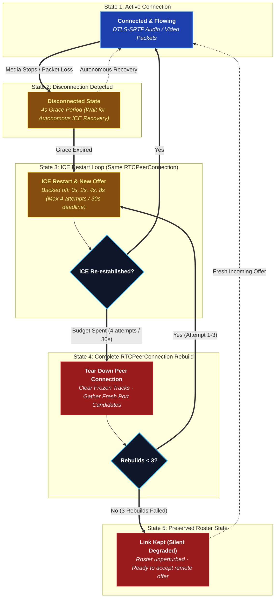

# Peer-to-Peer Media

There is no media server. Every participant in a call holds one
`RTCPeerConnection` per other participant — a full mesh — and voice, video
and screen share travel directly between machines over DTLS-SRTP.

## High-Level WebRTC Runtime Topology


---

### Archify WebRTC Component Cards

#### 1. Peer Endpoints (`apps/desktop`, `apps/android`, `apps/web`)
- **Role**: Capture, encode (Opus for audio, VP8/H.264 for video), and encrypt raw media using DTLS-SRTP.
- **Trust Boundary**: `TB-1 / TB-4 (Client Origin)`.
- **Security Invariant**: Each peer signs its DTLS fingerprint with the channel symmetric key. Unsigned or mismatched fingerprints are dropped immediately to prevent server MITM attacks.

#### 2. Call Signaling Switchboard (`apps/services/call-service`)
- **Role**: Pure signaling switchboard over WebSocket (`/ws/call`). Dispatches SDP offer/answers, exchanges ICE candidates, and maintains live voice channel participant rosters in Redis.
- **Trust Boundary**: `TB-2 (Internal Application Mesh)`.
- **Security Invariant**: **Zero Media Proxying**. Never inspects, processes, or proxies media RTP packets.

#### 3. NAT Traversal Infrastructure (STUN & TURN)
- **Role**: Discovers public-facing reflexive ICE candidates (STUN) and provides symmetric NAT fallback relays (TURN).
- **Trust Boundary**: `TB-3 (External Services)`.
- **Security Invariant**: Outbound-only connectivity. `call-service` issues short-lived HMAC-SHA256 authenticated credentials on demand.

Music is the exception that proves the rule: **Listen Together does not use any
of this.** Rather than streaming audio to everybody, the call agrees on a queue
and a timestamp and every client plays the track itself. See
[Listen Together](/architecture/listen-together).

## Why: the tunnel can't carry it

Cloudflare Tunnel carries HTTP and WebSocket. It does **not** carry UDP, and
WebRTC media is UDP. A media server behind the tunnel needs a second public
address, an open UDP port, or a forced relay — every one of those is a thing
that breaks in a way the operator can't reproduce locally. Peer-to-peer media
sidesteps the problem entirely: media never goes near the tunnel.

```text
Signalling:  Client → Cloudflare → Tunnel → Nginx → call-service   (WebSocket)
Media:       Client <===================================> Client  (WebRTC, direct)
```

## What a mesh costs

| Participants | Video | Voice only |
| --- | --- | --- |
| 2–5 | Comfortable | Comfortable |
| 6–8 | Degrades; expect to drop video | Comfortable |
| 9+ | Not supported | Marginal |

This is the accepted ceiling, not an oversight. A call that needs to be
bigger wants an SFU, and adding one is a deliberate future decision, not
something that comes back by drift. This design replaced an earlier LiveKit
SFU (phase 24 in `development/PLANNING.md`) after four commits of fighting
the tunnel to make an SFU's address reachable — removing the SFU turned out
to be the fix, not another workaround.

## NAT traversal

- **STUN is required.** A peer learns its own public address before it can
  offer one. It is not a relay — nothing but address discovery goes through
  it, and no port has to be opened for it.
- **TURN is optional and off by default.** Symmetric NAT and carrier-grade
  NAT pairs cannot form a direct path at all; TURN is the relay that fixes
  those, and configuring one is the operator's choice. The default is
  STUN-only, and `call-service` records that once per process — not as an
  error, but because the limit is invisible from everywhere else.
- **One way to configure the relay.** `TURN_URLS` + `TURN_USERNAME` +
  `TURN_CREDENTIAL` names any standard TURN server the operator runs — coturn,
  eturnal, another provider — with a long-term credential, because a self-run
  relay has no API to mint against. All three are read from the environment, so
  resolving them reaches nothing and cannot fail. A `turn:` URL is never handed
  out without both credentials: an `RTCPeerConnection` built from one *throws*,
  which would break every call in the deployment rather than only the ones
  needing a relay, so a half-configured relay is logged once and dropped.
- **Why one way and not two.** A hosted service used to be checked first, its
  short-lived credentials minted per call over HTTPS. The key was deleted at
  the provider; every mint answered `404`; and a failed mint resolved to "no
  relay" rather than to the coturn configured beside it, so every client got
  STUN-only while a working relay sat unused. Reading the relay out of local
  configuration removes the failure mode along with the feature.
- **No port forwarding, ever** — on the machine running BetweenUs. Both peers
  dial out, to each other and to the relay. The relay itself is the exception
  and it is somebody else's host: see below.

**A relay needs an address of its own, and the tunnel cannot give it one.**
This is the part that surprises people running behind a Cloudflare Tunnel with
nothing else exposed. A tunnel carries HTTP and WebSocket: its edge terminates
TLS on 443 and expects HTTP inside it, and TURN over TLS is its own binary
protocol, so a `turns:` URL aimed at the tunnel's hostname is refused before it
reaches anything. cloudflared's TCP ingress does not close the gap either — it
needs cloudflared or WARP running on the *client*, which a browser's WebRTC
stack has no way to do. A relay therefore lives on a host with a public address
of its own — a small VM is enough, since it forwards packets it has no key for
and does not decode them.

Setting one up, end to end: [TURN relay (coturn)](/deployment/turn-server).

**What STUN-only actually costs.** Two categories, and they are worth keeping
apart because only one of them is fixable from the client:

| | |
| --- | --- |
| Pairs with *no* path | Two symmetric NATs, two mobile carriers. Nothing the client does connects these. This is the accepted ceiling of a relay-less deployment. |
| Pairs that merely *missed* one | A candidate that lost a race, a NAT binding on a port the far end had given up on, an epoch that rotated mid-negotiation. These look identical from inside the call — and they are the ones a retry wins. |

The client cannot tell which it is facing, so it assumes the second and
retries properly before concluding the first. See below.

**What a link with no path must not be blamed on.** It carries nothing in
either direction, so a working microphone reads as silent on it. The "nobody
can hear you — your microphone is sending nothing" warning is therefore
measured only over connected links: a call where none are connected shows
"could not be reached" alone, rather than that plus an input-device dropdown
that cannot fix it. See `notBeingHeard` in `call-stats.ts` and `CallStats.kt`.

## Choosing a microphone

**A device id is named with `exact`, always.** The bare `deviceId: "abc"` form
is `ideal` — advisory. The browser scores every microphone by fitness distance
and is free to hand back a different one, and Chromium does: it opens whatever
the operating system calls the default. Nothing reports this, because a capture
that ignored an advisory constraint is not an error. Every pick therefore
reopened the same microphone, which is "changing the input device does not
change the input device".

`micCapture` and the settings level meter both build the constraint through
`deviceConstraint` in `voice-quality.ts`, so there is one answer to this rather
than one per capture site.

**What `exact` costs, and where it is paid.** A device unplugged since it was
chosen is now refused rather than silently substituted. The substitution is
still wanted, so it is made deliberately in `openAudioCapture`
(`audio-devices.ts`): on `OverconstrainedError` or `NotFoundError` the capture
is retried once with the device constraint dropped and every other constraint
intact. A denied permission is re-thrown untouched — retrying it would only be
denied again, while making the error say something it does not mean.

The person is still hearing a microphone they did not choose, so `DeviceSelect`
says so above the dropdown rather than leaving it to be discovered mid-call.

This is a browser-capture concern only. Android does not choose a microphone
through constraints: `CallAudio.kt` routes the whole call to one communication
device through `AudioManager`, which is why choosing a headset's microphone
there also puts the call in that headset.

## Cleaning up a microphone, and why echo is not part of it

Three separate mechanisms are easy to confuse, and only one of them removes
echo.

**Noise suppression** takes a single channel and removes what does not sound
like a voice. It has three levels, spelled the same on every client so that
"set it to High" means one thing in a support conversation:

| Level | Desktop / Web | Android |
| :--- | :--- | :--- |
| `off` | no constraint | `googNoiseSuppression` off |
| `standard` | `noiseSuppression` — the ordinary WebRTC suppressor, tuned for *stationary* noise: a fan, a hum, an air conditioner | the OEM hardware suppressor where the device has one |
| `high` | additionally `voiceIsolation` — Chromium's model-based suppressor, which removes a keyboard, a dog or a flatmate | forces WebRTC's own software suppressor, which is device-independent |

`high` costs measurably more CPU, which is why it is not the default. Where
`voiceIsolation` is unsupported the constraint is ignored and `high` degrades to
`standard`, so asking for it never fails a capture.

This was a boolean until it was three levels, and the boolean drove *both*
constraints — so every call anybody ever made ran the expensive suppressor.
`migrateVoiceSettings` in `voice-quality.ts` rewrites a stored `true` to
`standard`. That migration exists because the field's *type* changed, and a
default behind a field does not rescue a value of the wrong type: `true` is
neither `'off'` nor `'high'`, so it would have behaved as `standard` while the
settings screen showed nothing selected.

**Echo cancellation** is a different problem and a denoiser cannot do it. A
denoiser sees one channel; cancelling echo means subtracting the signal you are
*playing* from the signal you are capturing, so it needs the far-end reference.
To a denoiser, echo is speech — it is a human voice — so it is preserved
carefully.

**Why a call echoes even with echo cancellation on.** Chromium builds its echo
reference from the **default render device**. `AudioSink` in `MediaSink.tsx`
calls `setSinkId` so a call can be played to a chosen output, and whenever that
is not the default the canceller is subtracting audio that is not what the
speakers are producing. The result is uncancelled echo that reproduces only for
people who changed their output device, which is indistinguishable from bad luck
until it is measured. Hi-fi mode is the second cause and is deliberate: it turns
echo cancellation off, because the canceller chews holes in anything correlated
with what the speakers are already playing.

**How it is measured.** `getStats` reports `echoReturnLossEnhancement` on the
local `media-source`: how many dB the canceller is actually removing. A
converged canceller removes 20–40 dB; single digits mean it is running against
the wrong reference. `mesh.ts` reads it once per sample — it is one canceller
per machine, not one per link — and `echoCancellerFailing` in `call-stats.ts`
turns it into the warning shown in the connection panel and in voice settings.
Two things it deliberately does *not* warn about: echo cancellation switched off
(a choice, not a fault) and a null reading (plenty of builds do not report the
statistic, and warning on its absence would put a permanent notice on machines
with no echo at all).

On Android none of this applies in the same way. `JavaAudioDeviceModule` chooses
between the OEM canceller and WebRTC's own AEC3 at build time, and `CallAudio.kt`
puts the whole call in `MODE_IN_COMMUNICATION` with
`USAGE_VOICE_COMMUNICATION`, which is what gives the platform canceller a
reference at all.

## What decides a share's picture

Two mechanisms, and only one of them is negotiated.

| | |
| --- | --- |
| **Per-sender parameters** | `PeerLink.tune` sets `maxBitrate`, `maxFramerate` and `degradationPreference` through `RTCRtpSender.setParameters`. No renegotiation, so it is applied the instant a share starts and is the only place that sees the share's own profile — the ceiling computed by `bitrateFor` from the pixels actually being captured. |
| **SDP hints** | `patchVideoBandwidth` writes `b=AS`, `b=TIAS` and `x-google-max-bitrate` / `x-google-start-bitrate` into every video m-line at negotiation time — which is call-join time, long before anybody shares. It exists only so congestion control does not begin at WebRTC's ~300 kbps default and crawl. |

Both clients have both. `ShareQuality.kt` holds the phone's ceilings,
`SdpQuality.patch` its hints, and `PeerLink.tune` in `VoiceEngine.kt` its
per-sender parameters — the same numbers, because the two ends are talking to
each other.

**Every number in the SDP is a ceiling or a starting point. None of them is a
floor.** `x-google-min-bitrate` used to be one, set to a quarter of the ceiling
— 12.5 Mbps against the desktop's default, 5 Mbps against the phone's, both of
them the value the patch is called with when no share is running. An encoder
told to meet a bitrate floor its link cannot afford pays for it in pixels,
because 640×480 at 5 Mbps is reachable and 1920×1080 is not. Paired with a
start bitrate of 60% of that same ceiling — thrown at a path in its first
second, answered with loss, collapsing the estimate below where it would have
climbed unaided — that is a share which knocks over its own bandwidth estimate
and then sits at 480p on a connection with room for 1080p. The start is now a
fixed, survivable probe on both clients.

Fixing it on one client was never enough. **These hints configure whichever
encoder reads them**, and the ones written into an answer are read by the far
end — so a phone that still asked for a floor was a phone telling a desktop to
shrink the screen it was sending, and the symptom followed the direction of the
share rather than the client that had the bug.

The hints are appended only to payload types that have an encoder behind them.
`rtx`, `red` and `ulpfec` share the video clock rate but do not; `rtx`'s format
line is `apt=` and nothing else, and appending to it is how an entire patched
description gets refused — losing the hints on the codecs that did want them,
and on Android the raised H.264 level with them.

**Which H.264.** Asking for H.264 gets hardware encoding, which is what makes 60
fps affordable; it does not say *which* H.264, and the profile a device offers
first is Constrained Baseline — no CABAC, no 8×8 transform, and text visibly
softer at the same bitrate. Software fallback encoders are baseline-only, so
negotiating baseline can also be what pushes a machine off its hardware encoder
and into the CPU-overuse adaptation that shrinks a picture. Both clients rank
the offer before handing it to `setCodecPreferences`: `sortPreferredVideoCodecs`
on the desktop and `ShareQuality.codecRank` on Android, both preferring High
profile and `packetization-mode=1`. A rank and not a filter — a device with no
High profile encoder gets whatever it does have rather than a failed share.

**`profile-level-id` is three bytes, and only the first is the profile.**
profile_idc, then the constraint flags, then the level. Ranking on the
four-character prefix `6400` reads the profile *and half the constraint flags*,
so it accepts High (`6400··`) and rejects **Constrained High (`640c··`) — which
is the profile Chromium actually offers**. Both clients had a version of this:
the desktop's preference never fired at all and left baseline first, and
Android's would have missed `640c1f` the same way. Both now read the profile
byte alone.

**No profile spends the resolution.** `degradationPreference` picks what a
struggling link gives up, and `maintain-framerate` gives up pixels: WebRTC
scales the capture by 1.5, 2, 3, 4, so a 1440p share walks down to 480p within
seconds of the estimate settling and stays there. The `motion` profile used to
ask for exactly that — it reads as "keep it smooth", and 60 fps of a quarter-size
picture stretched back up is what it actually bought. That was the whole of "the
share drops to 480p".

Parsec holds the resolution and lets quantisation take the hit, and
`maintain-resolution` is the nearest thing WebRTC has: the rate controller
raises QP first in every mode, and only once QP is pinned does adaptation act —
and under this preference what it gives up is frames. A struggling link now goes
soft, then choppy, at full size, rather than sharp and smooth at a quarter of it.
Both desktop profiles use it and Android has only ever used it. What the intent
still changes is the bitrate the picture is worth, the content hint, and whether
the sound is a soundtrack.

**Why a share went soft.** `qualityLimitationReason` on the outbound stream is
the one reading that separates *the link cannot carry it* from *this machine
cannot encode it* from *nothing is holding it back and it still looks like
that*. It is sampled alongside the outbound frame size and shown in the
connection panel as `Held by`, next to the inbound size that was already there —
because a soft picture shrunk before it left and one damaged on the way are
identical from the far end, and `bandwidth` and `cpu` want opposite fixes.

## One signal at a time

Negotiation is the WebRTC spec's perfect-negotiation shape: politeness is
decided by comparing peer ids, the impolite side offers, and on a collision the
polite side yields. That algorithm assumes something the transport does not
provide on its own — **that one signal is fully applied before the next one is
looked at.**

Every client takes signals off a socket that does not wait for the handler.
Applying a description is asynchronous several times over: verifying the DTLS
fingerprint can go to the network for a fresh channel key, and adopting
transceivers, creating an answer and setting it are each their own await. So two
descriptions arriving close together ran *concurrently* and interleaved, and
perfect negotiation's decisions — is this a collision, is there still an offer
outstanding — were read from `signalingState` and then acted on well after
another run had moved the connection on.

The case that showed it: an offer and a re-offer from the connection chaser
landing together. Both passed the collision check while the state was still
`have-remote-offer`, the first drove the connection to `stable` with its answer,
and the second reached `setLocalDescription('answer')` a moment later —
`Called in wrong state: stable`, in red, on a call that was otherwise fine.

So each peer applies its signals through **one queue**, and the whole receive
path is a critical section over that peer's connection. Per peer and never per
call: separate connections share no state, and queueing them behind each other
would make the slowest peer's key re-read everybody else's problem.

## When a link breaks

A peer connection that stops carrying media is not a peer connection that is
over, and the policy for what to do about it is shared by every client —
`call-recovery.ts` on web and Electron, `CallRecovery.kt` on Android. Two
clients that disagree about how long to wait restart on top of each other, so
the numbers are deliberately identical.

| Stage | Behaviour |
| --- | --- |
| `disconnected` | 4s grace. ICE climbs out unaided often enough that restarting immediately throws away links that were about to be fine. |
| Restart | Up to 4 ICE restarts, backed off (0s, 2s, 4s, 8s), each followed by a real offer. |
| Deadline | 30s without media, whatever the attempt count says. |
| Spent | The connection is **rebuilt from nothing** — see below — up to 3 times. |
| Spent again | The link is **kept**. Nothing else re-adds a link, so removing one is permanent; a pair unrecoverable from one side may be fine from every other. Who is in a call is the roster's answer. |



Only the impolite peer restarts. `restartIce()` merely marks a connection as
wanting fresh candidates — the offer is what asks for them — and the polite
side's offer is discarded as glare, so a polite restart is a no-op that reads
like a recovery attempt in a log.

### Rebuilding a link

An ICE restart reuses the connection, so a connection whose *ports* are the
problem restarts onto the same problem. Only a new `RTCPeerConnection`
gathers genuinely new candidates: new local ports, a new NAT binding, a fresh
race to win or lose.

That is what everybody was doing by hand when they left a call and rejoined
until it worked, and on a relay-less deployment it is the single most
valuable move available — so the client does it itself. When a link's whole
recovery budget is spent, or when an offer has gone unanswered through every
`chase` attempt, the mesh throws that one connection away and builds a new one
for the same peer, up to `REBUILD_ATTEMPTS` (3) times per call.

- **Only the impolite side rebuilds**, for the reason only it offers. The
  polite side needs no rebuild: the fresh offer arrives with a new ICE ufrag
  and a new DTLS fingerprint, which its existing connection takes as a restart
  and answers. Both sides tearing down at once is two peers rebuilding into
  each other's closing connections.
- **The peer never leaves the roster.** A link this client cannot make work
  says nothing about whether the person is in the call.
- **Received tracks are cleared first.** A frozen last frame left on screen is
  worse than an empty tile — it is the call looking like it works.
- Each rebuild is only reached after a *complete* recovery budget, so three of
  them is three independent total failures. A pair that cannot manage it in
  three has no path, and going round again would be a spinner pretending
  otherwise.

**Losing the signalling socket does not end a call.** Signalling is not in
the media path: every peer connection carries on, and the only thing missing
is the ability to admit somebody new. The client reconnects quietly and
resumes the seat `call.gateway.ts` holds for its device id, so nobody else in
the call is told anything happened. Only a loss outlasting 45s is fatal — by
then the roster has dropped the device and holding the microphone open would
be a lie.

## End-to-end encryption, for free

DTLS-SRTP between two directly-connected peers already *is* end-to-end
encrypted — there's no SFU hop that needs to read the frames. The remaining
risk is `call-service` swapping a DTLS fingerprint to sit in the middle, so
each peer signs its fingerprint with the channel key (which `call-service`
never holds), and the other side refuses a connection whose fingerprint
isn't signed. Full design: [`E2EE.md`](/security/e2ee).

## Who is on the stage

Layout is a client decision — no signal decides it, and one viewer's stage never
moves anybody else's. Three rules, shared by the web/desktop client
(`VoiceChannelView.tsx`, with the pure part in `stage-order.ts`) and Android
(`VoiceChannelScreen.kt`):

| | |
| --- | --- |
| **The stage is the other people** | The local tile is drawn as a small floating window over the corner of the stage, never as a grid cell — the one face in the call nobody joined to watch. It takes the whole stage only when there is nobody else in the call yet. |
| **Nothing moves on its own** | Promoting a recent speaker exists to keep them on page one, so it runs only when there *is* a page two: while everybody fits on one page the order is left exactly as it arrived. Where one face fills the stage (a big call on either client), it follows the *last* speaker stickily rather than the current one, so a conversation does not throw the layout around between sentences. |
| **A pin outranks both** | Any tile, the local one included, can be pinned to hold the stage with everybody else in a strip underneath. The pin is per-viewer, is never sent anywhere, and is dropped the moment that person leaves the call. |

The first two are the same complaint answered twice: a grid that rearranges
itself around whoever is talking is unreadable in exactly the moment somebody is
trying to read it. `stage-order.check.ts` pins them down, because the fault is
invisible in a screenshot and obvious in a call.

A screen share never rearranges anything by itself either: it is announced by a
banner and joined on purpose, and it never replaces the sharer's own tile. That
is `ShareBanners` on the web and desktop and `ShareInvite` on Android, and it is
the same bargain on all three — a line at the bottom of the call saying who is
presenting, with a button, and nothing moves until it is pressed. Leaving the
share puts the banner back rather than suppressing the share.

**"Nothing moves" includes the tiles, and that is the part that broke.** A tile
shows a person's *camera* and never their share. Android's `Participant.video`
preferred the share over the camera — correct before the share stage existed,
when a phone genuinely had one tile to put things in, and quietly a liar once
`ShareInvite` arrived: the stream appeared in the sharer's tile the instant they
started, so it was already on screen behind a banner still asking whether to
join it. Somebody who never pressed Join was watching anyway. A share now
reaches the screen through exactly one door, which is pressing the button.

The dock and picture-in-picture are the deliberate exception, via
`Participant.anyPicture`: both are a glance at whether anything is happening,
neither has room to offer a choice, and neither is a stage anybody opted into.

Asking for the mouse (`ShareControlBar`) lives on the share itself for the same
reason it has to: the far end is sent *fractions* of the picture, so the surface
a touch is measured against must be the picture and not the box around it. On
Android that is the share stage — under the header, at the top, which is where
the desktop keeps "Request control" too. It sat at the bottom until it was found
crowding the call dock: stacked above mute and hang up, it pushed them down and
took a strip of screen a thumb is always moving through, which is too much room
for a request somebody makes once in a call. It rides with the chrome either
way, so a tap on the picture hides it. The letterboxed frame's own rectangle is
the drive surface; pinch-zoom is suspended while driving, because a one-finger
drag cannot be both a pan here and a mouse drag there.

## Live streaming: deliberately out of scope

One-to-many streaming needs a media server — a broadcast to 50 viewers is 50
uplinks from a mesh streamer, which doesn't work. It returns only when, and
only when, a media server exists to carry it.

## Rules

- Never proxy media through NestJS, Nginx, or the tunnel.
- Never run a media server or an SFU.
- Never require an inbound port for media.
- Never hand a client an address only the server can reach — peers exchange
  ICE candidates and work it out themselves.
- Never apply two signals to one peer connection at once. Perfect negotiation
  reads `signalingState` to decide what to do; a concurrent run invalidates that
  reading before it is acted on.
