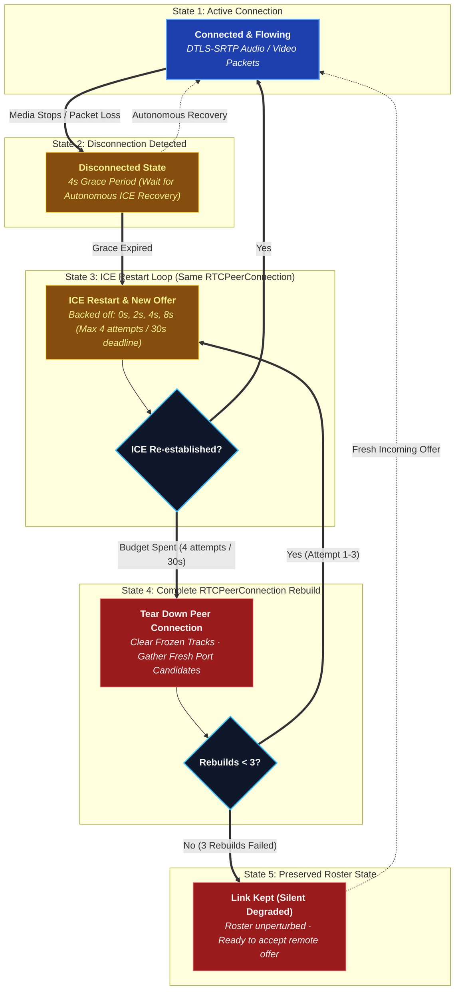

# Peer-to-Peer Media

There is no media server. Every participant in a call holds one
`RTCPeerConnection` per other participant — a full mesh — and voice, video
and screen share travel directly between machines over DTLS-SRTP.

## High-Level WebRTC Runtime Topology


---

### Archify WebRTC Component Cards

#### 1. Peer Endpoints (`apps/desktop`, `apps/android`, `apps/web`)
- **Role**: Capture, encode (Opus for audio, VP8/H.264 for video), and encrypt raw media using DTLS-SRTP.
- **Trust Boundary**: `TB-1 / TB-4 (Client Origin)`.
- **Security Invariant**: Each peer signs its DTLS fingerprint with the channel symmetric key. Unsigned or mismatched fingerprints are dropped immediately to prevent server MITM attacks.

#### 2. Call Signaling Switchboard (`apps/services/call-service`)
- **Role**: Pure signaling switchboard over WebSocket (`/ws/call`). Dispatches SDP offer/answers, exchanges ICE candidates, and maintains live voice channel participant rosters in Redis.
- **Trust Boundary**: `TB-2 (Internal Application Mesh)`.
- **Security Invariant**: **Zero Media Proxying**. Never inspects, processes, or proxies media RTP packets.

#### 3. NAT Traversal Infrastructure (STUN & TURN)
- **Role**: Discovers public-facing reflexive ICE candidates (STUN) and provides symmetric NAT fallback relays (TURN).
- **Trust Boundary**: `TB-3 (External Services)`.
- **Security Invariant**: Outbound-only connectivity. `call-service` issues short-lived HMAC-SHA256 authenticated credentials on demand.

Music is the exception that proves the rule: **Listen Together does not use any
of this.** Rather than streaming audio to everybody, the call agrees on a queue
and a timestamp and every client plays the track itself. See
[Listen Together](/architecture/listen-together).

## Why: the tunnel can't carry it

Cloudflare Tunnel carries HTTP and WebSocket. It does **not** carry UDP, and
WebRTC media is UDP. A media server behind the tunnel needs a second public
address, an open UDP port, or a forced relay — every one of those is a thing
that breaks in a way the operator can't reproduce locally. Peer-to-peer media
sidesteps the problem entirely: media never goes near the tunnel.

```text
Signalling:  Client → Cloudflare → Tunnel → Nginx → call-service   (WebSocket)
Media:       Client <===================================> Client  (WebRTC, direct)
```

## What a mesh costs

| Participants | Video | Voice only |
| --- | --- | --- |
| 2–5 | Comfortable | Comfortable |
| 6–8 | Degrades; expect to drop video | Comfortable |
| 9+ | Not supported | Marginal |

This is the accepted ceiling, not an oversight. A call that needs to be
bigger wants an SFU, and adding one is a deliberate future decision, not
something that comes back by drift. This design replaced an earlier LiveKit
SFU (phase 24 in `development/PLANNING.md`) after four commits of fighting
the tunnel to make an SFU's address reachable — removing the SFU turned out
to be the fix, not another workaround.

## NAT traversal

- **STUN is required.** A peer learns its own public address before it can
  offer one. It is not a relay — nothing but address discovery goes through
  it, and no port has to be opened for it.
- **TURN is optional and off by default.** Symmetric NAT and carrier-grade
  NAT pairs cannot form a direct path at all; TURN is the relay that fixes
  those, and configuring one is the operator's choice. The default is
  STUN-only, and `call-service` records that once per process — not as an
  error, but because the limit is invisible from everywhere else.
- **One way to configure the relay.** `TURN_URLS` + `TURN_USERNAME` +
  `TURN_CREDENTIAL` names any standard TURN server the operator runs — coturn,
  eturnal, another provider — with a long-term credential, because a self-run
  relay has no API to mint against. All three are read from the environment, so
  resolving them reaches nothing and cannot fail. A `turn:` URL is never handed
  out without both credentials: an `RTCPeerConnection` built from one *throws*,
  which would break every call in the deployment rather than only the ones
  needing a relay, so a half-configured relay is logged once and dropped.
- **Why one way and not two.** A hosted service used to be checked first, its
  short-lived credentials minted per call over HTTPS. The key was deleted at
  the provider; every mint answered `404`; and a failed mint resolved to "no
  relay" rather than to the coturn configured beside it, so every client got
  STUN-only while a working relay sat unused. Reading the relay out of local
  configuration removes the failure mode along with the feature.
- **No port forwarding, ever** — on the machine running BetweenUs. Both peers
  dial out, to each other and to the relay. The relay itself is the exception
  and it is somebody else's host: see below.

**A relay needs an address of its own, and the tunnel cannot give it one.**
This is the part that surprises people running behind a Cloudflare Tunnel with
nothing else exposed. A tunnel carries HTTP and WebSocket: its edge terminates
TLS on 443 and expects HTTP inside it, and TURN over TLS is its own binary
protocol, so a `turns:` URL aimed at the tunnel's hostname is refused before it
reaches anything. cloudflared's TCP ingress does not close the gap either — it
needs cloudflared or WARP running on the *client*, which a browser's WebRTC
stack has no way to do. A relay therefore lives on a host with a public address
of its own — a small VM is enough, since it forwards packets it has no key for
and does not decode them.

Setting one up, end to end: [TURN relay (coturn)](/deployment/turn-server).

**What STUN-only actually costs.** Two categories, and they are worth keeping
apart because only one of them is fixable from the client:

| | |
| --- | --- |
| Pairs with *no* path | Two symmetric NATs, two mobile carriers. Nothing the client does connects these. This is the accepted ceiling of a relay-less deployment. |
| Pairs that merely *missed* one | A candidate that lost a race, a NAT binding on a port the far end had given up on, an epoch that rotated mid-negotiation. These look identical from inside the call — and they are the ones a retry wins. |

The client cannot tell which it is facing, so it assumes the second and
retries properly before concluding the first. See below.

**What a link with no path must not be blamed on.** It carries nothing in
either direction, so a working microphone reads as silent on it. The "nobody
can hear you — your microphone is sending nothing" warning is therefore
measured only over connected links: a call where none are connected shows
"could not be reached" alone, rather than that plus an input-device dropdown
that cannot fix it. See `notBeingHeard` in `call-stats.ts` and `CallStats.kt`.

## Choosing a microphone

**A device id is named with `exact`, always.** The bare `deviceId: "abc"` form
is `ideal` — advisory. The browser scores every microphone by fitness distance
and is free to hand back a different one, and Chromium does: it opens whatever
the operating system calls the default. Nothing reports this, because a capture
that ignored an advisory constraint is not an error. Every pick therefore
reopened the same microphone, which is "changing the input device does not
change the input device".

`micCapture` and the settings level meter both build the constraint through
`deviceConstraint` in `voice-quality.ts`, so there is one answer to this rather
than one per capture site.

**What `exact` costs, and where it is paid.** A device unplugged since it was
chosen is now refused rather than silently substituted. The substitution is
still wanted, so it is made deliberately in `openAudioCapture`
(`audio-devices.ts`): on `OverconstrainedError` or `NotFoundError` the capture
is retried once with the device constraint dropped and every other constraint
intact. A denied permission is re-thrown untouched — retrying it would only be
denied again, while making the error say something it does not mean.

The person is still hearing a microphone they did not choose, so `DeviceSelect`
says so above the dropdown rather than leaving it to be discovered mid-call.

This is a browser-capture concern only. Android does not choose a microphone
through constraints: `CallAudio.kt` routes the whole call to one communication
device through `AudioManager`, which is why choosing a headset's microphone
there also puts the call in that headset.

## Cleaning up a microphone, and why echo is not part of it

Three separate mechanisms are easy to confuse, and only one of them removes
echo.

**Noise suppression** takes a single channel and removes what does not sound
like a voice. It has three levels, spelled the same on every client so that
"set it to High" means one thing in a support conversation:

| Level | Desktop / Web | Android |
| :--- | :--- | :--- |
| `off` | no constraint | `googNoiseSuppression` off |
| `standard` | `noiseSuppression` — the ordinary WebRTC suppressor, tuned for *stationary* noise: a fan, a hum, an air conditioner | the OEM hardware suppressor where the device has one |
| `high` | additionally `voiceIsolation` — Chromium's model-based suppressor, which removes a keyboard, a dog or a flatmate | forces WebRTC's own software suppressor, which is device-independent |

`high` costs measurably more CPU, which is why it is not the default. Where
`voiceIsolation` is unsupported the constraint is ignored and `high` degrades to
`standard`, so asking for it never fails a capture.

This was a boolean until it was three levels, and the boolean drove *both*
constraints — so every call anybody ever made ran the expensive suppressor.
`migrateVoiceSettings` in `voice-quality.ts` rewrites a stored `true` to
`standard`. That migration exists because the field's *type* changed, and a
default behind a field does not rescue a value of the wrong type: `true` is
neither `'off'` nor `'high'`, so it would have behaved as `standard` while the
settings screen showed nothing selected.

**Echo cancellation** is a different problem and a denoiser cannot do it. A
denoiser sees one channel; cancelling echo means subtracting the signal you are
*playing* from the signal you are capturing, so it needs the far-end reference.
To a denoiser, echo is speech — it is a human voice — so it is preserved
carefully.

**Why a call echoes even with echo cancellation on.** Chromium builds its echo
reference from the **default render device**. `AudioSink` in `MediaSink.tsx`
calls `setSinkId` so a call can be played to a chosen output, and whenever that
is not the default the canceller is subtracting audio that is not what the
speakers are producing. The result is uncancelled echo that reproduces only for
people who changed their output device, which is indistinguishable from bad luck
until it is measured. Hi-fi mode is the second cause and is deliberate: it turns
echo cancellation off, because the canceller chews holes in anything correlated
with what the speakers are already playing.

**How it is measured.** `getStats` reports `echoReturnLossEnhancement` on the
local `media-source`: how many dB the canceller is actually removing. A
converged canceller removes 20–40 dB; single digits mean it is running against
the wrong reference. `mesh.ts` reads it once per sample — it is one canceller
per machine, not one per link — and `echoCancellerFailing` in `call-stats.ts`
turns it into the warning shown in the connection panel and in voice settings.
Two things it deliberately does *not* warn about: echo cancellation switched off
(a choice, not a fault) and a null reading (plenty of builds do not report the
statistic, and warning on its absence would put a permanent notice on machines
with no echo at all).

On Android none of this applies in the same way. `JavaAudioDeviceModule` chooses
between the OEM canceller and WebRTC's own AEC3 at build time, and `CallAudio.kt`
puts the whole call in `MODE_IN_COMMUNICATION` with
`USAGE_VOICE_COMMUNICATION`, which is what gives the platform canceller a
reference at all.

## What decides a share's picture

Two mechanisms, and only one of them is negotiated.

| | |
| --- | --- |
| **Per-sender parameters** | `PeerLink.tune` sets `maxBitrate`, `maxFramerate`, `scaleResolutionDownBy` and `degradationPreference` through `RTCRtpSender.setParameters`. No renegotiation, so it is applied the instant a share starts and re-applied when the ladder moves — see [The resolution ladder](#the-resolution-ladder). It is the only place that sees both the share's profile (the ceiling `bitrateFor` computes from the pixels actually captured) and what this particular link turned out to carry. |
| **SDP hints** | `patchVideoBandwidth` writes `b=AS`, `b=TIAS` and `x-google-max-bitrate` / `x-google-start-bitrate` into every video m-line at negotiation time — which is call-join time, long before anybody shares. It exists only so congestion control does not begin at WebRTC's ~300 kbps default and crawl. |

Both clients have both. `ShareQuality.kt` holds the phone's ceilings,
`SdpQuality.patch` its hints, and `PeerLink.tune` in `VoiceEngine.kt` its
per-sender parameters — the same numbers, because the two ends are talking to
each other.

**Every number in the SDP is a ceiling or a starting point. None of them is a
floor.** `x-google-min-bitrate` used to be one, set to a quarter of the ceiling
— 12.5 Mbps against the desktop's default, 5 Mbps against the phone's, both of
them the value the patch is called with when no share is running. An encoder
told to meet a bitrate floor its link cannot afford pays for it in pixels,
because 640×480 at 5 Mbps is reachable and 1920×1080 is not. Paired with a
start bitrate of 60% of that same ceiling — thrown at a path in its first
second, answered with loss, collapsing the estimate below where it would have
climbed unaided — that is a share which knocks over its own bandwidth estimate
and then sits at 480p on a connection with room for 1080p. The start is now a
fixed, survivable probe on both clients.

Fixing it on one client was never enough. **These hints configure whichever
encoder reads them**, and the ones written into an answer are read by the far
end — so a phone that still asked for a floor was a phone telling a desktop to
shrink the screen it was sending, and the symptom followed the direction of the
share rather than the client that had the bug.

The hints are appended only to payload types that have an encoder behind them.
`rtx`, `red` and `ulpfec` share the video clock rate but do not; `rtx`'s format
line is `apt=` and nothing else, and appending to it is how an entire patched
description gets refused — losing the hints on the codecs that did want them,
and on Android the raised H.264 level with them.

**Which H.264.** Asking for H.264 gets hardware encoding, which is what makes 60
fps affordable; it does not say *which* H.264, and the profile a device offers
first is Constrained Baseline — no CABAC, no 8×8 transform, and text visibly
softer at the same bitrate. Software fallback encoders are baseline-only, so
negotiating baseline can also be what pushes a machine off its hardware encoder
and into the CPU-overuse adaptation that shrinks a picture. Both clients rank
the offer before handing it to `setCodecPreferences`: `sortPreferredVideoCodecs`
on the desktop and `ShareQuality.codecRank` on Android, both preferring High
profile and `packetization-mode=1`. A rank and not a filter — a device with no
High profile encoder gets whatever it does have rather than a failed share.

**`profile-level-id` is three bytes, and only the first is the profile.**
profile_idc, then the constraint flags, then the level. Ranking on the
four-character prefix `6400` reads the profile *and half the constraint flags*,
so it accepts High (`6400··`) and rejects **Constrained High (`640c··`) — which
is the profile Chromium actually offers**. Both clients had a version of this:
the desktop's preference never fired at all and left baseline first, and
Android's would have missed `640c1f` the same way. Both now read the profile
byte alone.

**Resolution has exactly one owner, and it is the ladder.**
`degradationPreference` picks what a struggling link gives up, and this setting
has now been wrong in both directions — both are written down because each one
alone is a way for a share to collapse.

`maintain-framerate` gives up pixels and lets WebRTC's own adapter decide how
many, in 1.5×/2×/3×/4× steps off an estimate it is still finding: a 1440p share
walked down to 480p within seconds and stayed there. `maintain-resolution` holds
the size and drops frames with no floor: on a 405 kbps link that is **1080p at
2 fps**.

The fix for the second was not simply the first. Asking for `maintain-framerate`
while the ladder was *also* scaling the picture put two independent scalers on
one frame, and they multiplied — a loopback share the ladder had already halved
to 960×540 arrived at **660×350**. Two things spending the same resource is
worse than either one spending it badly.

So both profiles use `maintain-resolution`, which keeps WebRTC's adapter off the
picture, and [the ladder](#the-resolution-ladder) is the only thing that scales
it. What the intent still changes is the bitrate the picture is worth, the
content hint, and whether the sound is a soundtrack.

**A screen share always carries a screencast content hint.** `contentHint` looks
like a label and is a switch. Chromium turns `detail` and `text` into
libwebrtc's `is_screencast = true` and `motion` into `false`, and
`is_screencast` decides two things that outweigh any number above it:

- **Periodic ALR probing.** `VideoSendStreamImpl` enables it for screen content
  only. Without it, a send-side bandwidth estimate that collapsed during one bad
  minute has no way back up while the encoder is application-limited — the
  estimator learns what a link can carry only from traffic it actually sent, and
  a four-frame-a-second slideshow sends nothing worth learning from.
- **The quality scaler**, armed when `is_screencast` is false, which is a second
  mechanism scaling the picture alongside the ladder's own budget.

So the `motion` profile — a film, a game — describes its content best with the
one hint it must never carry, and uses `detail` instead. This is the difference
between a share that goes soft during a bad minute and one that goes soft and
*stays* soft on a link that has already recovered: not a link that stayed bad, an
estimate that never climbed back.

### The resolution ladder

Everything above this point is a **ceiling**, decided before the share starts
from the display's size. None of it can know what the link turned out to carry,
and a ceiling is not a plan for missing it. This is what answers instead — and
the shape of it is the whole lesson of getting it wrong twice.

**It does not budget.** The first version computed the resolution that a measured
`availableOutgoingBitrate` could carry, and applied it. That is wrong in a way
that looks right in arithmetic and is disastrous in practice, because
*`availableOutgoingBitrate` is not the link's capacity*. It is the congestion
controller's estimate; the estimate only grows by probing with real traffic; and
an encoder with nothing to send never produces any. A static screen share — a
terminal nobody is typing in — sends a few kbps, so the estimate sits at
`START_KBPS` forever. Budgeting against it halved a **loopback** share to
960×540, where capacity is effectively infinite. And a smaller picture sends even
less, so the estimate can never climb back out.

That is a ratchet, and hysteresis does not save you from it: the climb needs
readings of headroom, and headroom never appears because the content was never
the thing sending.

**So it reacts, and only to a failure it can see.** `qualityLimitationReason` is
the encoder saying it wanted to send more and could not — the one signal a quiet
screen cannot fake.

| | |
| --- | --- |
| **`isStarved`** | `qualityLimitationReason === 'bandwidth'` **and** an outbound frame rate under 20. Both halves are required: `bandwidth` alone is reported transiently on shares that are completely fine, and a low frame rate alone is the normal state of a screen nobody is touching — a capturer only emits a frame when pixels change, so 4 fps at 5 kbps is a correct answer, not a fault. |
| **`isCpuStarved`** | The same shape, for `qualityLimitationReason === 'cpu'` — a software encoder (no hardware H.264 path, or a codec sort that landed on one without an encoder behind it) that cannot turn pixels into frames fast enough. Added in phase 48; before it, a CPU-bound share sat under 20 fps indefinitely, on any connection, because nothing was watching for the reason. |
| **`SCALE_STEPS`** | `[1, 1.5, 2, 3]` — discrete and coarse on purpose. A continuous scale recomputed per tick is a keyframe per tick; the steps make a struggling share settle on one of four answers instead of hunting. On 1080p: 1080p, 720p, 540p, 360p. Spent only by `isStarved`. |
| **`FRAME_TIERS`** | `[60, 30, 24]` — 24 is the floor because it is the rate film has used for a century; below it motion reads as a slideshow rather than motion. Spent only by `isCpuStarved`. |
| **`ShareLadder`** | Holds *two* independent indices, one into each list — one step down, one step up, or nothing, on each axis separately. A reading's `qualityLimitationReason` is one value at a time, so the two axes never move together for the same reason: this is not the two-scalers-on-one-picture bug from earlier in this document, because pixels and frames are different resources and each trigger owns exactly one of them. |

Down takes 2 consecutive starved readings; up takes 6 healthy ones — on
whichever axis moved. A collapsed share is already unwatchable so waiting is
more of the bug, while a recovered one has to prove it, because the estimate
rises by probing and the first good reading is the probe rather than the link.

**A quiet share counts toward the climb**, which is the exact opposite of the
broken version. There is no evidence left that the link is the problem, and the
only way to find out is to try a bigger picture.

On a healthy share, and on a quiet one, the ladder does nothing at all and the
share is exactly what the profile asked for. It is driven from the `getStats`
poll that already runs every second whether or not the connection panel is open,
and acted on by `applyShare` / `tune`, which publish
`min(profile frame rate, ShareLadder.frameRate)` alongside the resolution scale.
Both clients carry the same thresholds and steps; `share-quality.check.ts` and
`ShareQualityTest.kt` assert the same answers on both sides.

A new capture resets the ladder to the top, on both axes.

### Which candidate pair is answering

Three separate things read "the pair carrying this call": the round trip in the
connection panel, direct-or-relayed (and therefore `RELAY_MAX_BITRATE`), and the
ladder's own `availableOutgoingBitrate`. All three used to scan the report for
`succeeded && nominated` and keep the last match.

`getStats()` guarantees no ordering, and a link recovers by calling
`restartIce()` — up to four times, per `call-recovery.ts`. Every restart gathers
a fresh set of pairs, and **the pair that was carrying the call before it stays
in the report**: still `succeeded`, still `nominated`, counters frozen at the
moment it died. So "whichever came last" is a coin flip between the live pair
and a corpse, and the corpse only turns up after a link has had a bad minute —
which is exactly when all three readings matter.

Reading it is silent and it is not harmless:

- no `currentRoundTripTime`, so the panel shows `Round trip —` on a healthy call
- no `availableOutgoingBitrate`, so the ladder gets no reading and never moves
- the *old* candidate ids, so direct-or-relayed is answered about a path that no
  longer exists

`selectedCandidatePair` (`CallStats.selectedPair` on Android) prefers
`RTCTransportStats.selectedCandidatePairId`, which is the spec's own answer and
always names the live pair. The scan survives only as a fallback for a report
with no transport entry, and it breaks the tie on traffic rather than on order:
a pair that died stopped accumulating bytes.

### What the panel can now answer

`Link est.` is `availableOutgoingBitrate`. The ladder deliberately does **not** act on it — see above — but it is worth showing, because
It is the difference between "my connection is slow" and "WebRTC decided my
connection is slow", which are different faults: an estimate far below a link
that is demonstrably fine is an estimate that collapsed and never climbed back,
and the way back up is ALR probing, which is why the content hint above matters
so much.

`Path` is direct or via relay. It had been measured since the relay ceiling was
written and discarded at the panel boundary, so there was no way to tell from
inside the app that a call was on TURN — while being held to `RELAY_MAX_BITRATE`
on purpose and paying for every byte twice.

`Encoder` is `GPU` or `CPU`, with the implementation's own name on hover, and
`Out` now carries the frame rate actually sent (`1920×1080 @ 60`). Together with
`Path` and `Held by`, one test share answers why a 1080p60 share is not 60:

| Panel says | Bottleneck | Fix |
|---|---|---|
| `Encoder: CPU`, `Held by: cpu` | Software encoder (libvpx, OpenH264) | Hardware H.264 — on Linux, the VA-API flags below |
| `Path: relay` | TURN, held to `RELAY_MAX_BITRATE` | A direct pair (NAT/firewall), or a bigger relay |
| `Out` below the requested rate, nothing holding it | Capture | Windows WGC, or X11 / PipeWire on Linux |

The classification prefers `powerEfficientEncoder` when the browser reports it,
and falls back to the implementation name; an unrecognised name is left
unknown rather than guessed, and the row hides. Android's connection sheet
shows the same `Encoder` row.

**Hardware encoding on Linux.** Windows gets a GPU H.264 encoder by default and
macOS gets VideoToolbox; Linux Chromium encodes WebRTC H.264 in software unless
asked. `electron/main.ts` enables the VA-API encode/decode features and the
PipeWire capturer on Linux. On a GPU or driver without VA-API support Chromium
falls back to software in silence — the `Encoder` row is how to tell.
`BETWEENUS_DISABLE_VAAPI=1` skips the flags if a driver misbehaves.

On Wayland Chromium gives VA-API the compositor's GPU. On a hybrid laptop whose
compositor runs on the NVIDIA card that device has no VA-API, so the encoder is
OpenH264 or libvpx even when the Intel iGPU could encode. Pointing
`--render-node-override` at the iGPU for the whole app is not a fix: the
compositor then cannot import the window's buffers.

**Screen share under Wayland.** Every `desktopCapturer.getSources` call goes
through the xdg ScreenCast portal and puts its dialog on screen, and the
portal needs a backend that implements ScreenCast (`xdg-desktop-portal-gnome`,
`-kde` or `-wlr`; `-gtk` does not). With `systemScreenPicker` set in
`electron/main.ts`, the app's picker lists no sources and asks only the intent,
`screen:displays` reads sizes from Electron's `screen` without a source, and
the display-media handler makes the one `getSources` call and shares whatever
the portal's dialog was given.

**Both clients show the same eight readings, since phase 50.** Android's
connection sheet ported only four of the desktop's eight when it was written —
`Down`, `Up`, `Loss`, `Round trip` — leaving `Link est.`, `Path`, `Held by` and
`Out` desktop-only, not because the underlying `getStats` entries were
unavailable but because `LinkSample`/`LinkStats` never carried them across.
`shareReduced` is new on both: the debounced answer to "is the share actually
worse right now", read from `ShareLadder`'s own position (off the top on
either axis) rather than from a raw `sendLimitedBy` reading, which is
transient in exactly the way `isStarved`/`isCpuStarved` already exist to
filter. `healthWarning`'s third branch — checked last, after loss and round
trip — turns that into a sentence naming which axis is to blame, and reaches
the person sharing for free: both clients already pipe `healthWarning` into an
always-visible indicator (the desktop's control-bar `Connection` button,
Android's dock icon and `CallMoreSheet` subtitle), so no new banner was needed
to make a struggling share visible to the one person who can do something
about it.

**A ceiling on pixels, spent before anything is encoded.** Every other number
here is a ceiling on bits. `maxHeight` in `QualityOverride` is a ceiling on the
capture itself, and it is the only one that acts before the encoder or the link
ever sees a frame. A share used to be captured at the display's native size,
whatever that was — on a 1440p or 4K monitor, a consumer hardware encoder asked
for three to eight megapixels sixty times a second and a home uplink asked for
60–80 Mbps, which is a `qualityLimitationReason` of `cpu` or `bandwidth`, a
frame rate in single figures, and a share that looks broken on a connection with
nothing wrong with it.

`cappedSize` holds the capture to **1080p by default**, keeping the display's
aspect ratio exactly and rounding both dimensions even. It is never an
enlargement: a 1366×768 panel is captured at 1366×768, because asking a display
for lines it does not have is an upscale paid for in bitrate. `bitrateFor` is
then quoted against the capped size, so the pipe is sized for the picture that is
actually sent. Settings → Voice & Video offers *this display*, 2160p, 1440p,
1080p and 720p; the first is for a LAN that can carry it.

**Android has the same lever, since phase 49.** `ShareQuality.ScreenQuality`
(`AUTO` / `P1080` / `P720`) caps the long edge `captureSize` hands
`ScreenCapturerAndroid`, the same way `maxHeight` caps `cappedSize` on the
desktop — set once in Settings → Voice & Audio → Screen Share Resolution
(`AudioPrefs.screenShareQuality`), read at the start of every capture. A
smaller capture is fewer pixels for the phone to encode every frame and fewer
bits for the link to carry, both spent *before* the encoder or the ladder ever
sees a frame — the cheapest and most reliable fix a choppy share has, because
it removes the problem rather than reacting to it after the fact. Nothing is
lost visually on the watching end: a receiver's video surface stretches
whatever arrives to fill its own view regardless of the source resolution,
the same free upscale any undersized video already gets played back larger
than it was recorded.

The ceiling reaches `getDisplayMedia` through `captureConstraints` as a **`max`,
never an `ideal`**. `ideal` is a preference Chromium scores and is free to miss,
so the old constraint — `ideal` at the real size beside `max: Math.max(3840, …)`
— let a 4K display go on handing back 4K. Both capture sites (a share in a call,
and a remote session in `remote-agent.ts`) go through the one helper.

**A relayed link gets its own ceiling.** Every number above is sized for a direct
path between two machines, where the only limits are the two uplinks. A relayed
pair is a different problem: media goes up to the TURN server and back down, so
one share costs the relay *twice* its bitrate, and a relay is a small VM on an
operator's bill rather than a fabric. Pointing 35–80 Mbps at one does not produce
35–80 Mbps; it produces loss, and the estimator reads loss as a link that cannot
carry anything. The relay was being used correctly and at a rate it was never
going to carry.

`PeerLink` watches the nominated candidate pair in the `getStats` its video poll
already takes every second. When either end of that pair is a `relay` candidate,
`ceilingFor` holds the screen sender to `RELAY_MAX_BITRATE` (8 Mbps — well above
what 1080p60 H.264 needs to look clean, well inside what a modest VM forwards).
Per link, because in a mesh one peer may be direct and the next relayed; and
watched rather than decided once, because ICE is usually still choosing a pair
when a share starts and a pair can change mid-call. A manual ceiling already
below the relay limit is never raised. **Both clients**, since phase 48 —
Android's `poll` already computed direct-or-relay for the connection panel and
simply never acted on it; `PeerLink.applyRelayCeiling` on Android is the port of
`applyRelayCeiling` on the desktop.

**Why a share went soft.** `qualityLimitationReason` on the outbound stream is
the one reading that separates *the link cannot carry it* from *this machine
cannot encode it* from *nothing is holding it back and it still looks like
that*. It is sampled alongside the outbound frame size and shown in the
connection panel as `Held by`, next to the inbound size that was already there —
because a soft picture shrunk before it left and one damaged on the way are
identical from the far end, and `bandwidth` and `cpu` want opposite fixes: the
resolution ladder answers the first, the frame ladder the second, and each
reads only the reason it owns.

## What decides a camera's picture

For a long time, nothing did. A camera was opened with `getUserMedia({ video:
true })` and handed straight to the sender, which is three separate omissions
wearing one line: no device, so a machine with two cameras opened whichever the
browser preferred; no resolution, so a 1080p webcam opened at whatever default
the browser felt like; and no sender parameters at all, so the encoder ran at
WebRTC's own guess. That last one is invisible where it happens — the picture
looks correct on the machine sending it, and only the far end sees it soft.

The camera has its own quality module rather than a mode inside the share's,
and the reason is that the two want opposite trades:

| | screen share | camera |
| :--- | :--- | :--- |
| when the link tightens | `maintain-resolution` + the ladder — hold the frame rate, and step resolution down only when the encoder reports it cannot carry the picture | `balanced` — spend whichever is cheaper |
| content hint | `text` for a document, `motion` for a film | `motion`, always |
| bitrate at 1080p | 20 Mbps | 4 Mbps |

Text has to stay readable, so a share holds its pixels and gives up frames.
Nobody reads a face, and a camera that goes choppy *and* stays sharp looks
broken in a way a slightly softer one does not. The bitrate gap is the same
observation from the other side: a megapixel of small sharp text costs bits at
every edge, and a face in a room is the easiest thing a video encoder is ever
handed.

Both clients carry the same reference, floor and ceiling, and both assert them —
`camera-quality.check.ts` on the desktop, `CameraQualityTest` on Android. A call
has both clients in it, and two ladders that disagree is a picture quality that
depends on who is holding which device.

**The size asked for is not the size granted.** The publish parameters are
derived twice: once from what was requested, then again from what
`getSettings()` actually handed back. A camera asked for 360p that only has a
1080p mode would otherwise be published at a 360p ceiling — a permanently soft
picture for no saving at all — and only the second pass can tell the difference.

**Choosing a camera uses the same rules as choosing a microphone**, because
`enumerateDevices` returns every kind at once and the rules were never
microphone-specific. The device id is named with `exact` (anything weaker is
advisory and Chromium ignores it), an unplugged camera falls back deliberately
rather than silently, and `followSystemDevices` drops a pinned camera that is
genuinely gone. On Android the camera is stored by device *name* rather than
index, because indices move when a driver reorders the list — and a named camera
only wins while it still faces the way the flip button says, or picking the
wide-angle lens once would pin every later call to it.

## Filters, and the seam they run on

Filters and a portrait blur both need somewhere to stand between the captured
frames and the ones that go on the wire. On the desktop and web that is
`camera-effects.ts`: `MediaStreamTrackProcessor` reads frames out of the camera,
a canvas applies the effect, and `VideoTrackGenerator` puts them back into the
track that is published. It runs in a worker — a camera at 1080p30 is thirty
full-frame draws a second for the length of a call, and on the main thread the
symptom is not a slow filter but an interface that stutters whenever the camera
is on.

**Native blur is not used because it is not reachable.** The `backgroundBlur`
track constraint is wired to platform video effects that ship on ChromeOS and a
narrow slice of Windows builds and report unsupported nearly everywhere else;
on Android the app captures through WebRTC's `Camera2Enumerator`, whose
`CameraCaptureSession` is not the `CameraExtensionSession` bokeh lives on. And
colour filters were never native anywhere. That is the whole reason there is a
processing stage.

Three things can go wrong, and each is answered rather than assumed away:

- **A browser without Insertable Streams** — Firefox and Safari on the web
  client, never Electron — reports filters unavailable and publishes the raw
  camera. The settings screen says so. A setting that is accepted and then
  silently dropped is worse than one that admits it cannot be honoured.
- **A machine that cannot keep up** turns the filter off, but only after a
  sustained run over budget: a garbage collection or a dragged window is not a
  verdict. Coming back requires frames comfortably *under* budget, because a
  machine sitting exactly on the line would otherwise toggle the effect for the
  whole call, which is worse to watch than either state.
- **A frame that will not draw** is forwarded untouched rather than dropped.
  This sits between a camera and every peer: an unfiltered frame is cosmetic,
  and a missing one is a stall everybody sees.

The portrait blur is not here. Blurring a background means knowing which pixels
are the background, which means a segmentation model and the download behind it;
it attaches to this pipeline rather than replacing it. Android has no equivalent
stage yet.

Mirroring is a CSS transform on the self-view alone and never touches the track.
What everybody else receives is never mirrored — text held up to a camera would
arrive backwards for all of them.

## One signal at a time

Negotiation is the WebRTC spec's perfect-negotiation shape: politeness is
decided by comparing peer ids, the impolite side offers, and on a collision the
polite side yields. That algorithm assumes something the transport does not
provide on its own — **that one signal is fully applied before the next one is
looked at.**

Every client takes signals off a socket that does not wait for the handler.
Applying a description is asynchronous several times over: verifying the DTLS
fingerprint can go to the network for a fresh channel key, and adopting
transceivers, creating an answer and setting it are each their own await. So two
descriptions arriving close together ran *concurrently* and interleaved, and
perfect negotiation's decisions — is this a collision, is there still an offer
outstanding — were read from `signalingState` and then acted on well after
another run had moved the connection on.

The case that showed it: an offer and a re-offer from the connection chaser
landing together. Both passed the collision check while the state was still
`have-remote-offer`, the first drove the connection to `stable` with its answer,
and the second reached `setLocalDescription('answer')` a moment later —
`Called in wrong state: stable`, in red, on a call that was otherwise fine.

So each peer applies its signals through **one queue**, and the whole receive
path is a critical section over that peer's connection. Per peer and never per
call: separate connections share no state, and queueing them behind each other
would make the slowest peer's key re-read everybody else's problem.

## When a link breaks

A peer connection that stops carrying media is not a peer connection that is
over, and the policy for what to do about it is shared by every client —
`call-recovery.ts` on web and Electron, `CallRecovery.kt` on Android. Two
clients that disagree about how long to wait restart on top of each other, so
the numbers are deliberately identical.

| Stage | Behaviour |
| --- | --- |
| `disconnected` | 4s grace. ICE climbs out unaided often enough that restarting immediately throws away links that were about to be fine. |
| Restart | Up to 4 ICE restarts, backed off (0s, 2s, 4s, 8s), each followed by a real offer. |
| Deadline | 30s without media, whatever the attempt count says. |
| Spent | The connection is **rebuilt from nothing** — see below — up to 3 times. |
| Spent again | The link is **kept**. Nothing else re-adds a link, so removing one is permanent; a pair unrecoverable from one side may be fine from every other. Who is in a call is the roster's answer. |



Only the impolite peer restarts. `restartIce()` merely marks a connection as
wanting fresh candidates — the offer is what asks for them — and the polite
side's offer is discarded as glare, so a polite restart is a no-op that reads
like a recovery attempt in a log.

### Rebuilding a link

An ICE restart reuses the connection, so a connection whose *ports* are the
problem restarts onto the same problem. Only a new `RTCPeerConnection`
gathers genuinely new candidates: new local ports, a new NAT binding, a fresh
race to win or lose.

That is what everybody was doing by hand when they left a call and rejoined
until it worked, and on a relay-less deployment it is the single most
valuable move available — so the client does it itself. When a link's whole
recovery budget is spent, or when an offer has gone unanswered through every
`chase` attempt, the mesh throws that one connection away and builds a new one
for the same peer, up to `REBUILD_ATTEMPTS` (3) times per call.

- **Only the impolite side rebuilds**, for the reason only it offers. The
  polite side needs no rebuild: the fresh offer arrives with a new ICE ufrag
  and a new DTLS fingerprint, which its existing connection takes as a restart
  and answers. Both sides tearing down at once is two peers rebuilding into
  each other's closing connections.
- **The peer never leaves the roster.** A link this client cannot make work
  says nothing about whether the person is in the call.
- **Received tracks are cleared first.** A frozen last frame left on screen is
  worse than an empty tile — it is the call looking like it works.
- Each rebuild is only reached after a *complete* recovery budget, so three of
  them is three independent total failures. A pair that cannot manage it in
  three has no path, and going round again would be a spinner pretending
  otherwise.

**Losing the signalling socket does not end a call.** Signalling is not in
the media path: every peer connection carries on, and the only thing missing
is the ability to admit somebody new. The client reconnects quietly and
resumes the seat `call.gateway.ts` holds for its device id, so nobody else in
the call is told anything happened. Only a loss outlasting 45s is fatal — by
then the roster has dropped the device and holding the microphone open would
be a lie.

## End-to-end encryption, for free

DTLS-SRTP between two directly-connected peers already *is* end-to-end
encrypted — there's no SFU hop that needs to read the frames. The remaining
risk is `call-service` swapping a DTLS fingerprint to sit in the middle, so
each peer signs its fingerprint with the channel key (which `call-service`
never holds), and the other side refuses a connection whose fingerprint
isn't signed. Full design: [`E2EE.md`](/security/e2ee).

## Who is on the stage

Layout is a client decision — no signal decides it, and one viewer's stage never
moves anybody else's. Three rules, shared by the web/desktop client
(`VoiceChannelView.tsx`, with the pure part in `stage-order.ts`) and Android
(`VoiceChannelScreen.kt`):

| | |
| --- | --- |
| **The stage is the other people** | The local tile is drawn as a small floating window over the corner of the stage, never as a grid cell — the one face in the call nobody joined to watch. It takes the whole stage only when there is nobody else in the call yet. |
| **Nothing moves on its own** | Promoting a recent speaker exists to keep them on page one, so it runs only when there *is* a page two: while everybody fits on one page the order is left exactly as it arrived. Where one face fills the stage (a big call on either client), it follows the *last* speaker stickily rather than the current one, so a conversation does not throw the layout around between sentences. |
| **A pin outranks both** | Any tile, the local one included, can be pinned to hold the stage with everybody else in a strip underneath. The pin is per-viewer, is never sent anywhere, and is dropped the moment that person leaves the call. |

The first two are the same complaint answered twice: a grid that rearranges
itself around whoever is talking is unreadable in exactly the moment somebody is
trying to read it. `stage-order.check.ts` pins them down, because the fault is
invisible in a screenshot and obvious in a call.

A screen share never rearranges anything by itself either: it is announced by a
banner and joined on purpose, and it never replaces the sharer's own tile. That
is `ShareBanners` on the web and desktop and `ShareInvite` on Android, and it is
the same bargain on all three — a line at the bottom of the call saying who is
presenting, with a button, and nothing moves until it is pressed. Leaving the
share puts the banner back rather than suppressing the share.

**"Nothing moves" includes the tiles, and that is the part that broke.** A tile
shows a person's *camera* and never their share. Android's `Participant.video`
preferred the share over the camera — correct before the share stage existed,
when a phone genuinely had one tile to put things in, and quietly a liar once
`ShareInvite` arrived: the stream appeared in the sharer's tile the instant they
started, so it was already on screen behind a banner still asking whether to
join it. Somebody who never pressed Join was watching anyway. A share now
reaches the screen through exactly one door, which is pressing the button.

The dock and picture-in-picture are the deliberate exception, via
`Participant.anyPicture`: both are a glance at whether anything is happening,
neither has room to offer a choice, and neither is a stage anybody opted into.

Asking for the mouse (`ShareControlBar`) lives on the share itself for the same
reason it has to: the far end is sent *fractions* of the picture, so the surface
a touch is measured against must be the picture and not the box around it. On
Android that is the share stage — under the header, at the top, which is where
the desktop keeps "Request control" too. It sat at the bottom until it was found
crowding the call dock: stacked above mute and hang up, it pushed them down and
took a strip of screen a thumb is always moving through, which is too much room
for a request somebody makes once in a call. It rides with the chrome either
way, so a tap on the picture hides it. The letterboxed frame's own rectangle is
the drive surface; pinch-zoom is suspended while driving, because a one-finger
drag cannot be both a pan here and a mouse drag there.

### Who can be driven, and who can drive

These are two different questions and the answer is different for each, which is
what the refusal message used to get wrong.

**Being driven needs a bridge.** Input arrives as a fraction of a display and
something has to turn it into a real mouse move on that machine, which is the
Electron main process. A browser tab has no such API and no such API is coming,
so a share from a tab can never hand its own mouse over — whatever was picked in
the browser's picker, tab or window or entire screen.

**Driving needs nothing but a connection.** An API call, a WebSocket and a peer
connection, all of which a tab has. So a web client can take control of a
desktop share, and can open and drive a full remote session, exactly like the
desktop app. Only the clipboard sync skips itself, because that reads the local
clipboard through the bridge.

The refusal a web sharer sends back therefore asks about the runtime *before*
the surface, and names the way through:

> they are sharing from a browser, which cannot hand over its mouse — the
> desktop app can, or open a remote session on their machine instead

Asking about the surface first was the bug: somebody who had just shared their
entire screen from a tab was told "a window is being shared, not a whole
screen", and got the same wrong answer for every option in the picker. The
ordering is in `services/share-control-access.ts` and is the only thing that
module does.

That last clause is a real path, not a consolation. **Remote machines** and the
**Open a session** button beside a share are no longer hidden in a browser tab —
they were, on the reasoning that remote desktop is a desktop-app feature, which
is only half true. Offering *this* machine is desktop-only and still is, under
Settings → Remote Access. Reaching *another* machine is not, and hiding it took
the web client's only route to driving anything.

### What a share leaves out

The desktop's picture-in-picture overlay (the floating window that appears when
the app is minimised in a call) is excluded from capture with
`setContentProtection(true)` in `createPipWindow`. It is there for the person in
the call, not for the people watching their screen. Without it, sharing a whole
display put the overlay, and the share it was mirroring, in front of everyone
on the other end. This is the same mechanism as the one-time message viewer
(`screen:protect`): Windows marks the window `WDA_EXCLUDEFROMCAPTURE`, macOS
sets its sharing type to none, and on Linux it does nothing, so the overlay is
still captured there.

The overlay's picture is a JPEG the main window draws every 60 ms and sends
over IPC. It is drawn only while the overlay exists: main sends
`pip:open-changed` on open and close, and without it the loop spent a core of
CPU for the whole call on frames nobody received.

**The call's own audio is left out of a share's system audio.** Electron's
display-media handler offers only `loopback` and `loopbackWithMute`, and both
are the machine's whole output mix. That mix includes the call coming out of
the speakers, so a share with audio sent everyone's voice back to them a beat
late. The renderer's `restrictOwnAudio` constraint cannot fix this: the handler
chooses the loopback device before Chromium reads the constraint, so it is
accepted and ignored.

On Windows the audio therefore comes from WASAPI **process loopback**, set to
capture everything except this app's own process tree
(`PROCESS_LOOPBACK_MODE_EXCLUDE_TARGET_PROCESS_TREE`, targeting the main
process, which is the parent of the renderer and of Chromium's audio service).

| Step | Where |
| :--- | :--- |
| A PowerShell helper compiles the interop with `Add-Type` (no native module, same as remote input) and writes 48 kHz stereo 16-bit PCM to stdout | `electron/share-audio.ts` |
| The main process forwards whole frames to the renderer as `share-audio:pcm` | `electron/share-audio.ts` |
| An AudioWorklet with a 40 ms jitter buffer (backlog capped at 200 ms) plays the PCM into a `MediaStreamAudioDestinationNode` | `src/services/share-audio.ts` |
| `shareScreen` starts this capture first and, if it runs, asks `getDisplayMedia` for video only | `src/stores/voice.ts` |

It needs Windows 10 2004 or later. If the helper does not report `ready`
within ten seconds, or exits, the share falls back to the whole-mix loopback
rather than going out silent. The helper exits when its stdin closes, which
happens when the share stops and when the app quits.

### Full screen on the desktop, and the two keys it keeps

Full screen is two wishes that pull opposite ways, so it is two modes with a
button between them.

Both take the **screen**, not the window: the view asks for the platform's own
full screen (`requestFullscreen`), so the task bar and the caption buttons go
away in either mode. An overlay at `inset-0` only fills the page, which left
Windows' task bar along the bottom of the shared desktop and the window buttons
over its top corner — the two strips a shared screen most needs back. `F11` and
a browser-swallowed `Escape` are read back off `fullscreenchange`, so the
view's own state cannot disagree with the window's.

On the desktop this needs Electron's permission handler to allow `fullscreen`
alongside the capture permissions (`electron/main.ts`). A browser grants it
itself, so the same code worked on the web and did nothing in the app: the
request was rejected and the overlay stayed under the task bar.

Either way it is **one strip**, never two: the share's name, what can be done
to it, and the call controls sit in a single bar. Two bars — share chrome along
the top, the call dock along the bottom — landed on the two parts of a shared
desktop worth reading, its tab bar and its task bar, and split the way out
across six separate pills.

**Fill** is the default and is what full screen usually means: the picture edge
to edge, the strip floating over the *bottom*. Nothing is pinned to the top,
because the top of a shared screen is its tabs, and there is no second Exit
button waiting in a corner — that duplicate is gone.

The strip **auto-hides after three seconds** and is brought back by a small
dot button at the bottom centre of the screen. Nothing else triggers it — not
mouse movement, not keyboard input. A pointer crossing the picture on its way
somewhere else is not a request for a toolbar, and a keystroke on its way to the
machine being driven is not either. The button is always visible at low opacity,
small enough not to distract from the shared content, and clicking it shows the
strip which then auto-hides again after three seconds.

**Docked** puts the same strip in a row above the picture instead, with the
share in a bordered frame below it, and nothing fades. Docked chrome covers
nothing, which is the whole point: the shared desktop's own top and bottom stay
readable while somebody is driving it. It needs no caption inset: the window is
natively full screen here, so there are no window buttons in that corner to
leave room for.

Taking control of a share forces Docked and disables the button, saying why.
Chrome that fades takes **Release control** with it, and floating chrome is a
strip of this app over the machine being clicked into; neither is survivable in
the one mode where every pixel has to be readable and every control reachable.

Only two bindings stay local while a share is on screen, and both are chords:

| Chord | Does |
| --- | --- |
| `Ctrl+Shift+F` | Toggle full screen |
| `Ctrl+Shift+X` | Hand the mouse and keyboard back |

They are matched on `event.code` in `services/keyboard.ts`, so a non-QWERTY
layout gets the same physical keys, and they are the same two in a call share
and in a remote session. Neither can be a single key: while control is being
driven every keystroke belongs to the far machine, so a bare `f` was flipping
this view instead of typing an `f` over there, and a bare `Escape` handed
control back on the key most likely to be pressed — leaving the driver unable to
send Escape at all. Escape still leaves full screen when nobody is driving,
which is what Escape means everywhere else. Ctrl-or-Cmd plus Shift, never with
Alt, is what keeps both clear of `Ctrl+F`, `Cmd+F`, `Ctrl+Shift+Esc` and the Alt
chords the two desktops reserve.

## Live streaming: deliberately out of scope

One-to-many streaming needs a media server — a broadcast to 50 viewers is 50
uplinks from a mesh streamer, which doesn't work. It returns only when, and
only when, a media server exists to carry it.

## Rules

- Never proxy media through NestJS, Nginx, or the tunnel.
- Never run a media server or an SFU.
- Never require an inbound port for media.
- Never hand a client an address only the server can reach — peers exchange
  ICE candidates and work it out themselves.
- Never apply two signals to one peer connection at once. Perfect negotiation
  reads `signalingState` to decide what to do; a concurrent run invalidates that
  reading before it is acted on.
