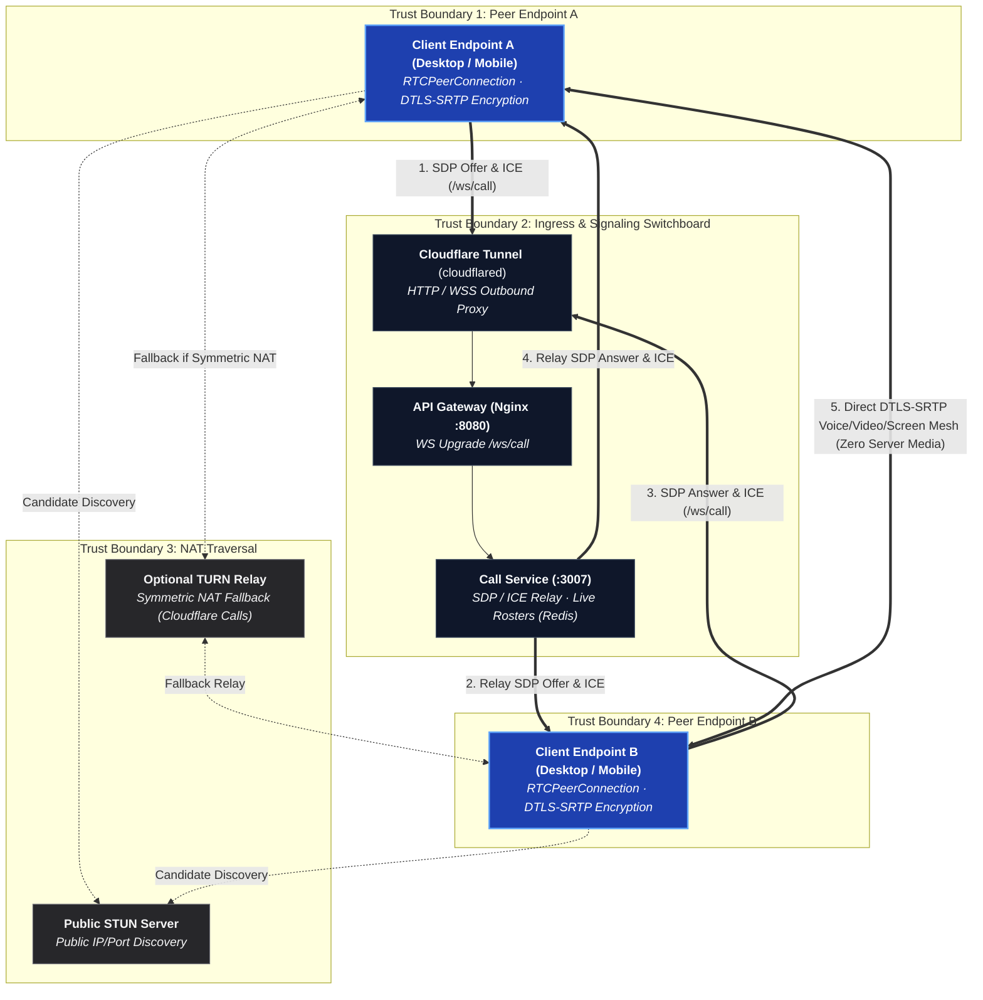
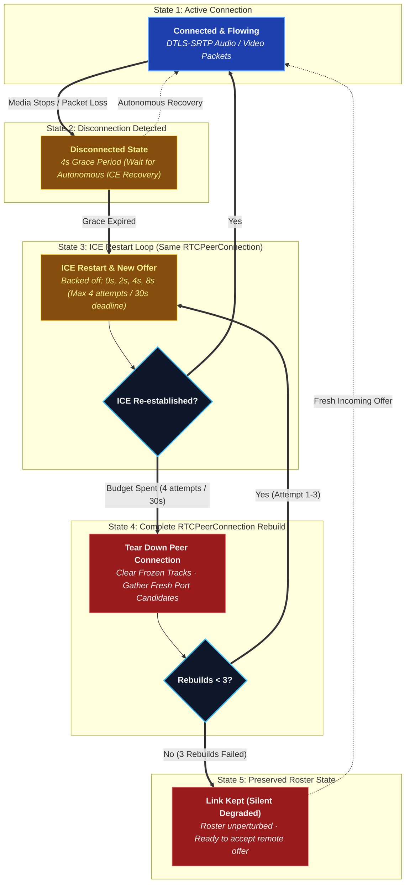

# Peer-to-Peer Media

There is no media server. Every participant in a call holds one
`RTCPeerConnection` per other participant — a full mesh — and voice, video
and screen share travel directly between machines over DTLS-SRTP.

## High-Level WebRTC Runtime Topology



---

### Archify WebRTC Component Cards

#### 1. Peer Endpoints (`apps/desktop`, `apps/android`, `apps/web`)
- **Role**: Capture, encode (Opus for audio, VP8/H.264 for video), and encrypt raw media using DTLS-SRTP.
- **Trust Boundary**: `TB-1 / TB-4 (Client Origin)`.
- **Security Invariant**: Each peer signs its DTLS fingerprint with the channel symmetric key. Unsigned or mismatched fingerprints are dropped immediately to prevent server MITM attacks.

#### 2. Call Signaling Switchboard (`apps/services/call-service`)
- **Role**: Pure signaling switchboard over WebSocket (`/ws/call`). Dispatches SDP offer/answers, exchanges ICE candidates, and maintains live voice channel participant rosters in Redis.
- **Trust Boundary**: `TB-2 (Internal Application Mesh)`.
- **Security Invariant**: **Zero Media Proxying**. Never inspects, processes, or proxies media RTP packets.

#### 3. NAT Traversal Infrastructure (STUN & TURN)
- **Role**: Discovers public-facing reflexive ICE candidates (STUN) and provides symmetric NAT fallback relays (TURN).
- **Trust Boundary**: `TB-3 (External Services)`.
- **Security Invariant**: Outbound-only connectivity. `call-service` issues short-lived HMAC-SHA256 authenticated credentials on demand.

Music is the exception that proves the rule: **Listen Together does not use any
of this.** Rather than streaming audio to everybody, the call agrees on a queue
and a timestamp and every client plays the track itself. See
[Listen Together](/architecture/listen-together).

## Why: the tunnel can't carry it

Cloudflare Tunnel carries HTTP and WebSocket. It does **not** carry UDP, and
WebRTC media is UDP. A media server behind the tunnel needs a second public
address, an open UDP port, or a forced relay — every one of those is a thing
that breaks in a way the operator can't reproduce locally. Peer-to-peer media
sidesteps the problem entirely: media never goes near the tunnel.

```text
Signalling:  Client → Cloudflare → Tunnel → Nginx → call-service   (WebSocket)
Media:       Client <===================================> Client  (WebRTC, direct)
```

## What a mesh costs

| Participants | Video | Voice only |
| --- | --- | --- |
| 2–5 | Comfortable | Comfortable |
| 6–8 | Degrades; expect to drop video | Comfortable |
| 9+ | Not supported | Marginal |

This is the accepted ceiling, not an oversight. A call that needs to be
bigger wants an SFU, and adding one is a deliberate future decision, not
something that comes back by drift. This design replaced an earlier LiveKit
SFU (phase 24 in `development/PLANNING.md`) after four commits of fighting
the tunnel to make an SFU's address reachable — removing the SFU turned out
to be the fix, not another workaround.

## NAT traversal

- **STUN is required.** A peer learns its own public address before it can
  offer one. It is not a relay — nothing but address discovery goes through
  it, and no port has to be opened for it.
- **TURN is optional and off by default.** Symmetric NAT and carrier-grade
  NAT pairs cannot form a direct path at all; TURN is the relay that fixes
  those, and configuring one is the operator's choice. The default is
  STUN-only, and `call-service` records that once per process — not as an
  error, but because the limit is invisible from everywhere else.
- **No port forwarding, ever.** Both peers dial out.

**What STUN-only actually costs.** Two categories, and they are worth keeping
apart because only one of them is fixable from the client:

| | |
| --- | --- |
| Pairs with *no* path | Two symmetric NATs, two mobile carriers. Nothing the client does connects these. This is the accepted ceiling of a relay-less deployment. |
| Pairs that merely *missed* one | A candidate that lost a race, a NAT binding on a port the far end had given up on, an epoch that rotated mid-negotiation. These look identical from inside the call — and they are the ones a retry wins. |

The client cannot tell which it is facing, so it assumes the second and
retries properly before concluding the first. See below.

## When a link breaks

A peer connection that stops carrying media is not a peer connection that is
over, and the policy for what to do about it is shared by every client —
`call-recovery.ts` on web and Electron, `CallRecovery.kt` on Android. Two
clients that disagree about how long to wait restart on top of each other, so
the numbers are deliberately identical.

| Stage | Behaviour |
| --- | --- |
| `disconnected` | 4s grace. ICE climbs out unaided often enough that restarting immediately throws away links that were about to be fine. |
| Restart | Up to 4 ICE restarts, backed off (0s, 2s, 4s, 8s), each followed by a real offer. |
| Deadline | 30s without media, whatever the attempt count says. |
| Spent | The connection is **rebuilt from nothing** — see below — up to 3 times. |
| Spent again | The link is **kept**. Nothing else re-adds a link, so removing one is permanent; a pair unrecoverable from one side may be fine from every other. Who is in a call is the roster's answer. |



Only the impolite peer restarts. `restartIce()` merely marks a connection as
wanting fresh candidates — the offer is what asks for them — and the polite
side's offer is discarded as glare, so a polite restart is a no-op that reads
like a recovery attempt in a log.

### Rebuilding a link

An ICE restart reuses the connection, so a connection whose *ports* are the
problem restarts onto the same problem. Only a new `RTCPeerConnection`
gathers genuinely new candidates: new local ports, a new NAT binding, a fresh
race to win or lose.

That is what everybody was doing by hand when they left a call and rejoined
until it worked, and on a relay-less deployment it is the single most
valuable move available — so the client does it itself. When a link's whole
recovery budget is spent, or when an offer has gone unanswered through every
`chase` attempt, the mesh throws that one connection away and builds a new one
for the same peer, up to `REBUILD_ATTEMPTS` (3) times per call.

- **Only the impolite side rebuilds**, for the reason only it offers. The
  polite side needs no rebuild: the fresh offer arrives with a new ICE ufrag
  and a new DTLS fingerprint, which its existing connection takes as a restart
  and answers. Both sides tearing down at once is two peers rebuilding into
  each other's closing connections.
- **The peer never leaves the roster.** A link this client cannot make work
  says nothing about whether the person is in the call.
- **Received tracks are cleared first.** A frozen last frame left on screen is
  worse than an empty tile — it is the call looking like it works.
- Each rebuild is only reached after a *complete* recovery budget, so three of
  them is three independent total failures. A pair that cannot manage it in
  three has no path, and going round again would be a spinner pretending
  otherwise.

**Losing the signalling socket does not end a call.** Signalling is not in
the media path: every peer connection carries on, and the only thing missing
is the ability to admit somebody new. The client reconnects quietly and
resumes the seat `call.gateway.ts` holds for its device id, so nobody else in
the call is told anything happened. Only a loss outlasting 45s is fatal — by
then the roster has dropped the device and holding the microphone open would
be a lie.

## End-to-end encryption, for free

DTLS-SRTP between two directly-connected peers already *is* end-to-end
encrypted — there's no SFU hop that needs to read the frames. The remaining
risk is `call-service` swapping a DTLS fingerprint to sit in the middle, so
each peer signs its fingerprint with the channel key (which `call-service`
never holds), and the other side refuses a connection whose fingerprint
isn't signed. Full design: [`E2EE.md`](/security/e2ee).

## Live streaming: deliberately out of scope

One-to-many streaming needs a media server — a broadcast to 50 viewers is 50
uplinks from a mesh streamer, which doesn't work. It returns only when, and
only when, a media server exists to carry it.

## Rules

- Never proxy media through NestJS, Nginx, or the tunnel.
- Never run a media server or an SFU.
- Never require an inbound port for media.
- Never hand a client an address only the server can reach — peers exchange
  ICE candidates and work it out themselves.
