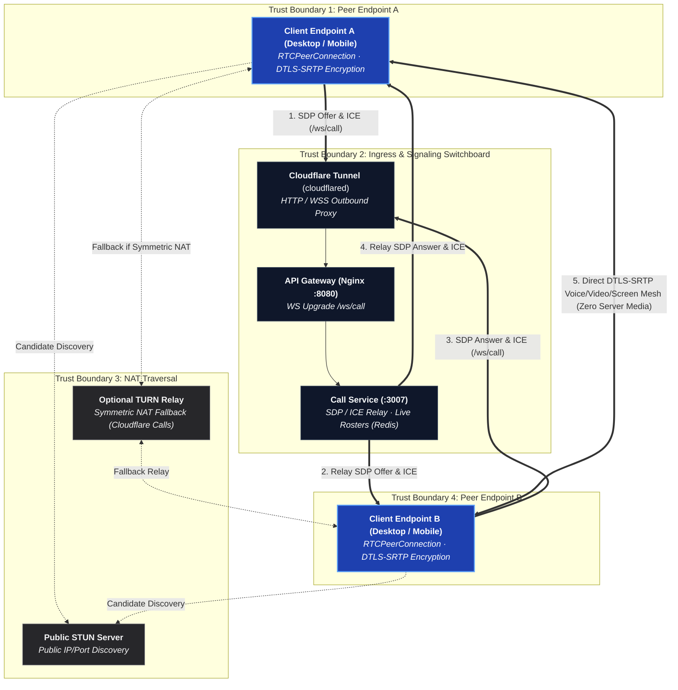

# Peer-to-Peer Media

There is no media server. Every participant in a call holds one
`RTCPeerConnection` per other participant — a full mesh — and voice, video
and screen share travel directly between machines over DTLS-SRTP.

## High-Level WebRTC Runtime Topology



---

### Archify WebRTC Component Cards

#### 1. Peer Endpoints (`apps/desktop`, `apps/android`, `apps/web`)
- **Role**: Capture, encode (Opus for audio, VP8/H.264 for video), and encrypt raw media using DTLS-SRTP.
- **Trust Boundary**: `TB-1 / TB-4 (Client Origin)`.
- **Security Invariant**: Each peer signs its DTLS fingerprint with the channel symmetric key. Unsigned or mismatched fingerprints are dropped immediately to prevent server MITM attacks.

#### 2. Call Signaling Switchboard (`apps/services/call-service`)
- **Role**: Pure signaling switchboard over WebSocket (`/ws/call`). Dispatches SDP offer/answers, exchanges ICE candidates, and maintains live voice channel participant rosters in Redis.
- **Trust Boundary**: `TB-2 (Internal Application Mesh)`.
- **Security Invariant**: **Zero Media Proxying**. Never inspects, processes, or proxies media RTP packets.

#### 3. NAT Traversal Infrastructure (STUN & TURN)
- **Role**: Discovers public-facing reflexive ICE candidates (STUN) and provides symmetric NAT fallback relays (TURN).
- **Trust Boundary**: `TB-3 (External Services)`.
- **Security Invariant**: Outbound-only connectivity. `call-service` issues short-lived HMAC-SHA256 authenticated credentials on demand.

Music is the exception that proves the rule: **Listen Together does not use any
of this.** Rather than streaming audio to everybody, the call agrees on a queue
and a timestamp and every client plays the track itself. See
[Listen Together](/architecture/listen-together).

## Why: the tunnel can't carry it

Cloudflare Tunnel carries HTTP and WebSocket. It does **not** carry UDP, and
WebRTC media is UDP. A media server behind the tunnel needs a second public
address, an open UDP port, or a forced relay — every one of those is a thing
that breaks in a way the operator can't reproduce locally. Peer-to-peer media
sidesteps the problem entirely: media never goes near the tunnel.

```text
Signalling:  Client → Cloudflare → Tunnel → Nginx → call-service   (WebSocket)
Media:       Client <===================================> Client  (WebRTC, direct)
```

## What a mesh costs

| Participants | Video | Voice only |
| --- | --- | --- |
| 2–5 | Comfortable | Comfortable |
| 6–8 | Degrades; expect to drop video | Comfortable |
| 9+ | Not supported | Marginal |

This is the accepted ceiling, not an oversight. A call that needs to be
bigger wants an SFU, and adding one is a deliberate future decision, not
something that comes back by drift. This design replaced an earlier LiveKit
SFU (phase 24 in `development/PLANNING.md`) after four commits of fighting
the tunnel to make an SFU's address reachable — removing the SFU turned out
to be the fix, not another workaround.

## NAT traversal

- **STUN is required.** A peer learns its own public address before it can
  offer one. It is not a relay — nothing but address discovery goes through
  it, and no port has to be opened for it.
- **TURN is optional, off by default.** Symmetric NAT and carrier-grade NAT
  pairs cannot form a direct path at all; TURN is the relay that fixes those.
  Configuring one is the operator's choice — Cloudflare's own TURN service is
  a natural fit since it's outbound-only and `call-service` mints short-lived
  credentials per call.
- **No port forwarding, ever.** Both peers dial out.

## End-to-end encryption, for free

DTLS-SRTP between two directly-connected peers already *is* end-to-end
encrypted — there's no SFU hop that needs to read the frames. The remaining
risk is `call-service` swapping a DTLS fingerprint to sit in the middle, so
each peer signs its fingerprint with the channel key (which `call-service`
never holds), and the other side refuses a connection whose fingerprint
isn't signed. Full design: [`E2EE.md`](/security/e2ee).

## Live streaming: deliberately out of scope

One-to-many streaming needs a media server — a broadcast to 50 viewers is 50
uplinks from a mesh streamer, which doesn't work. It returns only when, and
only when, a media server exists to carry it.

## Rules

- Never proxy media through NestJS, Nginx, or the tunnel.
- Never run a media server or an SFU.
- Never require an inbound port for media.
- Never hand a client an address only the server can reach — peers exchange
  ICE candidates and work it out themselves.
