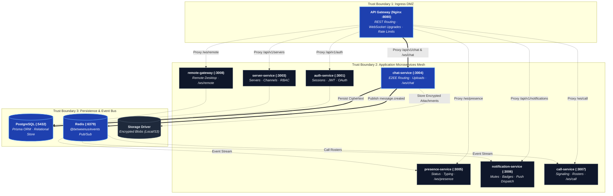

# Microservices

Every service is NestJS + TypeScript, has its own `package.json`, its own
`Dockerfile` target, and a clear responsibility. None of them share a
database connection string in the deployed target shape; the MVP shares one
Postgres schema (see [Database](/database/schema)) as a documented,
temporary shortcut.

## Microservices Topology & Inter-Service Event Mesh

## API Gateway

Nginx or Traefik. Routing, WebSocket upgrade, rate limiting, load balancing,
request-size limits. No business logic ever lands here — see
[Ingress](/system-design/ingress) for the actual `nginx.conf` shape.

## Auth Service

Registration, login, logout, JWT access tokens, refresh-token rotation,
OAuth (Google/GitHub), session management, password management, account
verification. Full flow: [Auth & Permissions](/system-design/auth-and-permissions).

## User Service

User profiles, avatars, settings, devices, friend relationships, user status.

## Server Service

Servers (Discord-style "guilds"), members, roles, permissions, channel
management, invitations, server settings. Owns the effective-permission
resolver (`roleDefaults ∪ customRoles ∪ granted \ denied`) that chat, call
and presence all call into via `@betweenus/database`.

## Chat Service

Text channels, direct messages, messages, editing, deletion (tombstones),
replies, reactions, attachments, message history. Realtime fanout over
WebSocket (`/ws/chat`), Redis Pub/Sub between instances.

## Presence Service

Online / offline / idle status, typing indicators, activity status. All
state lives in Redis — presence-service holds nothing durable. `/ws/presence`.

## Notification Service

Raises **no** notifications itself — the desktop client already receives
every message over `/ws/chat` and is the only thing that knows what's on
screen. What it owns is the state that has to outlive the client: mutes,
quiet hours, read markers, and (phase 27) minting the data-only FCM push
that tells a backgrounded device something happened.

## Call Service

Call signalling only (`/ws/call`): who may join which call, the roster of
peers, relaying offers/answers/ICE candidates, handing out ICE server
config. **Call Service never sees media** — it is a switchboard, not an SFU.
See [Peer-to-Peer Media](/architecture/media).

## Remote Gateway

Session handshake, offer/answer/ICE relay for the remote-desktop peer
connection, mouse/keyboard/clipboard event relay, permission enforcement,
audit trail. Never carries the screen itself. See
[Remote Desktop](/architecture/remote-desktop).

## Remote Agent

A scaffold for a headless agent. In practice the desktop app *is* the agent
on a machine somebody uses — it already has `desktopCapturer`, a WebRTC
publisher and `safeStorage` for the enrollment credential, so a second
process duplicating that would be scaffolding for its own sake.

## Rules every service follows

- Controllers are thin; services hold business logic; repositories handle
  persistence.
- No service reaches into another service's database directly — they call
  APIs, or publish/subscribe to events (see [Events](/system-design/events)).
- Every service exposes `/health`, and it says nothing sensitive.
- TypeScript strict mode; no `any`; typed DTOs and typed events.
