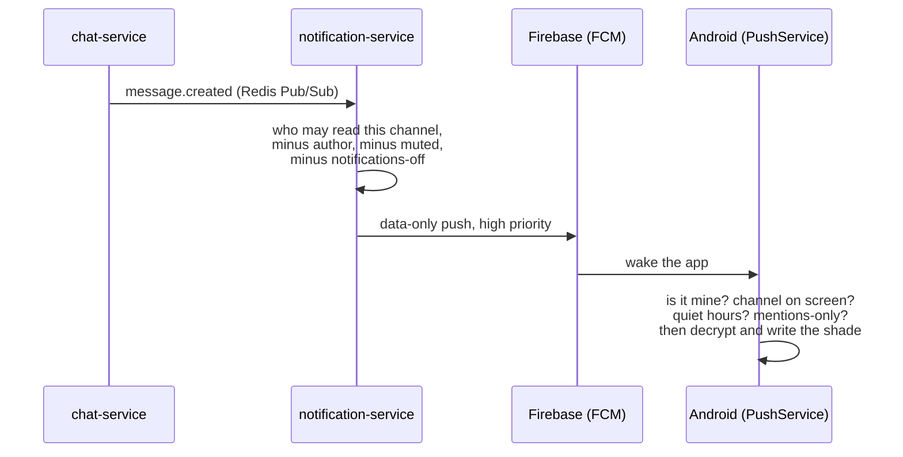

# Notifications

`notification-service` raises **no** notifications itself. A running client
already receives every message over `/ws/chat` and is the only thing that
knows what's on screen; the service owns the state that has to outlive the
client — mutes, quiet hours, read markers — and, for a backgrounded phone,
a data-only push that wakes the app rather than announcing anything.

## Why a push exists at all

Every client already gets messages over its socket while it's running: a
desktop app has the tray, a browser tab has the Notifications API. The one
client that can't be reached this way is a phone with the app swiped away
or the process stopped by the OS — that's the entire reason FCM is here.
It's not a second delivery path for messages; the message already sits in
Postgres and comes down the socket the instant the app runs again. The push
is a knock on the door.

## The push carries no words

The payload is **data-only** — no `notification` block, so Android never
draws anything by itself. That's forced, not a style choice:

1. **The body is sealed.** A message is encrypted with the channel key
   before it leaves the sender. `notification-service` stores and forwards
   ciphertext; it couldn't write "Ada: see you at six" even if it wanted to.
2. **The server doesn't know what's on screen.** Whether a conversation is
   open right now is a fact that exists only on the device. A push Android
   draws on its own would fire while someone is reading the very message it
   announces.

So the push wakes the app, and the app writes the notification — the same
shape WhatsApp uses, for the same reason.

## The split of decisions

| Decision | Where | Why there |
| --- | --- | --- |
| Notifications turned off | Server | On the account; saves waking the phone at all |
| Muted channel / muted person | Server | Both are on the envelope the server can see |
| My own message | Client | Cheap, and the id is right there |
| Channel already on screen *here* | Client | Cheapest where the screen actually is |
| Channel on screen on *another* device | Server | Only the server sees every device — see below |
| Quiet hours | Client | Minutes on *this* device's clock; the server never learns a timezone |
| Mentions-only | Client | The mention is inside the ciphertext |

Rule of thumb: if answering it needs the plaintext, it's a client decision
and the push still goes out. If it needs to know about a device that isn't
this one, only the server can answer it.

## Not waking a phone for a message already being read

> A `message.created` push is not sent to **any** of an account's devices
> while **any** of that account's windows has that exact channel open and
> focused.

- **Exact channel** — reading `#general` on server A silences nothing on
  server B.
- **Any window silences all devices** — the rule is per account, not per
  device; a laptop open on the channel is why the phone stays quiet.
- **`message.created` only** — `message.deleted` removes a notification
  that's become a lie, so suppressing *that* would leave the lie standing.
- **Mentions are not an exception** — no service has ever seen the word
  `@you`; deciding server-side would mean waking the phone for every
  message and letting the client decide anyway, which throws away the
  whole saving.

"Focused" is `document.hasFocus() && !document.hidden` plus the active
channel id on desktop/web, and `AppForeground.visible` plus
`Conversation.visibleChannelId` on Android. A phone locked mid-conversation
still counts as reading it — its chat screen is composed behind the lock
screen, which is exactly the case that would otherwise go silent forever.
Full design: [`push-suppression.md`](https://github.com/aiyu-ayaan/BetweenUs/blob/master/push-suppression.md).

## Unread counts are derived, not stored

One `ChannelRead` row per `(user, channel)` holding `lastReadAt`; the
unread count is messages after it that someone else wrote, computed on
read rather than incremented on write. A stored counter drifts the first
time some path forgets to decrement it — a marker can't drift, and it
naturally answers "unread since when" for an account that's been offline a
week. See [Database Schema](/database/schema#notifications--devices).

## What each client does with a wake-up

- **Desktop (Electron)**: the main process raises the OS notification and
  flashes the taskbar; the renderer is what decides *whether* to, since
  only it knows if the window is focused on that channel. Closing the
  window hides it rather than quitting — the tray keeps the socket alive,
  which is what makes a closed-but-not-quit app still reachable at all.
- **Web, tab open**: the Notifications API, permission requested at the
  first notification worth raising rather than at sign-in (a prompt on the
  way in is the one people refuse). Unread count goes in the tab title —
  the only badge a tab owns.
- **Web, tab closed**: a service worker and Web Push — see below.
- **Android**: `PushService` receives the data-only FCM message,
  `PushGate` applies the client-side half of the suppression rule, then
  `MessageNotifications` decrypts and posts. A direct call rings even with
  the app fully killed via a `CallStyle` notification with a full-screen
  intent (`SocialNotifications`) — see [Android Client](/architecture/android-client).

## Web Push: what is left when the tab is closed

A browser tab is unreachable the moment it is closed, which is the gap a
service worker fills and the only reason one exists in this repo. There is no
offline caching and no `fetch` handler: a cached shell of an end-to-end
encrypted app that cannot reach its server is a login screen that does not
work, which is worse than the browser's own offline page.

**No Firebase in this path.** `PushManager.subscribe` is a browser API and
VAPID is the standard that lets a deployment identify itself to whichever push
service that browser uses. A deployment can configure Firebase, VAPID, both or
neither; each combination decides which kinds of client stay reachable when
they are not running, and none of them is broken. The subscription registers
into the same `device_tokens` registry a phone's FCM token does, under
`platform: 'web'`, keyed on the same client-minted device id the key directory
uses.

The subscription is stored in the column an FCM token lives in. That column
means "how to reach this installation", and for a browser the answer is four
fields rather than one, so it travels as JSON — which is a smaller thing than
two more nullable columns that only ever apply to one platform.

### The worker cannot read the words

A message body is sealed with the channel key. That key is unwrapped with the
account's identity key, which lives in the page, and the wrapped copies are
behind an authenticated API call. None of that is reachable from a service
worker, and building it there would put a second copy of the key ladder in a
context the user cannot see.

So a message notification drawn by the worker says **"Ayaan · Sent a
message"** and not what was said. Opening it hands over to the app, which has
the keys. Everything carrying no sealed content — a friend request, being added
to a server, who is in a call, a remote session starting — is shown in full,
because there is nothing to hide.

This is a real difference from Android, where the app itself is woken and
decrypts in a cold process. It is the price of the browser's sandbox, not an
oversight.

### An open tab wins

If any client is already running, the push is handed to it over `postMessage`
and the worker draws nothing. That client can decrypt, and it knows what is on
screen. The worker only draws when nobody is there to do it better.

### Tap-through

Opening a notification focuses a running tab and tells it where to go; with
nothing running it opens one with the destination in the query string, which is
the only channel a page that does not exist yet can be told anything on. Both
paths end in the same function in the client, so a route cannot work one way and
not the other. A destination that no longer exists leaves the app where it is
rather than failing — the person tapped a notification and deserves a running
app either way.

A call notification opens the channel; **joining is still a decision somebody
makes on screen**, not one a tap makes for them.

### Dead subscriptions

`404` and `410` from a push service mean the subscription is gone — site data
cleared, permission revoked, the browser expired it — and the row is dropped,
because keeping it is a failed request per message forever. Anything else (a
`429`, a `500`, a timeout) is the push service having a moment, and dropping a
working subscription over one is how somebody silently stops getting
notifications.

## Configuration

`notification-service` reads Firebase's service-account credentials from
the **environment only** — never a file, since a JSON private key checked
into the repo once is a private key in the history forever.
`pnpm firebase:env ./serviceAccountKey.json --write` turns a downloaded key
into the three env vars and the file can be deleted. Full setup and the
wire format of a push: [`FCM/README.md`](https://github.com/aiyu-ayaan/BetweenUs/blob/master/FCM/README.md)
and [`FCM/PAYLOADS.md`](https://github.com/aiyu-ayaan/BetweenUs/blob/master/FCM/PAYLOADS.md).

Web Push needs a VAPID key pair instead, and nothing else — mint one with
`npx web-push generate-vapid-keys` and set `VAPID_PUBLIC_KEY`,
`VAPID_PRIVATE_KEY` and `VAPID_SUBJECT`. `GET /api/v1/notifications/devices/key`
hands browsers the public half; it answers `null` on a deployment that has
configured none, which is what stops the client prompting for a permission it
could not use. Changing the pair invalidates every subscription already issued:
those browsers re-subscribe on their next sign-in and are unreachable until
then.

See also [notification-service](/services/notification-service) for its
REST surface.
