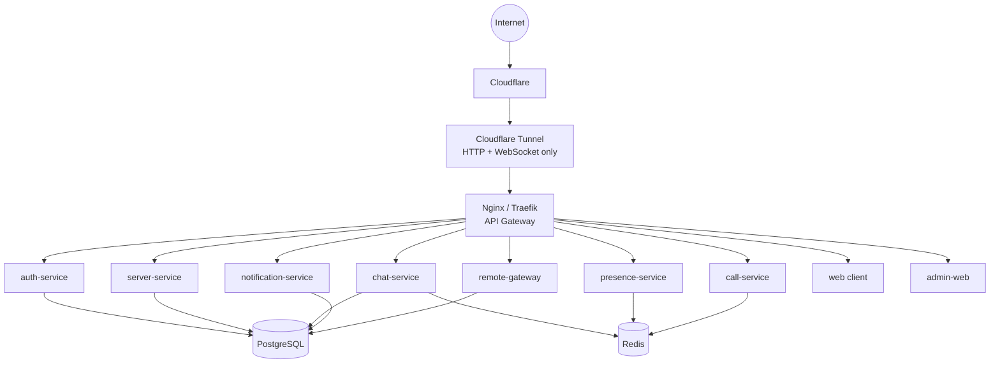

# Architecture Overview

BetweenUs is a monorepo: independently deployable NestJS microservices behind
one gateway, a peer-to-peer media layer that never touches the backend, and a
desktop-first client whose UI is reused unchanged by the web client.



## Why the pieces are shaped this way

- **The gateway has no business logic.** Nginx (or Traefik) only routes,
  rate-limits and enforces request-size limits. Every decision about who may
  do what lives in a service.
- **Each service owns its data.** No service reaches into another service's
  tables directly; they call each other's APIs or go through events.
- **Media never enters the backend.** Voice, video and screen share travel
  directly between the two participants' machines over WebRTC. See
  [Peer-to-Peer Media](/architecture/media).
- **Remote desktop is isolated.** Its own service (`remote-gateway`), its own
  permission vocabulary, its own Docker network, and an audit trail nothing in
  the application ever updates or deletes. See
  [Remote Desktop](/architecture/remote-desktop).
- **Public ingress is a tunnel, not an open port.** Cloudflare Tunnel carries
  HTTP and WebSocket outbound from the server; nothing listens for an inbound
  connection anywhere in the stack. See
  [Ingress and the Cloudflare Tunnel](/system-design/ingress).

## Clients, one backend

| Client | Stack | Status |
| --- | --- | --- |
| Desktop | Electron + React + TypeScript + Tailwind + Zustand | Primary, shipping |
| Web | Same React UI (`apps/desktop/src/App`) mounted by a Vite bundle, served at `/` by the gateway | Shipping |
| Admin panel | Separate React app, served at `/admin` | Shipping |
| Android | Kotlin, Jetpack Compose | In progress |

The web client is not a second codebase — `apps/web` imports the desktop
app's entry point directly. Anything the browser cannot do (screen capture by
source, synthetic input, the OS keychain) is decided at runtime by asking
whether the Electron preload bridge exists, not by a build flag.

## Repository layout

```text
apps/
  desktop/            Electron + React client
  web/                 Vite wrapper around the same React UI
  admin/                Admin panel (React)
  android/               Kotlin/Compose client
  services/
    api-gateway/          (routing config, no app code)
    auth-service/
    user-service/
    server-service/
    chat-service/
    presence-service/
    notification-service/
    call-service/
    remote-gateway/
    remote-agent/          (scaffold; the desktop app is the real agent)

packages/
  shared-types/  auth/  permissions/  database/  events/  websocket/
  logger/  config/  storage/  nest-common/

infrastructure/
  docker/     docker-compose.yml, docker-compose.dev.yml, Dockerfile
  nginx/      nginx.conf
  cloudflare/ tunnel.yml
```

Continue to [Microservices](/architecture/microservices) for what each
service owns, or [Peer-to-Peer Media](/architecture/media) for why there is
no media server.
