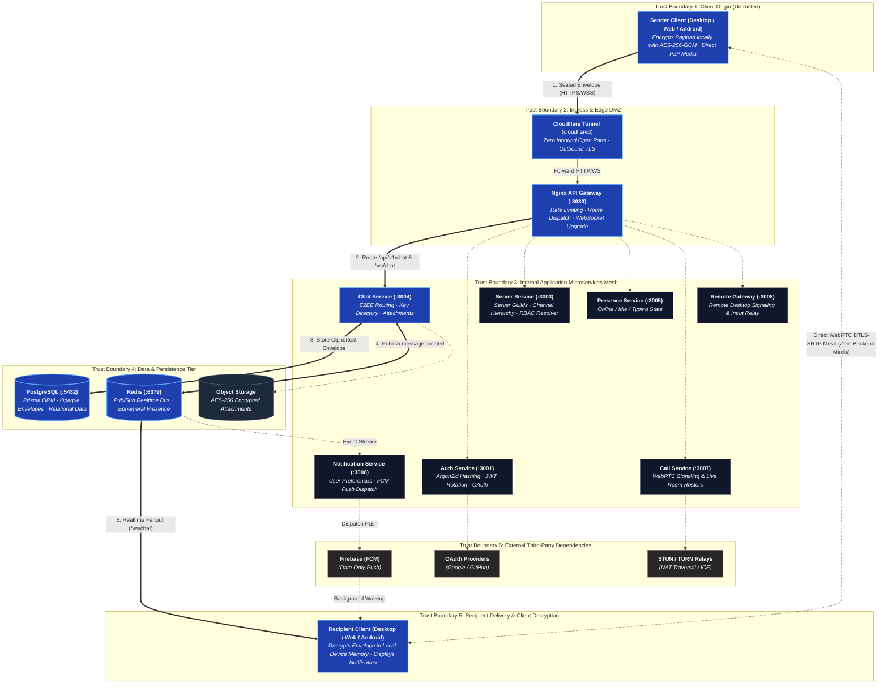

# Architecture Overview

BetweenUs is architected as an independently deployable NestJS microservices mesh behind an edge reverse tunnel and API gateway, a zero-knowledge peer-to-peer WebRTC media mesh that never touches backend servers, and multi-platform clients (Desktop, Web, Android) sharing unified domain logic and end-to-end cryptographic contracts.

---

## High-Level Runtime Architecture

The runtime architecture below highlights the **core system components (8–12)**, **strict trust boundaries**, **external third-party dependencies**, and the **primary message flow path** across the system. Supporting operational details and invariants are organized in component cards below rather than overburdening the diagram with cross-cutting edges.



---

## The Primary Runtime Path

The bold numbered path above tracks **End-to-End Encrypted Message Ingestion, Persistence & Realtime Fanout**:

1. **Client Seal & Transport**: The sender client derives the shared secret via ECDH P-256, encrypts the payload with AES-256-GCM, and sends the opaque ciphertext envelope over HTTPS/WSS.
2. **Edge Ingress**: Cloudflare Tunnel securely forwards the request to the internal Nginx API Gateway.
3. **Gateway Dispatch & Auth Guard**: Nginx verifies rate limits, normalizes client IP, and proxies the payload to `chat-service`. The service's `JwtAuthGuard` cryptographically verifies the token signature locally.
4. **Ciphertext Storage**: `chat-service` executes `resolveChannelAccess()` and persists the unreadable ciphertext envelope to PostgreSQL via Prisma ORM.
5. **Event Bus Broadcast**: `chat-service` publishes a typed `message.created` event payload onto the Redis Pub/Sub cluster.
6. **Realtime WebSocket Fanout**: Active WebSocket gateways receive the event and push the ciphertext to connected recipient clients.
7. **Client Decryption**: The recipient client decrypts the envelope in local device memory using its private key. If the client is offline/backgrounded, `notification-service` dispatches a data-only wakeup push through FCM.

---

## Archify Component Detail Cards

Supporting details, network ports, invariants, and trust boundaries are codified in the structural component cards below:

### 1. Unified Client Suite (`apps/desktop`, `apps/web`, `apps/android`)
- **Role**: Primary user interface across Desktop (Electron/React), Web (Vite), and Mobile (Android Jetpack Compose).
- **Trust Boundary**: `TB-1 (Untrusted Client Origin)`.
- **Key Invariants**: Performs client-side encryption/decryption (AES-256-GCM); private keys never leave local device storage (`safeStorage` / Android KeyStore). Maintains direct WebRTC peer connections.
- **Protocols**: HTTPS / WSS (Control & Signaling), UDP DTLS-SRTP (P2P Media).

### 2. Cloudflare Tunnel (`infrastructure/cloudflare`)
- **Role**: Edge ingress terminator establishing outbound-only secure tunnels to Cloudflare Edge.
- **Trust Boundary**: `TB-2 (Ingress DMZ)`.
- **Key Invariants**: Zero public inbound ports opened on host firewalls. Only HTTP and WebSocket traffic is accepted. UDP media traffic is strictly kept on direct client-to-client P2P paths.
- **Protocols**: Outbound QUIC/TLS tunnel to Cloudflare Edge; HTTP/1.1 proxy to Nginx.

### 3. Nginx API Gateway (`apps/services/api-gateway`)
- **Role**: Central reverse proxy, connection router, rate limiter, and WebSocket upgrade handler.
- **Trust Boundary**: `TB-2 (Ingress DMZ)`.
- **Key Invariants**: Completely stateless; contains **no business logic**. Normalizes `x-real-ip`, injects `x-request-id`, enforces request payload caps (10MB default, 50MB attachments), and enforces rate-limiting tiers.
- **Port**: `8080` (Internal).

### 4. Auth Service (`apps/services/auth-service`)
- **Role**: User authentication, account lifecycle, JWT issuance, and OAuth delegation.
- **Trust Boundary**: `TB-3 (Internal Application Cluster)`.
- **Key Invariants**: Passwords hashed with Argon2id. Issues 15-minute HS256 access tokens and cryptographically rotating refresh tokens with automated reuse/theft detection.
- **Port**: `3001`.

### 5. Server & Permissions Service (`apps/services/server-service`)
- **Role**: Server management, channel provisioning, role hierarchy, and permission resolution.
- **Trust Boundary**: `TB-3 (Internal Application Cluster)`.
- **Key Invariants**: Authoritative owner of the effective-permission arithmetic (`roleDefaults ∪ customRoles ∪ granted \ denied`). Exposes centralized authorization helpers (`resolveChannelAccess`, `resolveRemoteAccess`) consumed across all domain services.
- **Port**: `3003`.

### 6. Chat & Storage Service (`apps/services/chat-service`)
- **Role**: E2EE message routing, channel message history, E2EE key directory, and encrypted file uploads.
- **Trust Boundary**: `TB-3 (Internal Application Cluster)`.
- **Key Invariants**: Never receives, stores, or logs plaintext message bodies or attachment encryption keys. All payloads are opaque ciphertext blobs.
- **Port**: `3004` (REST + `/ws/chat`).

### 7. Presence Service (`apps/services/presence-service`)
- **Role**: Ephemeral user state engine (online/offline status, idle state, typing indicators, custom activities).
- **Trust Boundary**: `TB-3 (Internal Application Cluster)`.
- **Key Invariants**: Entirely backed by Redis key TTLs. Holds no persistent state in PostgreSQL.
- **Port**: `3005` (`/ws/presence`).

### 8. Notification Service (`apps/services/notification-service`)
- **Role**: User notification preferences, mute hierarchies, quiet hours, unread counters, and FCM push dispatch.
- **Trust Boundary**: `TB-3 (Internal Application Cluster)`.
- **Key Invariants**: Never formats or renders message previews on the server. Sends data-only push payloads so the receiving client decrypts and displays notifications locally.
- **Port**: `3006`.

### 9. Call Service (`apps/services/call-service`)
- **Role**: WebRTC signaling switchboard, room roster management, interactive activities, and YouTube listen-together clock synchronization.
- **Trust Boundary**: `TB-3 (Internal Application Cluster)`.
- **Key Invariants**: **Never receives or proxies media streams**. Handles only SDP offer/answer exchange, ICE candidates, and room state.
- **Port**: `3007` (`/ws/call`).

### 10. Remote Gateway (`apps/services/remote-gateway`)
- **Role**: Outbound remote desktop agent signaling, session handshake, input event relay, and append-only audit trail logging.
- **Trust Boundary**: `TB-3 (Internal Application Cluster)`.
- **Key Invariants**: Remote agents dial outbound; no inbound remote ports (e.g. 3389) are ever opened. Audit records are strictly append-only (immutable).
- **Port**: `3008` (`/ws/remote`).

### 11. PostgreSQL Database (`packages/database`)
- **Role**: Relational persistence store managed via Prisma ORM schemas.
- **Trust Boundary**: `TB-4 (Data Persistence Tier)`.
- **Key Invariants**: Stores user profiles, server schemas, permissions, device key bundles, encrypted message envelopes, and audit logs. Never accessible from public ingress.
- **Port**: `5432` (Private Docker Network).

### 12. Redis Realtime Engine (`packages/events`)
- **Role**: In-memory message broker, distributed event bus, presence cache, and rate-limit counter.
- **Trust Boundary**: `TB-4 (Data Persistence Tier)`.
- **Key Invariants**: Handles horizontal Pub/Sub event broadcasting across multi-instance service clusters and WebSocket gateways.
- **Port**: `6379` (Private Docker Network).

---

## Trust Boundaries & Security Enclaves

| Trust Boundary | Scope & Members | Security Controls & Invariants |
| :--- | :--- | :--- |
| **TB-1: Client Endpoints** | Desktop, Web, Android applications | Untrusted origin; client-side cryptographic isolation; zero server access to private keys or plaintext data. |
| **TB-2: Ingress DMZ** | Cloudflare Tunnel, Nginx API Gateway | Outbound tunnel encapsulation; SSL termination; rate limiting; header sanitization (`x-real-ip`, `x-request-id`); payload size quotas. |
| **TB-3: Microservices Mesh** | NestJS Services (`auth`, `server`, `chat`, `presence`, `notif`, `call`, `remote-gw`) | Private Docker network; decentralized JWT signature validation; strict RBAC permission checks via `@betweenus/database`. |
| **TB-4: Data Tier** | PostgreSQL, Redis, Object Store | Network isolation; zero public interfaces; ciphertext-at-rest; hashed credentials (Argon2id, SHA-256 tokens). |
| **TB-5: External Services** | Google/GitHub OAuth, Firebase (FCM), STUN/TURN | Strict allowlist validation; PKCE verification; minimal metadata exposure (data-only push notifications). |
| **TB-6: Direct P2P Media** | Client-to-Client WebRTC Mesh | DTLS-SRTP encryption with HMAC-SHA256 fingerprint verification; completely bypasses server infrastructure. |

---

## Clients, One Backend

| Client | Stack | Status |
| --- | --- | --- |
| Desktop | Electron + React + TypeScript + Tailwind + Zustand | Primary, shipping |
| Web | Same React UI (`apps/desktop/src/App`) mounted by a Vite bundle, served at `/` by the gateway | Shipping |
| Admin panel | Separate React app, served at `/admin` | Shipping |
| [Android](/architecture/android-client) | Kotlin, Jetpack Compose | In progress |

The web client is not a second codebase — `apps/web` imports the desktop app's entry point directly. Anything the browser cannot do (screen capture by source, synthetic input, the OS keychain) is decided at runtime by asking whether the Electron preload bridge exists, not by a build flag.

---

## Repository Layout

```text
apps/
  desktop/            Electron + React client (shared UI root)
  web/                Vite wrapper mounting desktop UI
  admin/              Admin management dashboard
  android/            Native Kotlin / Jetpack Compose mobile client
  services/
    api-gateway/      Nginx reverse proxy & rate limiting configuration
    auth-service/     Authentication, JWT rotation, and OAuth
    user-service/     Profiles, relationships, and user settings
    server-service/   Guilds, channels, and RBAC permission resolver
    chat-service/     E2EE messaging, uploads, and /ws/chat gateway
    presence-service/ Realtime status, typing, and /ws/presence gateway
    notification-service/ Mutes, read markers, and FCM push dispatch
    call-service/     WebRTC signaling, activities, and /ws/call gateway
    remote-gateway/   Remote desktop signaling, input relay, and audit trail

packages/
  shared-types/       Cross-stack TypeScript definitions and DTOs
  auth/               JWT utilities, cryptographic verifiers, and auth guards
  permissions/        Granular permission flags and bitmask arithmetic
  database/           Prisma schema, migrations, and centralized access resolvers
  events/             Redis Pub/Sub event schemas and typed emitter/listener
  websocket/          WebSocket authentication, room state, and heartbeat guards
  logger/             Structured JSON logger with automatic credential redaction
  config/             Typed environment configuration validation (Zod)
  storage/            Multipart attachment and asset storage driver
  nest-common/        Standardized exception filters, interceptors, and pipes

infrastructure/
  docker/             docker-compose.yml, docker-compose.dev.yml, Dockerfiles
  nginx/              nginx.conf, upstream routing tables, and security headers
  cloudflare/         tunnel.yml configuration
```

---

## Related Documentation

- [Microservices Architecture](/architecture/microservices) — Detailed responsibilities and data models per service
- [Peer-to-Peer Media Architecture](/architecture/media) — WebRTC mesh topology and DTLS-SRTP security
- [End-to-End Encryption Specification](/security/e2ee) — Cryptographic key exchange and envelope structure
- [Ingress & API Gateway Design](/system-design/ingress) — Cloudflare Tunnel and Nginx configuration
- [Authentication & Permissions](/system-design/auth-and-permissions) — RBAC model and token lifecycle

