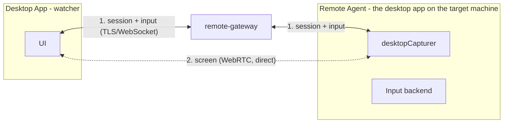

# Remote Desktop

The most dangerous capability the platform has, so it's the most isolated:
its own service (`remote-gateway`), its own permission vocabulary that no
server role grants, its own Docker network, and an audit trail nothing in
the application ever updates or deletes.

## Components

| Component | Runs on | Responsibility |
| --- | --- | --- |
| Remote Gateway | Server | Session handshake, SDP/ICE relay, input event relay, clipboard relay, permission checks, audit trail |
| Remote Agent | Target machine | Screen capture, mouse/keyboard input, clipboard, file transfer, audio, connection state, device registration |
| Desktop Remote Client | Controller's machine | UI, viewer, input capture to send |

The agent is not a separate binary — it's the desktop app itself, running on
whichever machine is being controlled. `apps/services/remote-agent` stays a
scaffold for a future headless variant.

## The machine dials out

A machine enrolls under the account signed into it, gets a token back once,
stores it hashed on the server (`RemoteMachine.agentTokenHash`, SHA-256) and
sealed in the OS keychain locally (`safeStorage`), then connects outbound to
`/ws/remote`. Nothing ever connects *towards* a machine — no inbound port, no
port 3389 anywhere in the stack. A stolen token is revoked by enrolling
again, which rotates it.

## Permissions

Six granular permissions, assignable per user and per machine, with optional
expiry:

- `REMOTE_VIEW`
- `REMOTE_CONTROL`
- `REMOTE_FILE_TRANSFER`
- `REMOTE_CLIPBOARD`
- `REMOTE_AUDIO`
- `REMOTE_ADMIN`

`resolveRemoteAccess` is the single answer for "may this user do this to
this machine" — owning the machine, or an unexpired `RemoteGrant`, and
`null` for everything else. A machine somebody has no access to answers 404,
so machine ids aren't probeable. An expired grant keeps its row: "access
lapsed" is something an owner should be able to see, not something that gets
swept away.

**A session freezes what it was granted.** `RemoteSession.permissions` is
copied from the grant when the session opens, and the relay checks every
event against that frozen copy — so revoking a grant mid-session *ends* the
session rather than racing to narrow it. Refused events are audited too.

## Media

The agent publishes its screen and the controller subscribes, over the same
WebRTC path calls use — see [Peer-to-Peer Media](/architecture/media).
`remote-gateway` relays the offer/answer/ICE exchange over `/ws/remote`
(three more event types on a socket that already exists). Unlike a voice
channel this is **not** end-to-end encrypted: there's no channel key shared
between two machines that have never spoken, so whoever runs the deployment
can see the frames if they wanted to intercept signalling. `E2EE.md` records
this as a limit rather than leaving it implied.

## Consent

- **The owner reaching their own machine** starts immediately — that's the
  case remote access exists for.
- **Anyone else** raises a prompt on the target machine that refuses itself
  if nobody answers. A grant is permission to *ask*, not permission to
  start.

## Input injection (Windows)

Electron's `sendInputEvent` only reaches the app's own window, which is
useless for controlling the rest of the desktop. Native addons need a
rebuild per Electron version and a prebuilt binary per platform; spawning a
process per event is far too slow to drag a window with. Instead: one
long-lived PowerShell process P/Invokes `user32`, fed one short line per
event. Windows only today — macOS and Linux report unsupported and a
session there is view-only.

## Rules

- Never expose port 3389 to the internet.
- Remote Agent authenticates device identity; each machine gets a unique
  identity.
- Every remote session requires explicit authorization before screen
  viewing, control, file transfer, clipboard access, or admin actions.
- Remote sessions are auditable — see `RemoteAudit` in
  [Database Schema](/database/schema#remote-desktop).
