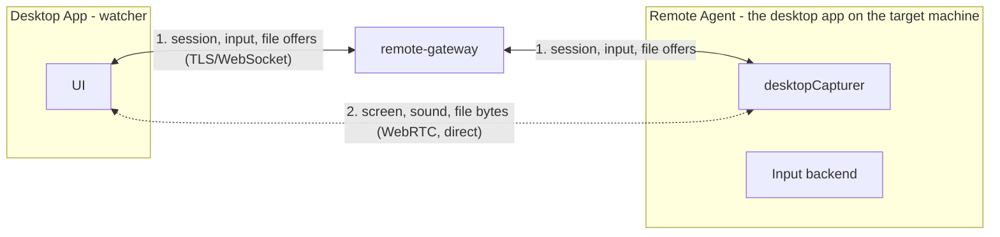

# Remote Desktop

The most dangerous capability the platform has, so it's the most isolated:
its own service (`remote-gateway`), its own permission vocabulary that no
server role grants, its own Docker network, and an audit trail nothing in
the application ever updates or deletes.

The split is the whole design: **what asks goes through the gateway, what is
big goes around it.** A permission the gateway never sees a message for is a
permission that does not exist, so every request is relayed and audited — and
the screen, the machine's sound and a file's bytes then travel directly
between the two machines, which is the only shape that survives a Cloudflare
Tunnel without opening a port.

## Components

| Component | Runs on | Responsibility |
| --- | --- | --- |
| Remote Gateway | Server | Session handshake, SDP/ICE relay, input event relay, clipboard relay, file offers, permission checks, audit trail. Never a screen, a sound or a byte of a file |
| Remote Agent | Target machine | Screen capture, loopback audio, mouse/keyboard input, clipboard, receiving files, connection state, device registration |
| Desktop Remote Client | Controller's machine | UI, viewer, input capture to send |

The agent is not a separate binary — it's the desktop app itself, running on
whichever machine is being controlled. `apps/services/remote-agent` stays a
scaffold for a future headless variant.

## The machine dials out

A machine enrolls under the account signed into it, gets a token back once,
stores it hashed on the server (`RemoteMachine.agentTokenHash`, SHA-256) and
sealed in the OS keychain locally (`safeStorage`), then connects outbound to
`/ws/remote`. Nothing ever connects *towards* a machine — no inbound port, no
port 3389 anywhere in the stack. A stolen token is revoked by enrolling
again, which rotates it.

## Permissions

Six granular permissions, assignable per user and per machine, with optional
expiry:

- `REMOTE_VIEW`
- `REMOTE_CONTROL`
- `REMOTE_FILE_TRANSFER`
- `REMOTE_CLIPBOARD`
- `REMOTE_AUDIO`
- `REMOTE_ADMIN`

`resolveRemoteAccess` is the single answer for "may this user do this to
this machine" — owning the machine, or an unexpired `RemoteGrant`, and
`null` for everything else. A machine somebody has no access to answers 404,
so machine ids aren't probeable. An expired grant keeps its row: "access
lapsed" is something an owner should be able to see, not something that gets
swept away.

**A session freezes what it was granted.** `RemoteSession.permissions` is
copied from the grant when the session opens, and the relay checks every
event against that frozen copy — so revoking a grant mid-session *ends* the
session rather than racing to narrow it. Refused events are audited too.

## The peer connection

One `RTCPeerConnection` per session carries three things, and they were three
separate features until it turned out they were one:

| What | Where it goes | Gated by |
| --- | --- | --- |
| The screen | A video track, agent → controller | `REMOTE_VIEW` (checked before the session exists) |
| The machine's own sound | An audio track, agent → controller | `REMOTE_AUDIO` |
| Files | A data channel, controller → agent | `REMOTE_FILE_TRANSFER` (on the offer, at the gateway) |

`remote-gateway` relays the offer/answer/ICE exchange over `/ws/remote` and
reads none of it — see [Peer-to-Peer Media](/architecture/media).

The audio transceiver and the data channel are **created for every session**,
whether or not it may use them. Neither can be added later without
renegotiating, and a renegotiation part way through a session is a black
screen on the controller's side for as long as it takes. Permission decides
what is *put* on them, not whether they exist.

Unlike a voice channel this is not end-to-end encrypted *in the sense a call
is*. The traffic is DTLS-SRTP directly between the two machines, so no server
holds a decodable frame — but the two machines share no secret the gateway has
never seen, so there is nothing to sign a fingerprint with, and an actively
malicious gateway could substitute one and sit in the middle. `E2EE.md`
records this as a limit rather than leaving it implied.

## Audio

`REMOTE_AUDIO` sends the machine's own output — what somebody sitting at it
would hear — not a microphone. It is asked for at the screen capture, because
that is the only place it can be asked for: Electron's loopback is a property
of the display capture and there is no separate device to open. That makes it
**Windows only** today; elsewhere the capture hands back no audio track and the
session is a silent one rather than a failed one.

The controller's picture stays muted and the sound plays from its own element,
so the two are independent. A session granted the permission starts listening:
the machine's owner agreed to it when they granted it, and a toggle that has to
be found before anything is heard is a feature nobody knows is there.

## File transfer

`REMOTE_FILE_TRANSFER` sends a file to the machine, by dropping it on the
screen or through the button in the session header. It lands in the machine's
downloads folder, never overwriting: `holiday.png`, then `holiday (2).png`.

The order is the point:

1. The controller sends `file.offer` — a name and a size — **over the gateway**,
   which checks the permission, refuses a size past 4 GB, and writes
   `file.offered` into the audit trail.
2. The machine answers `file.accepted` or `file.refused`.
3. Only then do the bytes go down the data channel, 64 KB at a time, directly
   between the two machines.
4. The machine writes `file.done` when the last byte reaches its disk, which is
   audited as `file.received`.

Sending first and asking afterwards would put a file on a machine whose
permission nothing had checked, which is why the offer is a gateway message and
the bytes are not.

**The wire carries bare bytes** — no frame header, no transfer id per chunk.
It can be that bare because the offer already told the receiver exactly how many
bytes to expect, so it counts rather than parses. The cost is that a session
sends **one file at a time**; a second offer while one is running is refused
rather than queued.

Three things are deliberate and worth naming:

- **A file one byte short never reports itself whole.** A truncated file that
  claims to be complete is the failure nobody notices until they open it.
- **A sender that goes past its declared size is cut off** and the partial file
  deleted, rather than written.
- **The name is cleaned twice** — in the renderer and again in the main process.
  It is the one part of a transfer that arrives as an instruction rather than as
  data: separators, `..`, drive letters and Windows device names are all ways of
  writing somewhere other than the folder that was chosen.

Nothing holds the whole file at either end. The sender walks it with
`File.slice`; the receiver streams each chunk to disk through the main process,
so four gigabytes costs 64 KB of memory rather than four gigabytes. The data
channel's send buffer is watched, so a slow link paces the sender instead of
growing a buffer inside the browser until the tab dies.

Pulling a file *back* from the machine is not implemented — that needs a remote
file browser, which is a different feature.

## Consent

- **The owner reaching their own machine** starts immediately — that's the
  case remote access exists for.
- **Anyone else** raises a prompt on the target machine that refuses itself
  if nobody answers. A grant is permission to *ask*, not permission to
  start.

## Input injection (Windows)

Electron's `sendInputEvent` only reaches the app's own window, which is
useless for controlling the rest of the desktop. Native addons need a
rebuild per Electron version and a prebuilt binary per platform; spawning a
process per event is far too slow to drag a window with. Instead: one
long-lived PowerShell process P/Invokes `user32`, fed one short line per
event. Windows only today — macOS and Linux report unsupported and a
session there is view-only.

## Rules

- Never expose port 3389 to the internet.
- Remote Agent authenticates device identity; each machine gets a unique
  identity.
- Every remote session requires explicit authorization before screen
  viewing, control, file transfer, clipboard access, or admin actions.
- Remote sessions are auditable — see `RemoteAudit` in
  [Database Schema](/database/schema#remote-desktop).
