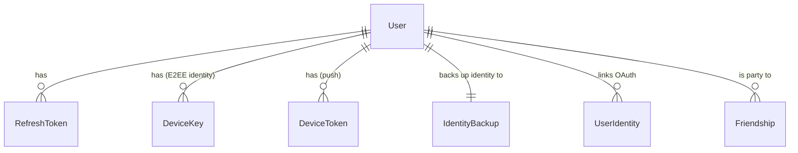
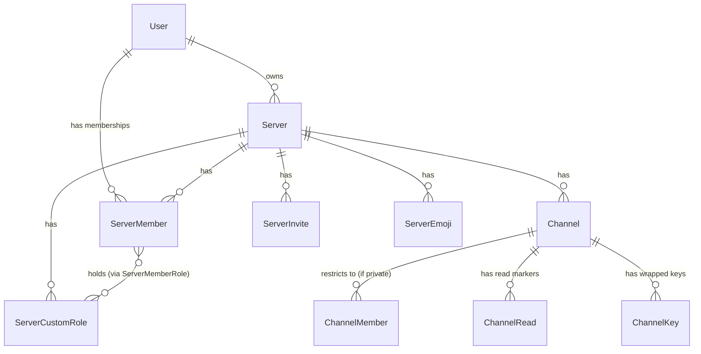
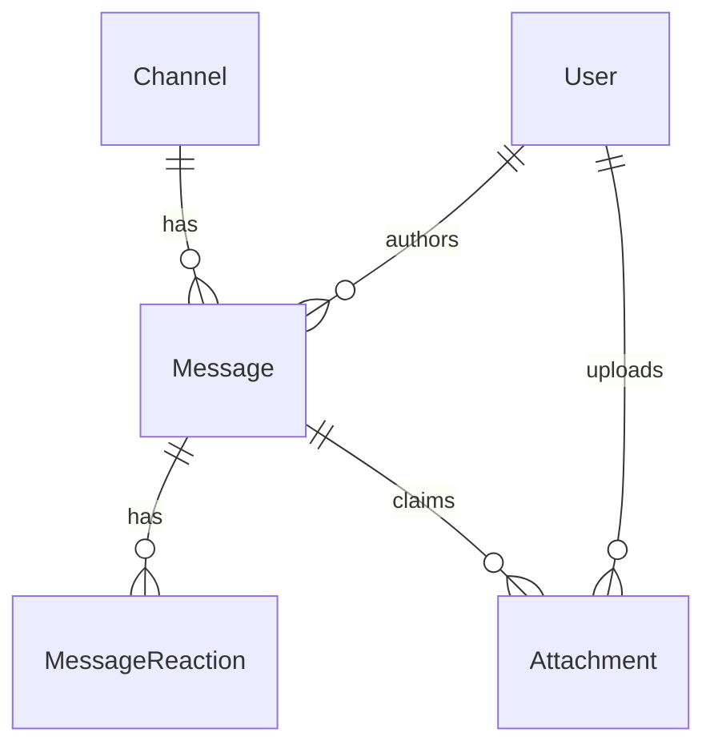
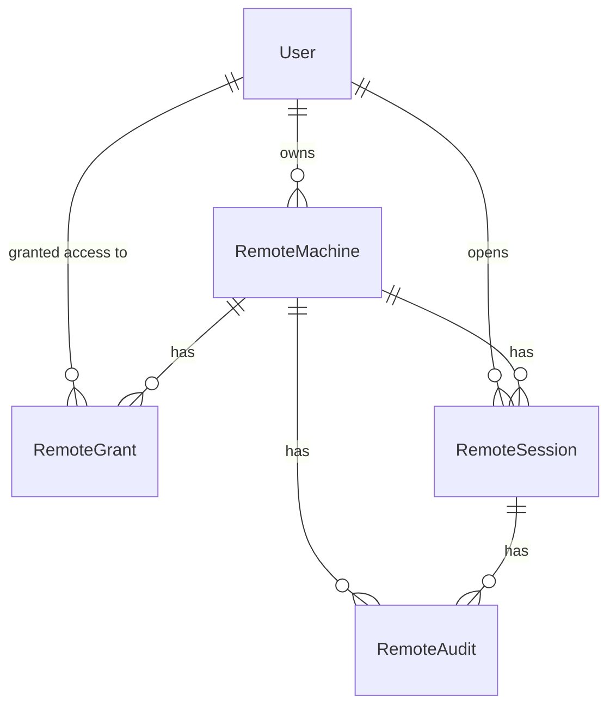

# Database Schema

Source of truth: [`packages/database/prisma/schema.prisma`](https://github.com/aiyu-ayaan/Nexora/blob/master/packages/database/prisma/schema.prisma).
One Prisma schema for the MVP, shared by auth-, server- and chat-service —
each service touches only the models it owns; splitting per service later is
a migration, not a rewrite, because every model is already accessed only by
its owning service's code paths.

## Entity relationship diagram

One diagram for all 20 models reads as a wall of boxes — every field zooms
to unreadable no matter how far you pan out. Split by domain instead, each
diagram placed next to the section it belongs to.

## Identity & auth

### `User`
The account. `passwordHash` is `'oauth-only'` for a provider-created account
that has never set a password — no hash can match that sentinel, which is
what makes a provider-only account correctly refuse password login rather
than silently accepting one. `role` (`GlobalRole`: `USER` / `ADMIN`) is
separate from any `ServerRole` — it grants the admin panel, not membership
rights inside any particular server. `disabledAt` keeps a disabled account's
data but blocks login and refresh.

### `RefreshToken`
`id` **is** the JWT `jti` — revoking a token is a delete by primary key.
`tokenHash` is stored, never the raw token. `revokedAt` marks reuse-detected
revocation.

### `UserIdentity`
One row per linked OAuth login (`provider` + `providerAccountId` unique
together) — the provider's own user id is what re-identifies the person on
the next login, since their email can change on the provider's side.

### `OAuthProvider`
Operator-configured provider credentials (Google/GitHub), one row per
provider name, `clientSecret` sealed with AES-256-GCM.

### `DeviceKey`
One row per **machine**, not per account — an ECDH P-256 public key (JWK).
The private half never leaves that machine. A device can be revoked
independently of the account's identity; a revoked row is kept (not
deleted) so the trust history stays auditable, but nothing new is ever
wrapped for it.

### `IdentityBackup`
The identity private key, sealed client-side (PBKDF2 over a password or
passphrase the server never sees) so signing in on a second machine or
reinstalling doesn't mean losing history. One per user; the server stores
opaque ciphertext it cannot open.

### `ChannelKey`
A channel's symmetric content key, wrapped once per `(recipient user,
recipient device)` pair using ECDH between the sender's device key and the
recipient's. The server stores only ciphertext (`wrappedKey`) it cannot
open. `epoch` increments when the channel's membership/key needs to rotate.

## Servers, roles, channels

### `Server`
A community — `slug` is the public, permanent join handle (superseded by
`ServerInvite` for anything revocable).

### `ServerMember`
One row per `(server, user)`. `role` is the fixed 5-rung hierarchy
(`OWNER`/`ADMIN`/`MODERATOR`/`MEMBER`/`GUEST`). `grantedPermissions` /
`deniedPermissions` are per-member overrides on top of the role — see
[Auth & Permissions](/system-design/auth-and-permissions) for the resolver.

### `ServerCustomRole` / `ServerMemberRole`
Named, coloured, ranked roles a server invents for itself, additive on top
of the fixed role hierarchy. A member can hold any number.

### `ServerInvite`
A revocable, expirable, use-capped code — deliberately not the server's
permanent `slug`, so a leaked invite can be shut off without renaming the
whole server.

### `Channel`
`serverId` is nullable — a `null` server id **is** a direct message.
`type` is `TEXT` / `VOICE` / `DM`. `isPrivate` + `ChannelMember` rows form an
allowlist; server membership grants nothing to a private channel, not even
to an administrator.

### `ChannelMember`
Rows are meaningful only when the channel is private — a public channel
ignores them, so making a channel private later needs no backfill.

### `ChannelRead`
One row per `(user, channel)`, `lastReadAt`. Unread counts are **derived**
from this on every read, never stored as a counter — a counter drifts the
first time some path forgets to decrement it; a marker can't drift.

### `Friendship`
One row per relationship, not one per direction — `userAId < userBId`
enforced by convention, `requesterId` says who sent it, `status` is
`PENDING`/`ACCEPTED`. Catches two people requesting each other at once via
the unique constraint on the ordered pair.

### `ServerEmoji`
A server's custom emoji. The picture is served unauthenticated (an ``
tag can't carry a header) — deliberately the one thing this deployment
serves in the clear, because an emoji is drawn a hundred times a screen and
has nothing secret about it.

## Messages & attachments

### `Message`
`content` is opaque to the server — a serialized `EncryptedEnvelope`
ciphertext, or plain text before E2EE existed. `deletedAt` + emptied
`content` is a soft-delete tombstone (the row stays so paging cursors that
point at it don't break); `deletedById` distinguishes "author took it back"
from "moderator removed it." `pinnedAt`/`pinnedById` are set independently.

### `MessageReaction`
`emoji` is stored **in the clear** — the one deliberate plaintext leak in
the whole schema, documented in [`E2EE.md`](/security/e2ee), because the
server has to group and count reactions for recipients who don't currently
hold the channel key.

### `Attachment`
Links a stored blob (`key`, the storage key) to the message that claims it.
Neither foreign key cascades on delete — both go `null` instead, and a
background sweeper collects blobs no message claims any more. This is the
one piece of metadata the server does learn about an attachment: how many
blobs, what size, belong to which message. The file's name, real type and
contents stay sealed inside the encrypted manifest.

## Notifications & devices

### `NotificationSetting`
One row per user, written on first change. `mutedChannelIds` /
`mentionOnlyChannelIds` / `mutedUserIds` are plain string arrays — small,
read whole, not worth a join table until a mute needs its own settings.
`quietStartMinute`/`quietEndMinute` are minutes-from-midnight on the
*client's* clock; the server never learns a timezone.

### `DeviceToken`
One row per `(user, deviceId)` for FCM push. `token` is separately unique,
because the same physical device can change accounts (sign out, sign in as
someone else) and must not keep pushing to the old owner.

## Remote desktop

### `RemoteMachine`
`agentTokenHash` is the enrolled agent's credential, hashed like a
password, shown once at enrollment. Rotated by re-enrolling.

### `RemoteGrant`
What one user may do to one machine — `permissions` is a subset of the six
`REMOTE_*` permissions, `expiresAt` nullable for open-ended access. Absence
of a row means **no access at all**; remote permissions are never implied by
a server role.

### `RemoteSession`
`permissions` is **copied** from the grant at session start and never
re-read — the session's authority is frozen, so revoking a grant mid-session
is a decision the gateway makes deliberately (ending the session) rather
than a race against event ordering.

### `RemoteAudit`
Append-only. Nothing in the application updates or deletes a row. Records
enrollment, renames, permission changes, session start/end, and refused
attempts.

### `AdminAudit`
Same append-only shape, for the admin panel: role changes, disable/enable,
deletion, OAuth provider config changes. `targetId` goes `null` when the
target account is deleted; `targetLabel` keeps what it was called at the
time, so the log still reads back after the account is gone.
