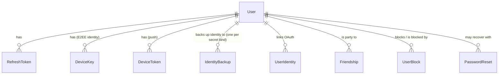
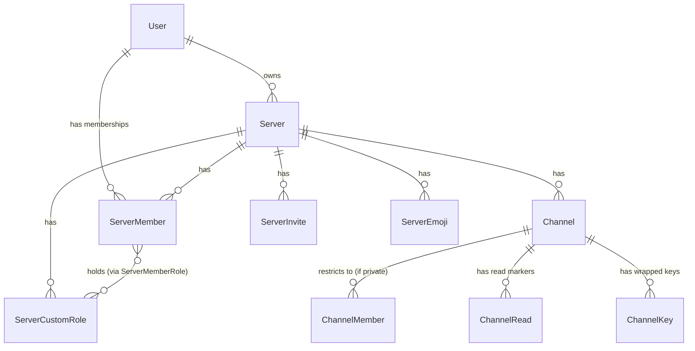
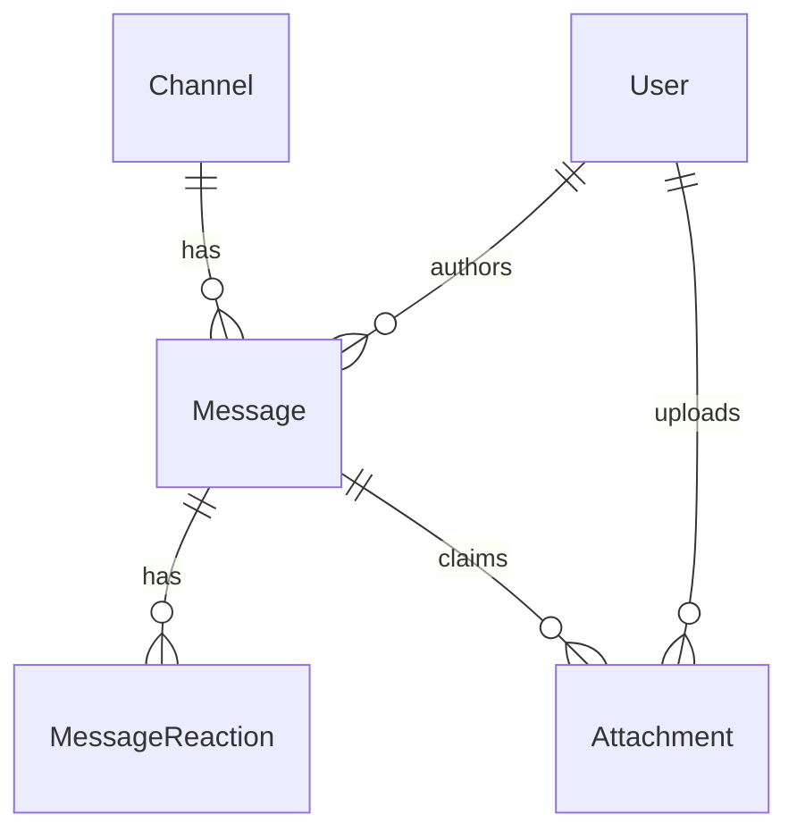
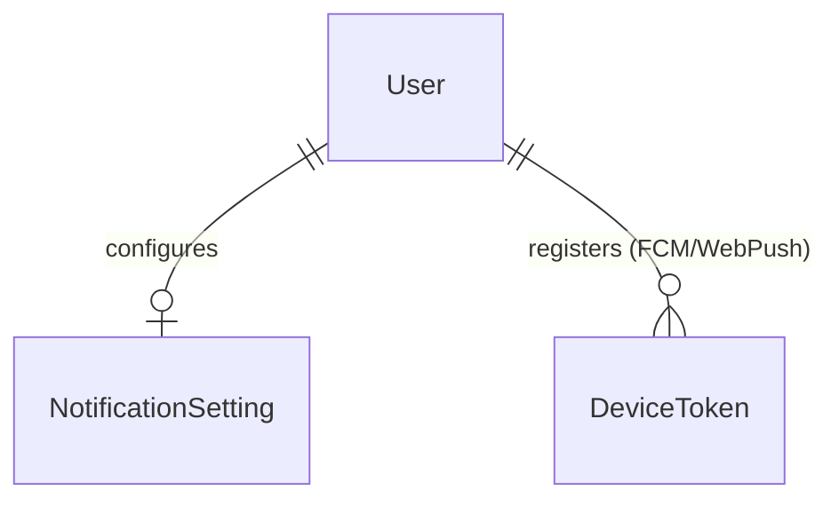
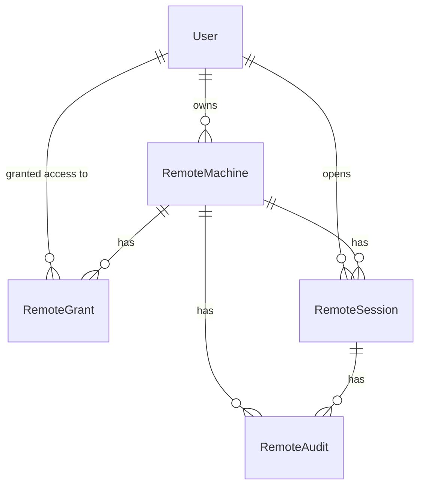

# Database Schema

Source of truth: [`packages/database/prisma/schema.prisma`](https://github.com/aiyu-ayaan/BetweenUs/blob/master/packages/database/prisma/schema.prisma).
One Prisma schema for the MVP, shared by auth-, server- and chat-service —
each service touches only the models it owns; splitting per service later is
a migration, not a rewrite, because every model is already accessed only by
its owning service's code paths.

## Entity relationship diagram

One diagram for all 20 models reads as a wall of boxes — every field zooms
to unreadable no matter how far you pan out. Split by domain instead, each
diagram placed next to the section it belongs to.

## Identity & auth

### `User`
The account. `passwordHash` is `'oauth-only'` for a provider-created account
that has never set a password — no hash can match that sentinel, which is
what makes a provider-only account correctly refuse password login rather
than silently accepting one. `role` (`GlobalRole`: `USER` / `ADMIN`) is
separate from any `ServerRole` — it grants the admin panel, not membership
rights inside any particular server. `disabledAt` keeps a disabled account's
data but blocks login and refresh.

`username` is normalised to lower case on every write, which is what makes the
unique index agree with the username login path — signing in already lower-cased
what was typed, so a mixed-case row was one nobody could sign in to by name.

Two markers about the account's own state: `passwordResetUntil` is an
administrator-granted recovery window (see `PasswordReset`), and `chatsClearedAt`
is a floor under everything **this** account can see, in every channel, on every
one of its devices — the per-conversation half of the same idea being
`ChannelRead.clearedAt`.

`messageTtlSeconds` is the same family again: this account's own disappearing
window, one-sided and enforced as a **filter**. History older than the window
is not returned to this account on any of its devices, and every other
participant's copy is untouched. `Server.messageTtlSeconds` outranks it,
because that one deletes the row rather than hiding it.

Two fields describe the account to other people rather than to itself. `about`
is the line under the name on a profile card — stored in the clear beside
`displayName` and `avatarUrl`, because it is a caption on a name and not a
secret, and defaulted to `Hey, I'm on Between Us.` so that a card nobody has
edited still reads as a card. `NOT NULL` with that default, so an account older
than the column reads as one that never changed it. The DTO caps it at
`ABOUT_MAX_LENGTH` (140).

`lastSeenAt` is nullable and is a **flush target, not the live value**: while
somebody is connected the answer is in `presence:lastseen` in Redis, and
presence-service writes here when their last window closes. Reads take the
later of the two. It is never written while the account is invisible — see
[presence-service](../services/presence-service.md).

### `RefreshToken`
`id` **is** the JWT `jti` — revoking a token is a delete by primary key.
`tokenHash` is stored, never the raw token. `revokedAt` marks reuse-detected
revocation.

### `UserIdentity`
One row per linked OAuth login (`provider` + `providerAccountId` unique
together) — the provider's own user id is what re-identifies the person on
the next login, since their email can change on the provider's side.

### `PasswordReset`
A single-use permission to set a password without knowing the old one. Only
`SHA-256(token)` is stored, for the same reason `RefreshToken` stores a hash: a
leaked dump must not be a pile of live reset links. `source` is `email` (a link
the SMTP server sent) or `admin` (an administrator opened a window on the
account). Spending one marks `usedAt`, clears `User.passwordResetUntil`, and
revokes every session the account had.

### `SmtpSetting`
One row, `id = 'smtp'`. The deployment's outgoing mail server, entered in the
admin panel rather than in the environment, with `password` sealed under
`SETTINGS_SECRET` exactly as an OAuth client secret is. No row — or a row with
`enabled` false — is a deployment that cannot send mail at all, which is a fully
supported deployment: every client then says "ask your administrator".

### `OAuthProvider`
Operator-configured provider credentials (Google/GitHub), one row per
provider name, `clientSecret` sealed with AES-256-GCM.

### `DeviceKey`
One row per **machine**, not per account — an ECDH P-256 public key (JWK).
The private half never leaves that machine. A device can be revoked
independently of the account's identity; a revoked row is kept (not
deleted) so the trust history stays auditable, but nothing new is ever
wrapped for it.

### `IdentityBackup`
The identity private key, sealed client-side (PBKDF2 over a password or
passphrase the server never sees) so signing in on a second machine or
reinstalling doesn't mean losing history. Unique on `(userId, kind)` — one per
secret kind, not one per user, so setting a recovery passphrase no longer
overwrites the password-sealed blob that a fresh sign-in is the only thing
holding the secret for. The server stores opaque ciphertext it cannot open.

### `ChannelKey`
A channel's symmetric content key, wrapped once per `(recipient user,
recipient device)` pair using ECDH between the sender's device key and the
recipient's. The server stores only ciphertext (`wrappedKey`) it cannot
open. `epoch` increments when the channel's membership/key needs to rotate.

## Servers, roles, channels

### `Server`
A community — `slug` is the public, permanent join handle (superseded by
`ServerInvite` for anything revocable).

`messageTtlSeconds` is the server's disappearing window: how long a message
sent in its channels lives, or null for for ever. Unlike the account-level
window it is a real **deletion** — the sweeper destroys the row and its blobs
when it closes, for everybody — and that is precisely why it outranks a
member's own setting. A member may choose to see less than the server keeps,
never more. Set with `MANAGE_SERVER`, and only to one of the published windows.

### `ServerMember`
One row per `(server, user)`. `role` is the fixed 5-rung hierarchy
(`OWNER`/`ADMIN`/`MODERATOR`/`MEMBER`/`GUEST`). `grantedPermissions` /
`deniedPermissions` are per-member overrides on top of the role — see
[Auth & Permissions](/system-design/auth-and-permissions) for the resolver.

### `ServerCustomRole` / `ServerMemberRole`
Named, coloured, ranked roles a server invents for itself, additive on top
of the fixed role hierarchy. A member can hold any number.

### `ServerInvite`
A revocable, expirable, use-capped code — deliberately not the server's
permanent `slug`, so a leaked invite can be shut off without renaming the
whole server.

### `Channel`
`serverId` is nullable — a `null` server id **is** a direct message.
`type` is `TEXT` / `VOICE` / `DM`. `isPrivate` + `ChannelMember` rows form an
allowlist; server membership grants nothing to a private channel, not even
to an administrator.

### `ChannelMember`
Rows are meaningful only when the channel is private — a public channel
ignores them, so making a channel private later needs no backfill.

### `ChannelRead`
One row per `(user, channel)`, `lastReadAt`. Unread counts are **derived**
from this on every read, never stored as a counter — a counter drifts the
first time some path forgets to decrement it; a marker can't drift.

`clearedAt` is the per-conversation half of `User.chatsClearedAt`: messages
older than it aren't returned to *this* user in *this* channel. It lives here
rather than in a table of its own because this row is already the one thing
keyed on exactly `(user, channel)` — a second table would be the same key, the
same cascade and the same lookup, twice. The two markers are read together and
the later one wins.

### `Friendship`
One row per relationship, not one per direction — `userAId < userBId`
enforced by convention, `requesterId` says who sent it, `status` is
`PENDING`/`ACCEPTED`. Catches two people requesting each other at once via
the unique constraint on the ordered pair.

### `UserBlock`
One account refusing another. **Directional**, unlike `Friendship` — "A blocked
B" and "B blocked A" are two different facts, and either alone has to close the
conversation, so the gate reads both directions. Unique on
`(blockerId, blockedId)`; the extra index on `blockedId` answers "who has blocked
me", which is the question that shuts a channel for the other side.

Blocking deletes the `Friendship` row but never the `Channel`: it holds two
people's history, and unblocking brings the conversation back intact.

### `ServerEmoji`
A server's custom emoji. The picture is served unauthenticated (an ``
tag can't carry a header) — deliberately the one thing this deployment
serves in the clear, because an emoji is drawn a hundred times a screen and
has nothing secret about it.

## Messages & attachments

### `Message`
`content` is opaque to the server — a serialized `EncryptedEnvelope`
ciphertext, or plain text before E2EE existed. `deletedAt` + emptied
`content` is a soft-delete tombstone (the row stays so paging cursors that
point at it don't break); `deletedById` distinguishes "author took it back"
from "moderator removed it." `pinnedAt`/`pinnedById` are set independently.

`expiresAt` is when the message stops existing, stamped from the server's
disappearing window **as the message is sent** rather than evaluated on read —
so changing that window governs what is sent next and never reaches back
through a channel. The disappearing sweeper deletes these rows outright rather
than tombstoning them: a conversation that fills with "this message was
deleted" for everything that aged out is not a disappearing conversation, it is
a very detailed index of one.

`viewOnce` marks a one-time message; `viewedAt` records when the **first**
recipient opened it, which is what the backstop expiry is measured from. Who
has looked lives in `MessageView`, one row per person — see below.
The flag lives here, outside the encrypted body, because burning is a row
update and a blob delete — the server's work — and a server that cannot read
the body cannot be told by the body. What it learns is that some message was
one-time, which both clients already draw on screen.

### `MessageReaction`
`emoji` is stored **in the clear** — the one deliberate plaintext leak in
the whole schema, documented in [`E2EE.md`](/security/e2ee), because the
server has to group and count reactions for recipients who don't currently
hold the channel key.

### `MessageView`
One person's one look at a one-time message, unique per `(messageId, userId)`.

A table rather than a single `viewedAt` on the message, because a one-time
message holds as many looks as there are people who can see it. The single
stamp meant the first person to open one in a channel destroyed it for
everybody else, who were then shown "Opened" for something they had never been
given — one look between them, and a race to it.

The message is destroyed once these rows cover the channel's audience minus the
author, who is not a viewer: re-reading what you sent spends nobody's look.

### `Attachment`
Links a stored blob (`key`, the storage key) to the message that claims it.
Neither foreign key cascades on delete — both go `null` instead, and a
background sweeper collects blobs no message claims any more. This is the
one piece of metadata the server does learn about an attachment: how many
blobs, what size, belong to which message. The file's name, real type and
contents stay sealed inside the encrypted manifest.

Deleting, burning or expiring a message purges its blobs **immediately**, in
the same request. The sweeper stays behind that as the backstop for what the
immediate purge could not reach — storage that was down, a process that died
mid-delete, a row orphaned by somebody else's cascade. It used to be the only
path, and "I deleted that photo" meaning "some time in the next six hours" is
why it is not any more.

## Notifications & devices

### `NotificationSetting`
One row per user, written on first change. `mutedChannelIds` /
`mentionOnlyChannelIds` / `mutedUserIds` are plain string arrays — small,
read whole, not worth a join table until a mute needs its own settings.
`quietStartMinute`/`quietEndMinute` are minutes-from-midnight on the
*client's* clock; the server never learns a timezone.

### `DeviceToken`
One row per `(user, deviceId)` for FCM push. `token` is separately unique,
because the same physical device can change accounts (sign out, sign in as
someone else) and must not keep pushing to the old owner.

## Remote desktop

### `RemoteMachine`
`agentTokenHash` is the enrolled agent's credential, hashed like a
password, shown once at enrollment. Rotated by re-enrolling.

### `RemoteGrant`
What one user may do to one machine — `permissions` is a subset of the six
`REMOTE_*` permissions, `expiresAt` nullable for open-ended access. Absence
of a row means **no access at all**; remote permissions are never implied by
a server role.

### `RemoteSession`
`permissions` is **copied** from the grant at session start and never
re-read — the session's authority is frozen, so revoking a grant mid-session
is a decision the gateway makes deliberately (ending the session) rather
than a race against event ordering.

### `RemoteAudit`
Append-only. Nothing in the application updates or deletes a row. Records
enrollment, renames, permission changes, session start/end, and refused
attempts.

### `CallSession`
One row per person per stay in a call, written by `call-service`'s gateway.
`channelName` / `serverName` are snapshots, not joins — a call log is history,
and the entry worth reading back is often the channel that has since been
deleted; a foreign key would remove exactly those rows. The only key is to the
account, so deleting an account takes its log with it.

`bytes`, `bytesSent`, `bytesReceived` and `links` (JSON, one entry per peer
connection) are the **client's own measurements**: media is peer to peer, so
nothing server-side is in the path to count. They are clamped before they are
written. `endedAt` is `null` for a call still running and for a row whose
process died mid-call.

### `AdminAudit`
Same append-only shape, for the admin panel: role changes, disable/enable,
deletion, OAuth provider and SMTP config changes, and password-reset windows
being opened or cancelled. `targetId` goes `null` when the
target account is deleted; `targetLabel` keeps what it was called at the
time, so the log still reads back after the account is gone.
