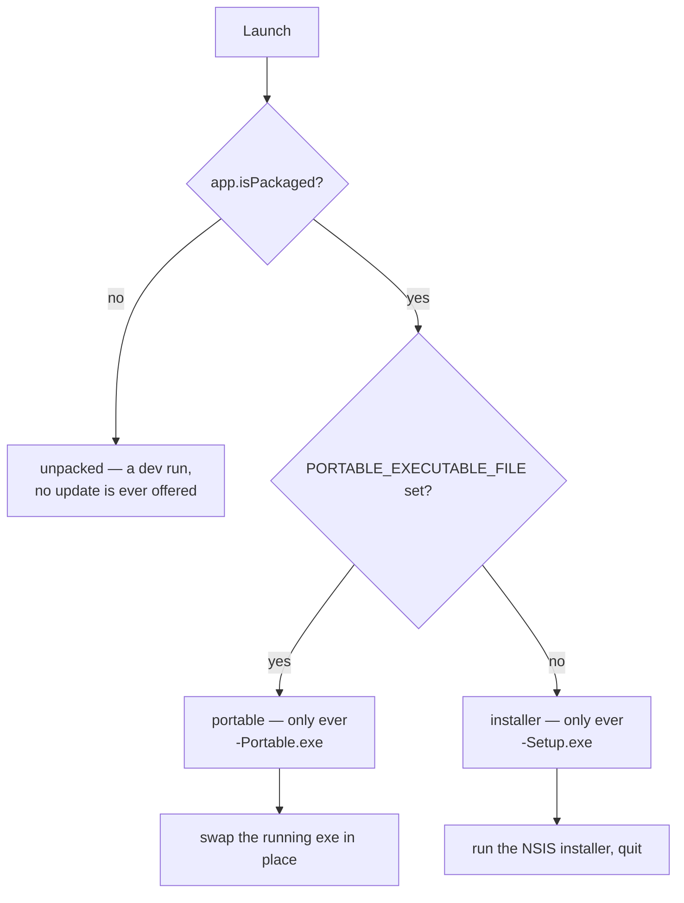

# Client Updates

Full source: [`development/UPDATES.md`](https://github.com/aiyu-ayaan/BetweenUs/blob/master/development/UPDATES.md).

[The release pipeline](./release-pipeline.md) publishes a GitHub Release with
named files attached. This is how the three clients notice one and take it.

There is no store, no update server and no `latest.yml`. Every client reads the
same release list; what differs is what it can do with what it finds.

| Client | What an update is | Who installs it |
| --- | --- | --- |
| Desktop, installed | `BetweenUs-<version>-Setup.exe` | the NSIS installer |
| Desktop, portable | `BetweenUs-<version>-Portable.exe` | the app, by swapping its own exe |
| Android | `BetweenUs-<version>-<abi>.apk` | Android's package installer |
| Web | a reload | nobody — the deployment was already updated |

## Desktop: the flavour decides everything

Windows ships as two builds from one `electron-builder.yml`. They are not
interchangeable: handing a portable copy the installer doesn't update it, it
installs a *second* BetweenUs into Program Files and leaves the portable one
running and out of date.



`PORTABLE_EXECUTABLE_FILE` is set by electron-builder's portable target and is
the only runtime difference between the two builds — the portable exe unpacks
itself to a temp directory and runs from there, so `process.execPath` is the
unpacked copy while that variable is the file the user keeps.

There is no fallback between the two assets. A release that built one and not
the other offers nothing rather than the wrong one.

### Applying it

**Installed** — start the setup exe and quit; NSIS closes the app, replaces the
installation and starts it again.

**Portable** — there is no installer, so the app does the swap itself:

1. Rename `BetweenUs.exe` to `BetweenUs.exe.old`. Windows allows renaming a
   running executable; it does not allow deleting one.
2. Copy the download over `BetweenUs.exe`. A copy rather than a rename, because
   the download is in the user-data directory and may be on another volume.
3. Start it and quit.
4. On the next launch, delete the `.old` file — by then nothing is running it.

The copy stays exactly where the user put it, which is the point of a portable
build. If any step fails the download is still on the disk and still runnable,
so the file manager opens on it and the reason is shown.

### Channels

Cumulative, and the same three as Android:

| Channel | Offered |
| --- | --- |
| `stable` | finished releases only |
| `beta` | betas, and every stable release |
| `alpha` | everything |

The default is the channel this build belongs to, so an alpha install isn't
stranded on stable until the version it's running is released. It's stored in
`betweenus-settings.json` — a property of this copy of the app, not of the
account.

"Newer" is by version and never by publish date: a stable release cut after an
alpha is not an upgrade for somebody running that alpha.

It checks on launch and then every six hours, plus a **Check for updates**
button in Settings → Updates. The GitHub API is unauthenticated — sixty
requests an hour per address — which is why a refused check is reported rather
than retried.

### Why not electron-updater

It would want a `latest.yml` published alongside the assets and a `publish`
block in the builder config, and it still couldn't update the portable build —
half of what ships.

## Web: notice, then reload

A tab can't install anything. The deployment is updated by whoever runs it and
a tab picks the new build up when it reloads, so the whole feature is noticing
that a reload is now worth doing.

What it watches is the **asset fingerprint**, not a version number. Vite names
every built file `index-<hash>.js` and the hash moves exactly when the contents
do; `index.html` is the one unhashed file and lists which hashes are current.

```text
running  = the /assets/… names in this document
served   = the /assets/… names in a no-store fetch of /index.html
different, and neither empty  →  offer a reload
```

Nothing has to be remembered at release time. That's why it isn't the web
client's `package.json` version — the release workflow bumps the root and
desktop manifests only, so a check against that number would never fire.

Either side coming back empty is "cannot tell", never "changed": a development
server, a 502 page, a proxy's holding page and an offline tab all land there,
and prompting a reload on a failed fetch is a reload loop.

A visible tab asks every five minutes, and any tab asks the moment it's brought
back to the front — the cheapest moment, and the one where a week-old tab is
most likely to be stale.

## Android

A check on launch, a daily WorkManager job on unmetered network for a phone
nobody has opened, the per-ABI APK rather than the universal one, and
`PackageInstaller` for the install so a refusal comes back with a reason. See
[the Android client](../architecture/android-client.md).

## The asset names are the contract

```text
BetweenUs-<version>-Setup.exe        desktop, installed
BetweenUs-<version>-Portable.exe     desktop, portable
BetweenUs-<version>-<abi>.apk        Android, per ABI
BetweenUs-<version>-universal.apk    Android, fallback
```

Renaming any of these silently stops that client being offered updates: the
check still runs, finds the release, and finds nothing in it it can apply. They
are set in `apps/desktop/electron-builder.yml` and in the `android` job of
`.github/workflows/release.yml`.

Carried-forward artifacts keep the version they were built for in their file
name, which is correct — the version a client compares against comes from the
release tag, not from the name.
