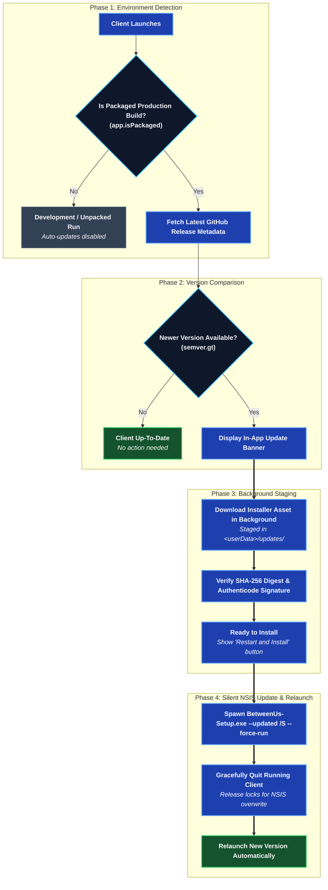

# Client Updates

Full source: [`development/UPDATES.md`](https://github.com/aiyu-ayaan/BetweenUs/blob/master/development/UPDATES.md).

[The release pipeline](./release-pipeline.md) publishes a GitHub Release with
named files attached. This is how the three clients notice one and take it.

There is no store, no update server and no `latest.yml`. Every client reads the
same release list; what differs is what it can do with what it finds.

| Client | What an update is | Who installs it |
| --- | --- | --- |
| Desktop | `BetweenUs-<version>-Setup.exe` | the NSIS installer, silently |
| Android | `BetweenUs-<version>-<abi>.apk` | Android's package installer |
| Web | a reload | nobody — the deployment was already updated |

## Desktop

Windows ships one build: an installer. A portable exe shipped beside it until
the pair of them made every update a question of which build was asking, and
handing a portable copy the installer installs a *second* BetweenUs rather than
updating the first. One build, one asset, no question.



A release that built the other platforms only offers Windows nothing, rather
than something it cannot apply.

### The installer

Assisted rather than one-click, and per user:

| | |
| --- | --- |
| Where it goes | the user chooses, and an update keeps that choice |
| Elevation | none — a per-user install never asks for an administrator |
| Shortcuts | desktop and start menu |
| Uninstall | leaves AppData, so reinstalling does not lose anyone's keys |

### Applying it

The download waits in `<userData>/updates`. **Restart and install** starts it
as `--updated /S --force-run` — silent, into the directory already chosen, and
BetweenUs starts again when it is done — and this process quits so NSIS has
nothing left to close. Started with no arguments it opens its wizard behind the
running app, which is exactly what made the button look dead.

If it cannot be started at all, the download is on the disk and runnable, so
the file manager opens on it and the reason is shown.

### When it downloads

A check finds an offer and fetches it there and then: the download is the slow
half and it is the half that can happen quietly. Installing is always asked
for. A download that is still waiting when the app is closed is picked back up
on the next launch — the file name carries the version — and anything that is
no longer an upgrade on this build is deleted.

### The notes are drawn as markdown

A release body is `### Features` with a list under it, `**bold**`, a fenced
block of shell. Every client used to show that text exactly as it arrived,
hashes and asterisks included. All three now render it.

It is the message parser doing it, with one rule switched on:

```text
parse(text)       chat            no headings - a heading in a chat line is shouting
parseNotes(text)  release notes   headings, and a table's `| --- |` rule swallowed
```

The drawing is per client — `components/ReleaseNotes.tsx` on desktop and web,
`feature/update/ReleaseNotes.kt` on Android — because the message list lays
custom emoji and link previews over its blocks and none of that belongs in a
changelog. Headings come out at two sizes, lists get a marker gutter, fenced
code gets its own ground.

Tables are not parsed: the rule row is swallowed, the rows stay as pipes.

### Channels

Cumulative, and the same three as Android:

| Channel | Offered |
| --- | --- |
| `stable` | finished releases only |
| `beta` | betas, and every stable release |
| `alpha` | everything |

The default is the channel this build belongs to, so an alpha install isn't
stranded on stable until the version it's running is released. It's stored in
`betweenus-settings.json` — a property of this copy of the app, not of the
account. Changing it in Settings → Updates takes effect on the spot and
re-checks; the offer in hand is dropped, because it was picked on the old
channel.

"Newer" is by version and never by publish date: a stable release cut after an
alpha is not an upgrade for somebody running that alpha.

It checks on launch and then every six hours, plus a **Check for updates**
button in Settings → Updates. The GitHub API is unauthenticated — sixty
requests an hour per address — which is why a refused check is reported rather
than retried.

### Why not electron-updater

It would want a `latest.yml` published alongside the assets, a `publish` block
in the builder config, and a second release path to keep working. The rules
here are two hundred lines with a self-check beside them
(`electron/updates.check.ts`).

## Web: notice, then reload

A tab can't install anything. The deployment is updated by whoever runs it and
a tab picks the new build up when it reloads, so the whole feature is noticing
that a reload is now worth doing.

What it watches is the **asset fingerprint**, not a version number. Vite names
every built file `index-<hash>.js` and the hash moves exactly when the contents
do; `index.html` is the one unhashed file and lists which hashes are current.

```text
running  = the /assets/… names in this document
served   = the /assets/… names in a no-store fetch of /index.html
different, and neither empty  →  offer a reload
```

Nothing has to be remembered at release time. That's why it isn't the web
client's `package.json` version — the release workflow bumps the root and
desktop manifests only, so a check against that number would never fire.

Either side coming back empty is "cannot tell", never "changed": a development
server, a 502 page, a proxy's holding page and an offline tab all land there,
and prompting a reload on a failed fetch is a reload loop.

A visible tab asks every five minutes, and any tab asks the moment it's brought
back to the front — the cheapest moment, and the one where a week-old tab is
most likely to be stale.

## Android

A check on launch, a daily WorkManager job on unmetered network for a phone
nobody has opened, the per-ABI APK rather than the universal one, and
`PackageInstaller` for the install so a refusal comes back with a reason. See
[the Android client](../architecture/android-client.md).

## The asset names are the contract

```text
BetweenUs-<version>-Setup.exe        desktop, installed
BetweenUs-<version>-<abi>.apk        Android, per ABI
BetweenUs-<version>-universal.apk    Android, fallback
```

Renaming any of these silently stops that client being offered updates: the
check still runs, finds the release, and finds nothing in it it can apply. They
are set in `apps/desktop/electron-builder.yml` and in the `android` job of
`.github/workflows/release.yml`.

Carried-forward artifacts keep the version they were built for in their file
name, which is correct — the version a client compares against comes from the
release tag, not from the name.
