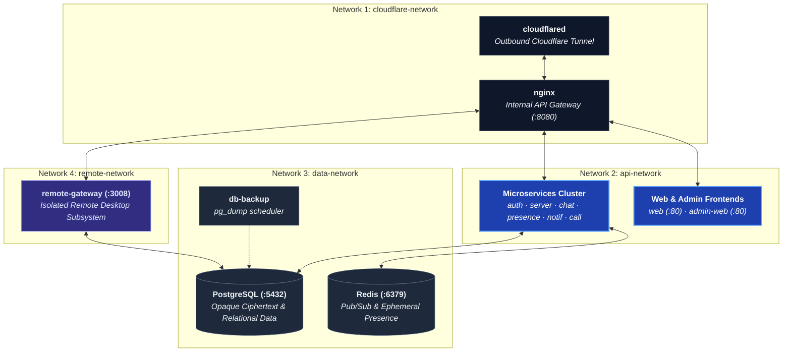

# Docker Compose

All backend services are containerized, built from one shared
[`infrastructure/docker/Dockerfile`](https://github.com/aiyu-ayaan/BetweenUs/blob/master/infrastructure/docker/Dockerfile)
with a `target` per service (it needs the whole workspace, the lockfile and
`packages/`, not just one directory). Docker Compose is used for both dev
and production; Kubernetes is a documented later option, not introduced
before it's needed.

## Services

```text
cloudflared          Cloudflare Tunnel (--profile public, optional)
nginx                Internal gateway / reverse proxy
web                   Web client (static bundle)
admin-web              Admin panel (static bundle)
migrate                 Runs Prisma migrations once, then exits
auth-service              JWT sessions, OAuth, admin auth
server-service              Servers, channels, roles, invites
chat-service                  Messages, DMs, friends, E2EE keys, uploads
presence-service                Online status, typing, voice roster (stateless, Redis-backed)
notification-service              Mutes, quiet hours, unread, push devices
call-service                        Call signalling only
remote-gateway                        Remote-desktop signalling, permissions, audit
postgres                               Primary database
redis                                    Presence, pub/sub, rate limiting, temp sessions
db-backup / db-backup-once                pg_dump on a schedule / on demand
```

## Networks

Private Docker networks, so only what needs to talk to a thing can reach it:



Postgres and Redis are never on `cloudflare-network` and are never
published on a host port in production. There is no media network — no
container carries media, ever (see [Peer-to-Peer Media](/architecture/media)).

## Running it

```bash
cp .env.example .env
docker compose --env-file .env -f infrastructure/docker/docker-compose.yml pull
docker compose --env-file .env -f infrastructure/docker/docker-compose.yml up -d
```

Or via the root `package.json` scripts, which pass `--env-file .env` for
you (compose reads `.env` relative to the compose file's own directory,
`infrastructure/docker/`, not the repo root):

```bash
pnpm prod:up          # pull + up -d
pnpm prod:up:build    # build locally instead of pulling
pnpm prod:down
pnpm db:backup        # one-off pg_dump via db-backup-once
```

## Images

Published to `${IMAGE_REPO:-aiyuayaan/betweenus}` on Docker Hub, one tag per
service per version, built for both `linux/amd64` and `linux/arm64` under a
single manifest list — a Pi, an Ampere VPS or an Apple-silicon Mac pulls the
same tag and gets its own architecture. Moving tags:

| Tag | Follows |
| --- | --- |
| `<service>-<version>` | One exact release, never moves |
| `<service>-alpha` / `<service>-beta` | The newest release on that channel |
| `<service>-latest` | The newest release of *any* channel |

A deployment's `.env` sets `BETWEENUS_VERSION` to pin an exact version;
unset, it follows `latest`.

## Public ingress

Two ways, one line of difference — see
[Ingress](/system-design/ingress):

- Bring your own `cloudflared` (already running one tunnel for everything
  else): add an ingress entry pointing at `http://localhost:8080`, the
  gateway's published `GATEWAY_PORT`.
- Let BetweenUs run its own: `docker compose ... --profile public up -d`
  starts the `cloudflared` service, gated on the gateway's own healthcheck
  rather than merely existing.
