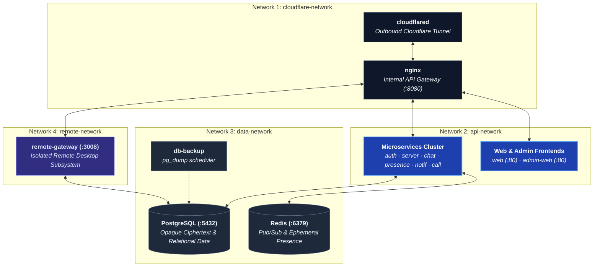

# Docker Compose

All backend services are containerized, built from one shared
[`infrastructure/docker/Dockerfile`](https://github.com/aiyu-ayaan/BetweenUs/blob/master/infrastructure/docker/Dockerfile)
with a `target` per service (it needs the whole workspace, the lockfile and
`packages/`, not just one directory). Docker Compose is used for both dev
and production; Kubernetes is a documented later option, not introduced
before it's needed.

## Services

```text
cloudflared          Cloudflare Tunnel (--profile public, optional)
nginx                Internal gateway / reverse proxy
web                   Web client (static bundle)
admin-web              Admin panel (static bundle)
migrate                 Runs Prisma migrations once, then exits
auth-service              JWT sessions, OAuth, admin auth
server-service              Servers, channels, roles, invites
chat-service                  Messages, DMs, friends, E2EE keys, uploads
presence-service                Online status, typing, voice roster (stateless, Redis-backed)
notification-service              Mutes, quiet hours, unread, push devices
call-service                        Call signalling only
remote-gateway                        Remote-desktop signalling, permissions, audit
postgres                               Primary database
redis                                    Presence, pub/sub, rate limiting, temp sessions
db-backup / db-backup-once                pg_dump on a schedule / on demand
```

## Networks

Private Docker networks, so only what needs to talk to a thing can reach it:



Postgres and Redis are never on `cloudflare-network` and are never
published on a host port in production. There is no media network — no
container carries media, ever (see [Peer-to-Peer Media](/architecture/media)).

## Running it

```bash
cp .env.example .env
docker compose --env-file .env -f infrastructure/docker/docker-compose.yml pull
docker compose --env-file .env -f infrastructure/docker/docker-compose.yml up -d
```

Or via the root `package.json` scripts, which pass `--env-file .env` for
you (compose reads `.env` relative to the compose file's own directory,
`infrastructure/docker/`, not the repo root):

```bash
pnpm prod:up          # pull + up -d
pnpm prod:up:build    # build locally instead of pulling
pnpm prod:down
pnpm db:backup        # one-off pg_dump via db-backup-once
```

### `deploy.sh`

`infrastructure/docker/deploy.sh` is the same two commands with the parts
that matter when they go wrong:

```bash
sh infrastructure/docker/deploy.sh          # the channel .env follows
sh infrastructure/docker/deploy.sh 0.0.2    # that version exactly
sh infrastructure/docker/deploy.sh alpha    # the newest alpha
```

It pulls before it stops anything, so a failed pull is a deploy that did
not happen rather than an outage. It writes `BETWEENUS_VERSION` into
`.env`, so a later `docker compose up -d` by hand gets the same version.
And if the gateway does not come back healthy it restores the version that
was running and exits non-zero — which is the whole difference between a
deploy step and two commands in a README.

Asked for the version that is already running — which is what a `!patch`
deploy is — it adds `--force-recreate`, so every container comes down and
comes back on the image just pulled rather than on compose's judgement about
whether anything changed. `DEPLOY_RECREATE=1` asks for that on any deploy.

If the rollback *also* fails it says so loudly. That usually means the
migration ran and the previous images cannot read the new schema; the
pre-migration dump in the backup volume is what that case is for, and
restoring it is a person's decision, not the script's.

The same file ships in the deployment bundle attached to every release, and
the release pipeline's [`deploy` job](/deployment/release-pipeline#getting-it-onto-a-host)
runs it over SSH.

## Backups off the host

The dumps land beside the database they came from, which covers a bad
migration and not a dead disk. Set `BACKUP_S3_BUCKET` and every dump is also
PUT to object storage as it is written:

| Variable | Meaning |
| --- | --- |
| `BACKUP_S3_ENDPOINT` | Path-style endpoint — MinIO, R2, B2, Spaces, Wasabi, S3 |
| `BACKUP_S3_BUCKET` | Off when empty. Nothing else here is read without it |
| `BACKUP_S3_PREFIX` | Key prefix, default `betweenus` |
| `BACKUP_S3_REGION` | Signing region, default `us-east-1` |
| `BACKUP_S3_ACCESS_KEY` / `BACKUP_S3_SECRET_KEY` | Credentials |
| `BACKUP_OFFSITE_REQUIRED` | `1` makes a failed upload a failed backup, which before a migration stops the migration. Default `0` |

Retention is local only. Nothing prunes the bucket — set a lifecycle rule
there, which every S3 implementation has.

## Secrets past `.env`

`.env` is one file holding every secret, and its contents are in
`docker inspect` and in the environment of every process a service spawns.
Any variable can instead be given as `NAME_FILE`, the path of a file holding
the value — the shape Docker and Podman secrets, Kubernetes projected
volumes and systemd credentials all produce. `NAME` wins when both are set.

`docker-compose.secrets.yml` is a ready override that mounts a directory of
them at `/run/secrets`:

```bash
docker compose --env-file .env \
  -f infrastructure/docker/docker-compose.yml \
  -f infrastructure/docker/docker-compose.secrets.yml up -d
```

Rotating a signing secret used to sign out every account on every device,
which meant it never happened. `JWT_SECRET_PREVIOUS` is accepted on
verification and never used to sign, so a rotation is: move the old value
across, put the new one in place, restart, and delete the old one once
nothing can still be carrying it — one access-token lifetime for
`JWT_SECRET`, the refresh lifetime for `JWT_REFRESH_SECRET`. Deleting it is
what ends the rotation. `SETTINGS_SECRET_PREVIOUS` does the same for the
sealed OAuth client secrets in the database.

## Images

Published to `${IMAGE_REPO:-aiyuayaan/betweenus}` on Docker Hub, one tag per
service per version, built for both `linux/amd64` and `linux/arm64` under a
single manifest list — a Pi, an Ampere VPS or an Apple-silicon Mac pulls the
same tag and gets its own architecture. Moving tags:

| Tag | Follows |
| --- | --- |
| `<service>-<version>` | One exact release, never moves |
| `<service>-alpha` / `<service>-beta` | The newest release on that channel |
| `<service>-latest` | The newest release of *any* channel |

A deployment's `.env` sets `BETWEENUS_VERSION` to pin an exact version;
unset, it follows `latest`.

## Public ingress

Two ways, one line of difference — see
[Ingress](/system-design/ingress):

- Bring your own `cloudflared` (already running one tunnel for everything
  else): add an ingress entry pointing at `http://localhost:8080`, the
  gateway's published `GATEWAY_PORT`.
- Let BetweenUs run its own: `docker compose ... --profile public up -d`
  starts the `cloudflared` service, gated on the gateway's own healthcheck
  rather than merely existing.
