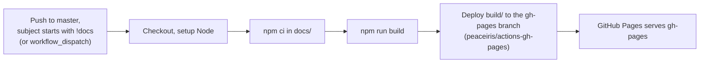

# Docs Deployment

This site is built and deployed by
[`.github/workflows/docs.yml`](https://github.com/aiyu-ayaan/BetweenUs/blob/master/.github/workflows/docs.yml),
following the same marker convention as [the release pipeline](/deployment/release-pipeline):
a commit on `master` whose subject starts with `!docs` builds this
Docusaurus site and publishes it. Unlike a release, there's no version to
bump and no PR step — a `!docs` push ships directly, because there's no
compiled artifact whose diff is worth reviewing before it goes out.

## The `gh-pages` branch

The workflow force-pushes the built static site to a `gh-pages` branch — a
new commit each run, authored by the Actions bot, containing only the
built HTML/CSS/JS. That branch never appears in a pull request and is
never merged; it exists purely as what GitHub Pages serves from
(**Settings → Pages → Deploy from a branch → `gh-pages`**). This mirrors
how a classic GitHub Pages deploy works, and is the same shape
`electron-builder`/`create-docusaurus`'s own `npm run deploy` script uses
under the hood.

## Trigger detail

Reusing the same "marker at the start of a commit subject" idea as
`release.yml`, but simpler — one job, no version state, no rollback:

- `push` to `master`: the workflow checks whether any pushed commit's
  subject starts with `!docs`; if none does, the job exits without
  building anything.
- `workflow_dispatch`: always builds and deploys, for a manual redeploy
  (useful right after merging a docs PR that didn't itself carry the
  marker, or after a Pages outage).

## Running it locally first

Always build locally before pushing a `!docs` commit — see
[Running Locally](/running-locally#docs-site).
