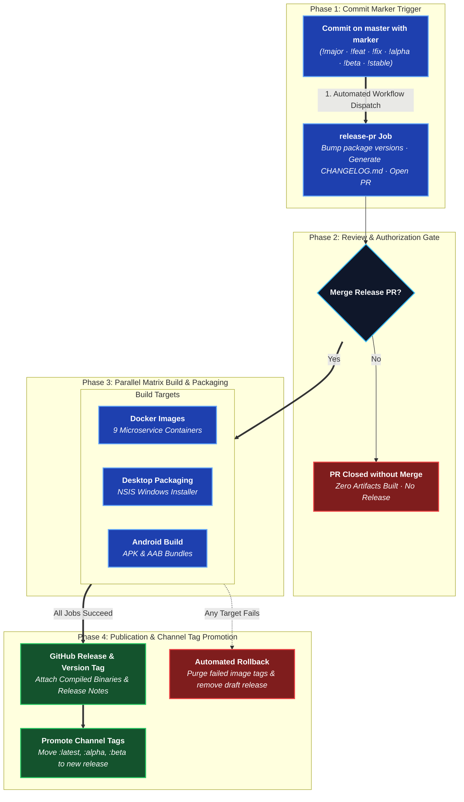

# Release Pipeline

Full source: [`development/RELEASING.md`](https://github.com/aiyu-ayaan/BetweenUs/blob/master/development/RELEASING.md)
and [`.github/workflows/release.yml`](https://github.com/aiyu-ayaan/BetweenUs/blob/master/.github/workflows/release.yml).

One version number covers the server images, the Windows desktop build and
the Android artifacts. A release doesn't have to rebuild all of it — what it
skips is carried forward from the previous release rather than left behind.

## Two steps, not one



1. **The marker commit opens a release PR.** It bumps `package.json` and
   `apps/desktop/package.json`, writes the `CHANGELOG.md` entry, and records
   what's being built in `.github/release-targets`. Nothing is built yet —
   the diff is the last look before it ships.
2. **Merging that PR is what releases.** Images → desktop installer →
   Android APKs and AAB (one job each, in parallel) → the tag and GitHub
   Release → the moving tags
   (`latest`, `alpha`/`beta`) re-pointed dead last, only once every artifact
   and the Release itself exist.

## Markers

| Marker | Effect |
| --- | --- |
| `!major` | `1.4.2` → `2.0.0`, stable |
| `!feat` | `1.4.2` → `1.5.0`, stable |
| `!fix` | `1.4.2` → `1.4.3`, stable |
| `!alpha` | `0.0.1` → `0.0.2-alpha.1`, pre-release |
| `!beta` | promotes to `0.0.2-beta.1`, same base version |
| `!stable` | promotes to `0.0.2`, no version bump |

A push with no marker releases nothing. A channel promotes but never
demotes in place.

## Scoping to one platform

```text
!alpha(android)        Android artifacts only
!fix(android,desktop)  both clients, no server images
!feat(docker)          the nine service images only
!feat                  everything (empty scope = all)
```

A scope that isn't entirely platform names (`docker`/`desktop`/`android`
and their aliases) is read as an ordinary conventional-commit scope and
changes nothing — `!feat(chat)` still builds everything.

## What a skipped platform gets

Not left behind — carried forward. `<service>-<version>` image tags exist
for every service every release, either freshly built or copied (by
digest, `imagetools create`, no rebuild) from the last release's tag. The
Windows installer and Android APKs are likewise downloaded from the
previous GitHub Release and re-attached under this version's release,
keeping their own (older) filenames — which is the honest answer to "which
build is this." The CHANGELOG carries a table saying exactly which half of
each release is which.

## Manual dispatch

`workflow_dispatch` takes `mode: pr` (open a release PR by hand) or
`mode: release` (build and publish whatever `master` already carries — the
way back after a rollback, or after a merged release PR this workflow
missed).

## On failure

`rollback` deletes the version's image tags and any tag/Release that got as
far as existing, and deliberately leaves the channel tags (`latest`,
`alpha`, `beta`) untouched — they still point at the last release that
finished. The version bump stays on `master`; the next release is computed
from the failed version, so use `!fix` or `!alpha`, not a retry of the same
number.
