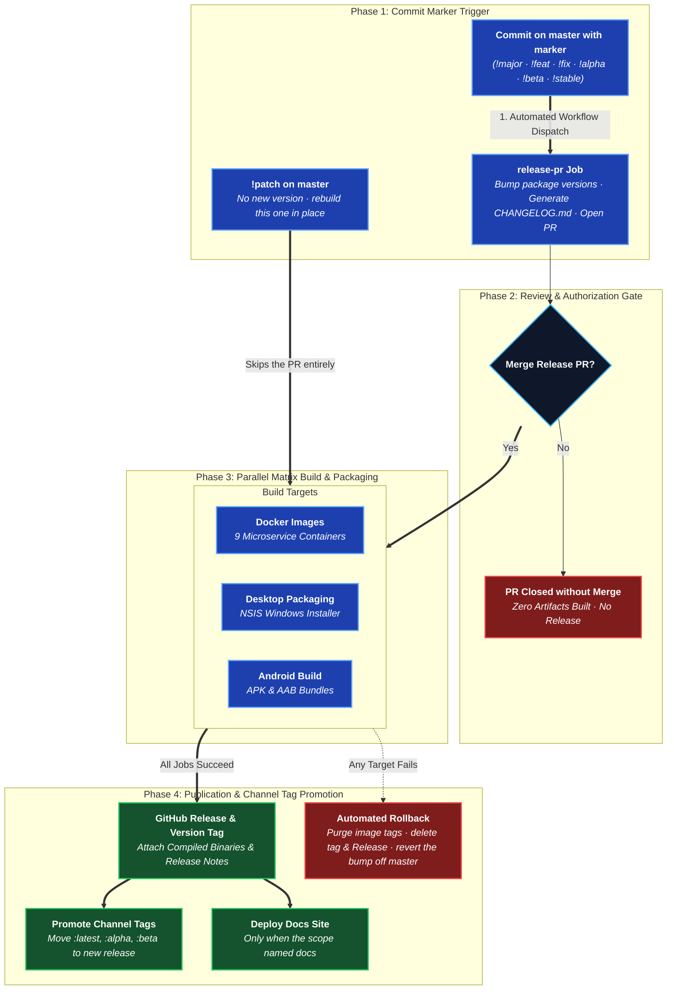

# Release Pipeline

Full source: [`development/RELEASING.md`](https://github.com/aiyu-ayaan/BetweenUs/blob/master/development/RELEASING.md)
and [`.github/workflows/release.yml`](https://github.com/aiyu-ayaan/BetweenUs/blob/master/.github/workflows/release.yml).

One version number covers the server images, the Windows desktop build and
the Android artifacts. A release doesn't have to rebuild all of it — what it
skips is carried forward from the previous release rather than left behind.

## Two steps, not one



1. **The marker commit opens a release PR.** It bumps `package.json` and
   `apps/desktop/package.json`, writes the `CHANGELOG.md` entry, and records
   what's being built in `.github/release-targets`. Nothing is built yet —
   the diff is the last look before it ships.
2. **Merging that PR is what releases.** Images → desktop installer →
   Android APKs and AAB (one job each, in parallel) → the tag and GitHub
   Release → the moving tags
   (`latest`, `alpha`/`beta`) re-pointed dead last, only once every artifact
   and the Release itself exist.

## Markers

| Marker | Effect |
| --- | --- |
| `!major` | `1.4.2` → `2.0.0`, stable |
| `!feat` | `1.4.2` → `1.5.0`, stable |
| `!fix` | `1.4.2` → `1.4.3`, stable |
| `!alpha` | `0.0.1` → `0.0.2-alpha.1`, pre-release |
| `!beta` | promotes to `0.0.2-beta.1`, same base version |
| `!stable` | promotes to `0.0.2`, no version bump |
| `!patch` | no new version — rebuilds the artifacts of the current one |

A push with no marker releases nothing. A channel promotes but never
demotes in place. When a push carries several markers the strongest wins,
and `!patch` is the weakest — a push asking for both a release and a
rebuild of the old one wants the release, which already contains it.

## Scoping to one platform

```text
!alpha(android)        Android artifacts only
!fix(android,desktop)  both clients, no server images
!feat(docker)          the nine service images only
!feat                  everything (empty scope = all)
!fix(android,docs)     the APKs, and the docs site after the release
```

A scope that isn't entirely known names (`docker`/`desktop`/`android` and
their aliases, plus `docs`) is read as an ordinary conventional-commit
scope and changes nothing — `!feat(chat)` still builds everything.

`docs` is the odd name out: not a platform, and it never narrows what is
built. It asks for the Docusaurus site to be deployed once the release is
published — `!fix(docs)` is still a full release, `!fix(android,docs)` is
still only the APKs. It uses `docs.yml`'s build and shares its concurrency
group, and it sits outside the rollback story: a Pages outage should not
undo a release whose images and installers are already out.

## What a skipped platform gets

Not left behind — carried forward. `<service>-<version>` image tags exist
for every service every release, either freshly built or named a second
time (`.github/scripts/retag.sh`, no rebuild and no pull) from the last
release's tag. The
Windows installer and Android APKs are likewise downloaded from the
previous GitHub Release and re-attached under this version's release,
keeping their own (older) filenames — which is the honest answer to "which
build is this." The CHANGELOG carries a table saying exactly which half of
each release is which.

## Rebuilding a release that exists

A release can be wrong without the version being wrong — an installer built
against the wrong API URL, an image built before a secret was set. `!patch`
replaces the artifacts of the version `master` already carries and produces
no new one.

```text
!patch                 rebuild everything for this version
!patch(desktop)        replace the installer, leave the rest alone
!patch(docker,docs)    replace the images, and redeploy the docs site
```

It skips the release PR entirely (a patch has no diff to show). The image
tags are moved onto the new build, which leaves the images they named
before untagged; the deploy that follows passes `--force-recreate`, because
a deploy of the version already running is a replacement; the installers and APKs replace the assets of the same
name on the Release that already exists; the tag, the CHANGELOG entry and
the version in the manifests are untouched, because the version has not
changed. A platform the scope leaves out carries forward from the release
being patched — itself — so leaving it alone is a no-op rather than a gap.

A `!patch` on a version that was never released is refused, and **a patch
is never rolled back**: the release it replaces is the one a rollback would
delete. Fix what broke and push `!patch` again; repeating it is safe.

## Manual dispatch

`workflow_dispatch` takes `mode: pr` (open a release PR by hand),
`mode: release` (build and publish whatever `master` already carries — the
way back after a rollback, or after a merged release PR this workflow
missed), or `mode: patch` (rebuild that version in place). `pr` and `patch`
both read the `targets` input for what to build.

## Getting it onto a host

The pipeline used to push nine images, move three channel tags, and stop.
`deploy` is the last job, after `promote`, and it is off unless
`vars.DEPLOY_HOST` is set — a variable and not a secret, because a job-level
`if` cannot read `secrets` and a repository with no deployment has to skip
this rather than fail on a missing key.

| Name | Kind | What it is |
| --- | --- | --- |
| `DEPLOY_HOST` | variable | The host. Setting it is what turns the job on |
| `DEPLOY_USER` | variable | Defaults to `betweenus` |
| `DEPLOY_DIR` | variable | The checkout on the host, defaults to `~/betweenus` |
| `BETWEENUS_API_URL` | variable | Checked from outside afterwards, if set |
| `DEPLOY_SSH_KEY` | secret | Private key for that user |
| `DEPLOY_KNOWN_HOSTS` | secret | The host's public key, so the connection is pinned |

The host key is pinned on purpose: `StrictHostKeyChecking=no` on a deploy
job hands the deployment's SSH session to whoever answers on that address.

The job checks out the release tag on the host and runs
[`deploy.sh`](/deployment/docker-compose#deploysh), then checks the public
URL from outside — the only place a Cloudflare tunnel that did not come back
up is visible.

A failed deploy does **not** trigger `rollback`. The host has already put
itself back on the previous images; the release is fine, and deleting its
tags over one host that would not take it throws away a good build.

:::warning Rolling back past a migration rename
An image published before the phase-35 migration rename carries the old
migration directory names, so against a database migrated by a newer
checkout it tries to apply two migrations that are already there and dies on
`relation "server_custom_roles" already exists` — and leaves a *failed*
migration behind, which makes every later `migrate deploy` refuse with
P3009 until the row is removed by hand.

`packages/database/prisma/reconcile/2026-09-02-rename-custom-roles-and-attachments.sql`
carries both directions and the `DELETE` that clears it.
:::

:::warning Deploying a new image onto a database that has the old names
The mirror image of the same problem, and the one that actually bit
`192.168.1.115`: a database that applied `20260810100000_custom_roles` before
the rename, met by a post-rename image, finds two migrations it has never
applied and dies on the same `relation "server_custom_roles" already exists`.

Both migrations are now written to re-apply as a no-op — `CREATE TABLE IF NOT
EXISTS`, and constraints dropped before they are added — so a forward deploy
heals itself. What it cannot clear is a failed row an earlier deploy already
recorded:

```sql
DELETE FROM "_prisma_migrations"
 WHERE migration_name = '20260816150000_custom_roles' AND finished_at IS NULL;
```

Run that, then the reconcile file, then redeploy.
:::

## On failure

`rollback` deletes the version's image tags, deletes any tag and Release
that got as far as existing, and reverts the version bump and CHANGELOG
entry off `master`. The channel tags (`latest`, `alpha`, `beta`) are
deliberately left untouched — they still point at the last release that
finished, which is why `promote` runs dead last.

The revert is what used to be missing. The bump survived a failure, and a
`master` claiming a version nobody published is what the *next* release
computes from: a failed `v0.0.7` made the next one `v0.0.8`, skipping
`v0.0.7` for good and leaving a CHANGELOG entry whose every download link
was dead. Now the same marker can simply be pushed again. The revert commit
carries `[skip ci]`, because a push that lowers the version field otherwise
looks to the workflow exactly like a release PR landing; if branch
protection refuses the push, the run summary says the bump is still there.
