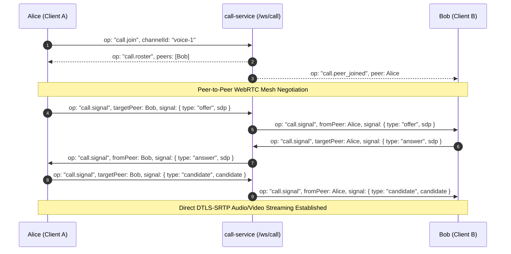

# WebSocket Gateway Protocol

BetweenUs operates two distinct WebSocket ingress gateways:
1. **`/ws/chat`**: Real-time message fanout, typing indicators, read receipts, and presence updates.
2. **`/ws/call`**: Low-latency WebRTC mesh signaling, peer connection management, synchronized Listen Together playback, and server-refereed game state machines.

---

## 0. Connection Liveness & Reconnection

Every gateway (`/ws/chat`, `/ws/presence`, `/ws/call`, `/ws/remote`) replies to a
`ping` frame with `pong`, and pings at the protocol level itself, terminating
sockets that stop answering. Clients are expected to hold up their half:

| Behaviour | Value |
| :--- | :--- |
| Reconnect backoff | 1s doubling to 30s |
| Show "Disconnected" | after 30s down |
| Keep retrying while disconnected | every 30s, until back or signed out |
| Handshake timeout | 10s |
| Idle probe | `ping` every 25s, `pong` expected within 10s |

A socket that reads as open is not evidence that it is: a suspended laptop or a
dozing phone leaves a connection that will never deliver another byte and never
close. Clients therefore probe rather than trust, and re-probe whenever the app
returns to the foreground or the device finds a network again. A `4401` close
code means the access token was rejected, not that the connection failed - the
client refreshes the token and stays on the reconnect ladder.

Implementation: `apps/desktop/src/services/socket.ts`,
`apps/android/core/.../data/Sockets.kt`.

---

## 1. Chat Gateway (`/ws/chat`)

### Connection Handshake
Clients connect to `/ws/chat` providing their JWT access token either via standard `Authorization` header or query parameter:
```text
wss://betweenus.local/ws/chat?token=<jwt-access-token>
```

### Frame Envelope
All chat frames are JSON strings conforming to the following structure:
```typescript
export interface WebSocketMessage<T = unknown> {
  /** Operation opcode identifying event type. */
  op: string;
  /** Correlated sequence number for message ordering and gap detection. */
  seq?: number;
  /** Event payload. */
  d: T;
}
```

### Client Opcodes (`ClientChatEvent`)

| Opcode | Payload Schema | Description |
| :--- | :--- | :--- |
| `chat.subscribe` | `{ channelId: string }` | Subscribes caller to receive real-time events for a channel. |
| `chat.unsubscribe` | `{ channelId: string }` | Leaves channel subscription. |
| `chat.typing` | `{ channelId: string }` | Broadcasts typing indicator (expires automatically after 5s). |
| `chat.read` | `{ channelId: string; messageId: string }` | Marks read position; synchronizes unread badges across devices. |
| `ping` | `{}` | Heartbeat keep-alive ping (sent every 30s). |

### Server Opcodes (`ServerChatEvent`)

| Opcode | Payload Schema | Description |
| :--- | :--- | :--- |
| `chat.message_created` | `Message` | Broadcasts a newly posted message (plaintext or encrypted). A thread reply is the same event with `threadRootId` set; clients keep it out of the channel timeline. |
| `chat.message_updated` | `Message` | Broadcasts an edited message or content modification. Carries `editCount` (earlier versions held), which is what makes an "(edited)" marker clickable. Also how a thread root's `thread` summary (`replyCount`, `lastReplyAt`) changes when a reply is sent, deleted or expires. A vote, a retraction and a close on a poll arrive as this event too, carrying the whole `Message` with its refreshed `poll.tallies` - who chose what, by user id, the way `reactions` carries who reacted. |
| `thread.follow` | `{ thread: ThreadFollowState }` | This account's follow or unread state in one thread moved: it followed or unfollowed, read it on some device, or a reply was sent, deleted or expired. Sent to that account's own sockets only, with the count already worked out. |
| `chat.message_deleted` | `{ channelId: string; messageId: string }` | Broadcasts message deletion / tombstone render. |
| `chat.reaction_added` | `{ messageId: string; emoji: string; userId: string }` | Real-time emoji reaction addition. |
| `chat.reaction_removed`| `{ messageId: string; emoji: string; userId: string }` | Real-time emoji reaction removal. |
| `chat.typing` | `{ channelId: string; userId: string; username: string }` | Live typing indicator broadcast. |
| `presence.update` | `{ userId: string; status: ActiveStatus; customStatus?: string }` | User presence transition. |
| `pong` | `{}` | Heartbeat acknowledgment from the server. |

---

## 2. Call Switchboard Gateway (`/ws/call`)

### Connection Handshake
```text
wss://betweenus.local/ws/call?token=<jwt-access-token>&channelId=<voice-channel-id>
```

### Signaling Architecture
The call switchboard does NOT route or process audio/video frames. Instead, it coordinates WebRTC **SDP offer/answer exchanges** and **ICE candidates** so peer devices can form a direct, end-to-end encrypted mesh:



### Call Opcodes (`ClientCallEvent` / `ServerCallEvent`)

```typescript
export type ClientCallEvent =
  | { op: 'call.join'; channelId: string; hasAudio: boolean; hasVideo: boolean }
  | { op: 'call.leave' }
  | { op: 'call.signal'; targetPeerId: string; signal: CallSignal }
  | { op: 'call.media_state'; hasAudio: boolean; hasVideo: boolean; hasScreen: boolean }
  | { op: 'call.game_action'; action: GameAction }
  | { op: 'call.listen_action'; action: ListenAction };

export type ServerCallEvent =
  | { op: 'call.roster'; peers: CallPeer[] }
  | { op: 'call.peer_joined'; peer: CallPeer }
  | { op: 'call.peer_left'; peerId: string }
  | { op: 'call.signal'; fromPeerId: string; signal: CallSignal }
  | { op: 'call.media_state'; peerId: string; hasAudio: boolean; hasVideo: boolean; hasScreen: boolean }
  | { op: 'call.game_state'; state: GameSession }
  | { op: 'call.listen_state'; state: ListenSession };
```

---

## 3. Listen Together Synchronization Protocol

Synchronized YouTube playback uses an authoritative timeline engine. The host broadcasts track changes and play/pause timestamps; each participant calculates the current playback position deterministically:

```typescript
export interface ListenSession {
  channelId: string;
  hostUserId: string;
  currentTrack: ListenTrack | null;
  queue: ListenTrack[];
  /** Host server timestamp when playback started or resumed. */
  startedAt: number | null;
  /** Playback position in milliseconds when track was paused. */
  pausedAtMs: number | null;
  isPlaying: boolean;
}

/**
 * Calculates current track playback position across all peers identically.
 */
export function listenPositionAt(session: ListenSession, nowMs: number): number {
  if (!session.isPlaying || session.startedAt === null) {
    return session.pausedAtMs ?? 0;
  }
  return (session.pausedAtMs ?? 0) + (nowMs - session.startedAt);
}
```
