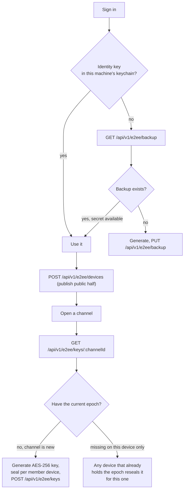

# End-to-End Encryption

Full source: [`development/E2EE.md`](https://github.com/aiyu-ayaan/Nexora/blob/master/development/E2EE.md).

## Threat model

**Protected against**: a reader of the database, a backup, Redis, or the
Nginx logs — none of them holds a key that opens a message. Call media
never touches the server at all (see
[Peer-to-Peer Media](/architecture/media)), so there's no server copy to
read in the first place.

**Not protected against**: a compromised client (the keys live there), and
metadata — the server still knows who wrote to which channel and when, and
how big each message was.

## One key per machine

A channel's symmetric AES-256-GCM key is wrapped once per **device**, not
once per account (`ChannelKey`, one row per `(channel, epoch, recipient
user, recipient device)`). That's what lets a single device be revoked
without rotating an identity every other machine is also using — and what
lets "who can open this channel" be answered by the wrap table directly.

## Repairing a second device — without over-sharing

`GET /api/v1/e2ee/keys/:channelId` answers two questions: who's missing the
**current** epoch (keeps the next message readable), and who's missing
**any** epoch their owner already holds on another machine (lets a phone
signed in today read history from before it existed). The second is
deliberately bounded — "their owner already holds it" — so a new device
only ever recovers access the same person already has elsewhere, never a
year of history handed to someone who joined yesterday.

## Revocation

Deletes the wraps addressed to that device and refuses to seal for it
again; the row itself stays, because "when a machine stopped being trusted"
is the only thing anyone can audit afterwards. Every channel that device
could read is marked stale and re-keys. Registering a revoked device id
again is refused rather than silently un-revoking — the machine asking is
running the same code that would let it un-revoke itself.

What revocation does **not** do: reach what the device already decrypted,
or stop a still-logged-in session from continuing (that's what ending the
session is for — two different actions, both needed).

## Pieces

| Piece | Where it lives | Who can read it |
| --- | --- | --- |
| Device identity key (ECDH P-256) | Private half sealed in the OS keychain, per machine | That machine |
| Device public keys | `device_keys` table | Everyone in the server |
| Sealed identity backup | `identity_backups` table | Whoever knows the account password or a recovery passphrase |
| Channel key (AES-256-GCM) | In memory on member devices | Channel members |
| Wrapped channel key | `channel_keys` table | Only the device it was sealed for |
| Message body | `messages.content` | Channel members |
| Attachment bytes | Object storage | Channel members (session to fetch, channel key to read) |
| Voice/video media | DTLS-SRTP, direct between peers | The two people on that connection |
| Avatars / server icons | Object storage | **Anyone with the URL** — deliberately public |

## Deliberate leaks

- **Reactions are plaintext** (`MessageReaction.emoji`) — the server has to
  count them for recipients who don't currently hold the channel key, and
  encrypting per-recipient would need a key exchange per thumbs-up.
- **Attachment size and count are known** to the server via the
  `Attachment` row, even though the file's name, type and contents stay
  sealed inside the message envelope.
- **Avatars and server icons are unencrypted** by necessity — an ``
  tag can't carry an authorization header, and a member list renders them
  for people who hold no channel key at all.

## Identity backup: the one boundary that moved

The backup is sealed with a key derived from the account password, and the
password is something a *live* server sees at sign-in. So a **stolen
database opens nothing** (passwords are bcrypt-hashed, the backup is
ciphertext), but a **compromised running server** could capture a password
in use and open that user's backup afterward. Anyone whose threat model
includes the running deployment should set a recovery passphrase instead —
it is never sent anywhere in any form.
