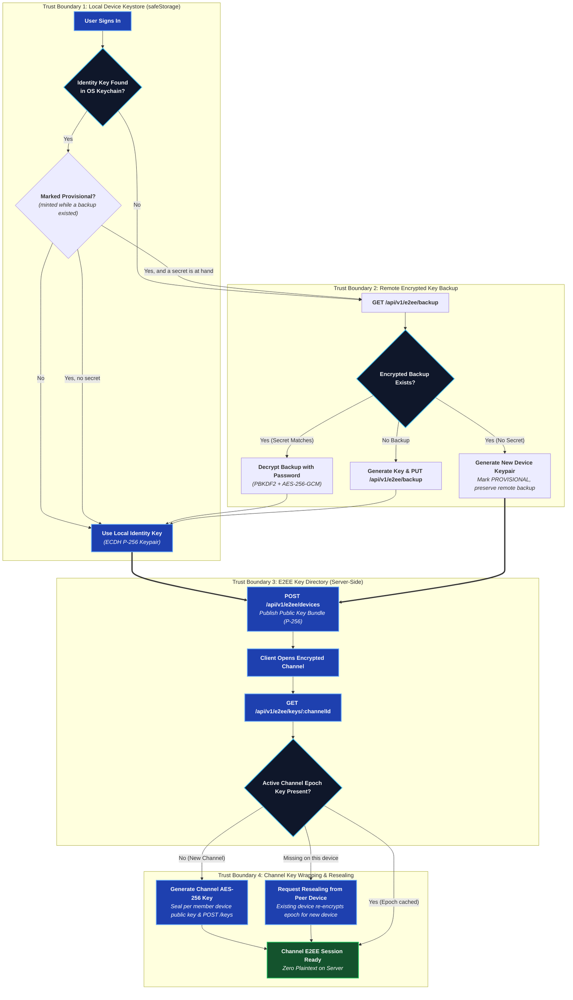
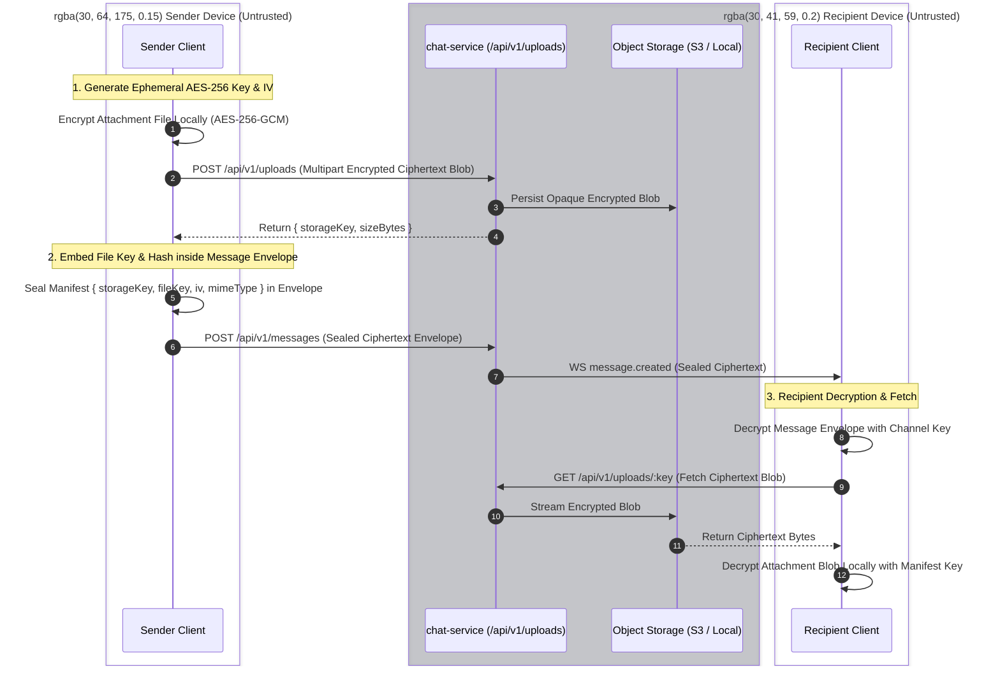

# End-to-End Encryption

Full source: [`development/E2EE.md`](https://github.com/aiyu-ayaan/BetweenUs/blob/master/development/E2EE.md).

## Threat model

**Protected against**: a reader of the database, a backup, Redis, or the
Nginx logs — none of them holds a key that opens a message. Call media
never touches the server at all (see
[Peer-to-Peer Media](/architecture/media)), so there's no server copy to
read in the first place.

**Not protected against**: a compromised client (the keys live there), and
metadata — the server still knows who wrote to which channel and when, and
how big each message was.

## One key per machine

A channel's symmetric AES-256-GCM key is wrapped once per **device**, not
once per account (`ChannelKey`, one row per `(channel, epoch, recipient
user, recipient device)`). That's what lets a single device be revoked
without rotating an identity every other machine is also using — and what
lets "who can open this channel" be answered by the wrap table directly.

## Repairing a second device — without over-sharing

`GET /api/v1/e2ee/keys/:channelId` answers two questions: who's missing the
**current** epoch (keeps the next message readable), and who's missing
**any** epoch their owner already holds on another machine (lets a phone
signed in today read history from before it existed). The second is
deliberately bounded — "their owner already holds it" — so a new device
only ever recovers access the same person already has elsewhere, never a
year of history handed to someone who joined yesterday.

## Letting a new member read the history

The one deliberate exception to that bound, and it is a decision somebody
makes rather than a default. Adding a member (`POST
/api/v1/servers/:serverId/members`) takes `shareHistory`, which is stored on
`server_members.historyShared` and is `false` unless asked for.

With it set, the gap list above stops asking whether that member already
holds an epoch and offers their devices **every** epoch of every channel in
the server. The server still hands over nothing itself — it holds no key —
and the publish rules are unchanged: a caller may only add entries to an
epoch it already holds. So the history opens the first time a machine that
holds those keys opens the channel, not the moment the member is added.
An account whose fellow members are all offline waits until one is back.

Clearing the flag takes nothing back. A key that has been sealed for a
device has been sealed.

Without it, the default stands: a newcomer mints the next epoch, reads from
the moment they arrive, and everything before that stays a padlock.

## The one body the server can read: webhooks

Everything above assumes every author holds a channel key. One kind of author
does not and cannot: a webhook — a URL a build server, an alerting stack or a
`curl` in a deploy script posts into a channel with. It holds no key, it cannot
be given one (handing a channel key to a shell script hands away the channel to
everyone who can read that script, permanently), and it could not use one
without this project shipping its crypto to every language anybody writes a
deploy script in.

So a webhook's message is stored and delivered **in the clear**, and it is the
one documented exception to the sealed-envelope rule. It is made visible rather
than hidden:

- `Message.kind` is `WEBHOOK`, which is a column the server sets and every
  client reads.
- Every client draws those messages with a `WEBHOOK · NOT ENCRYPTED` badge, on
  every message rather than once per group — a group scrolled half off the top
  of the screen would otherwise be unencrypted with nothing saying so.
- The settings panel that creates one says so *before* the button.

A channel with a webhook on it has a guarantee of "everything except what the
robots say", and the clients say exactly that instead of implying more. Nothing
about it weakens a person's message: `POST /api/v1/messages` still takes a
sealed envelope and chat-service still cannot open one. See
[Webhooks](../services/webhooks.md).

## Moments: sealed, with the audience frozen

A moment — a post that expires after 24 hours, called a status in the code — is
end-to-end encrypted like a message. What differs is where its audience comes
from, and that difference is the whole design.

A message is sealed for a channel, whose members are known when it is sent. A
moment has no channel: its audience is a friend list, and a friend list changes
after the post is written. Sealing it therefore means choosing between
re-wrapping a key for every friendship made while the post is alive and freezing
the audience at the moment of posting. **Freezing is the choice** — and it is
not a compromise, it is the behaviour every app with this feature has: somebody
who becomes your friend tomorrow does not get shown what you posted today.

How it works, whole:

1. Before posting, the client reads `GET /api/v1/statuses/audience` — every
   device of every friend it may post to right now, plus its own, with revoked
   machines already filtered out.
2. It mints one AES-256-GCM key for the post, seals the caption as an
   `EncryptedEnvelope` and the file as ciphertext under it.
3. It wraps that key once per device, by the same ECDH → HKDF → AES-GCM wrap a
   channel key uses, and posts the bundle with the ciphertext.
4. The server writes one `status_keys` row per wrap. That table **is** the
   audience: no row, no key, nothing to read.

There is no epoch and no rekey. A moment is written once and gone within a day,
so there is nothing to rotate — and nothing to hand a newcomer either.

The server still checks the friend list on every read, because it answers a
question the wrap does not: unfriending or blocking does not delete a wrap
already written, and a post from somebody you have since blocked has to leave
the tray. It also refuses to write a wrap addressed to somebody the author may
not post to, which closes the gap between the client reading the directory and
the post landing.

What this costs, said plainly:

- A machine that signs in after a post was written cannot open it. Its key was
  wrapped for the machines you had at the time, and there is no gap-filling for
  moments the way there is for channel epochs — the post expires before the
  repair would be worth having.
- Whether somebody posted, when, how long a video runs and what colour a text
  post is drawn on stay in the clear: the server times the sweep with them, and
  the clients draw the tray with them.
- `mediaType` is in the clear too. The server cannot sniff ciphertext and a
  player will not decode a blob with no type, so the author sends what the bytes
  are once opened — stored exactly as sent, and never treated as a fact about
  the object on disk.
- The viewer list is readable by the author and nobody else. Everyone else can
  only ever learn whether *they* opened something.

The two smaller things outside the envelope are unchanged and unrelated:
reaction emoji, and the `viewOnce` flag on a one-time message — in each case
because the server has to act on it, and a server that cannot read the body
cannot be told by the body.

## Revocation

Deletes the wraps addressed to that device and refuses to seal for it
again; the row itself stays, because "when a machine stopped being trusted"
is the only thing anyone can audit afterwards. Every channel that device
could read is marked stale and re-keys. Registering a revoked device id
again is refused rather than silently un-revoking — the machine asking is
running the same code that would let it un-revoke itself.

What revocation does **not** do: reach what the device already decrypted,
or stop a still-logged-in session from continuing (that's what ending the
session is for — two different actions, both needed).

## Pieces

| Piece | Where it lives | Who can read it |
| --- | --- | --- |
| Device identity key (ECDH P-256) | Private half sealed in the OS keychain, per machine | That machine |
| Device public keys | `device_keys` table | Everyone in the server |
| Sealed identity backup, one per secret kind | `identity_backups` table | Whoever knows the account password or a recovery passphrase |
| Channel key (AES-256-GCM) | In memory on member devices | Channel members |
| Wrapped channel key | `channel_keys` table | Only the device it was sealed for |
| Message body | `messages.content` | Channel members |
| Attachment bytes | Object storage | Channel members (session to fetch, channel key to read) |
| Voice/video media | DTLS-SRTP, direct between peers | The two people on that connection |
| Avatars / server icons | Object storage | **Anyone with the URL** — deliberately public |

### E2EE Encrypted Attachment & Blob Lifecycle

## Forwarding

A forwarded message is a **new message, not a pointer to the original**. It has
to be: the body and every attachment blob are sealed under the key of the
channel they were written in, and nobody in the channel it lands in holds that
key. So the forwarding client decrypts what it already can read, re-seals it
for the destination, and uploads the files again under the destination's
current epoch.

Riding inside that new envelope is `forwardedFrom` — the original author and
the channel it was taken from — which is what the "Forwarded from …" tag on the
bubble reports. It carries no message id, deliberately: a jump-to-it link would
point at a channel the reader may not be allowed to open.

The server is not told any of this. A forward reaches it as an ordinary message
with an ordinary envelope, and there is no endpoint for it.

## Deliberate leaks

- **Reactions are plaintext** (`MessageReaction.emoji`) — the server has to
  count them for recipients who don't currently hold the channel key, and
  encrypting per-recipient would need a key exchange per thumbs-up.
- **Attachment size and count are known** to the server via the
  `Attachment` row, even though the file's name, type and contents stay
  sealed inside the message envelope.
- **A one-time message announces that it is one** (`Message.viewOnce`), and
  when it was opened. The flag has to be outside the envelope: burning is a row
  update and a blob delete, both the server's work, and a server that cannot
  read the body cannot be told by the body. Keeping it inside would make
  "one-time" a promise kept only by software the sender does not control, which
  is not a promise. Nothing about the content leaks — not its name, type or
  size beyond what the `Attachment` row already says.
- **A message's expiry is plaintext** (`Message.expiresAt`). The server has to
  know when to delete the row, which is the whole feature.
- **Avatars and server icons are unencrypted** by necessity — an ``
  tag can't carry an authorization header, and a member list renders them
  for people who hold no channel key at all.

## Identity backup: the one boundary that moved

The backup is sealed with a key derived from the account password, and the
password is something a *live* server sees at sign-in. So a **stolen
database opens nothing** (passwords are bcrypt-hashed, the backup is
ciphertext), but a **compromised running server** could capture a password
in use and open that user's backup afterward. Anyone whose threat model
includes the running deployment should set a recovery passphrase instead —
it is never sent anywhere in any form.

An account holds **one backup per secret kind**, not one in total. Setting a
recovery passphrase used to overwrite the password-sealed blob, and that blob is
the only one a fresh sign-in holds the secret for — the password is in hand at
that moment and nothing else is. Losing it meant every later sign-in on a new
device fell into the fork below and stayed there. The passphrase now sits beside
the password backup, and the switch that turns password recovery off is a
deliberate choice on the same screen rather than a side effect.

### Signing in without the secret

A sign-in that cannot open the backup is not stopped and is never asked for a
secret. A launch from a stored token has no password to hand, and an account
that has only ever signed in with GitHub or Google has no password *at all* —
so the machine generates a key pair of its own and carries on.

Two properties make that safe rather than lossy:

- The machine leaves the backup exactly as it found it. Promoting a
  self-minted key to the account's backup would lock out every machine still
  restoring from the real one, so only a deliberate "set a recovery
  passphrase" (or a password change) ever replaces it.
- `channel_keys` is addressed per `recipientDeviceId`, so the new machine
  publishes its own public half under its own device id and takes nothing away
  from the rows already sealed for the others.
- The self-minted key is **marked provisional** whenever the account had a
  backup this machine could not open, and the next sign-in carrying a secret
  tries the backup again rather than short-circuiting on it. Unmarked, that key
  ended the story: a device signed in with the correct account password read
  every message the account had ever been sent as a padlock, for the life of the
  install, and nothing on screen said why.

The cost is that history is not instant there. It reads what arrives from now
on, and older conversations fill in as the account's other machines open them —
the same "repairing a second device" path above. Supplying the secret (signing
in with the account password, or setting a recovery passphrase) restores the
account key outright and is the only instant path — and, because the key was
marked, signing in with the password later works just as well as signing in with
it first.

## Safety numbers

Everything above protects a message from whoever reads the database. None of
it protects against the server **handing out the wrong public key** — a client
has no way to tell a stranger's key from a substituted one, because it asked
the server and the server answered.

A safety number is the answer to that. Two people compare sixty digits over
something that is not this app — a phone call, a room — and a match means they
hold each other's real keys. It's in a member's menu, under **Verify safety
number**.

### What the number is over

The directory holds one key per *machine*, so a per-device number would mean
comparing n×m strings with somebody who owns a laptop and a phone. The number
is over a user's whole active device set instead: every published key, sorted
by device id, as raw curve points rather than JWK text — two clients that
serialise the same key with fields in a different order would otherwise compute
different numbers for the same person, and that failure would look exactly like
an attack.

That gives the property the feature exists for. **A server that adds a device
to somebody's directory changes their safety number**, which is exactly how it
would go about reading their messages. So does genuinely buying a phone, and
the client cannot tell those apart — which is why a changed number says what
happened rather than what it means, and asks the two people to check again.

The algorithm is Signal's numeric fingerprint and deliberately not something
invented here: iterated SHA-512 over the key material and the user id,
truncated to 30 bytes, read as six groups of five decimal digits, with the two
halves sorted so neither person has to go first. The 5200 iterations are the
point of it — a 30-digit truncation is short enough to read aloud, so making
each guess cost 5200 hashes is what stops somebody grinding out a key that
collides with a number you already trust.

### Two limits

- **Verification is stored per machine and never on the server.** A server that
  could mark somebody verified could substitute their key and then reassure the
  person about it. A second device verifies for itself.
- **There is no badge in the member list.** The iteration count that makes a
  fingerprint hard to forge also makes it too slow to compute for every row of a
  column. A key that changed since it was checked is reported when the dialog is
  next opened, not the moment it changes.

No endpoint was added for any of this. The dialog reads the same
`GET /api/v1/e2ee/devices?channelId=` the channel already uses — asking about
somebody through a channel you share is a question you were already entitled to
ask, and a per-user lookup would have been a new one.
