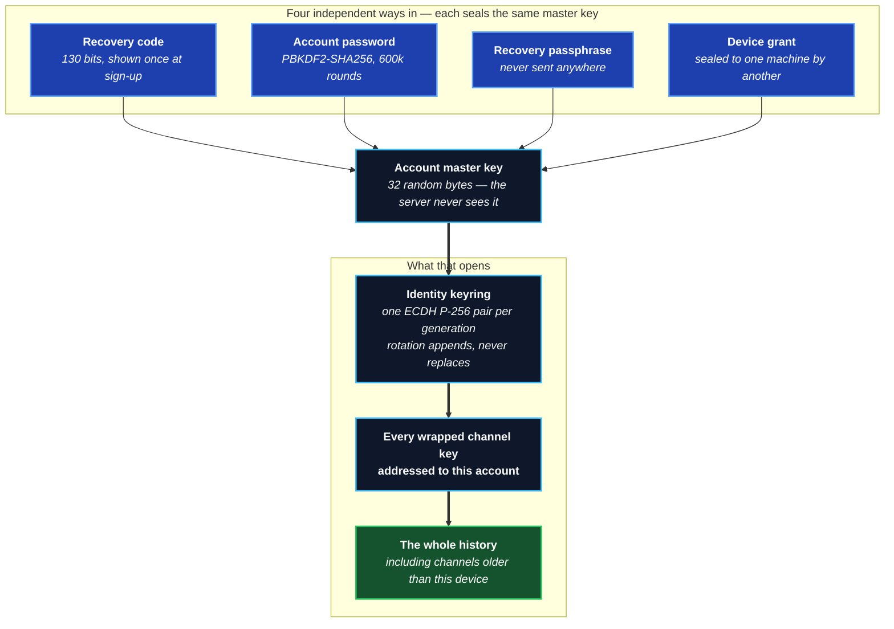
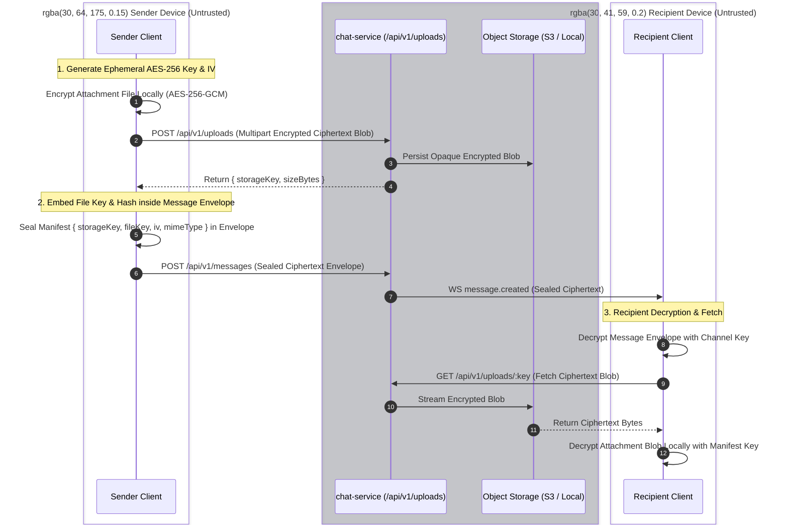

# End-to-End Encryption

Full source: [`development/devdocs/E2EE.md`](https://github.com/aiyu-ayaan/BetweenUs/blob/master/development/devdocs/E2EE.md).

## Threat model

**Protected against**: a reader of the database, a backup, Redis, or the
Nginx logs — none of them holds a key that opens a message. Call media
never touches the server at all (see
[Peer-to-Peer Media](/architecture/media)), so there's no server copy to
read in the first place.

**Not protected against**: a compromised client (the keys live there), and
metadata — the server still knows who wrote to which channel and when, and
how big each message was.

## One identity per account — not one per machine

A channel's symmetric AES-256-GCM key is wrapped once per **account**
(`ChannelKey`, one row per `(channel, epoch, recipient user)`, filed under
the recipient id `@account`). Every device you sign in on opens the same
row, so your whole history is there the moment you sign in — with no other
device online, and nothing to wait for.

This is the most important thing on this page, and it is worth saying what
it replaced, because the previous design lost people's conversations.

### What went wrong before

Keys used to be wrapped per **device**. Three things followed:

1. A device that did not exist when a key generation was created held
   nothing for it.
2. The only thing in the world that could seal one for it was another
   device that *already* held that generation. So history arrived — if it
   arrived — whenever one of your other machines next opened that channel.
3. **If no such machine ever came online again, those messages were gone.**
   Not delayed. A reinstall, a wiped laptop, a phone you revoked, a
   single-device account starting over: the only key that opened those
   messages ceased to exist, and the server had never held one.

There was a fourth, worse case. A device that could not open the account
backup would quietly generate an identity of its own and carry on looking
normal — so one account ended up with several identities, each able to read
a different slice of its own history. What you saw was an empty channel and
a line suggesting you open the app on the device you first signed in with,
which was advice about a machine that might no longer exist.

### The account vault

**Your account has an identity, and your devices open it.** The identity is
a *keyring* rather than a single key — rotating it after losing a laptop
adds a generation and leaves every earlier one in place, so nothing already
sealed ever stops opening.

**Every account gets a recovery code at sign-up, shown once.** It is not
derived from your password, so a password reset does not touch it; it is
not on any of your devices, so losing them does not touch it. It is the
reason the answer to "I lost everything" is now a code on a piece of paper
rather than an apology. The server refuses to let you remove your last
portable way in.

### Signing in on a new device

Whichever of these happens, the outcome is the same: your history is there.

- **With your password** — the vault opens with nothing extra typed.
- **With your recovery code or passphrase** — typed once on the unlock
  screen. Needs no other device.
- **By approving it from a device already signed in** — the two screens
  show the same fingerprint, you check they match, and you tap approve.

### A device that cannot get in is locked, not broken

If a device can open none of those — a provider sign-in with no password, a
launch from a stored session — it says so and stops. It does **not** invent
an identity, mint keys, or write anything, so nothing about the state is
one-way. It draws one screen with all three ways in on it, and comes to
life the moment you use any of them.

### Messages written under the old design

Those keys are sealed to one installation and only that installation can
open them. So it re-seals them to your account — on every channel it opens,
and once across every channel each time you sign in, because that window
closes if the device is ever wiped. After that the conversation is readable
from every device you own, including ones you have not set up yet.

**Honestly stated**: a generation whose only key went with a machine that
no longer exists cannot be recovered — not by you, not by the operator, not
by anybody. `GET /api/v1/e2ee/health` reports those rather than drawing
padlocks and implying somebody is coming.

## Repairing access — without over-sharing

`GET /api/v1/e2ee/keys/:channelId` answers three questions: who is missing
the **current** generation (the sender clears that list *before* it seals,
so a message is never written under a key a member cannot open), which
earlier generations a member was deliberately let in on, and which
generations this device still holds only in the old per-device form and
should re-seal to its account.

Repairing somebody's *own* second device is no longer one of them. There is
nothing to repair: it opens the same row the first device does.

## Letting a new member read the history

The one deliberate exception, and it is a decision somebody makes rather
than a default. Adding a member (`POST /api/v1/servers/:serverId/members`)
takes `shareHistory`, which is stored on `server_members.historyShared` and
is `false` unless asked for.

With it set, the gap list offers that member **every** generation of every
channel in the server. The server still hands over nothing itself — it
holds no key — and the publish rules are unchanged: a caller may only add
entries to a generation it already holds. So the history opens the first
time a member who holds those keys opens the channel, not the moment the
new member is added.

Clearing the flag takes nothing back. A key that has been sealed for an
account has been sealed.

Without it, the default stands: a newcomer reads from the moment they
arrive, and everything before that stays a padlock.

## The one body the server can read: webhooks

Everything above assumes every author holds a channel key. One kind of author
does not and cannot: a webhook — a URL a build server, an alerting stack or a
`curl` in a deploy script posts into a channel with. It holds no key, it cannot
be given one (handing a channel key to a shell script hands away the channel to
everyone who can read that script, permanently), and it could not use one
without this project shipping its crypto to every language anybody writes a
deploy script in.

So a webhook's message is stored and delivered **in the clear**, and it is the
one documented exception to the sealed-envelope rule. It is made visible rather
than hidden:

- `Message.kind` is `WEBHOOK`, which is a column the server sets and every
  client reads.
- Every client draws those messages with a `WEBHOOK · NOT ENCRYPTED` badge, on
  every message rather than once per group — a group scrolled half off the top
  of the screen would otherwise be unencrypted with nothing saying so.
- The settings panel that creates one says so *before* the button.

A channel with a webhook on it has a guarantee of "everything except what the
robots say", and the clients say exactly that instead of implying more. Nothing
about it weakens a person's message: `POST /api/v1/messages` still takes a
sealed envelope and chat-service still cannot open one. See
[Webhooks](../services/webhooks.md).

## Moments: sealed, with the audience frozen

A moment — a post that expires after 24 hours, called a status in the code — is
end-to-end encrypted like a message. What differs is where its audience comes
from, and that difference is the whole design.

A message is sealed for a channel, whose members are known when it is sent. A
moment has no channel: its audience is a friend list, and a friend list changes
after the post is written. Sealing it therefore means choosing between
re-wrapping a key for every friendship made while the post is alive and freezing
the audience at the moment of posting. **Freezing is the choice** — and it is
not a compromise, it is the behaviour every app with this feature has: somebody
who becomes your friend tomorrow does not get shown what you posted today.

How it works, whole:

1. Before posting, the client reads `GET /api/v1/statuses/audience/accounts` —
   every friend it may post to right now, plus its own account.
2. It mints one AES-256-GCM key for the post, seals the caption as an
   `EncryptedEnvelope` and the file as ciphertext under it.
3. It wraps that key once per **account**, by the same ECDH → HKDF → AES-GCM
   wrap a channel key uses, and posts the bundle with the ciphertext.
4. The server writes one `status_keys` row per wrap. That table **is** the
   audience: no row, no key, nothing to read.

There is no epoch and no rekey. A moment is written once and gone within a day,
so there is nothing to rotate — and nothing to hand a newcomer either.

The server still checks the friend list on every read, because it answers a
question the wrap does not: unfriending or blocking does not delete a wrap
already written, and a post from somebody you have since blocked has to leave
the tray. It also refuses to write a wrap addressed to somebody the author may
not post to, which closes the gap between the client reading the directory and
the post landing.

What this costs, said plainly:

- Somebody who becomes your friend after a post was written cannot open it.
  That is the design rather than a cost: the audience is frozen when the post
  is written, which is what every app with this feature does.

  A *device* signed in after the post used to be in the same position, and
  that one was a bug — a day-long version of the problem that lost whole
  conversations. The wrap is per account now, so a moment opens on whichever
  of your devices you happen to pick up, including one you set up an hour
  after it was posted.
- Whether somebody posted, when, how long a video runs and what colour a text
  post is drawn on stay in the clear: the server times the sweep with them, and
  the clients draw the tray with them.
- `mediaType` is in the clear too. The server cannot sniff ciphertext and a
  player will not decode a blob with no type, so the author sends what the bytes
  are once opened — stored exactly as sent, and never treated as a fact about
  the object on disk.
- The viewer list is readable by the author and nobody else. Everyone else can
  only ever learn whether *they* opened something.

The two smaller things outside the envelope are unchanged and unrelated:
reaction emoji, and the `viewOnce` flag on a one-time message — in each case
because the server has to act on it, and a server that cannot read the body
cannot be told by the body.

## Revocation

Revoking a device stops it being granted the vault again and takes it out
of the directory. The row itself stays, because "when a machine stopped
being trusted" is the only thing anyone can audit afterwards. Registering a
revoked device id again is refused rather than silently un-revoking — the
machine asking is running the same code that would let it un-revoke itself.

What revocation deliberately does **not** do is delete the account's
wrapped channel keys. They are addressed to the account, not to the
machine, so deleting them would lock you out of your own history.

So closing the door on a lost device is **two actions**, and the app offers
them together:

1. **Revoke the device.** It stops being sealed for and loses its standing.
2. **Rotate your account identity.** A new generation is added to the
   keyring, so everything sealed from now on is sealed to a public half
   that device's grant does not open. Nothing already sealed stops
   opening — that is what the keyring is for.

What neither does: reach what the device already decrypted, or stop a
still-logged-in session from continuing. Ending the session is a third
action and is also needed.

## Pieces

| Piece | Where it lives | Who can read it |
| --- | --- | --- |
| Account master key (32 bytes) | In memory, and each unlocked device's keychain | Whoever can open any one vault door |
| Account identity keyring | `account_vaults`, sealed under the master key | The same |
| Vault doors, one row each | `account_vault_factors` | Each opens for one secret, or one machine |
| Account identity public key | `account_vaults.publicKey` | Everyone — it is what others wrap to |
| Device identity key (ECDH P-256) | Private half sealed in the OS keychain, per machine | That machine. Receives vault grants and opens pre-vault keys; **not** what channel keys are addressed to |
| Device public keys | `device_keys` table | Everyone in the server |
| Sealed identity backup *(legacy)* | `identity_backups` table | Whoever knows the account password or a recovery passphrase. Read so older clients still sign in; nothing writes one |
| Channel key (AES-256-GCM) | In memory on member devices | Channel members |
| Wrapped channel key | `channel_keys` table, one row per member **account** | Only the account it was sealed for |
| Message body | `messages.content` | Channel members |
| Attachment bytes | Object storage | Channel members (session to fetch, channel key to read) |
| Voice/video media | DTLS-SRTP, direct between peers | The two people on that connection |
| Avatars / server icons | Object storage | **Anyone with the URL** — deliberately public |

### E2EE Encrypted Attachment & Blob Lifecycle

### When a blob is collected

Three passes, answering three different questions. They are separate on
purpose: conflating them is how objects came to sit in storage that nothing
would ever name again.

| Pass | When | What it collects |
| --- | --- | --- |
| Immediate purge | The moment a message is deleted, burned or expires | The blobs that message named. The rows are marked first, so a storage outage mid-delete is finished by the sweep rather than lost |
| `AttachmentSweeper` | Every six hours | Uploads nobody ever sent (past their grace), blobs whose message is gone, and rows orphaned by a cascade that runs no application code |
| `StorageReconciler` | Daily | **Objects with no database row at all** |

The third is the one worth explaining. Every other pass starts from a row
and asks whether its object should go — so an object that *no* row named
was invisible to all of them. Not kept deliberately: unreachable. No query
could produce its key, so no code could produce its delete.

A replaced avatar or server icon, a photo picked for a moment that was
never posted, an upload whose bookkeeping lost a race with a dying process,
a half-finished multi-part upload: each left bytes behind indefinitely.
The reconciler walks the store itself and removes what nothing points at.

Two rules keep it from becoming the problem it solves. It reads every
reference **first**, so a failed database query deletes nothing rather than
emptying the bucket. And it leaves anything younger than a week alone,
because an object is always written *before* the row that names it —
collecting a young orphan would delete a file somebody was in the middle of
sending.

One thing it cannot collect: ciphertext whose key is gone. A message row
still references it, and the server cannot tell a message nobody *can* read
from one nobody *has* read.

## Forwarding

A forwarded message is a **new message, not a pointer to the original**. It has
to be: the body and every attachment blob are sealed under the key of the
channel they were written in, and nobody in the channel it lands in holds that
key. So the forwarding client decrypts what it already can read, re-seals it
for the destination, and uploads the files again under the destination's
current epoch.

Riding inside that new envelope is `forwardedFrom` — the original author and
the channel it was taken from — which is what the "Forwarded from …" tag on the
bubble reports. It carries no message id, deliberately: a jump-to-it link would
point at a channel the reader may not be allowed to open.

The server is not told any of this. A forward reaches it as an ordinary message
with an ordinary envelope, and there is no endpoint for it.

## Deliberate leaks

- **Reactions are plaintext** (`MessageReaction.emoji`) — the server has to
  count them for recipients who don't currently hold the channel key, and
  encrypting per-recipient would need a key exchange per thumbs-up.
- **Attachment size and count are known** to the server via the
  `Attachment` row, even though the file's name, type and contents stay
  sealed inside the message envelope.
- **A one-time message announces that it is one** (`Message.viewOnce`), and
  when it was opened. The flag has to be outside the envelope: burning is a row
  update and a blob delete, both the server's work, and a server that cannot
  read the body cannot be told by the body. Keeping it inside would make
  "one-time" a promise kept only by software the sender does not control, which
  is not a promise. Nothing about the content leaks — not its name, type or
  size beyond what the `Attachment` row already says.
- **A poll announces that it is one, and how it stands.** The server sees that
  a message is a poll, its option count, whether it is multi-choice, when it
  closes, and per-user votes as option indexes (`MessagePoll`, `PollVote`) -
  the same class of leak as reactions, and for the same reason: it has to count
  for readers who may not hold the key at the moment they ask. The question
  and the option labels stay inside the envelope, the server refuses a `poll`
  field that carries anything but numbers, and a vote index means nothing
  without the sealed labels it points into. Push notifications carry only the
  ciphertext, so the preview is built on the device.
- **A message's expiry is plaintext** (`Message.expiresAt`). The server has to
  know when to delete the row, which is the whole feature.
- **Avatars and server icons are unencrypted** by necessity — an ``
  tag can't carry an authorization header, and a member list renders them
  for people who hold no channel key at all.

## The one boundary that moved: password recovery

The `password` door is sealed with a key derived from your account
password, and the password is something a *live* server sees at sign-in. So
a **stolen database opens nothing** (passwords are bcrypt-hashed, every
door is ciphertext), but a **compromised running server** could capture a
password in use and open that account's vault afterwards.

Anyone whose threat model includes the running deployment should turn the
password door off. That is safe to do now in a way it was not before: every
account is created with a recovery code, so removing the password door
leaves one standing by construction — and the server refuses the removal if
it would not.

### Signing in without a secret

A sign-in that carries no secret — a launch from a stored session, or an
account that has only ever signed in with GitHub or Google and has no
password at all — leaves the device **locked** rather than improvising.

It generates nothing, publishes nothing, and writes nothing. It shows one
screen with three ways in: type the recovery code, type a passphrase, or
approve the device from one already signed in. The moment any of them
succeeds, the whole history is there.

This is the part that changed, and it changed because the old behaviour
lost data. Such a device used to generate an identity of its own and carry
on looking normal — so the account had two identities, the new one could
read nothing already sealed for the old one, and it would go on to create
new keys that the *rest* of the account could not read either. What the
person saw was a screen of padlocks and a suggestion to open the app on
their previous device.

### Approving a device

Approving seals your account's master key to whatever public key that
request carries, so the fingerprint comparison is the whole of the
security, not a formality. Both screens show the same twelve digits; the
approving device recomputes them from the key it is about to seal for
rather than trusting the number that arrived with the request. If they do
not match, somebody else is asking.

## Safety numbers

Everything above protects a message from whoever reads the database. None of
it protects against the server **handing out the wrong public key** — a client
has no way to tell a stranger's key from a substituted one, because it asked
the server and the server answered.

A safety number is the answer to that. Two people compare sixty digits over
something that is not this app — a phone call, a room — and a match means they
hold each other's real keys. It's in a member's menu, under **Verify safety
number**.

### What the number is over

The directory holds one key per *machine*, so a per-device number would mean
comparing n×m strings with somebody who owns a laptop and a phone. The number
is over a user's whole active device set instead: every published key, sorted
by device id, as raw curve points rather than JWK text — two clients that
serialise the same key with fields in a different order would otherwise compute
different numbers for the same person, and that failure would look exactly like
an attack.

That gives the property the feature exists for. **A server that adds a device
to somebody's directory changes their safety number**, which is exactly how it
would go about reading their messages. So does genuinely buying a phone, and
the client cannot tell those apart — which is why a changed number says what
happened rather than what it means, and asks the two people to check again.

The algorithm is Signal's numeric fingerprint and deliberately not something
invented here: iterated SHA-512 over the key material and the user id,
truncated to 30 bytes, read as six groups of five decimal digits, with the two
halves sorted so neither person has to go first. The 5200 iterations are the
point of it — a 30-digit truncation is short enough to read aloud, so making
each guess cost 5200 hashes is what stops somebody grinding out a key that
collides with a number you already trust.

### Two limits

- **Verification is stored per machine and never on the server.** A server that
  could mark somebody verified could substitute their key and then reassure the
  person about it. A second device verifies for itself.
- **There is no badge in the member list.** The iteration count that makes a
  fingerprint hard to forge also makes it too slow to compute for every row of a
  column. A key that changed since it was checked is reported when the dialog is
  next opened, not the moment it changes.

No endpoint was added for any of this. The dialog reads the same
`GET /api/v1/e2ee/devices?channelId=` the channel already uses — asking about
somebody through a channel you share is a question you were already entitled to
ask, and a per-user lookup would have been a new one.
