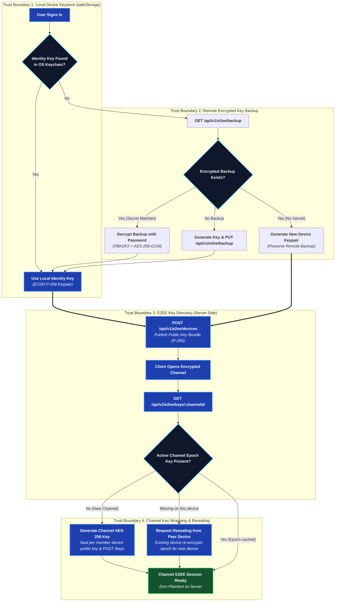

# End-to-End Encryption

Full source: [`development/E2EE.md`](https://github.com/aiyu-ayaan/BetweenUs/blob/master/development/E2EE.md).

## Threat model

**Protected against**: a reader of the database, a backup, Redis, or the
Nginx logs — none of them holds a key that opens a message. Call media
never touches the server at all (see
[Peer-to-Peer Media](/architecture/media)), so there's no server copy to
read in the first place.

**Not protected against**: a compromised client (the keys live there), and
metadata — the server still knows who wrote to which channel and when, and
how big each message was.

## One key per machine

A channel's symmetric AES-256-GCM key is wrapped once per **device**, not
once per account (`ChannelKey`, one row per `(channel, epoch, recipient
user, recipient device)`). That's what lets a single device be revoked
without rotating an identity every other machine is also using — and what
lets "who can open this channel" be answered by the wrap table directly.

## Repairing a second device — without over-sharing

`GET /api/v1/e2ee/keys/:channelId` answers two questions: who's missing the
**current** epoch (keeps the next message readable), and who's missing
**any** epoch their owner already holds on another machine (lets a phone
signed in today read history from before it existed). The second is
deliberately bounded — "their owner already holds it" — so a new device
only ever recovers access the same person already has elsewhere, never a
year of history handed to someone who joined yesterday.

## Revocation

Deletes the wraps addressed to that device and refuses to seal for it
again; the row itself stays, because "when a machine stopped being trusted"
is the only thing anyone can audit afterwards. Every channel that device
could read is marked stale and re-keys. Registering a revoked device id
again is refused rather than silently un-revoking — the machine asking is
running the same code that would let it un-revoke itself.

What revocation does **not** do: reach what the device already decrypted,
or stop a still-logged-in session from continuing (that's what ending the
session is for — two different actions, both needed).

## Pieces

| Piece | Where it lives | Who can read it |
| --- | --- | --- |
| Device identity key (ECDH P-256) | Private half sealed in the OS keychain, per machine | That machine |
| Device public keys | `device_keys` table | Everyone in the server |
| Sealed identity backup | `identity_backups` table | Whoever knows the account password or a recovery passphrase |
| Channel key (AES-256-GCM) | In memory on member devices | Channel members |
| Wrapped channel key | `channel_keys` table | Only the device it was sealed for |
| Message body | `messages.content` | Channel members |
| Attachment bytes | Object storage | Channel members (session to fetch, channel key to read) |
| Voice/video media | DTLS-SRTP, direct between peers | The two people on that connection |
| Avatars / server icons | Object storage | **Anyone with the URL** — deliberately public |

## Deliberate leaks

- **Reactions are plaintext** (`MessageReaction.emoji`) — the server has to
  count them for recipients who don't currently hold the channel key, and
  encrypting per-recipient would need a key exchange per thumbs-up.
- **Attachment size and count are known** to the server via the
  `Attachment` row, even though the file's name, type and contents stay
  sealed inside the message envelope.
- **Avatars and server icons are unencrypted** by necessity — an ``
  tag can't carry an authorization header, and a member list renders them
  for people who hold no channel key at all.

## Identity backup: the one boundary that moved

The backup is sealed with a key derived from the account password, and the
password is something a *live* server sees at sign-in. So a **stolen
database opens nothing** (passwords are bcrypt-hashed, the backup is
ciphertext), but a **compromised running server** could capture a password
in use and open that user's backup afterward. Anyone whose threat model
includes the running deployment should set a recovery passphrase instead —
it is never sent anywhere in any form.

### Signing in without the secret

A sign-in that cannot open the backup is not stopped and is never asked for a
secret. A launch from a stored token has no password to hand, and an account
that has only ever signed in with GitHub or Google has no password *at all* —
so the machine generates a key pair of its own and carries on.

Two properties make that safe rather than lossy:

- The machine leaves the backup exactly as it found it. Promoting a
  self-minted key to the account's backup would lock out every machine still
  restoring from the real one, so only a deliberate "set a recovery
  passphrase" (or a password change) ever replaces it.
- `channel_keys` is addressed per `recipientDeviceId`, so the new machine
  publishes its own public half under its own device id and takes nothing away
  from the rows already sealed for the others.

The cost is that history is not instant there. It reads what arrives from now
on, and older conversations fill in as the account's other machines open them —
the same "repairing a second device" path above. Supplying the secret (signing
in with the account password, or setting a recovery passphrase) restores the
account key outright and is the only instant path.

## Safety numbers

Everything above protects a message from whoever reads the database. None of
it protects against the server **handing out the wrong public key** — a client
has no way to tell a stranger's key from a substituted one, because it asked
the server and the server answered.

A safety number is the answer to that. Two people compare sixty digits over
something that is not this app — a phone call, a room — and a match means they
hold each other's real keys. It's in a member's menu, under **Verify safety
number**.

### What the number is over

The directory holds one key per *machine*, so a per-device number would mean
comparing n×m strings with somebody who owns a laptop and a phone. The number
is over a user's whole active device set instead: every published key, sorted
by device id, as raw curve points rather than JWK text — two clients that
serialise the same key with fields in a different order would otherwise compute
different numbers for the same person, and that failure would look exactly like
an attack.

That gives the property the feature exists for. **A server that adds a device
to somebody's directory changes their safety number**, which is exactly how it
would go about reading their messages. So does genuinely buying a phone, and
the client cannot tell those apart — which is why a changed number says what
happened rather than what it means, and asks the two people to check again.

The algorithm is Signal's numeric fingerprint and deliberately not something
invented here: iterated SHA-512 over the key material and the user id,
truncated to 30 bytes, read as six groups of five decimal digits, with the two
halves sorted so neither person has to go first. The 5200 iterations are the
point of it — a 30-digit truncation is short enough to read aloud, so making
each guess cost 5200 hashes is what stops somebody grinding out a key that
collides with a number you already trust.

### Two limits

- **Verification is stored per machine and never on the server.** A server that
  could mark somebody verified could substitute their key and then reassure the
  person about it. A second device verifies for itself.
- **There is no badge in the member list.** The iteration count that makes a
  fingerprint hard to forge also makes it too slow to compute for every row of a
  column. A key that changed since it was checked is reported when the dialog is
  next opened, not the moment it changes.

No endpoint was added for any of this. The dialog reads the same
`GET /api/v1/e2ee/devices?channelId=` the channel already uses — asking about
somebody through a channel you share is a question you were already entitled to
ask, and a per-user lookup would have been a new one.
