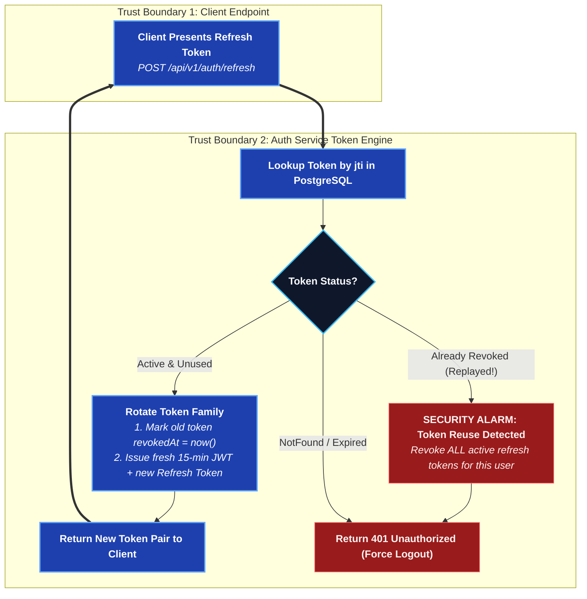

# auth-service

Registration, login, sessions, OAuth, account management, and the admin
panel's own auth. Details: [Auth & Permissions](/system-design/auth-and-permissions).

## `/api/v1/auth`

| Method | Path | What it does |
| --- | --- | --- |
| POST | `/register` | Create an account |
| POST | `/login` | Password login → access + refresh token |
| POST | `/refresh` | Rotate a refresh token; reuse revokes the whole account's sessions |
| POST | `/logout` | Revoke the current refresh token |
| GET | `/me` | Current account |
| POST | `/account/password` | Change password |
| PATCH | `/account` | Update profile fields |
| GET | `/username-available` | Is this username free? Public; Bloom-filtered |
| POST | `/forgot-password` | Start recovery → `emailed` \| `reset` \| `unavailable` |
| POST | `/reset-password` | Spend a single-use reset token |

### Refresh Token Lifecycle & Theft Detection

### Forgotten passwords

`/forgot-password` has three answers, and which one you get is a fact about the
deployment rather than about the account:

- **`reset`** — an administrator has opened a reset window on that account, so
  the call mints a single-use token and hands it back; the client goes straight
  to a new-password form. This is how a self-hosted deployment with no mail
  server still has a way back in.
- **`emailed`** — a link was sent. An account that does **not** exist, and a
  disabled one, get this same answer and no email. Telling them apart would make
  this endpoint a way to find out who has an account here.
- **`unavailable`** — no SMTP server is configured, so the client says to ask an
  administrator.

Reset tokens are stored as `SHA-256` and are single use. Minting one burns the
account's previous live token, and spending one revokes every session the
account had.

:::caution End-to-end encryption
The identity backup is sealed with the *old* password, so a reset leaves it
unreadable. A machine signing in for the first time after a reset mints a new
device key and can read what arrives from then on — not what came before. A
server that could re-seal the backup would be a server that could read it.
:::

### Username availability

`/username-available` is answered from a Bloom filter warmed from the table at
boot, so the registration form can ask on every keystroke. The filter has no
false negatives: a miss is a definitive "available" with no query, and a hit is
confirmed against the unique index before anybody is told a name is taken. It is
a cache in front of the constraint and never a substitute for it.

Usernames are normalised to lower case on write, which is what makes the unique
index agree with signing in by username.

## `/api/v1/auth/oauth`

| Method | Path | What it does |
| --- | --- | --- |
| GET | `/version` | Build/version probe |
| GET | `/providers` | Which providers are enabled |
| GET | `/:provider/start` | Begin the provider redirect |
| GET | `/:provider/callback` | Provider returns here; issues a one-time code |
| POST | `/exchange` | Trade the one-time code for a session |

## `/api/v1/admin`

Requires `GlobalRole.ADMIN`, checked by database lookup on every request
(not a token claim — a demotion has to take effect immediately).

| Method | Path | What it does |
| --- | --- | --- |
| GET | `/status` | Whether any admin exists yet |
| GET | `/users` | List accounts |
| PATCH | `/users/:id` | Change role / disable / enable / open a password-reset window |
| DELETE | `/users/:id` | Delete an account |
| GET | `/audit` | Read `AdminAudit` |
| GET | `/health` | One snapshot of the deployment (`?days=` sizes the bandwidth window, 30 by default) |
| GET | `/oauth` | Read provider configs |
| PUT | `/oauth/:provider` | Set a provider's credentials |
| GET | `/smtp` | Outgoing mail settings (never the password) |
| PUT | `/smtp` | Configure the deployment's SMTP server |
| POST | `/smtp/test` | Send one test message |

### Health & storage

`GET /admin/health` answers one `AdminServerHealth`: the dependency probes, the
reporting process's runtime, database and media storage, bandwidth over a
window, and the live socket counts. It is measured at the moment of the call
rather than cached, so the panel polls it (30 seconds, pausable) instead of
subscribing to anything.

Several fields are **deliberately nullable, and a null is never a zero**:

| Field | Null when | The panel says |
| --- | --- | --- |
| `AdminComponentHealth.latencyMs` | the probe never came back | "No response", not "0 ms" |
| `AdminMediaStorage.diskBytes` | driver is `s3` — walking a bucket is not free | "Not measurable here", with the reason |
| `AdminMediaStorage.diskFreeBytes` | driver is `s3` — object storage has no volume to fill | as above |
| `AdminDatabaseStorage.version`, `AdminRuntimeHealth.appVersion` | the server did not report one | "unknown" |

Rendering any of those as `0 B` would be the panel inventing a measurement an
operator cannot tell apart from a real one, which is the one way this screen
could lie. `apps/admin/src/screens/HealthScreen.check.tsx` renders the view
against an S3 fixture and asserts that it does not.

Call bytes are the clients' own totals from `CallSession` and not this host's
traffic — media is peer-to-peer and never passes through it. Attachment bytes
are what this deployment actually served.

#### How the snapshot is assembled

Every probe is timed and caught **individually** — Postgres (`SELECT 1`), Redis
(`PING`), and a `GET /health` against chat-service, presence-service,
call-service and remote-gateway — each on its own 2.5 s deadline. A dependency
that is down turns its own card red inside a `200`; it never fails the request.
A page that 500s when something is broken tells an administrator only that
something is broken, at the exact moment they need to know which thing. Every
section (database, media, bandwidth, live) is wrapped the same way and returns
its empty shape rather than propagating. `overall` is simply the worst state
across the components, pessimistically: one `down` is `down`.

Every URL in the response goes through `redactUrl` first. That strips
`user:password@` **and** any query parameter whose name looks like a secret —
`?password=`, `?sslpassword=`, `?token=` — because `new URL` parses
`host:5432/db?password=hunter2` quite happily by reading `host:` as a scheme,
and a redaction that only cleared the userinfo would hand that one straight
back. Anything that does not parse at all is replaced wholesale rather than
passed through.

Where the numbers come from, and what they are not:

| Field | Source | Caveat |
| --- | --- | --- |
| `database.*` | raw SQL over `pg_database_size`, `pg_stat_user_tables`, `pg_stat_activity`, `SHOW max_connections` / `server_version` | `rowEstimate` is `n_live_tup`, the planner's estimate — an exact `count(*)` per table is a scan of the whole database, which is a strange thing for a health page to do to a struggling server. Top 15 tables only |
| `media.byKind` | the storage key's file extension | `Attachment` has **no** content-type column and cannot have one: the manifest naming the file is sealed inside the ciphertext. The extension comes from `buildKey`, so it is a hint about what was uploaded rather than a declaration |
| `media.diskBytes` | a walk of `LOCAL_STORAGE_PATH`, `fs.statfs` for the free space | local driver only |
| `bandwidth.*` | `CallSession` (`BigInt`, converted with `Number()` exactly as `calls.service.ts` does) and `Attachment.size` | no new tracking and no migration — it is what was already recorded. A client closed mid-call reported nothing, so the call totals are a floor |
| `live.onlineUsers`, `activeCalls`, `activeCallParticipants` | Redis: `presence:online` (fresh entries only, same 90 s cutoff `PresenceStore` uses), `presence:voice:channels`, `presence:voice:<channelId>` | a second reader of presence-service's keys; if they change, this changes with them |
| `live.activeRemoteSessions` | `RemoteSession` where `endedAt` is null | — |

Two figures are honestly limited rather than exact, and the reason is written
into the code beside each:

- **`live.totalSockets` is connected *accounts*, not sockets.** Presence is
  keyed per account — two windows of one account are one entry in
  `presence:online` — and nothing anywhere keeps a per-device count, so it will
  never exceed `onlineUsers`. A true socket count needs presence to key by
  device, which is a change to presence-service rather than to this endpoint.
- **`/ws/chat` reports `connections: 0`, meaning "not tracked".**
  `chat-service` keeps its subscriptions inside the gateway process and
  publishes nothing about them. The endpoint's `state` still comes from that
  service's own probe, which is the question the endpoint list is really asked.

The endpoint URLs are built from `PUBLIC_API_URL` with the scheme swapped for
its WebSocket equivalent, never hardcoded: an administrator checking their
tunnel wants the URL their clients actually dial.

### Outgoing mail

SMTP is operator configuration, not environment: it lives in `SmtpSetting` and
is entered in the admin panel, with the password sealed under `SETTINGS_SECRET`
exactly as an OAuth client secret is. The panel can replace it and can never
read it back, and a test send reports the mail server's own refusal verbatim.

A deployment with **no** mail server is fully supported — every client's
forgot-password screen then says to ask an administrator, and the administrator
resets an account from the Users tab instead.

### Opening a password-reset window

`PATCH /users/:id` with `{ "passwordReset": true }` lets that account set a new
password without knowing the old one, by naming itself on the forgot-password
screen. It is a **window**, not a flag: it expires on its own
(`PASSWORD_RESET_WINDOW_HOURS`, a day by default), one grant is one reset, and
both opening and cancelling are written to `AdminAudit`.

The **first** administrator is never created through this API — `pnpm
admin:create` runs where the database already is, the one place that proves
the operator owns the deployment.

## Profile pictures

`PATCH /api/v1/auth/account` carries both `avatarUrl` and `coverUrl`. For each,
`null` is a value — it clears the picture back to the default — and an absent key
means "leave it alone", so a client that only wants to change a display name
does not have to resend the pictures it is not touching.

Both must match `UPLOADED_PICTURE_URL`: a picture stored by this deployment.
They are drawn by every client that can see the account, so an arbitrary URL
would be a beacon reporting who looked at whom.

They are separate columns rather than one picture scaled two ways. An avatar is a
square read at 32px in a member list; a cover is a 4:1 band read at several
hundred, and cropping one out of the other gives a blurred crop of somebody's
face as a backdrop. The clients frame them to `COVER_ASPECT` (4) and
`COVER_MAX_WIDTH` (1600) before uploading, so what reaches the server is exactly
what everybody fetches.
