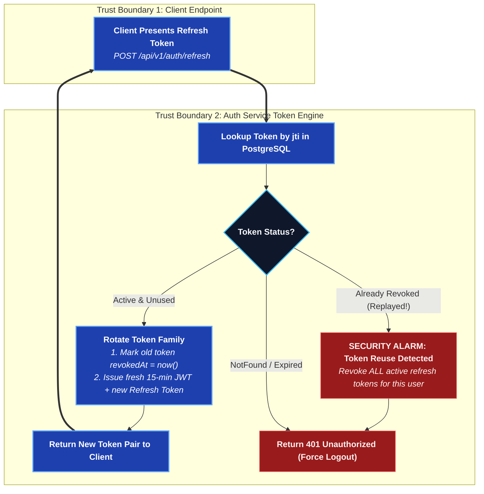

# auth-service

Registration, login, sessions, OAuth, account management, and the admin
panel's own auth. Details: [Auth & Permissions](/system-design/auth-and-permissions).

## `/api/v1/auth`

| Method | Path | What it does |
| --- | --- | --- |
| POST | `/register` | Create an account |
| POST | `/login` | Password login → access + refresh token |
| POST | `/refresh` | Rotate a refresh token; reuse revokes the whole account's sessions |
| POST | `/logout` | Revoke the current refresh token |
| GET | `/me` | Current account |
| POST | `/account/password` | Change password |
| PATCH | `/account` | Update profile fields |
| GET | `/username-available` | Is this username free? Public; Bloom-filtered |
| POST | `/forgot-password` | Start recovery → `emailed` \| `reset` \| `unavailable` |
| POST | `/reset-password` | Spend a single-use reset token |

### Refresh Token Lifecycle & Theft Detection

### Forgotten passwords

`/forgot-password` has three answers, and which one you get is a fact about the
deployment rather than about the account:

- **`reset`** — an administrator has opened a reset window on that account, so
  the call mints a single-use token and hands it back; the client goes straight
  to a new-password form. This is how a self-hosted deployment with no mail
  server still has a way back in.
- **`emailed`** — a link was sent. An account that does **not** exist, and a
  disabled one, get this same answer and no email. Telling them apart would make
  this endpoint a way to find out who has an account here.
- **`unavailable`** — no SMTP server is configured, so the client says to ask an
  administrator.

Reset tokens are stored as `SHA-256` and are single use. Minting one burns the
account's previous live token, and spending one revokes every session the
account had.

:::caution End-to-end encryption
The identity backup is sealed with the *old* password, so a reset leaves it
unreadable. A machine signing in for the first time after a reset mints a new
device key and can read what arrives from then on — not what came before. A
server that could re-seal the backup would be a server that could read it.
:::

### Username availability

`/username-available` is answered from a Bloom filter warmed from the table at
boot, so the registration form can ask on every keystroke. The filter has no
false negatives: a miss is a definitive "available" with no query, and a hit is
confirmed against the unique index before anybody is told a name is taken. It is
a cache in front of the constraint and never a substitute for it.

Usernames are normalised to lower case on write, which is what makes the unique
index agree with signing in by username.

## `/api/v1/auth/oauth`

| Method | Path | What it does |
| --- | --- | --- |
| GET | `/version` | Build/version probe |
| GET | `/providers` | Which providers are enabled |
| GET | `/:provider/start` | Begin the provider redirect |
| GET | `/:provider/callback` | Provider returns here; issues a one-time code |
| POST | `/exchange` | Trade the one-time code for a session |

## `/api/v1/admin`

Requires `GlobalRole.ADMIN`, checked by database lookup on every request
(not a token claim — a demotion has to take effect immediately).

| Method | Path | What it does |
| --- | --- | --- |
| GET | `/status` | Whether any admin exists yet |
| GET | `/users` | List accounts |
| PATCH | `/users/:id` | Change role / disable / enable / open a password-reset window |
| DELETE | `/users/:id` | Delete an account |
| GET | `/audit` | Read `AdminAudit` |
| GET | `/oauth` | Read provider configs |
| PUT | `/oauth/:provider` | Set a provider's credentials |
| GET | `/smtp` | Outgoing mail settings (never the password) |
| PUT | `/smtp` | Configure the deployment's SMTP server |
| POST | `/smtp/test` | Send one test message |

### Outgoing mail

SMTP is operator configuration, not environment: it lives in `SmtpSetting` and
is entered in the admin panel, with the password sealed under `SETTINGS_SECRET`
exactly as an OAuth client secret is. The panel can replace it and can never
read it back, and a test send reports the mail server's own refusal verbatim.

A deployment with **no** mail server is fully supported — every client's
forgot-password screen then says to ask an administrator, and the administrator
resets an account from the Users tab instead.

### Opening a password-reset window

`PATCH /users/:id` with `{ "passwordReset": true }` lets that account set a new
password without knowing the old one, by naming itself on the forgot-password
screen. It is a **window**, not a flag: it expires on its own
(`PASSWORD_RESET_WINDOW_HOURS`, a day by default), one grant is one reset, and
both opening and cancelling are written to `AdminAudit`.

The **first** administrator is never created through this API — `pnpm
admin:create` runs where the database already is, the one place that proves
the operator owns the deployment.
