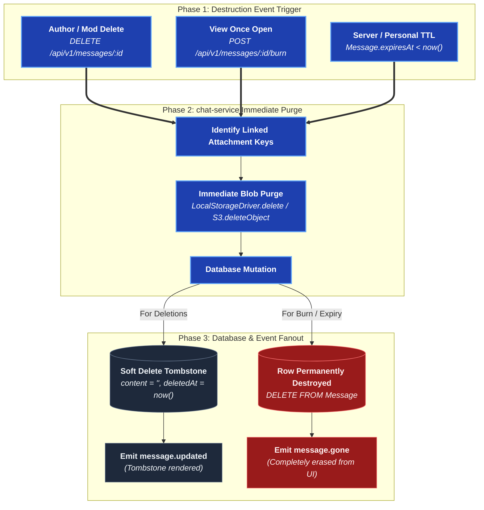

# chat-service

Messages, direct messages, friends, E2EE key exchange, and uploads. The
biggest service, and the only one with a WebSocket for message delivery.

## `/ws/chat`

Socket.IO-style JSON messages, not `@nestjs/websockets` decorators — one
gateway class handling frames itself.

| Frame `type` | Direction | What it does |
| --- | --- | --- |
| `ping` | client → server | Keepalive |
| `channel.subscribe` | client → server | Join `channel:<id>` room (access re-checked) |
| `channel.unsubscribe` | client → server | Leave the room |
| `server.subscribe` | client → server | Join `server:<id>` room (membership re-checked) |
| `server.unsubscribe` | client → server | Leave the room |
| `message.created` / `message.updated` | server → client | New message, or an edit/delete/pin/reaction on an existing one |
| `friends.changed` | server → client | Re-fetch the friends list |
| `server.members.changed` | server → client | Re-fetch a server's member list |
| `server.channels.changed` | server → client | Re-fetch a server's channels and categories (created, renamed, deleted, moved, or a category changed) |
| `user.updated` | server → client | A changed profile, carried: `{ id, username, displayName, avatarUrl, coverUrl, about }` |
| `server.updated` | server → client | A renamed server or a new icon, carried |
| `channel.read` | server → client | Somebody's read marker moved |

`user.updated` is fanned out to everyone entitled to see the account — the
members of every server it is in, everyone it is friends with, and its own other
devices. Friendships stand in for direct messages, because a DM already requires
one. `server.updated` goes to the `server:<id>` room.

See [Events](/system-design/events) for why edits, deletes, pins and
reactions all arrive as one `message.updated` shape.

## Polls: refereed, not decrypted

A poll is an ordinary `USER` message. Its question and option labels sit inside
the encrypted envelope; the server holds a `MessagePoll` row beside it with
only `optionCount`, `multiChoice`, `closesAt` and `closedAt`, and a `PollVote`
row per chosen option index. It applies [Play Together](/architecture/play-together)'s
referee shape to a message: **a vote is a number**. The client sends indexes,
the server checks them against rules it can evaluate without reading anything
(`poll-rules.ts`: the poll is open, every index is below `optionCount`, a
single-choice poll took at most one), counts, and broadcasts the tally, and
every client draws what came back rather than a count of its own.

**Why chat-service and not call-service.** call-service referees a live,
in-memory, ordered board and is single-replica for that reason. A poll has none
of that: it is stored in Postgres, sent down the send route, deleted, pinned,
expired and fanned out with its message, and its votes must survive a restart.
Putting the referee in call-service would have split one message's lifecycle
across two services for the sake of a metaphor. What is reused is the shape,
not the process.

- **Access** is `resolveChannelAccess` (via `requireChannelAccess`), never
  inline. Voting takes `SEND_MESSAGE`; a channel the caller cannot see and a
  message that is not a poll both answer `404`.
- **A ballot is the whole ballot.** `PUT .../poll/vote` replaces the caller's
  rows in one transaction (delete plus insert), so it is idempotent, a switch
  is never counted twice, and `[]` retracts. The unique index on
  `(messageId, userId, option)` covers two devices voting at once.
- **Closing** is the author, or `MANAGE_MESSAGE` in a server channel (there is
  no role in a DM, so only the author). A poll is closed if `closedAt` is set
  *or* `closesAt` has passed; the second is evaluated on every read and vote,
  so no sweeper is needed and none can be late.
- **No edits.** The labels are sealed, so the server cannot tell a typo fix from
  swapping "yes" and "no" under everybody's votes. `PATCH` on a poll is refused.
  Deleting the message deletes the poll and its votes in the same transaction.
- **Notifications** carry only the ciphertext envelope like any message. The
  poll preview ("Poll: <question>") is built on the receiving client after it
  opens the envelope; no service ever has the question to put in one.

## `/api/v1/messages`

| Method | Path | What it does |
| --- | --- | --- |
| GET | `/` | Page a channel's history; `?threadRootId=` pages that root's thread instead |
| GET | `/:messageId` | One message by id, tombstone included (after the literal `/pins`, `/unfurl` routes) |
| GET | `/unfurl` | Link preview metadata |
| GET | `/pins` | A channel's pinned messages |
| POST | `/` | Send a message; `threadRootId` posts it into that root's thread |
| PATCH | `/:messageId` | Edit (author only) |
| DELETE | `/:messageId` | Delete (author, or `DELETE_MESSAGE`) |
| POST | `/:messageId/burn` | Report a one-time message opened — destroys it |
| PUT | `/:messageId/pin` | Pin (`MANAGE_MESSAGE` in a server channel, free in a DM) |
| DELETE | `/:messageId/pin` | Unpin |
| POST | `/:messageId/reactions` | React |
| PUT | `/:messageId/poll/vote` | Replace the caller's ballot on a poll (option indexes) |
| POST | `/:messageId/poll/close` | Close a poll (author, or `MANAGE_MESSAGE`) |
| POST | `/clear` | Hide **this account's own** history: one channel, or all |

`/clear` is a filter and never a delete. With a `channelId` it stamps
`ChannelRead.clearedAt`; without one it stamps `User.chatsClearedAt`. History,
pins and the unread count apply whichever marker is **later** as a floor. The
rows stay in the table and the other participant's view does not move.

Two markers rather than one because they answer different questions and neither
subsumes the other: "clear everything" is one write on the account instead of a
fan-out over every channel, and "clear this conversation" is one write on the
row that already exists per `(user, channel)`.

The cut is published as `chats.cleared` — carrying the instant and the
`channelId` it applies to, null for all — to that account's own sockets, because
every device holds a cache of decrypted messages that no refetch would clear. A
scoped clear drops only that channel's cache; dropping the lot would turn one
clear into a spinner on the next several conversations opened.

### Threads

A thread hangs off a root message in the same channel. A reply is an ordinary
sealed message with one extra field the server can see, `threadRootId`; the
body is sealed with the channel key exactly like any other, so the server
learns *that* a thread exists and how busy it is and never what was said.
This is not the quote reply: `MessageBody.replyTo` is a snapshot inside the
envelope of a message that stays in the timeline.

- **Access** is the channel's, from `resolveChannelAccess`: `SEND_MESSAGE` to
  reply, `VIEW_CHANNEL` to page or fetch. A thread in a channel the caller
  cannot see answers the same 404 as one that does not exist.
- **Timeline.** `GET /messages?channelId=` (no `threadRootId`) returns only
  rows with a null `threadRootId`; `?threadRootId=` returns only that root's
  replies, paged newest-first by the same cursor and the same page size.
- **Validation** (`threads.ts`). The root must be in the reply's channel, must
  not itself be a reply (one level only), must be a bodied kind (not an arrival
  notice) and must not be a one-time message; a reply cannot be one-time
  either. Codes: `MESSAGE_NOT_FOUND` (404), `THREAD_NOT_ALLOWED` (400).
- **Root summary.** The root carries `thread: { replyCount, lastReplyAt }`
  (columns `threadReplyCount`, `threadLastReplyAt`). They are *recomputed*
  from the live replies whenever a reply is sent, deleted or expires - never
  incremented - and published as an ordinary `message.updated` for the root,
  after the reply's own `message.created`.
- **Realtime.** A reply travels as `message.created` carrying `threadRootId`,
  edits and deletions as `message.updated` - the same events as any message.
  Clients keep replies out of the timeline and its cache.
- **Deleting a root** is a tombstone like any other, so the thread stays
  reachable: the root reads "Original message deleted" and the chip remains.
  A root destroyed outright (disappearing window) takes its thread with it via
  the foreign key's cascade; the sweeper announces each reply's removal too.
- **Unread.** Replies are excluded from the channel unread counts, because
  they are not in the timeline a badge would open onto.

### How a message stops existing

Four mechanisms, and the difference that matters is **who loses it**. A
*deletion* removes the row for everybody; a *filter* hides it from one account
and leaves every other participant's copy exactly as it was.

| Mechanism | Scope | Tombstone? | Set by |
| --- | --- | --- | --- |
| `DELETE /:messageId` | Everybody | Yes | Author, or `DELETE_MESSAGE` |
| `POST /:messageId/burn` | Everybody | No — row destroyed | Sender, per message |
| `Server.messageTtlSeconds` | Everybody | No — row destroyed | `MANAGE_SERVER` |
| `User.messageTtlSeconds` | One account | Nothing is deleted | The account itself |

A server's window outranks an account's, and that is not a rule anyone
enforces — it falls out of what they are. A deleted row cannot be un-hidden, so
a member may choose to see *less* than the server keeps and never more. What a
client shows is `min(server, personal)`, with "off" meaning no limit.

`Message.expiresAt` is stamped when the message is created, from the server's
window as it stood at that moment. Changing the window governs what is sent
next and never reaches back through a channel.

Deleting, burning and expiring all purge the attachment blobs immediately,
before publishing their event. `AttachmentSweeper` still runs every six hours
as the backstop for what the immediate purge could not reach — it used to be
the only path, and "I deleted that photo" meaning "some time today" is why it
is not any more.

### Voice messages

A voice message is an ordinary audio attachment. Nothing on the server knows
about it — it is sealed, uploaded and swept exactly like a file picked with the
paperclip. What makes it a voice message is two fields inside the encrypted
manifest, both measured by the sender:

- `duration` — seconds, so a player can say "0:07" before a byte is fetched.
- `waveform` — 48 bar heights from 0 to 1, measured while it was recorded.

The sender measures them because a receiver cannot: computing a waveform means
decoding the whole file, which means downloading it first, and the waveform is
meant to be on screen *before* that. It also means every client draws the same
shape for the same message, which a waveform has to do to be trusted as a
position indicator. Desktop taps an `AnalyserNode` on the live stream; Android
reads `MediaRecorder.getMaxAmplitude()`. Both normalise against the loudest bar
— microphone gain varies by an order of magnitude between devices — and floor
every bar so a pause is a line rather than a hole.

Voice messages fetch and decrypt themselves on sight. They are seconds long and
tens of kilobytes; the click-to-load rule that still governs video exists to
avoid spending a large download on a message somebody scrolled past, which is
not this.

Every audio attachment gets the player. `isVoiceNote` — an attachment with a
waveform, or one named `voice_<date>_<time>.<ext>` — only decides whether the
filename is drawn above it: a recording's name is a timestamp nobody wants to
read, where a shared track's name is most of what was being shared.

### Naming what was picked

The manifest's `name` and `contentType` are resolved once on the sending
client, in the order the sources are worth trusting:

1. the provider's `DISPLAY_NAME`;
2. the URI's last path segment, when it looks like a filename — it is one for a
   `file://` URI, which has no provider to query, and is an opaque id like
   `msf:42` for the document browser, which is why it is second;
3. a generated `attachment.<ext>`, with the extension derived from the type.

The content type follows the same shape: what the provider says, then a guess
from the name's extension, then `application/octet-stream`. That last step
matters — `octet-stream` is a provider saying "I do not know", and recording it
as a fact is how an audio file arrives as an anonymous document with no way to
play it.

### One-time messages

`viewOnce` travels **outside** the encrypted envelope, on the send request.
Burning is a row update and a blob delete, both of which are the server's work,
and a server that cannot read the body cannot be told by the body. What leaks
is that *some* message was one-time — a fact both clients already draw on
screen. It is a documented E2EE exception alongside reaction emoji.

**The rule is enforced at the download, not in the client.** `GET
/uploads/:key` refuses a one-time attachment to anybody who already has a
`MessageView` row for its message, and refuses it to the author outright. The
locks in the clients are software choosing to behave; this is the door the
bytes come through. The view is recorded *after* the fetch, so the fetch that
spends the look still succeeds and only the ones after it do not.

**The author never opens their own.** They sent it. A sender who can re-open it
on another device has a message that is one-time for exactly one of the two
people in the conversation — and it is the one case a client cannot enforce for
itself, since the author is the account that held the plaintext.

**One look each, not one look in total.** A `MessageView` row records one
person's look, unique per `(messageId, userId)`, and the message is destroyed
once those rows cover the channel's audience minus the author. Opening twice
from two devices records one look, so a second device is not charged to
somebody else.

The author is not a viewer: re-reading your own message spends nothing.

Clients decide their own state from `Message.viewedBy` — a list of user ids
rather than a per-caller boolean, because the same message object is broadcast
to every subscriber and a flag computed for one of them would be wrong for all
the rest. It is the same reasoning as reaction summaries.

A one-time message also gets a **backstop expiry** of a week, because "everyone
has looked" may never arrive — one member of a channel who never opens theirs
would otherwise keep the ciphertext for ever. It is never longer than a window
the server itself set.

Clients **hold** a one-time message on screen while its viewer is open. Burning
happens as the viewer opens, so the row is destroyed while the picture is still
being looked at; without the hold, removing the message unmounted the row and
the viewer drawn inside it, and whoever spent their look never saw anything.

**Fetch, record, draw.** The burn deletes the blobs, so it cannot come first —
that races the download of the bytes being opened, and on a phone the download
loses. Drawing first is no better: it spends the look only when the write
happens to succeed. Viewers fetch every file, wait for the look to be recorded,
then draw; a failure draws nothing, spends nothing and says so.

**A viewer fetches before it reports.** The burn deletes the blobs, so
reporting a look before the download finished raced the destruction of the
bytes being opened — and on a phone the download lost every time. The viewer
now decrypts every file in the message first and reports afterwards; video and
voice notes are written to the plaintext cache during that prefetch so no
player goes back for a blob that no longer exists.

Clients display it with every copy path they control removed — no download, no
context menu, nothing draggable or selectable, and no thumbnail in the message
list. Beyond that the platforms genuinely differ, and each viewer's copy says
which one it is on:

| Client | Screen capture | How |
| --- | --- | --- |
| Android | Blocked | `FLAG_SECURE` on the viewer window |
| Desktop | Blocked | `setContentProtection(true)` while the viewer is open |
| Web | **Cannot be blocked — so it will not open one** | A page has no say over the screen it is drawn on |

The web build does not open one at all. Showing the picture there would be a
sender choosing "one-time" and quietly getting none of it, on a client that
looks identical to the ones where it works — so the browser draws a locked card
with an info button explaining that the limitation is the browser's, and says
that nothing has been used up. The author is exempt: their own message spends
nobody's look.

**None of it stops a second camera pointed at the screen, and no software on a
device somebody holds can.** The guarantee is that the file stops existing
everywhere once its recipients have seen it, and the viewers say so rather than
implying more.

## `/api/v1/users` and `/api/v1/friends` and `/api/v1/dm`

| Method | Path | What it does |
| --- | --- | --- |
| GET | `/users/search` | Find a user by name (also used to add server members) |
| GET | `/friends` | List friendships |
| POST | `/friends` | Send a friend request |
| POST | `/friends/:userId/accept` | Accept |
| DELETE | `/friends/:userId` | Remove / decline |
| GET | `/dm` | List DM channels |
| POST | `/dm` | Open a 1:1 (friends only) |
| POST | `/dm/:channelId/members` | Add a friend to a conversation in progress |
| GET | `/blocks` | List accounts this user has blocked |
| POST | `/blocks` | Block an account |
| DELETE | `/blocks/:userId` | Unblock |

### Blocking

`UserBlock` rows are directional — "A blocked B" and "B blocked A" are separate
facts — and the check reads **both** directions. It lives in
`resolveChannelAccess`, so everything downstream of a channel id closes through
one function: history, pins, reactions, calls, typing and read markers. A group
conversation closes the same way a 1:1 always did the moment any one of its
other members is on either side of a block with the account asking.

Blocking ends the friendship in the same transaction but never deletes the
channel: it holds two people's history, and unblocking brings the conversation
back intact. Search, the friend-request endpoint and the DM list all answer
`USER_NOT_FOUND` whichever way the block runs, so neither the block nor its
direction is something the far side can test for.

### Group DMs

`ChannelMember` was always a generic allowlist with nothing capping a direct
message at two rows, so a group is the same `Channel` (`type: 'DM'`,
`serverId: null`) with more than two members — no schema change. What *was*
two-person-shaped: `openDirectChannel`'s existing-conversation lookup (now
requires exactly two members, so a group the pair happen to share is never
mistaken for their 1:1), and the block check inside `resolveChannelAccess`
(now checked against every other member instead of the first one found).

Adding a third (or fourth, …) person is `POST /dm/:channelId/members`
(`FriendsService.addDirectMember`). **Any current member may add anyone they
are friends with** — the same trust and the same friendship gate a 1:1 already
runs on; there is no owner or approval step, because either side of an
existing conversation could always say anything to the other outside it
anyway. The person being added must not be blocked by (or have blocked) any
existing member. Adding publishes the existing `friend.changed` wire event
(`kind: 'dm-member-added'`) to every member old and new, rather than a second
event that would say the same thing every client already refetches its DM
list on.

`DirectChannel.participant` stays the first other member — the field every
existing screen reads, unchanged for a 1:1 — and `.participants` is the full
list. Desktop's conversation list and header title use the full list; most
other places that draw a DM by name (quick switcher, forward dialog, push
notifications) still read `.participant` alone and show only the first other
member for a group — a known, deliberate gap for a first pass, not a bug
nobody noticed. Android has the API client and model (`DirectChannel.participants`,
`BetweenUsApi.addDirectMember`) but no "add someone" screen yet.

## `/api/v1/statuses`

| Method | Path | What it does |
| --- | --- | --- |
| GET | `/` | The tray: your own run, and one entry per friend who has posted |
| GET | `/audience` | Every device a post may be sealed for: your friends' and your own |
| POST | `/` | Post one — multipart: `kind`, `caption` (sealed), `background`, `durationMs`, `mediaIv`, `mediaType`, `senderDeviceId`, `keys` (JSON), `file` (ciphertext) |
| POST | `/:statusId/view` | Record that this account opened one (idempotent) |
| GET | `/:statusId/views` | Who opened one of yours — author only |
| DELETE | `/:statusId` | Take one of your own down early |

A status — a **moment**, in every client — is a post that expires after 24
hours. It is deliberately **not** a message: it has no channel, no conversation to belong to, and an audience that
is a set — accepted friends, minus blocks in either direction — rather than a
room. Modelling it as a message in a hidden channel would have meant a channel
per account and a membership row per friend kept in step with the friend list.

The media and the caption travel in **one** request, unlike an attachment,
which is uploaded first and claimed by a message later. Two steps exist there
because a message can carry several files and is composed over time; a status is
one file and one button, and a two-step version leaves an orphaned blob every
time somebody changes their mind in between.

**A moment is end-to-end encrypted, and its audience is frozen when it is
posted** — see [E2EE](/security/e2ee). The caption is an envelope, the file is
ciphertext, and the post carries one wrap of its key per recipient *device*,
written to `status_keys`. That table is the audience: a friendship made after
the post adds no wrap to it, so a new friend does not see what came before.

Two gates, answering different questions. The wrap says who can open a post;
the friend rule — accepted friends minus blocks in either direction, one
function with three callers (the tray, the single-post gate, the media
download) — says whose posts may still be listed at all, because unfriending
does not delete a wrap. The bytes land under `status/<authorId>/`, which is what
the download route reads to gate the object by a status key rather than by
channel access.

Nothing in this route inspects the file: a magic-number check on ciphertext
refuses every real post. What the bytes are once opened travels as `mediaType`
and is stored exactly as sent.

`expiresAt` is stamped at write time and filtered at read time, so a post is
invisible the moment it is due whether or not the sweep has run; `StatusSweeper`
only recovers disk. Deleting a post, posting one, or having one expire announces
`status.changed` to the author's friends, which carries only `authorId` — `seen`
and `viewCount` differ per reader, so the tray is re-read rather than patched.

## `/api/v1/e2ee`

| Method | Path | What it does |
| --- | --- | --- |
| GET | `/vault` | Fetch caller's sealed account vault and active factor metadata |
| POST | `/vault` | Create the account vault, with the master key for the server to hold (`escrow`) |
| GET | `/vault/escrow` | The master key the server holds for this account, or `null` |
| PUT | `/vault/escrow` | Hand the server the master key (refused with `WRONG_MASTER_KEY` unless it opens the keyring) |
| POST | `/vault/reset` | Start over a vault nobody can open (refused with `VAULT_ESCROWED` while a held key opens it) |
| POST | `/vault/rotate` | Append a new ECDH public key generation to the keyring |
| PUT | `/vault/factors` | Add or update a factor (`password`, `passphrase`, `recovery-code`, `device`) |
| DELETE | `/vault/factors/:kind` | Remove a factor (refuses deletion of last portable factor) |
| POST | `/vault/grants` | A device asks to be granted the vault |
| GET | `/vault/grants` | List pending vault grant requests for this account |
| GET | `/vault/grants/:deviceId` | The grant sealed for that device, or `null` (approving is `PUT /vault/factors` with kind `device`) |
| DELETE | `/vault/grants/:deviceId` | Deny and dismiss a grant request |
| GET | `/channels` | List all channel IDs this account holds keys for (promotion sweep) |
| GET | `/recipients?channelId=` | Get account recipient identity keys (`AccountKeyRecipient`) for a channel |
| GET | `/keys/:channelId` | Fetch wrapped channel keys addressed to caller's account and devices |
| POST | `/keys` | Publish account-scoped wrapped channel keys (`@account`) |
| POST | `/devices` | Register this machine's device key (with optional `holdsVault` assertion) |
| GET | `/devices/mine` | List my own devices |
| DELETE | `/devices/:deviceId` | Revoke a device |
| GET | `/backup` | *(Legacy)* Fetch v1 identity backup |
| PUT | `/backup` | *(Legacy)* Store v1 identity backup |

## `/api/v1/uploads`

| Method | Path | What it does |
| --- | --- | --- |
| POST | `/picture` | Avatar / server icon (unencrypted, strict image allowlist) |
| POST | `/` | Single-request attachment upload |
| POST | `/multipart` | Open a multipart session (sealed ticket, no server-side state) |
| POST | `/multipart/part` | Upload one part |
| POST | `/multipart/complete` | Finish and assemble |
| DELETE | `/multipart` | Abort a session |
| GET | `/:key(*)` | Download (session-checked; opaque bytes, except a picture, whose type was verified on the way in) |

Attachments are encrypted client-side before upload and served only as
opaque downloads — see [`E2EE.md`](/security/e2ee).

**Clients queue their object fetches.** The gateway rate-limits
`/api/v1/uploads` to the `api` zone — 20r/s with a burst of 20, per address
(`infrastructure/nginx/nginx.conf`) — and a channel of photo albums would
otherwise ask for every tile at once, pushing the overflow past the limit and
getting a `503` for it. Every client therefore funnels object downloads through
one door with at most **4 in flight**, and retries `429/502/503/504` three
times with an exponential, jittered backoff: `objectSlot` in
`apps/desktop/src/services/object-fetch.ts`, and the matching `Semaphore` in
`BetweenUsApi.fetchObject` on Android. Before this, a single refused request
became a permanent "this file could not be opened" — the file icons scattered
through an album, and the moments that never loaded.

A client that gzipped an attachment before encrypting it sets `gzip` on the
manifest entry, and **every** client must un-gzip on the way out. The desktop
packs text-shaped types (text, JSON, XML, SVG) above 4 KB; a client that
ignored the flag handed a deflate stream to its image decoder.

### Storage Garbage Collection & Reconciliation

Three automated passes ensure storage blobs never leak or remain unreferenced:
- **Immediate purge**: When a message is deleted, burned, or expired, all claimed attachments are set to `ORPHANED` and deleted immediately from disk/S3.
- **`AttachmentSweeper` (every 6 hours)**: Collects abandoned composer uploads (`PENDING` older than grace period), `ORPHANED` attachments, and rows where the message was deleted via database foreign key cascade (`LINKED` with `messageId = null`).
- **`StorageReconciler` (daily)**: Walks object storage (`StorageDriver.list()`) directly to identify and delete blobs that have no corresponding database row whatsoever (e.g. replaced avatars, abandoned moment drafts, interrupted uploads older than 7-day grace).

A message may carry `MAX_ATTACHMENTS_PER_MESSAGE` (10) files. The cap is a
client one, enforced in the picker on every platform where it can be explained,
and it exists so the attachment manifest sealed inside the message body stays
under `MAX_MESSAGE_CONTENT_LENGTH` (32 000 characters) — the ceiling the
`content` field is validated against, on the ciphertext rather than on the
words. Both constants live in `packages/shared-types` so the service DTO and
the four clients cannot drift apart.

## Message Markup & Formatting

Messages support full client-side markdown parsing:
- **Lists**: Bulleted (`*`, `-`) and numbered (`1.`) lists. The composer automatically continues lists on `Enter` and terminates on a double `Enter`.
- **Inline marks**: Bold (`**`), italic (`*`), strikethrough (`~~`), inline code (`` ` ``).
- **Blocks**: Fenced code blocks with language highlighting and block quotes (`> `).
- **Composer behavior**: Auto-growing height up to a max cap, text wrapping without horizontal scrolls, and live markup previews.

## Webhooks

`chat-service` also serves `/api/v1/webhooks` — both managing them and the one
unauthenticated route in this service that executes one. Managing a webhook is a
channel operation and would fit `server-service`; executing one writes a message
and has to broadcast it, which only this service can do, and splitting the two
would put one URL prefix across two upstreams in the gateway.

A webhook message is written with `kind = WEBHOOK` and a `webhookId`, then
published on the Redis bus as `message.created` exactly like any other message —
so it reaches clients over `/ws/chat` with no special path.

**Its `content` is plaintext.** That is the single documented exception to this
product's end-to-end encryption, because the sender holds no channel key and
cannot be given one. Clients read `kind` to draw the badge that says so.

Note that `kind` alone does not answer "does this row carry a body". That is
asked against the allowlist `{ USER, WEBHOOK }`, so a client that has never
heard of a future kind draws nothing rather than the wrong thing. Testing
`kind !== 'USER'` is the bug the allowlist exists to prevent.

Full guide, including the fields accepted and ignored: [Webhooks](webhooks.md).
