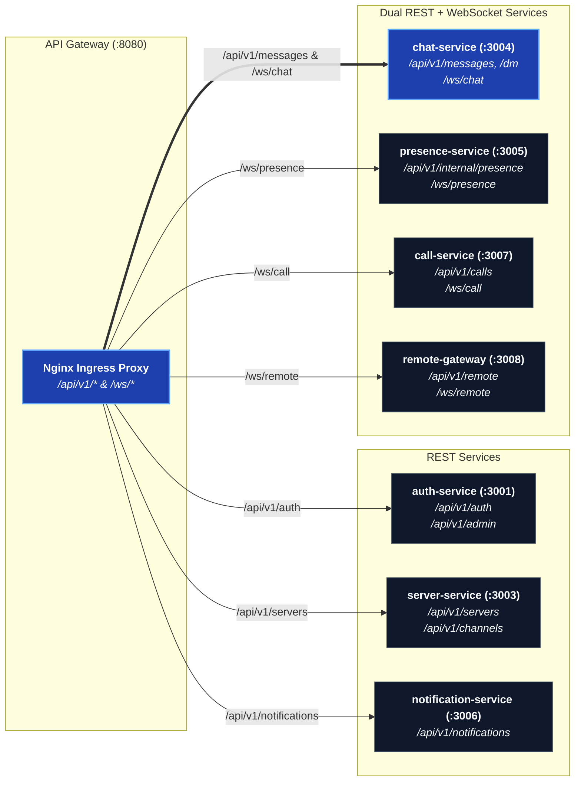

# Services Overview

Every service is a small NestJS app under `apps/services/<name>`, its own
`package.json` and `Dockerfile` target. This section is the REST/WebSocket
surface of each one, generated against the actual controllers and gateways
in the repo — see [Microservices](/architecture/microservices) for what each
one is *for*.

| Service | REST prefix | WebSocket | Owns |
| --- | --- | --- | --- |
| [auth-service](/services/auth-service) | `/api/v1/auth`, `/api/v1/admin` | — | Sessions, OAuth, admin panel auth |
| [server-service](/services/server-service) | `/api/v1/servers`, `/api/v1/channels` | — | Servers, roles, channels, invites |
| [chat-service](/services/chat-service) | `/api/v1/messages`, `/api/v1/friends`, `/api/v1/dm`, `/api/v1/e2ee`, `/api/v1/uploads` | `/ws/chat` | Messages, DMs, friends, E2EE keys, uploads |
| [presence-service](/services/presence-service) | `/api/v1/internal/presence` (internal) | `/ws/presence` | Online / last seen / typing / voice roster state |
| [notification-service](/services/notification-service) | `/api/v1/notifications` | — | Mute/quiet-hour prefs, unread, push devices |
| [call-service](/services/call-service) | `/api/v1/calls` | `/ws/call` | Call signalling, ICE config |
| [remote-gateway](/services/remote-gateway) | `/api/v1/remote` | `/ws/remote` | Machines, grants, sessions, audit |

All REST routes above are mounted under Nginx's `/api/v1` prefix; the table
shows each controller's own path segment. Every service also exposes
`/health`.

`api-gateway` (Nginx/Traefik config, no app code) and `remote-agent` (a
scaffold — the desktop app is the real agent) don't have their own API
surface to document here.
