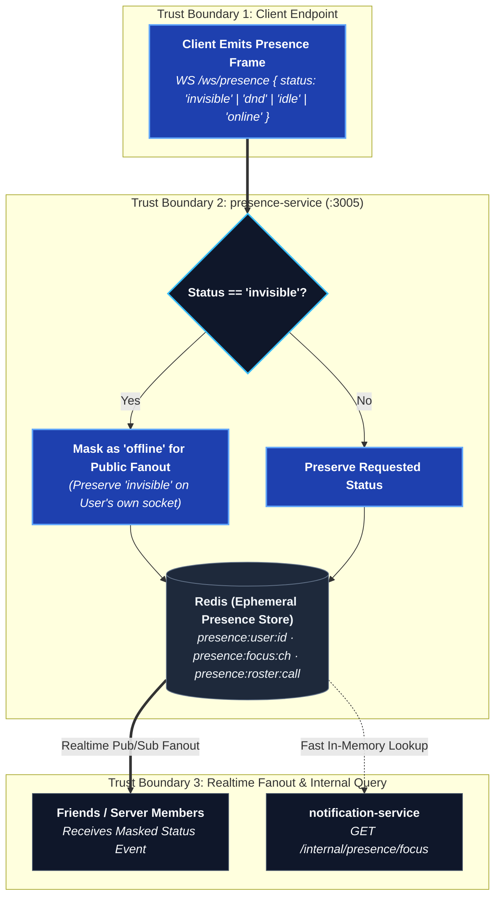

# presence-service

Online/offline/idle/DND status, typing indicators, and voice rosters. All
state lives in Redis; the service itself holds nothing durable.

## `/ws/presence`

Connects, publishes status changes, subscribes to the presence of accounts
the client cares about (friends, server members, a channel's participants).

## `/api/v1/internal/presence` (internal only)

Not routed through the public Nginx surface — used by other services
server-to-server.

| Method | Path | What it does |
| --- | --- | --- |
| GET | `/focus` | Whether an account currently has a given channel focused (used for notification suppression) |
| GET | `/online` | Online count for a server (used by the invite-preview card) |

Requests are made with a two-second timeout and answered with `null` on any
failure — an invite preview that hangs because presence is restarting is
worse than one that just omits the online count.

## Status resolution

Online / idle / do-not-disturb / invisible are what the client *chose*;
connected-or-not is what the server actually knows. `invisible` is resolved
to `offline` server-side before it's told to anyone else — a status that
leaks in the payload isn't invisible. The account's own client still sees
its real status.

