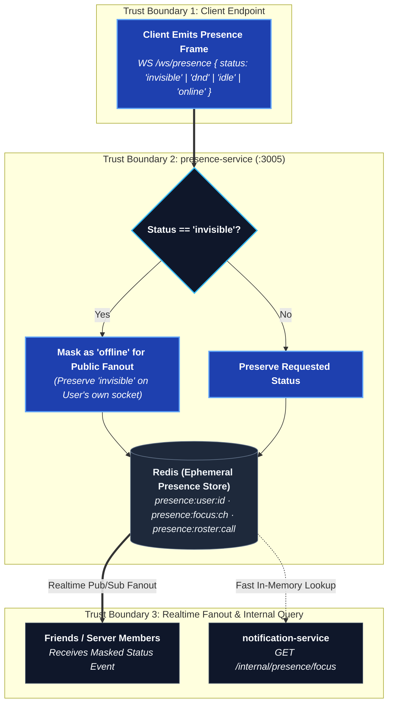

# presence-service

Online/offline/idle/DND status, last seen, typing indicators, and voice
rosters. Live state lives in Redis; the one durable thing this service writes
is a last-seen timestamp, and it writes it once per account per departure.

## `/ws/presence`

Connects, publishes status changes, subscribes to the presence of accounts
the client cares about (friends, server members, a channel's participants).

## `/api/v1/internal/presence` (internal only)

Not routed through the public Nginx surface — used by other services
server-to-server.

| Method | Path | What it does |
| --- | --- | --- |
| GET | `/focus` | Whether an account currently has a given channel focused (used for notification suppression) |
| GET | `/online` | Online count for a server (used by the invite-preview card) |

Requests are made with a two-second timeout and answered with `null` on any
failure — an invite preview that hangs because presence is restarting is
worse than one that just omits the online count.

## Last seen

`presence:online` is trimmed of anybody stale, which is precisely the moment
"when were they last here" starts being interesting - so the value lives in its
own Redis hash, `presence:lastseen`, updated on every heartbeat.

It is flushed to `users.lastSeenAt` in Postgres when an account's **last**
window closes. That is the only moment it stops moving and therefore the only
moment it is worth a row write; it is also what makes a week-long absence
survive a Redis wipe or a service restart. Reads consult both stores and take
the later answer, so neither has to be authoritative and there is no
bookkeeping about which is ahead.

**It is never written while an account is invisible.** A status that hid you
but went on publishing when you were last here would not be hiding you, so the
value freezes at the last moment the account was genuinely visible and thaws
when they choose a visible status again.

### `presence.query`

The client event that asks. Answered with one ordinary `presence.changed` per
user, so a client has one road into its presence state rather than two:

```json
{ "type": "presence.query", "userIds": ["…", "…"] }
```

Three things constrain it:

- **Audience scoping.** Every id is filtered through `audienceOfUser` - the same
  set every presence broadcast is scoped to, which is everybody who shares a
  server or an accepted friendship with the caller. Without this it would be the
  one event a client could aim at an arbitrary id, and a "who is online" oracle
  over the whole deployment is exactly what `audience.ts` exists to remove. An
  id outside the audience is answered with silence, not with a refusal.
- **A cap of 100 ids per query**, because the largest honest batch is a member
  column and one longer than that is scrolled rather than read.
- **No timestamp for anybody online.** "Online, last seen a moment ago" says one
  thing twice, and the second half is the half that goes stale.

It is a pull rather than part of `presence.sync` because a sync carries who is
online, and the people a last-seen time is interesting for are exactly the ones
who are not - sending every offline account's timestamp on connect would be the
whole user table.

## Status resolution

Online / idle / do-not-disturb / invisible are what the client *chose*;
connected-or-not is what the server actually knows. `invisible` is resolved
to `offline` server-side before it's told to anyone else — a status that
leaks in the payload isn't invisible. The account's own client still sees
its real status.


