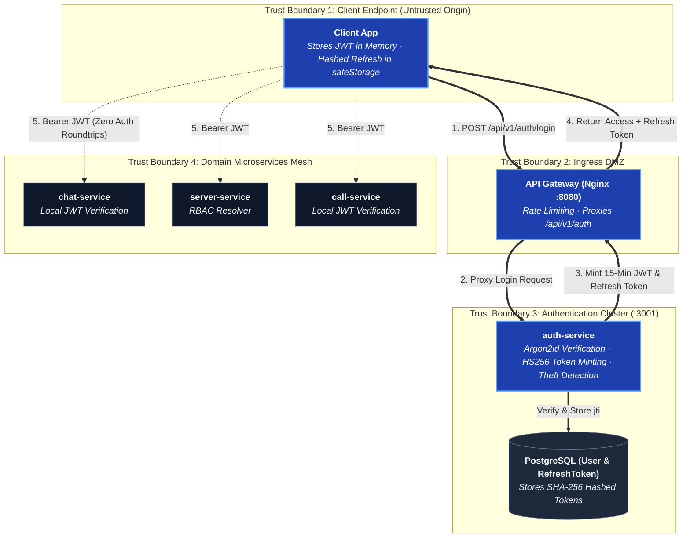

# Auth & Permissions

## Authentication flow



- **Access tokens** are short-lived JWTs (15 minutes), HS256, verified
  locally by every service via `@betweenus/auth` — no round-trip to
  auth-service per request.
- **Refresh tokens** are stored hashed in Postgres (`RefreshToken`), keyed by
  their JWT `jti`, and rotated on every use.
- **Reuse detection**: presenting an already-spent refresh token revokes
  every live token for that account. The server can't tell victim from
  thief, so it treats reuse as compromise and signs out everywhere. The cost
  is an occasional re-login on a genuine race — the desktop client avoids
  that itself with single-flight refresh.
- **A token says how it should be checked** — `jwt.verify` is pinned to
  HS256 explicitly; a token is never trusted to name its own algorithm.
- **Placeholder secrets are refused.** `JWT_SECRET="replace-me"` from
  `.env.example` is rejected outright; the two JWT secrets must differ, and
  production requires 32+ characters.

## OAuth

Google and GitHub, configured from the admin panel (`OAuthProvider` table)
rather than the environment — enabling a provider is an operator action, not
a redeploy. The client secret is sealed with AES-256-GCM
(`SETTINGS_SECRET`, falling back to `JWT_SECRET`) and never sent back out.

- The **client secret never reaches a client app**. The desktop app opens a
  real browser (Google refuses embedded webviews); auth-service trades the
  provider code for a profile server-side; the finished session comes back
  as a one-time code to a loopback server the client started.
- The web client uses the same shape with an allowed origin instead of
  loopback — the browser tab has an origin a provider can redirect to.
- The redirect target is checked as a parsed **origin**, not a `startsWith`
  prefix (a `startsWith('https://betweenus.example')` check also matches
  `https://betweenus.example.attacker.test/`).
- **A provider login links before it creates**: provider account id first,
  then verified email, and only then a new account. `email_verified` is
  checked — an unverified email from the provider is not treated as proof of
  identity, or typing a victim's address into a fresh Google account would
  hijack their BetweenUs account.

## Authorization: RBAC + granular overrides

Five built-in server roles, forming a fixed hierarchy (who may edit whom, who
may hand out what):

```text
OWNER > ADMIN > MODERATOR > MEMBER > GUEST
```

On top of the role, a member can hold any number of **custom roles**
(`ServerCustomRole`, additive) and **per-member overrides**:

```text
effective permissions = roleDefaults ∪ customRoles ∪ grantedPermissions \ deniedPermissions
```

Denial is applied last, so it always wins — revoking one capability from one
person works regardless of which roles they hold. This is the single
resolver every service calls (`resolveChannelAccess` /
`resolveRemoteAccess` in `@betweenus/database`), not four independent
copies.

### Assignable permissions (examples)

```text
VIEW_CHANNEL        SEND_MESSAGE       DELETE_MESSAGE     MANAGE_CHANNEL
MANAGE_MEMBER        MANAGE_ROLE         MANAGE_MESSAGE     START_CALL
MANAGE_CALL           REMOTE_VIEW          REMOTE_CONTROL     REMOTE_FILE_TRANSFER
REMOTE_CLIPBOARD       REMOTE_AUDIO          REMOTE_ADMIN
```

Authorization is always enforced server-side. The desktop UI disables
buttons for permissions a member lacks, but that's a courtesy, never the
security boundary — every route re-checks.

## Private channels and direct messages

- A **private channel** is an allowlist (`ChannelMember` rows), not a
  permission. Server membership no longer implies channel membership.
- A **direct message** is a channel with `serverId = null` and two
  `ChannelMember` rows — it reuses history, paging, realtime fanout,
  notifications and E2EE rather than duplicating any of it.
- Only accepted friends may open a DM; the friend-search endpoint is
  otherwise a spam surface.
- A **block** closes the DM from both ends. `UserBlock` rows are directional,
  but `resolveChannelAccess` reads both directions and returns `null`, so the
  refusal is indistinguishable from a channel the caller was never on. It is a
  fourth reason a DM can be closed and it lives in the same resolver as the
  other three — never in a controller.

## Trust boundaries: the phase-27 audit

A full pass over every route, guard and gateway found seven places believing
the wrong party. The two reachable from outside with nothing but a request:

- **Rate-limit bucket spoofing** — the limiter read the first entry of
  `X-Forwarded-For`, which Nginx *appends* to rather than replaces, so a
  caller could supply `X-Forwarded-For: 1.2.3.4` and pick a fresh identity
  every request. Fixed: `X-Real-IP` (set with `proxy_set_header`, so it
  can't be spoofed) is read first, falling back to the *last* hop of
  `X-Forwarded-For`.
- **OAuth redirect allow-list was a `startsWith`** — see above.

Full write-up, including the still-open gaps: [`SECURITY.md`](/security/overview).
