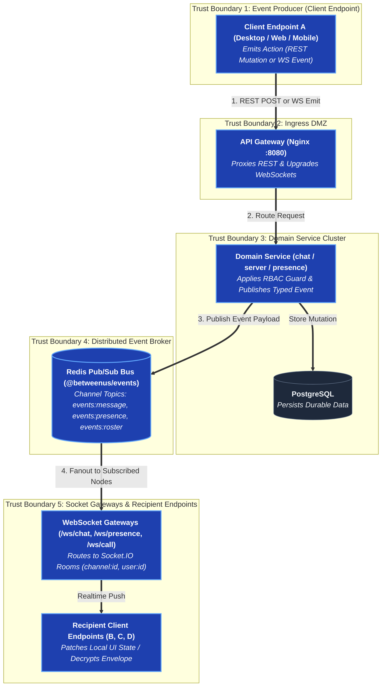

# Events & Realtime Communication

## REST + WebSocket surface

```text
REST:
  /api/v1/auth
  /api/v1/users
  /api/v1/servers
  /api/v1/channels
  /api/v1/messages
  /api/v1/roles
  /api/v1/permissions
  /api/v1/calls
  /api/v1/remote

WebSocket:
  /ws/chat        text channels, DMs, message events
  /ws/presence    online status, typing indicators
  /ws/call        call signalling: offer/answer/ICE, roster
  /ws/remote      remote-desktop signalling: session, input, offer/answer/ICE
```

## High-Level Realtime Event Topology



`/ws/call` and `/ws/remote` carry **signalling only** — offers, answers, ICE
candidates, and roster/session state. Media never rides a WebSocket; it
negotiates its own WebRTC path directly between peers (see
[Peer-to-Peer Media](/architecture/media)).

## Two kinds of event: carried vs. announced

- **Carried in full** — a chat message is delivered as the whole `Message`
  DTO, because the client has to render it without a round trip.
- **Announced, then re-fetched** — `friends.changed`, `server.members.changed`
  tell a client "something changed, re-read the list." A `Friend` DTO is
  written from the reader's own side (who requested, which direction), so
  one payload can't serve both parties of the same friendship without being
  composed twice — a refetch is cheaper and harder to get subtly wrong.

`user.updated` and `server.updated` are carried rather than announced, and the
reason is the opposite of the friendship one: the same four fields are drawn in
a dozen places at once. A changed avatar has a copy in every message that
account ever sent in an open channel, in every cached page of history behind it,
in the pins, the read receipts, the member list, the friend list and the
conversation list. Announcing it would be one refetch per list on every client
that shares a room with them; carrying `{ id, username, displayName, avatarUrl }`
lets each client patch its copies in place. A reply's quoted author is
deliberately *not* patched — it is a snapshot of how a message was signed at the
time, not a live reference.

## Rooms

Three kinds of Socket.IO room:

- `channel:<id>` — a text/voice channel or DM.
- `user:<id>` — every connected socket for one account, for events addressed
  at a person (friend requests).
- `server:<id>` — every socket for someone who's a member, for community-wide
  events (membership changes). A client subscribes to every server it's in,
  not just the one on screen, so being removed from a server reaches the
  client wherever it's currently looking.

Membership is re-checked by the gateway on every subscribe, the same way for
channels and servers, so a stale subscription can't leak events after access
is revoked.

## One envelope per kind of change

An edit, a deletion (tombstone), a pin, and a reaction all arrive as a single
`message.updated` event carrying the whole message; the client replaces its
copy. The alternative — one event per verb, each patching a different field
— is several chances for two clients to disagree about what a message
currently is.

## Redis Pub/Sub today, NATS later

Redis Pub/Sub is what fans a chat message out to every gateway instance
today (`chat.message.created` → every instance re-broadcasts to its local
sockets), which makes chat-service horizontally scalable from day one. NATS
is the documented upgrade path for larger-scale, cross-service event
communication — not built yet, and not needed until Redis Pub/Sub's
at-most-once delivery becomes the limiting factor.

## Domain events (target vocabulary)

```text
user.created            user.updated            user.online / user.offline
server.created           server.updated            server.member.added / removed / updated
channel.created           channel.deleted
message.created             message.updated             message.deleted
chats.cleared (own devices only)
call.started                  call.ended                    call.participant.joined / left
remote.machine.registered      remote.machine.offline
remote.session.started          remote.session.ended
remote.permission.changed
```

`chats.cleared` is the odd one: it reaches exactly one account's own room and
nobody else, because clearing your history is a fact about your view rather than
about the conversation. It is *carried* - it names the cut-off instant and the
channel it applies to, or null for all of them - because each of that account's
devices holds a cache of decrypted messages, and no refetch clears one.

### Where the built events differ from that list

Two of them are published as **one event with a state** rather than as a
started/ended pair, and both for the same reason: what hangs off them is a
single notification that appears and then has to be taken away again. Two
events would be two subscriptions that must never disagree about which
notification they are talking about.

- `call.roster` carries the whole roster of a call rather than a join or a
  leave. A roster of nobody is the call ending, and it is the only thing that
  can cancel the notification. The fan-out draws two different conclusions from
  one event, which is the payoff for carrying the whole list: *who has just
  arrived* — they have answered the call somewhere, so the ringer comes down on
  their other devices — and *whether the room should be told*, which is only
  true at the two ends of a call. A join event alone could say the first and
  never the second.
- `call.ring` sits beside `call.roster` rather than inside it. A roster is a
  fact about a channel and is broadcast to everybody who can hear it; a ring is
  aimed at one account by somebody who chose to aim it, and that difference is
  the whole reason a ring is allowed to wake a locked phone where a roster is
  not. One event per person rung, so its two subscribers — the push fan-out and
  the presence gateway — never have to agree about how to split a list.
- `remote.session` carries `state: 'started' | 'ended'` in place of
  `remote.session.started` and `remote.session.ended`. It also carries the
  machine name, its owner and who is driving it, so the subscriber makes no
  database call of its own — and in particular does not read remote-desktop
  tables that belong to another service.
