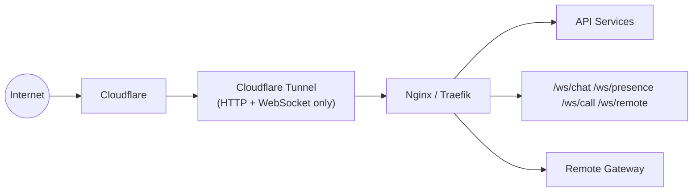

# Ingress: Cloudflare Tunnel

## The rule everything else is built around

A Cloudflare Tunnel carries HTTP and WebSocket. It does not carry UDP, and
WebRTC media is UDP. Putting a media server behind the tunnel means
smuggling media around it somehow — every one of those workarounds breaks.
Peer-to-peer media never has this problem, because media never goes near the
tunnel at all. See [Peer-to-Peer Media](/architecture/media).



```text
Signalling:  Client → Cloudflare → Tunnel → Nginx → call-service
                       (WebSocket, same shape as chat)

Media:       Client <========================================> Client
                       (WebRTC, direct, never touches Cloudflare)
```

## What this buys

- **No UDP port is ever opened.**
- **No service ever advertises its own address.** There is deliberately no
  "advertised address" setting anywhere — that class of bug (correct on the
  server, wrong for every client, invisible to whatever the operator can
  test locally) was the single most expensive bug in an earlier design that
  used an SFU.
- **One hostname.** Signalling is a WebSocket path on the same gateway as
  everything else.
- **Reachable from any network** a client can reach the site from at all.

## Reaching the other peer

| Case | What carries the media |
| --- | --- |
| Same LAN | Direct, host candidates |
| Different networks, ordinary NAT | Direct, STUN-discovered addresses |
| Symmetric / carrier-grade NAT | TURN relay, only if one is configured |

STUN needs no tunnel and no port — the client dials a public STUN server
itself. TURN is optional and off by default; when an operator wants that
last category of network to work, Cloudflare's own TURN service fits
naturally since it's outbound-only too, and `call-service` mints short-lived
credentials for it per call.

## Two layers, two jobs

**Cloudflare Tunnel:**
- Secure outbound tunnel
- Public ingress for HTTP and WebSocket
- No port forwarding, no direct public server exposure

**Nginx / Traefik:**
- Internal routing, load balancing
- WebSocket routing, rate limiting
- Service routing

`cloudflared` can run as its own Docker container (`--profile public`), or
an operator can point an existing tunnel they already run at
`http://localhost:8080` — the gateway's published `GATEWAY_PORT`. Both work;
the difference is one line of tunnel config.

## Route map

```text
/           web client (apps/web, built static bundle)
/admin      admin panel (apps/admin)
/api/v1/*   REST, routed to the owning service
/ws/*       WebSocket, routed to the owning service's gateway
```

Nginx matches the longest prefix, so `/` never shadows `/admin`, `/api`, or
`/ws`.
