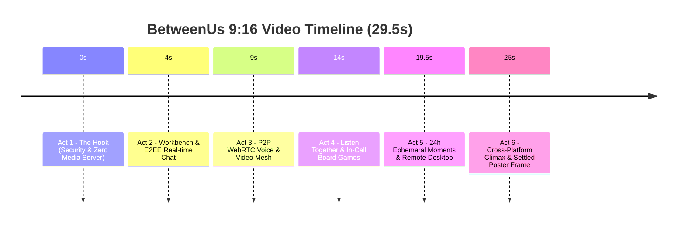

# BetweenUs — 9:16 Vertical Video & Professional Screenshot Suite Design

- **Date:** 2026-09-18
- **Status:** Approved
- **Scope:** Architectural (Creative direction, storyboard, video rendering pipeline, high-resolution screenshot generation, and repository showcase integration)

---

## 1. Executive Summary & Goals

The BetweenUs repository currently features two bare test screenshots (`pictures/home.png` and `pictures/home android.jpeg`) and an existing 36-second horizontal demo video. The goal of this project is to deliver a complete, modern, interactive marketing and visual asset overhaul:

1. **A 29-Second 9:16 Vertical Showcase Video (`brag-output/brag.mp4`):**
   - Engineered specifically for mobile screens, social platforms (X/Twitter, Reels, Shorts), and modern landing pages.
   - Built via the `brag` skill and rendered programmatically with **Hyperframes** (headless Chromium + FFmpeg).
   - Features BetweenUs's signature floating workbench design language, glowing Iris accents, and live simulated interactions.
   - Powered by a clean, modern electronic music track with smooth intro/outro fades (Music Only, no synthetic voice).
   - Posters baked directly into **Frame 0** for instantaneous idle thumbnail display across all video players.

2. **A Production-Grade Interactive Screenshot Suite (`pictures/`):**
   - **`home.png`** (2560×1440): Main Desktop Workbench hero showing an active server, live E2EE conversation, syntax-highlighted code block, reaction chips, and voice roster.
   - **`home-android.png`** (1080×2400): Native Android Jetpack Compose mobile client inside a sleek smartphone device frame with WhatsApp-style media picker and Moments story ring.
   - **`voice-listen-play.png`** (2560×1440): P2P WebRTC voice conference featuring the docked Listen Together YouTube synchronized queue and the Play Together in-call Carrom board game.
   - **`moments-viewer.png`** (1080×1920): 24-hour E2EE disappearing story player with segmented progress bars and encrypted audience indicators.
   - **`remote-desktop.png`** (2560×1440): Outbound secure remote administration interface showing live workstation control and low-latency metrics.

3. **Repository Integration:**
   - Update `README.md` to reference the new visual assets.
   - Generate `brag-output/share-copy.txt` with punchy launch copy for social distribution.

---

## 2. Visual Identity & Design System

The visual language follows the core workbench architecture defined in `apps/desktop/tailwind.theme.mjs`:

- **Ground:** Cool near-black canvas (`#0b0f19` / `rgb(11, 15, 25)`).
- **Floating Panels:** Rounded cards (`border-radius: 0.75rem`) on `surface-900` (`#111827`) and `surface-800` (`#1f2937`) with hairline borders (`rgba(255, 255, 255, 0.08)`).
- **Iris Accent:** Electric Iris ramp (`#6366f1` / `#818cf8` / `#4f46e5`) used for active states, halos, and brand badges.
- **Status Indicators:**
  - Online: `#3fd68c`
  - Idle: `#f5b83d`
  - Do Not Disturb: `#ff5d5d`
  - Offline: `#6b7280`
- **Typography:** Inter (Display & Text), Segoe UI Variable, and JetBrains Mono for cryptographic keys, latency counters, and code blocks.

---

## 3. Video Architecture & Storyboard (9:16, 1080×1920, 29.5s)

### 3.1 Timing & Beat Breakdown



#### Detailed Scene Breakdown

1. **Act 1: The Hook (0.0s – 4.0s)**
   - *Visual:* Dark ground with deep radial Iris pulse. Kinetic bold typography drops in: *"COMMUNICATION WITHOUT COMPROMISE."*
   - *Motion:* Cryptographic lock icon seals into place with glowing badge: `AES-256-GCM • Zero Media Server`.
   - *Key takeaway:* Privacy-first, server never holds decryption keys.

2. **Act 2: The Modern Workbench & E2EE Chat (4.0s – 9.0s)**
   - *Visual:* Floating desktop workbench window slides into frame with hairline border.
   - *Interaction:* Live chat stream with incoming animated message from `aiyu`, active typing indicator, interactive emoji reactions (`🔥 4`, `🚀 2`, `✨ 3`) popping in with spring curves, and an inline TypeScript code block attachment.
   - *Tagline Pill:* `Floating Panel Workbench • True End-to-End Encryption`.

3. **Act 3: Zero-Media-Server P2P Voice & Video (9.0s – 14.0s)**
   - *Visual:* Smooth camera transition into the Voice Channel Stage.
   - *Interaction:* 4 participant video/avatar tiles with real-time emerald speaking rings (`#3fd68c`), live WebRTC mesh badge (`18ms DTLS-SRTP`), and active screen-sharing preview.
   - *Tagline Pill:* `WebRTC P2P Mesh • Direct Device-to-Device Stream`.

4. **Act 4: Interactive Media & Social (14.0s – 19.5s)**
   - *Visual:* Split feature stage.
     - **Top Card:** *Listen Together* — YouTube synchronized audio queue player card with album art, scrub bar, and `Audio Ducking Active` pill.
     - **Bottom Card:** *Play Together* — In-call Carrom board physics game showing striker movement, pocketed coins, and active turn pill.
   - *Tagline Pill:* `Synchronized YouTube Listening & In-Call Board Games`.

5. **Act 5: Moments & Remote Desktop (19.5s – 25.0s)**
   - *Visual:*
     - **19.5s – 22.2s:** *Moments* — Full-screen 24-hour disappearing story player with segmented progress bars and encrypted recipient tag (`Key frozen to 5 friends`).
     - **22.2s – 25.0s:** *Remote Desktop* — Secure remote admin session card with live cursor tracking over an outbound dial-out workstation (`/ws/remote`).
   - *Tagline Pill:* `24h Ephemeral Stories • Outbound Remote Desktop`.

6. **Act 6: Cross-Platform Climax & Outro (25.0s – 29.5s)**
   - *Visual:* Three floating client cards converge in 3D perspective (Desktop Electron, Web Browser, Native Android Compose phone frame).
   - *Climax:* Central gleaming **BetweenUs** Iris brand logo settles.
   - *Closing Copy:* *"Your Private Digital Space. Desktop • Web • Android."*
   - *Poster Anchor:* Last frame at 29.5s is fully settled, crisp, and high-contrast.

---

## 4. Audio Design Specification

- **Soundtrack:** Curated from bundled `/brag` tracks: `happy-beats-business-moves-vol-1-by-ende-dot-app.mp3`.
- **Duration:** Exactly trimmed to 29.5 seconds.
- **Envelope:**
  - `0.0s – 1.0s`: Smooth volume fade-in from 0 to 0.85.
  - `1.0s – 27.5s`: Steady driving electronic groove at 0.85 volume.
  - `27.5s – 29.5s`: Gentle logarithmic fade-out to 0.0.
- **Sound Effects:** None (Music Only per user direction).

---

## 5. Professional Screenshot Suite Specification

All screenshots will be rendered at crisp vector clarity into `pictures/`:

| Filename | Resolution | Description & Featured Elements |
| :--- | :--- | :--- |
| **`pictures/home.png`** | 2560 × 1440 | **Main Desktop Workbench (Hero):** Floating panel rail, active channels (`#general`, `#dev-chat`), live conversation with `aiyu` and `alex`, rich code attachment, emoji reactions, active voice bar, and online presence roster. |
| **`pictures/home-android.png`** | 1080 × 2400 | **Native Android Client:** Rendered inside a modern bezel-less smartphone mockup with Jetpack Compose Material 3 styling, WhatsApp-style media picker, voice room status pill, and avatar Moments story rings. |
| **`pictures/voice-listen-play.png`** | 2560 × 1440 | **Voice Stage & Interactive Activities:** 4 video participant tiles with active emerald speaker halos, docked Listen Together YouTube player card, and active in-call Carrom board physics game. |
| **`pictures/moments-viewer.png`** | 1080 × 1920 | **24h E2EE Moments Viewer:** Full-screen ephemeral media player with segmented top progress bar, time left, encrypted recipient list, and interactive reaction bar. |
| **`pictures/remote-desktop.png`** | 2560 × 1440 | **Secure Remote Desktop:** Active remote session window displaying workstation stream, latency HUD (`12ms`), zero-inbound-port badge, and remote mouse/keyboard control overlay. |

---

## 6. Technical Implementation Pipeline & Tooling

1. **Hyperframes Project (`brag-output/composition/`):**
   - Configured with `hyperframes.json` (`resolution: portrait`, `1080x1920`, `duration: 29.5s`).
   - `index.html` orchestrating CSS keyframes and spring transitions.
   - Local audio asset copied to `brag-output/composition/assets/music/track.mp3`.
2. **Quality Verification:**
   - Run `npx hyperframes check` in `brag-output/composition/` to guarantee zero missing assets, valid keyframes, and proper contrast.
3. **Screenshot Generation Engine:**
   - Programmatic generation of high-resolution screenshot canvases using headless Chromium capture directly from component HTML templates to ensure pixel-perfect fidelity.
4. **Video Render & Frame 0 Poster Baking:**
   - Execute `npx hyperframes render --quality high --output ../brag.mp4`.
   - Extract settled poster image via FFmpeg:
     ```bash
     ffmpeg -ss 28.0 -i brag-output/brag.mp4 -frames:v 1 -q:v 2 brag-output/brag.jpg
     ```
   - Bake `brag.jpg` as frame 0 using FFmpeg overlay filter:
     ```bash
     ffmpeg -y -i brag.mp4 -i brag.jpg -filter_complex "[0:v][1:v]overlay=0:0:enable='eq(n,0)'[v]" -map "[v]" -map 0:a? -c:v libx264 -crf 18 -preset slow -pix_fmt yuv420p -c:a copy -movflags +faststart brag.poster.mp4 && mv brag.poster.mp4 brag.mp4
     ```
5. **Documentation & Copy:**
   - Generate `brag-output/share-copy.txt`.
   - Update `README.md` hero image and gallery anchors.

---

## 7. Deliverables Checklist

- [ ] `docs/superpowers/specs/2026-09-18-betweenus-video-and-screenshots-design.md` committed.
- [ ] `brag-output/brag-plan.md` created with 9-question rubric.
- [ ] `brag-output/composition-brief.md` created per `/brag` specification.
- [ ] `brag-output/composition/` implemented and verified with `npx hyperframes check`.
- [ ] 5 high-resolution screenshots generated in `pictures/`.
- [ ] `brag-output/brag.mp4` rendered, verified, and frame 0 poster baked.
- [ ] `brag-output/share-copy.txt` created.
- [ ] `README.md` updated with new screenshots and video tour anchors.
