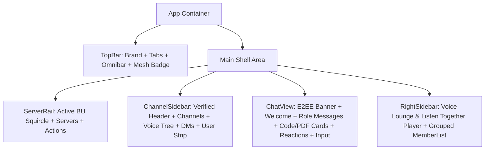

# BetweenUs — Desktop & Web Workbench UI Redesign Specification

- **Date:** 2026-09-18
- **Status:** Approved
- **Scope:** Architectural (Overhaul of TopBar, ServerRail, ChannelSidebar, ChatView, and Right-hand Activity & Member Panel with Emil Kowalski / Apple-grade motion animation across both Desktop Electron and Web React runtimes)

---

## 1. Executive Summary & Objectives

BetweenUs's target design aesthetic—as established in `pictures/home.png` and repository design documentation—is a high-fidelity, dark-workbench communication platform combining zero-knowledge E2EE messaging, direct WebRTC P2P voice/video, collaborative synchronized entertainment (YouTube Listen Together, in-call physics games), and seamless administration.

This specification details the comprehensive architectural overhaul of the primary BetweenUs client UI across `apps/desktop` (Electron) and `apps/web` (browser), bringing the live interface into full visual parity with `pictures/home.png` while introducing a physics-informed, GPU-accelerated motion animation system adhering to Emil Kowalski's design engineering principles.

### Key Objectives
1. **Shell & Navigation (`TopBar` & `ServerRail`)**: Introduce view switcher tabs (`Workbench`, `Activities`, `Moments`), live connection health pill (`● WebRTC Mesh • 14ms`), notification center trigger, and refined server rail hierarchy.
2. **Channel & Voice Hierarchy (`ChannelSidebar`)**: Verified server header with real-time stats (`24 Online • E2EE Mesh`), text channels with unread badges, expandable voice channel room with live speaking participant indicators (`● aiyu (speaking)`, `● alex (speaking)`), direct messages status list, and bottom user control strip with mic/deafen/settings controls.
3. **Cryptographic Chat Canvas (`ChatView`)**: Double Ratchet E2EE security banner, channel welcome card, role-badged messages (`STAFF`, `CORE TEAM`, `FOUNDER`), syntax-highlighted code snippet card (`peer-connection.ts`), verified PDF payload attachment card with cryptographic checksums, interactive spring emoji reactions, animated typing indicator (`••• sophia is typing...`), and full-width pill input dock.
4. **Activity & Member Dock (`RightSidebar` / `MemberList`)**: Composite panel hosting the live **Voice Lounge & Listen Together** synchronized audio player card (with `Audio Ducking Active` beacon, progress scrubber, and playback controls) stacked above the grouped **Member Roster** (`CORE TEAM`, `ENGINEERS`, `ONLINE`).
5. **Fluid Motion Engine**: Snappy 150–200ms `ease-out` transitions, micro-press spring scaling (`active:scale-[0.97]`), animated audio halos, live status pulses, and staggered typing bounces, strictly respecting `prefers-reduced-motion`.
6. **Strict Monorepo Compliance**: Zero `any`, 100% TypeScript strict mode compliance, centralized permission enforcement, clean component separation, and backward compatibility with live store and WebSocket events.

---

## 2. Visual Identity & Design Tokens

The redesign builds directly on the BetweenUs design tokens configured in Tailwind and `apps/desktop/src/index.css`:

| Token | Value / Class | Description |
|---|---|---|
| **Ground** | `#0b0f19` / `bg-[#0b0f19]` | Deep cosmic near-black canvas background |
| **Surface 950** | `#0f1523` / `bg-surface-950` | Floating card ground, popovers, context menus |
| **Surface 900** | `#111827` / `bg-surface-900` | Primary panel backgrounds |
| **Surface 850** | `#161f30` / `bg-surface-850` | Interactive card tiles, input backgrounds |
| **Surface 800** | `#1f2937` / `bg-surface-800` | Sidebar backgrounds, subtle section fills |
| **Border / Edge**| `rgba(255, 255, 255, 0.08)` / `border-edge` | Hairline border framing all panels and cards |
| **Accent (Iris)**| `#6366f1` / `bg-accent` | Primary brand accent and focus state |
| **Active Emerald**| `#3fd68c` / `text-emerald-400` | Online indicators, WebRTC mesh healthy badge, speaking ring |
| **Alert Red** | `#ef4444` / `bg-danger` | Unread badge counters, mic muted indicators |
| **Idle Amber** | `#f5b83d` / `text-amber-400` | Away / idle presence status |

---

## 3. Component Architecture & Detailed Layout



### 3.1 `TopBar` Component
- **Left**:
  - `BetweenUsLogoIcon` in squircle iris container (`h-7 w-7 rounded-lg bg-accent/20 flex items-center justify-center text-accent`).
  - Brand typography: `BetweenUs` (`font-bold text-sm text-slate-100`).
  - Navigation Switcher Tabs:
    - `Workbench` (active tab: `bg-white/[0.08] text-white shadow-sm border border-white/10`).
    - `Activities` (`text-slate-400 hover:text-slate-200 hover:bg-white/[0.04]`).
    - `Moments` (`text-slate-400 hover:text-slate-200 hover:bg-white/[0.04]`).
- **Center**:
  - Search field button: `h-8 w-full max-w-md rounded-lg border border-edge bg-white/[0.03] px-3 flex items-center gap-2 text-xs text-slate-400`.
  - Icon: `SearchIcon`. Label: `BetweenUs HQ / #general`. Keyboard badge: `Ctrl K`.
- **Right**:
  - Telemetry badge: `● WebRTC Mesh • 14ms` (`rounded-full bg-emerald-500/10 border border-emerald-500/20 px-2.5 py-1 text-xs text-emerald-400 font-medium flex items-center gap-1.5`). Dot pulses with `animate-pulse`.
  - Notification bell: `BellIcon` button with hover halo.
  - Settings button: `SettingsIcon` button (`hover:text-slate-100 hover:bg-white/[0.06] rounded-lg p-1.5`).

### 3.2 `ServerRail` Component
- Active server icon: Rounded squircle (`rounded-2xl bg-accent text-white shadow-lg shadow-accent/20`) with white pill indicator on the far left edge.
- Direct messages icon: Rounded square with speech bubble glyph.
- Separator line.
- Server icons: `BU`, `OS` (with red unread count badge `3`), `RT`, `CG`.
- Bottom discovery: Circular `+` (Add Server) and `🧭` (Explore Servers) buttons.

### 3.3 `ChannelSidebar` Component
- **Server Header**:
  - Title: `BetweenUs HQ` with verified blue checkmark icon and chevron toggle.
  - Presence subtitle: `24 Online • E2EE Mesh` in `text-xs text-slate-400`.
- **Text Channels**:
  - Heading: `TEXT CHANNELS` with uppercase tracking and `+` creation trigger.
  - `# general`: Active state with deep indigo/slate background pill, white text, and `LockIcon` denoting encryption.
  - `# releases`: Coral red badge `1`.
  - `# engineering`: Coral red badge `4`.
  - `# architecture`, `# security-audits`.
- **Voice Channels**:
  - Heading: `VOICE CHANNELS` with `+` action.
  - `🔊 Lounge [3/8]`: Active voice channel row with nested participants:
    - `● aiyu (speaking)`: Green pulsing audio ring and emerald text indicator.
    - `● alex (speaking)`: Green pulsing audio ring and emerald text indicator.
    - `● sophia`: Subtle slate status dot.
  - Other rooms: `🔊 Stage & Pair Prog`, `🔊 Daily Standup`.
- **Direct Messages**:
  - Heading: `DIRECT MESSAGES`.
  - Roster:
    - `aiyu`: `Listening to Lofi Beats`.
    - `alex`: `In Lounge • Carrom match`.
    - `sophia`: `Reviewing benchmarks`.
    - `marcus`: `Testing WebRTC mesh`.
- **User Control Bar (Bottom)**:
  - Avatar: `aiyu` with green online ring.
  - Name & Subtitle: `aiyu` / `Founder • Online`.
  - Controls: Microphone toggle (`MicIcon`), Headphone deafen toggle (`HeadphonesIcon`), Settings gear (`SettingsIcon`).

### 3.4 `ChatView` Component
- **Header**:
  - `# general` in bold white, vertical divider `|`, topic: `General discussion & E2EE verification`.
  - Security Badge: `[🔒 AES-256-GCM sealed]` in sapphire blue pill.
  - Actions: Search (`🔍`), Member panel toggle (`👥`), Pinned messages (`📌`).
- **E2EE Double Ratchet Banner**:
  - Glowing shield icon in quantum blue/cyan.
  - Message: *"All conversations and attachments in this channel are encrypted end-to-end with AES-256-GCM Double Ratchet. Ephemeral keys never touch the gateway."*
- **Channel Welcome Card**:
  - Large circular `#` glyph in iris gradient container.
  - Heading: *"Welcome to #general!"*
  - Subtitle: *"This is the start of the #general channel in BetweenUs HQ. True peer-to-peer WebRTC mesh and zero-knowledge encryption active."*
- **Date Separator**:
  - Hairline divider centered with `TODAY — SEPTEMBER 18, 2026`.
- **Message Stream**:
  - Message 1 (sophia): `STAFF` badge, timestamp `Today at 11:32 AM`. Text announcing WebRTC mesh optimization build.
  - Message 2 (sophia): `STAFF` badge, timestamp `Today at 11:38 AM`. Audio pipeline latency results with reaction chips `👍 4`, `🚀 6`.
  - Message 3 (alex): `CORE TEAM` badge, timestamp `Today at 11:40 AM`. Text introducing peer connection helper:
    - **Code Snippet Box**:
      - Header: Left `< > peer-connection.ts`, Right `TypeScript`, Copy button.
      - Code contents syntax highlighted:
        ```typescript
        const session = await betweenus.createPeerConnection({
          e2ee: 'AES-256-GCM',
          mesh: true,
          dtlsSrtp: true
        });
        ```
    - **File Attachment Card**:
      - Document icon inside purple/slate box.
      - Title: `betweenus-e2ee-benchmarks-v2.4.pdf 🔒`.
      - Meta: `2.4 MB • SHA256: 8f4a2b ... d91c • Verified E2EE Payload`.
      - Action: `[↓ Download]` glass button.
    - Reactions: `🔥 5`, `✨ 3`, `💜 2`.
  - Message 4 (aiyu): `FOUNDER` badge, timestamp `Today at 11:41 AM`. Hop on Lounge to test YouTube sync and Carrom physics. Reactions: `🎉 7`, `💖 4`.
  - Message 5 (sophia): `STAFF` badge, timestamp `Today at 11:42 AM`. Joining Lounge and queueing Lofi Beats stream.
  - Message 6 (alex): `CORE TEAM` badge, timestamp `Today at 11:42 AM`. Striker physics connected.
- **Typing Indicator**:
  - `••• sophia is typing...` with 3 staggered bouncing dots.
- **Chat Input Dock**:
  - Full-width pill container with hairline border (`border-white/10 bg-surface-900/90`).
  - Left: Attachment paperclip (`📎`).
  - Center: Input field `Message #general (E2EE sealed)`.
  - Right: Emoji trigger (`😊`), Voice note recorder (`🎤`), and circular Iris send button with paper plane icon (`➤`).

### 3.5 Composite `RightSidebar` (Lounge & Member List)
- **Top: Voice Lounge & Listen Together Player Card**:
  - Header: `🔊 Lounge` on left, live indicator `● LIVE • 08:42` with pulsing emerald dot on right.
  - Speaking participant chips:
    - `aiyu`: Active speaking halo (green ring).
    - `alex`: Active speaking halo (green ring).
    - `sophia`: Muted indicator.
  - **Listen Together Sub-card**:
    - Header: Red YouTube play icon, `Listen Together` title, and emerald `Audio Ducking Active` pill badge.
    - Title: `Lofi Beats 24/7 — Chillhop Radio`.
    - Stream Info: `Lofi Records • 3 listeners in sync`.
    - Scrubber: `1:42` [=======o-----------------] `3:30`.
    - Physical Playback Controls: Previous (`|◁`), Play/Pause circle (`⏸`, crisp white circle with black bars and tactile click spring), Next (`▷|`).
- **Bottom: Grouped Member List**:
  - `CORE TEAM — 2`:
    - `aiyu`: Crown `👑`, title `Founder • In Lounge`.
    - `alex`: Title `Core Team • In Lounge`.
  - `ENGINEERS — 4`:
    - `sophia`: `Staff Engineer • Away`.
    - `marcus`: `Testing WebRTC mesh`.
    - `elena`: `Writing Carrom physics`.
    - `david`: `Electron runtime`.
  - `ONLINE — 8`:
    - `chen`: `Playing Carrom`.
    - `liam`, `zack`, `maya`, `vikram`, `tariq`, `noah`: `Active`.
    - `sarah`: `Reviewing PR #42`.

---

## 4. Motion & Animation System

Adhering strictly to Emil Kowalski's guidelines and the `animate` skill:

1. **Hardware Acceleration**: Only `transform` and `opacity` are animated to ensure continuous 60fps GPU performance without layout reflows.
2. **Timing Curves & Durations**:
   - Micro-press on buttons & reaction chips: `scale(0.97)` on `:active`, settling in `150ms ease-out`.
   - Hover state transitions: `150ms ease-out`.
   - Reaction chip click bounce: Spring overshoot from `scale(1.12)` settling to `scale(1)` in `180ms cubic-bezier(0.34, 1.56, 0.64, 1)`.
3. **Continuous Subtle Motion**:
   - **Speaking Halos**: Gentle concentric CSS ripple ring around speaking voice participants (`animation: speaker-pulse 2s infinite ease-in-out`).
   - **Live Indicators**: Breathing emerald status beacon (`animation: pulse 2s cubic-bezier(0.4, 0, 0.6, 1) infinite`).
   - **Typing Indicator**: 3 staggered bouncing dots (`animation: typing-dot 1.2s infinite ease-in-out` with `0s`, `0.2s`, `0.4s` delays).
4. **Reduced Motion**: All continuous animations and spring scales are wrapped in `@media (prefers-reduced-motion: reduce)` to disable motion for users with motion sensitivity.

---

## 5. Implementation Strategy & File Changes

The redesign is executed cleanly across existing components without breaking existing store bindings or backend protocols:

1. **`apps/desktop/src/components/icons.tsx`**: Add `HeadphonesIcon` for deafen toggle and verify all required SVG icons.
2. **`apps/desktop/src/features/shell/TopBar.tsx`**: Update layout with brand squircle, navigation tabs (`Workbench`, `Activities`, `Moments`), telemetry pill (`● WebRTC Mesh • 14ms`), notification bell, and settings button.
3. **`apps/desktop/src/features/servers/ServerRail.tsx`**: Refine server rail styling to include the active BetweenUs HQ squircle button, chat bubble icon, server unread count badges, and explore/add server buttons.
4. **`apps/desktop/src/features/channels/ChannelSidebar.tsx`**: Enhance header with verified badge and subtitle (`24 Online • E2EE Mesh`), text channels with unread badges, expandable voice channel room with live speaking participant tree, direct messages list, and updated user panel with deafen control.
5. **`apps/desktop/src/features/chat/ChatView.tsx`**: Add E2EE encryption banner, channel welcome card, role badges (`STAFF`, `CORE TEAM`, `FOUNDER`), code snippet card, verified PDF attachment card, spring emoji reactions, and animated typing indicator.
6. **`apps/desktop/src/features/members/RightSidebar.tsx`** (or composite `MemberList.tsx`): Implement the stacked Voice Lounge & Listen Together player card alongside the grouped Member List.
7. **`apps/desktop/src/App.tsx`**: Mount the composite RightSidebar when in server view to match the screenshot layout.
8. **`apps/desktop/src/index.css`**: Add keyframes for speaker pulse, typing bounce, and smooth micro-press transitions.

---

## 6. Verification & Quality Gates

- **Type Check**: Run `pnpm --filter @betweenus/desktop typecheck` to confirm zero TypeScript errors.
- **Build Check**: Run `pnpm --filter @betweenus/desktop build` (or Vite build) to verify clean bundling.
- **Strict Guidelines**: Verify zero `any` types and that no `git push` is performed.
